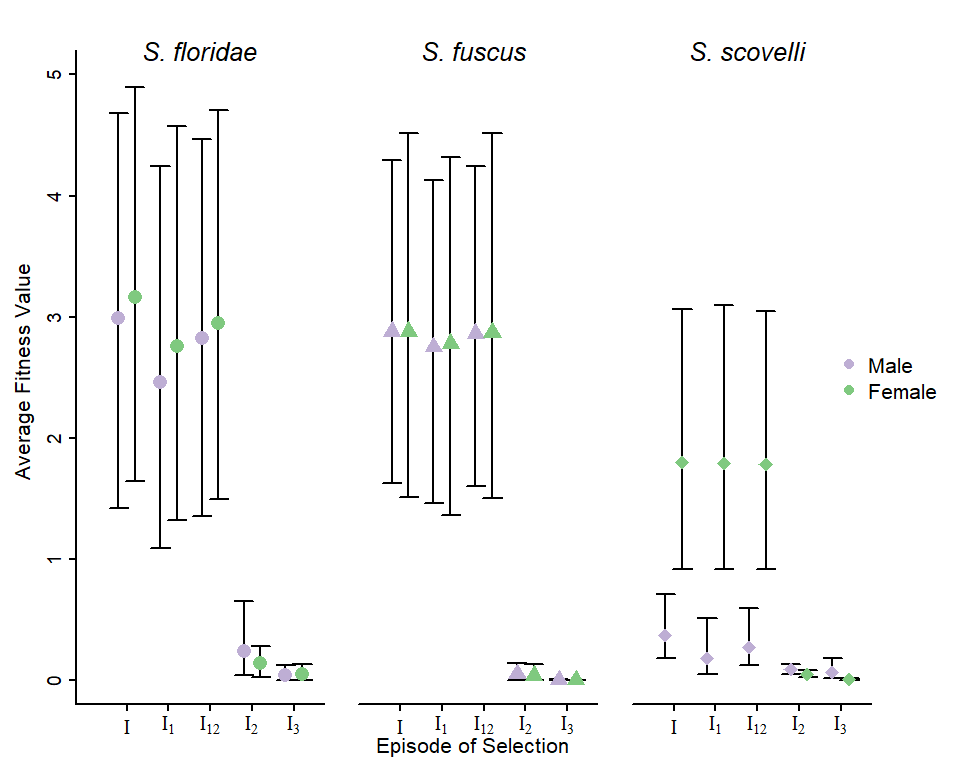
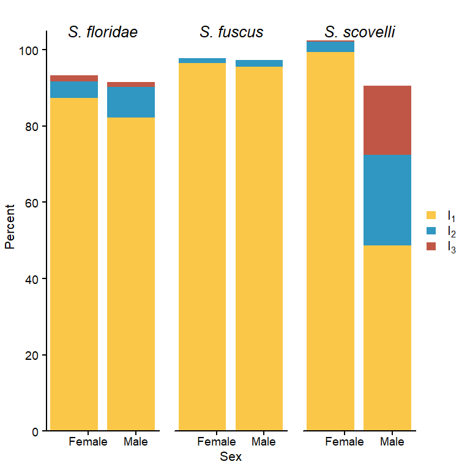
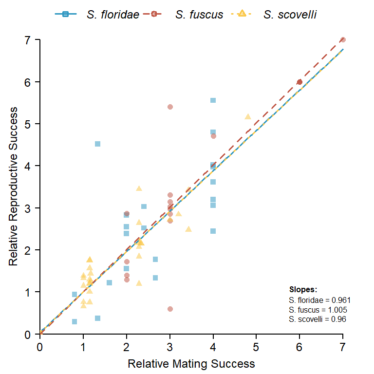
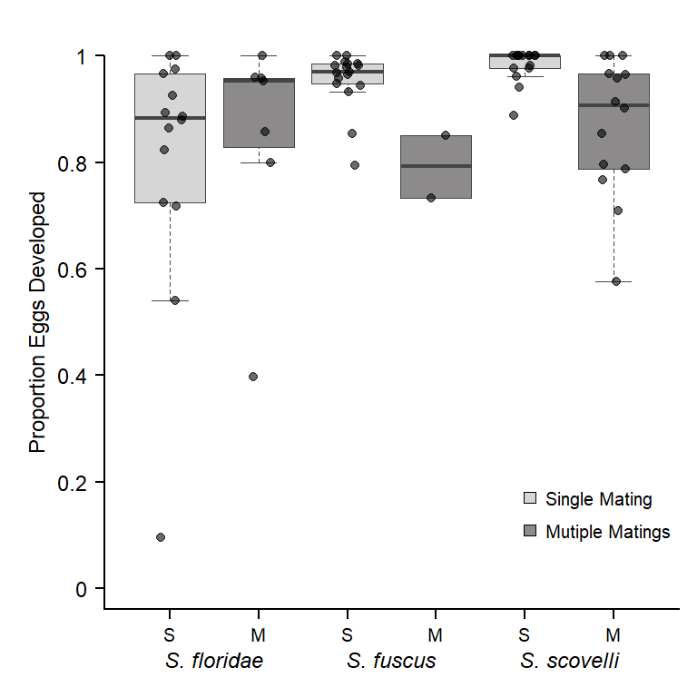
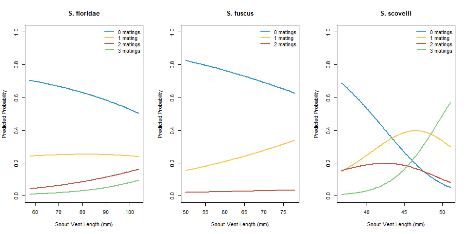
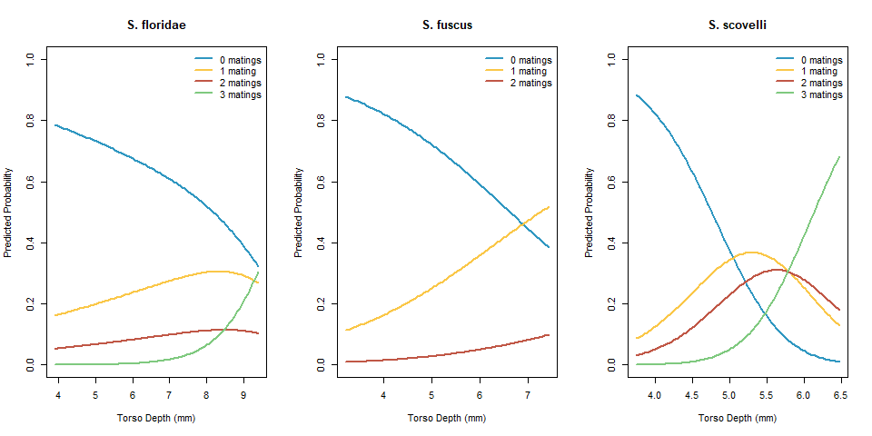

Comparing selection pressures across the three species of *Syngnathus*
================
Coley Tosto


- [The Opportunity for Selection across
  Species](#the-opportunity-for-selection-across-species)
- [The Bateman Gradient - Comparing reproductive and mating
  success](#the-bateman-gradient---comparing-reproductive-and-mating-success)
- [Selection differentials and gradients across the
  species](#selection-differentials-and-gradients-across-the-species)

``` r
#This is a cohesive list of all the libraries used in this document
library(lme4)
library(spfTools)
library(magick)
library(patchwork)
library(ggplot2)
library(nnet)
```

``` r
##Data for the Opportunity of selection
opp_select <- read.csv("data/episode_select_data.csv", header = TRUE)

##Data for generating the female bateman gradients
FL_fem_bateman <- read.csv("data/FL_fem_bateman.csv", header = TRUE)
FL_fem_bateman$species <- rep("floridae", times = nrow(FL_fem_bateman))

FU_fem_bateman <- read.csv("data/FU_fem_bateman.csv", header = TRUE)
FU_fem_bateman$species <- rep("fuscus", times = nrow(FU_fem_bateman))

SS_fem_bateman <- read.csv("data/SS_fem_bateman.csv", header = TRUE)
SS_fem_bateman$species <- rep("scovelli", times = nrow(SS_fem_bateman))


FL_fem_fitness <- read.csv("data/fem_fitnessFL.csv", header = TRUE)
FL_fem_fitness$species <- rep("floridae", times = nrow(FL_fem_fitness))

FU_fem_fitness <- read.csv("data/fem_fitnessFU.csv", header = TRUE)
FU_fem_fitness$species <- rep("fuscus", times = nrow(FU_fem_fitness))

SS_fem_fitness <- read.csv("data/fem_fitnessSS.csv", header = TRUE)
SS_fem_fitness$species <- rep("scovelli", times = nrow(SS_fem_fitness))
```

## The Opportunity for Selection across Species

We can start by comparing the episodes of selection calculated for males
and females across the species. The data I will be using for this
includes the average selection across the trials for each episode along
side the upper and lower percentile-based confidence intervals we
generated from bootstrapping.

I am first going to plot the average fitness value with the confidence
intervals as error bars.

<!-- -->

We can then visualize what percentage pre- versus post-copulatory
episodes of selection make up in the total opportunity for selection. To
do that we will assume that “I” is 100% and every other episode will
make up some portion of that.

First, we need to calculate the percentages.

``` r
sexes <- c("M", "F")

#Create a dataframe to store the final values in
opp_percents <- data.frame(matrix(ncol = 4,
                                 nrow = 0))
colnames(opp_percents) <- c("Percent", "Species", "Episode_sel", "Sex")

for (pipefish in unique(opp_select_sub$species)) {
  
  #Subset for the species of interest
  tmp <- opp_select_sub[opp_select_sub$species == pipefish, ]
  
  for (sex in sexes) {
    
    #subset for the sex
    tmp_sex <- tmp[tmp$sex == sex, ]
    percents <- as.data.frame(t(t(apply(tmp_sex, 1, function(x){
      
      (as.numeric(x[1])/tmp_sex$average_cal[tmp_sex$episode_sel == "I"])*100
      
    }))))
    
    colnames(percents) <- "Percent"
    percents$Species <- pipefish
    percents$Episode_sel <- tmp_sex$episode_sel
    percents$Sex <- sex
    
    rownames(percents) <- NULL
    
    opp_percents <- rbind(opp_percents, percents)
    
  }
}
```

Once we have the percentages we can use them to generate stacked bar
plots for the different species.

<!-- -->

``` r
figA <- image_ggplot(image_read_pdf('figs/opp_select_aveCI.pdf'),interpolate = TRUE)
figB <- image_ggplot(image_read_pdf('figs/opp_select_per.pdf'),interpolate = TRUE)

fig <- figA + figB + plot_annotation(tag_levels = "A")

ggsave("figs/fig_opp_select.pdf", fig, height = 5, width=11)
ggsave("figs/fig_opp_select.png", fig, height = 5, width=11)
```

## The Bateman Gradient - Comparing reproductive and mating success

For the Bateman gradient I will only be comparing females across the
three species as they are the sex which consistently mates multiply.

The model we have chosen for the gradient is a linear mixed effects
model where we have used the trial number as a random effect.

    ## floridae slope = 0.9611335

    ## fuscus slope = 1.005453

    ## scovelli slope = 0.9596159

<!-- -->

The Bateman gradient primarily focuses on pre-copulatory selection, to
add an extra component I am going to compare the proportion of eggs
developed (post-copulatory selection) between singly and multiply mated
females across the species.

<!-- -->

We can test to see if there are any significant differences as well.

``` r
data$eggs_per_mate <- data$totalEggs/data$MatingSuccess
t.test(data$prop_developed[data$species == "floridae"] ~ data$mating_status[data$species == "floridae"],
       var.equal = FALSE)
```

    ## 
    ##  Welch Two Sample t-test
    ## 
    ## data:  data$prop_developed[data$species == "floridae"] by data$mating_status[data$species == "floridae"]
    ## t = 0.38986, df = 13.753, p-value = 0.7026
    ## alternative hypothesis: true difference in means between group M and group S is not equal to 0
    ## 95 percent confidence interval:
    ##  -0.1798398  0.2595793
    ## sample estimates:
    ## mean in group M mean in group S 
    ##       0.8462871       0.8064174

``` r
t.test(data$prop_developed[data$species == "fuscus"] ~ data$mating_status[data$species == "fuscus"],
       var.equal = FALSE)
```

    ## 
    ##  Welch Two Sample t-test
    ## 
    ## data:  data$prop_developed[data$species == "fuscus"] by data$mating_status[data$species == "fuscus"]
    ## t = -2.7043, df = 1.101, p-value = 0.2066
    ## alternative hypothesis: true difference in means between group M and group S is not equal to 0
    ## 95 percent confidence interval:
    ##  -0.7798817  0.4544469
    ## sample estimates:
    ## mean in group M mean in group S 
    ##       0.7920699       0.9547873

``` r
t.test(data$prop_developed[data$species == "scovelli"] ~ data$mating_status[data$species == "scovelli"],
       var.equal = FALSE)
```

    ## 
    ##  Welch Two Sample t-test
    ## 
    ## data:  data$prop_developed[data$species == "scovelli"] by data$mating_status[data$species == "scovelli"]
    ## t = -3.1351, df = 14.438, p-value = 0.007079
    ## alternative hypothesis: true difference in means between group M and group S is not equal to 0
    ## 95 percent confidence interval:
    ##  -0.18618277 -0.03517485
    ## sample estimates:
    ## mean in group M mean in group S 
    ##       0.8710678       0.9817466

``` r
t.test(data$eggs_per_mate[data$species == "floridae"] ~ data$mating_status[data$species == "floridae"],
       var.equal = FALSE)
```

    ## 
    ##  Welch Two Sample t-test
    ## 
    ## data:  data$eggs_per_mate[data$species == "floridae"] by data$mating_status[data$species == "floridae"]
    ## t = -0.65565, df = 14.071, p-value = 0.5226
    ## alternative hypothesis: true difference in means between group M and group S is not equal to 0
    ## 95 percent confidence interval:
    ##  -136.73108   72.68346
    ## sample estimates:
    ## mean in group M mean in group S 
    ##        180.9762        213.0000

``` r
t.test(data$eggs_per_mate[data$species == "fuscus"] ~ data$mating_status[data$species == "fuscus"],
       var.equal = FALSE)
```

    ## 
    ##  Welch Two Sample t-test
    ## 
    ## data:  data$eggs_per_mate[data$species == "fuscus"] by data$mating_status[data$species == "fuscus"]
    ## t = -0.49385, df = 1.5556, p-value = 0.6821
    ## alternative hypothesis: true difference in means between group M and group S is not equal to 0
    ## 95 percent confidence interval:
    ##  -559.5977  470.7153
    ## sample estimates:
    ## mean in group M mean in group S 
    ##        204.5000        248.9412

``` r
t.test(data$eggs_per_mate[data$species == "scovelli"] ~ data$mating_status[data$species == "scovelli"],
       var.equal = FALSE)
```

    ## 
    ##  Welch Two Sample t-test
    ## 
    ## data:  data$eggs_per_mate[data$species == "scovelli"] by data$mating_status[data$species == "scovelli"]
    ## t = -2.542, df = 23.872, p-value = 0.01793
    ## alternative hypothesis: true difference in means between group M and group S is not equal to 0
    ## 95 percent confidence interval:
    ##  -14.833671  -1.537758
    ## sample estimates:
    ## mean in group M mean in group S 
    ##        25.88095        34.06667

The only significant difference present is in *S. scovelli*. For the
other two species, even if there were a significant difference, it is
likely that the sample size of the multiply mated females is too small
to detect one.

``` r
figB <- image_ggplot(image_read_pdf('figs/SM_boxplot.pdf'),interpolate = TRUE)
figA <- image_ggplot(image_read_pdf('figs/fem_bateman.pdf'),interpolate = TRUE)

fig <- figA + figB + plot_annotation(tag_levels = "A")

ggsave("figs/Fig_bateman_prop.pdf", fig, height=5, width=10)
ggsave("figs/Fig_bateman_prop.png", fig, height=5, width=10) # also save as a png
```

## Selection differentials and gradients across the species

I am going to try running a multinomial logistic regression where I will
use a trait of interest to predict mating success females in the three
species. I will start with snout-vent-length as the trait of interest.

``` r
##Convert mating success and run the model
FL_fem_fitness$MatingSuccess <- factor(FL_fem_fitness$MatingSuccess)
model_FL <- multinom(MatingSuccess ~ svl, data = FL_fem_fitness)
```

    ## # weights:  12 (6 variable)
    ## initial  value 77.632484 
    ## iter  10 value 54.721505
    ## iter  20 value 53.968782
    ## final  value 53.959741 
    ## converged

``` r
summary(model_FL)
```

    ## Call:
    ## multinom(formula = MatingSuccess ~ svl, data = FL_fem_fitness)
    ## 
    ## Coefficients:
    ##   (Intercept)         svl
    ## 1   -1.466886 0.006932525
    ## 2   -4.867339 0.035960794
    ## 3   -7.472851 0.055920015
    ## 
    ## Std. Errors:
    ##   (Intercept)        svl
    ## 1    2.285807 0.02843051
    ## 2    3.662702 0.04380991
    ## 3    5.897080 0.06851115
    ## 
    ## Residual Deviance: 107.9195 
    ## AIC: 119.9195

``` r
FU_fem_fitness$MatingSuccess <- factor(FU_fem_fitness$MatingSuccess)
model_FU <- multinom(MatingSuccess ~ svl, data = FU_fem_fitness)
```

    ## # weights:  9 (4 variable)
    ## initial  value 80.198697 
    ## iter  10 value 48.116431
    ## iter  20 value 47.946157
    ## iter  30 value 47.912167
    ## iter  40 value 47.906023
    ## iter  50 value 47.904777
    ## iter  60 value 47.904559
    ## iter  70 value 47.904536
    ## final  value 47.904533 
    ## converged

``` r
summary(model_FU)
```

    ## Call:
    ## multinom(formula = MatingSuccess ~ svl, data = FU_fem_fitness)
    ## 
    ## Coefficients:
    ##   (Intercept)        svl
    ## 1   -3.572706 0.03799406
    ## 2   -5.116074 0.02868550
    ## 
    ## Std. Errors:
    ##   (Intercept)        svl
    ## 1    3.018733 0.04699719
    ## 2    7.752886 0.12076910
    ## 
    ## Residual Deviance: 95.80907 
    ## AIC: 103.8091

``` r
SS_fem_fitness$MatingSuccess <- factor(SS_fem_fitness$MatingSuccess)
model_SS <- multinom(MatingSuccess ~ svl, data = SS_fem_fitness)
```

    ## # weights:  12 (6 variable)
    ## initial  value 76.246190 
    ## iter  10 value 62.991333
    ## iter  20 value 62.369687
    ## iter  30 value 62.237424
    ## iter  40 value 62.230032
    ## iter  50 value 62.229503
    ## final  value 62.229434 
    ## converged

``` r
summary(model_SS)
```

    ## Call:
    ## multinom(formula = MatingSuccess ~ svl, data = SS_fem_fitness)
    ## 
    ## Coefficients:
    ##   (Intercept)       svl
    ## 1   -9.872368 0.2278055
    ## 2   -6.478584 0.1360662
    ## 3  -21.810143 0.4740671
    ## 
    ## Std. Errors:
    ##   (Intercept)       svl
    ## 1    5.247316 0.1276961
    ## 2    5.940509 0.1454879
    ## 3    8.146523 0.1885362
    ## 
    ## Residual Deviance: 124.4589 
    ## AIC: 136.4589

Now that we have the models, we can use them to predict the probability
of having a mating success of X at each trait value.

<!-- -->

The only species we can see any clear patterns for is *S. scovelli*,
when a female reaches a certain snout-vent length, her chances for
securing a mate increase considerably.

I will re-run the same thing now using torso depth as the trait of
interest.

``` r
##Convert mating success and run the model
FL_fem_fitness$MatingSuccess <- factor(FL_fem_fitness$MatingSuccess)
model_FL <- multinom(MatingSuccess ~ depth, data = FL_fem_fitness)
```

    ## # weights:  12 (6 variable)
    ## initial  value 77.632484 
    ## iter  10 value 53.110938
    ## iter  20 value 51.896862
    ## final  value 51.868724 
    ## converged

``` r
summary(model_FL)
```

    ## Call:
    ## multinom(formula = MatingSuccess ~ depth, data = FL_fem_fitness)
    ## 
    ## Coefficients:
    ##   (Intercept)     depth
    ## 1   -2.573096 0.2541445
    ## 2   -3.802447 0.2835733
    ## 3  -13.659808 1.4485787
    ## 
    ## Std. Errors:
    ##   (Intercept)     depth
    ## 1    1.595572 0.2362467
    ## 2    2.445756 0.3557589
    ## 3    7.350375 0.8909661
    ## 
    ## Residual Deviance: 103.7374 
    ## AIC: 115.7374

``` r
FU_fem_fitness$MatingSuccess <- factor(FU_fem_fitness$MatingSuccess)
model_FU <- multinom(MatingSuccess ~ depth, data = FU_fem_fitness)
```

    ## # weights:  9 (4 variable)
    ## initial  value 80.198697 
    ## iter  10 value 46.143499
    ## iter  20 value 46.094796
    ## iter  20 value 46.094796
    ## iter  20 value 46.094796
    ## final  value 46.094796 
    ## converged

``` r
summary(model_FU)
```

    ## Call:
    ## multinom(formula = MatingSuccess ~ depth, data = FU_fem_fitness)
    ## 
    ## Coefficients:
    ##   (Intercept)     depth
    ## 1    -3.84956 0.5591567
    ## 2    -7.10520 0.7740417
    ## 
    ## Std. Errors:
    ##   (Intercept)     depth
    ## 1    1.491448 0.2976998
    ## 2    3.745812 0.6981885
    ## 
    ## Residual Deviance: 92.18959 
    ## AIC: 100.1896

``` r
SS_fem_fitness$MatingSuccess <- factor(SS_fem_fitness$MatingSuccess)
model_SS <- multinom(MatingSuccess ~ depth, data = SS_fem_fitness)
```

    ## # weights:  12 (6 variable)
    ## initial  value 76.246190 
    ## iter  10 value 57.974899
    ## iter  20 value 57.504611
    ## iter  30 value 57.494314
    ## final  value 57.494247 
    ## converged

``` r
summary(model_SS)
```

    ## Call:
    ## multinom(formula = MatingSuccess ~ depth, data = SS_fem_fitness)
    ## 
    ## Coefficients:
    ##   (Intercept)    depth
    ## 1   -9.085998 1.800516
    ## 2  -12.005173 2.303975
    ## 3  -23.188035 4.239219
    ## 
    ## Std. Errors:
    ##   (Intercept)     depth
    ## 1    3.749467 0.7809460
    ## 2    4.469319 0.9124145
    ## 3    7.154013 1.3551731
    ## 
    ## Residual Deviance: 114.9885 
    ## AIC: 126.9885

<!-- -->

For torso depth, we can start to see some interesting patterns forming
for all three species, there is a higher probability that at least one
mating will be secured if you have a deeper torso.

