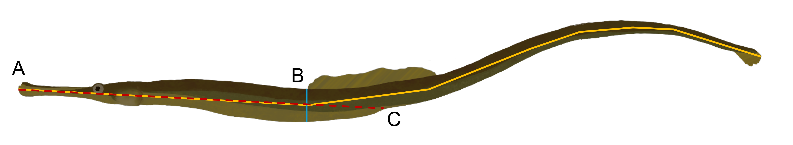

```{r setup, include=FALSE}
knitr::opts_knit$set(root.dir='../',
                     fig_path="../figs/")
```

``` {r library, message = FALSE, warning = FALSE}
#This is a cohesive list of all the libraries used in this document
library(ggplot2)
library(cowplot)
library(fBasics)
library(pwr)
#library(lme4)
library(dplyr)
library(tidyr)
library(knitr)

```

``` {r read-data, message = FALSE, warning = FALSE}

#MomIDs and embryo counts for each section of the male's brood pouch
em_dat <- read.csv("data/EmbryoParentage_floridae.csv")

#Metadata for males and females from the mesocosm experiments
fem_mesoFL <- read.csv("data/all_fem_meso_floridae.csv")
mal_mesoFL <- read.csv("data/all_mal_meso_floridae.csv")

```

# Calculating the degree of sexual dimorphism
Other papers have reported varying levels of significant or non-significant size differences between males and females in this species, particularly in terms of standard length (measured from the tip of the snout to the base of the caudal fin). I want to investigate the data that I have to see what sexual size dimorphism is like for this population. I am doing this across all fish that were used, including those trials that had no successful matings.

The aspects of size that I am interested in looking at include:

- **Standard length** (A; yellow line): measured from the tip of the snout to the base of the caudal fin.
- **Torso depth** (B; blue line): measured from the point in front of the dorsal fin down (perpendicular to standard length).
- **Snout-vent length** (C; red line): measured from the tip of the snout to the urogenital opening.

<p float="center">



</p>

## Checking the assumptions for a pairwise comparison
Before comparing male size to female size I want to ensure the data meets the assumptions. The main two things that I will be looking into include:

1. Equal variances between my groups (using `var.test()`).
2. Normal distribution of the data (using `normalTest()`).

The null hypotheses for these two tests are that the variances are equal and the data is normally distributed.

To account for the fact that fish who are longer may just inherently be deeper as well, I am going to adjust the depth by the snout-vent length of the pipefish prior to running any analyses. Snout-vent length was chosen over standard length as it is more representative of the size of the pipefish. It is possible for a pipefish to loose a part of its tail and remain alive, which would impact the standard length, but not the snout-vent length

```{r assump-test}
#Adjust the torso depth
fem_mesoFL$depth_adj <- fem_mesoFL$depth/fem_mesoFL$svl
mal_mesoFL$depth_adj <- mal_mesoFL$depth/mal_mesoFL$svl

#Testing to see if the variances are equal
var.test(fem_mesoFL$length, mal_mesoFL$length) #EQUAL
var.test(fem_mesoFL$depth_adj, mal_mesoFL$depth_adj) #EQUAL
var.test(fem_mesoFL$svl, mal_mesoFL$svl) #NOT EQUAL

#Testing for normal distribution - Females
normalTest(fem_mesoFL$length, method = "da") #NOT NORMAL
normalTest(fem_mesoFL$depth_adj, method = "da") #NORMAL
normalTest(fem_mesoFL$svl, method = "da") #NORMAL

#Testing for normal distribution - Males
normalTest(mal_mesoFL$length, method = "da") #NORMAL
normalTest(mal_mesoFL$depth_adj, method = "da") #NORMAL
normalTest(mal_mesoFL$svl, method = "da") #NORMAL

```

## Investigate distributions and run the tests
Looking at the distributions below I do not expect to see differences in standard length, but maybe in depth and SVL. I will run one of three tests depending on the results of the above assumption testing:

1. If **both** assumptions are met: _Two Sample t-test_
2. If only the **variances** are not equal, but the data is normal: _Welch Two Sample t-test_
3. If the **data is not normal**, regardless of whether variances are equal: _Wilcoxon rank sum test with continuity correction_

Based on this, I will run a Wilcoxon test for standard length, a Welch two sample t-test for snout-vent length, and a two sample t-test for torso depth (adjusted).

```{r histogram_sizes, message=FALSE, warning = FALSE, echo = FALSE, fig.cap="_Histograms of male and female pipefish body sizes._", fig.width=15}
#Combining the datasets
fem_mesoFL$Sex <- "F"
mal_mesoFL$Sex <- "M"
all_sex_meso <- rbind(fem_mesoFL[, c("length", "depth_adj", "svl", "Sex")], mal_mesoFL[, c("length", "depth_adj", "svl", "Sex")])

length <- ggplot(data = all_sex_meso, aes(x = length)) +
  geom_histogram(aes(fill = Sex),
                 alpha = 0.5,
                 position = 'identity') +
  scale_fill_manual(values = c("#7fc97f75", "#beaed475")) +
  theme_minimal() +
  labs(x = "Length (mm)",
       y = "Number of Pipefish",
       title = "Length of male and female pipefish")

depth <- ggplot(data = all_sex_meso, aes(x = depth_adj)) +
  geom_histogram(aes(fill = Sex),
                 alpha = 0.5,
                 position = 'identity') +
  scale_fill_manual(values = c("#7fc97f75", "#beaed475")) +
  theme_minimal() +
  labs(x = "Depth (mm)",
       y = "Number of Pipefish",
       title = "Depth of male and female pipefish")

svl <- ggplot(data = all_sex_meso, aes(x = svl)) +
  geom_histogram(aes(fill = Sex),
                 alpha = 0.5,
                 position = 'identity') +
  scale_fill_manual(values = c("#7fc97f75", "#beaed475")) +
  theme_minimal() +
  labs(x = "SVL (mm)",
       y = "Number of Pipefish",
       title = "Snout-vent length of male and female pipefish")

plot_grid(length, depth, svl,
          ncol = 3)

```

```{r t-test-sd}
#Running the appropriate test
wilcox.test(fem_mesoFL$length, mal_mesoFL$length)
t.test(fem_mesoFL$depth_adj, mal_mesoFL$depth_adj, var.equal = TRUE)
t.test(fem_mesoFL$svl, mal_mesoFL$svl, var.equal = FALSE)
```

From these results we can see that there are no significant differences between male and female pipefish in terms of standard length. However, female dusky pipefish are significantly deeper that males and possess a significantly longer snout-vent length. For those two morphometrics I am going to run a power test to ensure that we are confident in our results.

```{r power-test}

#Checking the power - SVL
d_mean_svl <- abs(mean(fem_mesoFL$svl, na.rm = TRUE) - 
                    mean(mal_mesoFL$svl, na.rm = TRUE))
pool_sd_svl <- sqrt((var(fem_mesoFL$svl, na.rm = TRUE) + 
                       var(mal_mesoFL$svl, na.rm = TRUE))/ 2)
d_svl <- d_mean_svl/pool_sd_svl

pwr.t.test(n = nrow(fem_mesoFL), 
           d = d_svl,
           sig.level = 0.05,
           type = 'two.sample',
           alternative = 'two.sided')

#Checking the power - Depth
d_mean_depth <- abs(mean(fem_mesoFL$depth_adj, na.rm = TRUE) - 
                      mean(mal_mesoFL$depth_adj, na.rm = TRUE))
pool_sd_depth <- sqrt((var(fem_mesoFL$depth_adj, na.rm = TRUE) + 
                         var(mal_mesoFL$depth_adj, na.rm = TRUE))/ 2)
d_depth <- d_mean_depth/pool_sd_depth
pwr.t.test(n = nrow(fem_mesoFL), 
           d = d_depth,
           sig.level = 0.05,
           type = 'two.sample',
           alternative = 'two.sided')

```

For both variables we have a power of over 0.9 or over 90% so we can be confident in our interpretation.

# Calculating mating and reproductive success for individuals who mated
_Syngnathus floridae_ (dusky pipefish) were sampled from three distinct seagrass beds around Tampa Bay in Tampa, Florida. Sexually mature females (standard length $\ge$ 120mm) and pregnant males were collected and brought back to the University of Tampa and put into experimental breeding populations. In these trials, 8 males and 8 females were housed together in a 140L tank for a period of 14-days and allowed to mate freely. Parentage analysis was done with all of the pregnant males from the trials to figure out how many times each male and female mated, and the number of eggs that were transferred. The results of that are here.

First I had to calculate the mating and reproductive success for each male and female who mated based on the assigned mom for each genotyped embryo.

```{r calc-success, file="R/calc_fitness.R", warning=FALSE}

```

After running the above R script we have two datasets, `mal_fitness` and `fem_fitness`. These datasets include information about the mating success (number of mates) and reproductive success (Number of embryos transferred). We can split reproductive success up further later if we want to from the total number of embryos transferred to the number of embryos developed and the number that were undeveloped. 

I want to include all of the other metadata that I have for these individuals (traits, collection location, latency to pregnancy, etc.) as well as tack on all of the information for the individuals who did not mate. To do that I am going to need to merge the fitness datasets with `fem_meso` and `mal_meso`.

```{r merge-fit-meso}
#Make a column in *_meso that contains the full fishID (i.e. FL1M3) to match the 
#formatting in the fitness datasets (make sure they have the same name for merging purposes)
fem_mesoFL$momID <- paste0("FL", fem_mesoFL$trial_num, "F", fem_mesoFL$fishID)
mal_mesoFL$maleID <- paste0("FL", mal_mesoFL$trial_num, "M", mal_mesoFL$fishID)

#Merge the datasets based on the columns created above
fem_allFL <- merge(fem_mesoFL, fem_fitness, by = "momID", all.x = TRUE, all.y = TRUE)
mal_allFL <- merge(mal_mesoFL, mal_fitness, by = "maleID", all.x = TRUE, all.y = TRUE)
```

There are a few trials that I want to remove from the analysis:

1. All trials where there were no successful matings (7, 9, 10, 11).

2. Trial 1, a male gave birth and the babies were immediately eaten by the adults so the trial was ended early and therefore I was unable to get any parentage information for that trial.

I also want to replace the NAs that were automatically added to the columns from the fitness dataset (MatingSuccess, NumDeveloped, NumUndeveloped, totalEggs) with 0s and add a column to the female dataset that tells me whether or not the female mated (with 1 or 0).

```{r subset-successful-trials}
#Subset the merged datasets to remove trials without successful matings and Trial 1
fem_succFL <- subset(fem_allFL, !(trial_num %in% c(7, 9, 10, 11, 1)))
mal_succFL <- subset(mal_allFL, !(trial_num %in% c(7, 9, 10, 11, 1)))

#Replace NAs with 0s in the columns related to fitness
mal_succFL[, c("MatingSuccess", "NumDeveloped_Calc", 
               "NumUndeveloped_Calc", "totalEggs")] <- sapply(mal_succFL[, c("MatingSuccess", 
                                                                             "NumDeveloped_Calc", 
                                                                             "NumUndeveloped_Calc", 
                                                                             "totalEggs")],
                                                              function(x)
                                                                ifelse(is.na(x), 0, x))

fem_succFL[, c("MatingSuccess", "NumDeveloped", 
               "NumUndeveloped", "totalEggs")] <- sapply(fem_succFL[, c("MatingSuccess", 
                                                                        "NumDeveloped", 
                                                                        "NumUndeveloped", 
                                                                        "totalEggs")],
                                                         function(x)
                                                           ifelse(is.na(x), 0, x))

#Add a column for females to denote mated or unmated
fem_succFL$mated <- ifelse(fem_succFL$MatingSuccess > 0, 1, 0)

```

# Summary statistics for successfully mated individuals
## Males
Across all `r length(unique(mal_succFL$trial_num))` trials and `r nrow(mal_succFL)` total males, there were `r nrow(mal_succFL[mal_succFL$preg_status == 1,])` males that mated at least one time and `r nrow(mal_succFL[mal_succFL$MatingSuccess > 1,])` of those males had two mates. 

Looking across all males, including the ones that did not mate, this is what we find as the mean, sd, and se for the number of embryos transferred and how many of those developed versus didn't:

|                  | mean| SD| SE| max | min |
|:-----------------|----:|---:|----:|----:|----:|
|Number of Embryos | `r mean(mal_succFL$totalEggs)`|`r sd(mal_succFL$totalEggs)`|  `r sd(mal_succFL$totalEggs)/sqrt(nrow(mal_succFL))`|`r max(mal_succFL$totalEggs)` | `r min(mal_succFL$totalEggs)`|
|Developed Embryos | `r mean(mal_succFL$NumDeveloped)`|`r sd(mal_succFL$NumDeveloped)`|  `r sd(mal_succFL$NumDeveloped)/sqrt(nrow(mal_succFL))`|`r max(mal_succFL$NumDeveloped)` | `r min(mal_succFL$NumDeveloped)`|
|Undeveloped Embryos| `r mean(mal_succFL$NumUndeveloped)`|`r sd(mal_succFL$NumUndeveloped)`|  `r sd(mal_succFL$NumUndeveloped)/sqrt(nrow(mal_succFL))`|`r max(mal_succFL$NumUndeveloped)` | `r min(mal_succFL$NumUndeveloped)`|

These values will be influenced by the number of 0s coming from males who did not mate. So let's look at the same thing, but this time for only males who had at least one successful mating:

|                  | mean| SD| SE|  max | min |
|:-----------------|----:|---:|----:|----:|----:|
|Number of Embryos | `r mean(mal_succFL$totalEggs[mal_succFL$preg_status == 1])`|`r sd(mal_succFL$totalEggs[mal_succFL$preg_status == 1])`|  `r sd(mal_succFL$totalEggs[mal_succFL$preg_status == 1])/sqrt(nrow(mal_succFL[mal_succFL$preg_status == 1,]))`| `r max(mal_succFL$totalEggs[mal_succFL$preg_status == 1])` | `r min(mal_succFL$totalEggs[mal_succFL$preg_status == 1])` |
|Developed Embryos | `r mean(mal_succFL$NumDeveloped[mal_succFL$preg_status == 1])`|`r sd(mal_succFL$NumDeveloped[mal_succFL$preg_status == 1])`|  `r sd(mal_succFL$NumDeveloped[mal_succFL$preg_status == 1])/sqrt(nrow(mal_succFL[mal_succFL$preg_status == 1,]))`|`r max(mal_succFL$NumDeveloped[mal_succFL$preg_status == 1])` | `r min(mal_succFL$NumDeveloped[mal_succFL$preg_status == 1])` |
|Undeveloped Embryos| `r mean(mal_succFL$NumUndeveloped[mal_succFL$preg_status == 1])`|`r sd(mal_succFL$NumUndeveloped[mal_succFL$preg_status == 1])`|  `r sd(mal_succFL$NumUndeveloped[mal_succFL$preg_status == 1])/sqrt(nrow(mal_succFL[mal_succFL$preg_status == 1,]))`| `r max(mal_succFL$NumUndeveloped[mal_succFL$preg_status == 1])` | `r min(mal_succFL$NumUndeveloped[mal_succFL$preg_status == 1])` |

We can see from the bottom table that even when we only include males who mated there is still a wide range in the brood size. I want to see what relationship there is between brood pouch size (in terms of both total area and length) and brood size (total number of embryos).

```{r em-v-bp, echo=FALSE, fig.cap="_Scatterplot of the relationship between brood pouch size metrics and the number of embryos a male had._", fig.width=15, fig.height=10 }
#create a subset of only the males who mated
mated_malFL <- mal_succFL[mal_succFL$preg_status == 1, ]

#Plot brood size against the different metrics for pouch size
par(mfrow=c(1,2))
plot(mated_malFL$bp_area,
     mated_malFL$totalEggs,
     xlab = expression(paste("Brood Pouch Area (mm"^2*")")),
     ylab = "Brood Size (# embryos)",
     col = "darkorange",
     pch = 19)
abline(lm(mated_malFL$totalEggs ~ as.numeric(mated_malFL$bp_area)), lwd = 3, lty = 2)
plot(mated_malFL$bp_length,
     mated_malFL$totalEggs,
     xlab = "Brood Pouch Length (mm)",
     ylab = "Brood Size (# embryos)",
     col = "cyan4",
     pch = 19)
abline(lm(mated_malFL$totalEggs ~ as.numeric(mated_malFL$bp_length)), lwd = 3, lty = 2)
```

There may be some correlation happening here, but it doesn't look particularly strong. Let's run some correlations tests to see what they say.

```{r eggs-bp-cor, echo=FALSE}
cor.test(as.numeric(mated_malFL$bp_area), mated_malFL$totalEggs)
cor.test(as.numeric(mated_malFL$bp_length), mated_malFL$totalEggs)
```

There is not a significant correlation between the number of eggs and size of the brood pouch when we look at brood pouch area OR brood pouch length. 

Multiple of the wild study papers looked at correlations between body size in terms of standard length and the number of embryos and found significant positive correlations. 

```{r em-v-sl, echo=FALSE, fig.cap="_Scatterplot of the relationship between standard length (mm) and the number of embryos a male had._", fig.width=15, fig.height=10}
plot(mated_malFL$length,
     mated_malFL$totalEggs,
     xlab = "Standard Length (mm)",
     ylab = "Brood Size (# embryos)",
     col = "#CD5C5C75",
     pch = 19,
     cex = 1.5
)
abline(lm(mated_malFL$totalEggs ~ as.numeric(mated_malFL$length)), lwd = 3, lty = 2)
```

```{r eggs-sl-cor, echo=FALSE}
cor.test(as.numeric(mated_malFL$length), mated_malFL$totalEggs)
```

There appears to be no significant correlation between standard length and the number of eggs in males, unlike what has been found in the species previously. This is unsurprising as we didn't find any hint of a relationship in the brood pouch size metrics and there was a considerable number of males that did not have a full brood pouch.

## Females
Across all `r length(unique(fem_succFL$trial_num))` trials and `r nrow(fem_succFL)` total females, there were `r nrow(fem_succFL[fem_succFL$mated == 1,])` females that mated at least one time, `r nrow(fem_succFL[fem_succFL$MatingSuccess == 2,])` females that mated twice, and `r nrow(fem_succFL[fem_succFL$MatingSuccess == 3,])` that mated 3 times. 

Looking across all females, including the ones that did not mate, this is what we find as the mean, sd, and se for the total number of embryos transferred from each female (across all of her mates if applicable) and how many of those developed versus didn't:

|                  | mean| SD| SE| max | min |
|:-----------------|----:|---:|----:|----:|----:|
|Number of Embryos | `r mean(fem_succFL$totalEggs)`|`r sd(fem_succFL$totalEggs)`|  `r sd(fem_succFL$totalEggs)/sqrt(nrow(fem_succFL))`|`r max(fem_succFL$totalEggs)` | `r min(fem_succFL$totalEggs)`|
|Developed Embryos | `r mean(fem_succFL$NumDeveloped)`|`r sd(fem_succFL$NumDeveloped)`|  `r sd(fem_succFL$NumDeveloped)/sqrt(nrow(fem_succFL))`|`r max(fem_succFL$NumDeveloped)` | `r min(fem_succFL$NumDeveloped)`|
|Undeveloped Embryos| `r mean(fem_succFL$NumUndeveloped)`|`r sd(fem_succFL$NumUndeveloped)`|  `r sd(fem_succFL$NumUndeveloped)/sqrt(nrow(fem_succFL))`|`r max(fem_succFL$NumUndeveloped)` | `r min(fem_succFL$NumUndeveloped)`|

These values will be influenced by the number of 0s coming from females who did not mate. So let's look at the same thing, but this time for only females who had at least one successful mating:

|                  | mean| SD| SE|  max | min |
|:-----------------|----:|---:|----:|----:|----:|
|Number of Embryos | `r mean(fem_succFL$totalEggs[fem_succFL$mated == 1])`|`r sd(fem_succFL$totalEggs[fem_succFL$mated == 1])`|  `r sd(fem_succFL$totalEggs[fem_succFL$mated == 1])/sqrt(nrow(fem_succFL[fem_succFL$mated == 1,]))`| `r max(fem_succFL$totalEggs[fem_succFL$mated == 1])` | `r min(fem_succFL$totalEggs[fem_succFL$mated == 1])` |
|Developed Embryos | `r mean(fem_succFL$NumDeveloped[fem_succFL$mated == 1])`|`r sd(fem_succFL$NumDeveloped[fem_succFL$mated == 1])`|  `r sd(fem_succFL$NumDeveloped[fem_succFL$mated == 1])/sqrt(nrow(fem_succFL[fem_succFL$mated == 1,]))`|`r max(fem_succFL$NumDeveloped[fem_succFL$mated == 1])` | `r min(fem_succFL$NumDeveloped[fem_succFL$mated == 1])` |
|Undeveloped Embryos| `r mean(fem_succFL$NumUndeveloped[fem_succFL$mated == 1])`|`r sd(fem_succFL$NumUndeveloped[fem_succFL$mated == 1])`|  `r sd(fem_succFL$NumUndeveloped[fem_succFL$mated == 1])/sqrt(nrow(fem_succFL[fem_succFL$mated == 1,]))`| `r max(fem_succFL$NumUndeveloped[fem_succFL$mated == 1])` | `r min(fem_succFL$NumUndeveloped[fem_succFL$mated == 1])` |

We can see from the bottom table that even when we only include females who mated there is still a wide range in the number of eggs transferred. I want to see what relationship there may be between female body size (in terms of standard length, depth, and SVL) and the number of eggs she transferred. I also want to see on average how many eggs were transferred per mating. I'm going to calculate this by taking the total number of eggs and dividing it by the number of mates. 

```{r egg-per-mate-fem, echo=FALSE}
eggs_per_mate <- fem_succFL$totalEggs/fem_succFL$MatingSuccess
mean(eggs_per_mate, na.rm = TRUE)
sd(eggs_per_mate, na.rm = TRUE)/sqrt(length(eggs_per_mate))
```


```{r em-v-fem-size, echo=FALSE, fig.cap="_Scatterplot of the relationship between female size metrics and the number of eggs transferred._", fig.width=15, fig.height=8}
#create a subset of only the females who mated
mated_femFL <- fem_succFL[fem_succFL$mated == 1, ]

#Plot total number of eggs transferred against the different metrics for females size
par(mfrow=c(1,3))
plot(mated_femFL$length,
     mated_femFL$totalEggs,
     xlab = "Length (mm)",
     ylab = "Number of eggs transferred",
     col = "darkorange",
     pch = 19)
abline(lm(mated_femFL$totalEggs ~ mated_femFL$length), lwd = 3, lty = 2)
plot(mated_femFL$depth_adj,
     mated_femFL$totalEggs,
     xlab = "Depth (mm)",
     ylab = "Number of eggs transferred",
     col = "cyan4",
     pch = 19)
abline(lm(mated_femFL$totalEggs ~ mated_femFL$depth_adj), lwd = 3, lty = 2)
plot(mated_femFL$svl,
     mated_femFL$totalEggs,
     xlab = "Snout-vent Length (mm)",
     ylab = "Number of eggs transferred",
     col = "purple",
     pch = 19)
abline(lm(mated_femFL$totalEggs ~ mated_femFL$svl), lwd = 3, lty = 2)

```

There may be some correlation happening here, but it doesn't look particularly strong. Let's run some correlations tests to see what they say.

```{r eggs-fem-size-cor, echo=FALSE}

cor.test(mated_femFL$length, as.numeric(mated_femFL$totalEggs))
cor.test(mated_femFL$depth_adj, as.numeric(mated_femFL$totalEggs))
cor.test(mated_femFL$svl, as.numeric(mated_femFL$totalEggs))

```

There is not a significant correlation between the number of eggs and size of the female in terms of standard length, depth, or snout-vent length. Interestingly, however, there is a negative correlation for length and SVL and a positive correlation for depth (but they are all overall weak).

# Differences between mated individuals and unmated individuals
I want to now see if there are any significant differences in the sizes of individuals who mated vs individuals that didn't mate in males and females. I am going to be focusing on the same morphometrics outlined above.

## Males
### Visual Comparison
Before conducting any analyses, let's see if we can visually detect any differences between males who mated and unmated individuals.

```{r mat-status-morph-mal, echo=FALSE, fig.cap="_Six different morphometrics compared between males who sucessfully mated versus those that didn't. Orange represents unmated and blue represents mated males._", fig.height=10, fig.width=15, warning=FALSE}

par(mfrow=c(2,3))
mal_succFL$preg_status <- as.factor(mal_succFL$preg_status)
boxplot(mal_succFL$length ~ mal_succFL$preg_status,
        xlab = "Mated",
        ylab = "Length (mm)",
        col= c("darkorange", "cyan4"))
boxplot(mal_succFL$depth_adj ~ mal_succFL$preg_status,
        xlab = "Mated",
        ylab = "Depth (mm)",
        col= c("darkorange", "cyan4"))
boxplot(mal_succFL$svl ~ mal_succFL$preg_status,
        xlab = "Mated",
        ylab = "Snout-vent Length (mm)",
        col= c("darkorange", "cyan4"))
boxplot(as.numeric(mal_succFL$bp_area) ~ mal_succFL$preg_status,
        xlab = "Mated",
        ylab = expression(paste("Brood Pouch Area (mm"^2*")")),
        col= c("darkorange", "cyan4"))
boxplot(mal_succFL$bp_length ~ mal_succFL$preg_status,
        xlab = "Mated",
        ylab = "Brood Pouch Length (mm)",
        col= c("darkorange", "cyan4"))
boxplot(mal_succFL$weight ~ mal_succFL$preg_status,
        xlab = "Mated",
        ylab = "Weight (g)",
        col= c("darkorange", "cyan4"))
```

I don't notice many differences, however, it appears that unmated males are slightly larger in terms of standard length and snout-vent length, a somewhat surprising find.

### Testing the difference
Let's now put some statistical power behind the difference in various morphometrics between mated and unmated individuals. I am first going to test the assumptions and then run the appropriate version of a t-test. See the previous section "Calculating the degree of sexual dimorphism" for more details.

```{r mat-stat-stat-mal, echo=FALSE, warning=FALSE}
##Test the assumptions
##Looking for equal variances
var.test(mal_succFL$length ~ mal_succFL$preg_status) #equal
var.test(mal_succFL$depth_adj ~ mal_succFL$preg_status) #equal
var.test(mal_succFL$svl ~ mal_succFL$preg_status) #equal
var.test(as.numeric(mal_succFL$bp_area) ~ mal_succFL$preg_status) #equal
var.test(mal_succFL$bp_length ~ mal_succFL$preg_status) #equal
var.test(mal_succFL$weight ~ mal_succFL$preg_status) #equal

##Looking for a normal distribution
normalTest(mal_succFL$length, method = "da") #normal
normalTest(mal_succFL$depth_adj, method = "da") #normal
normalTest(mal_succFL$svl, method = "da") #normal
normalTest(as.numeric(mal_succFL$bp_area), method = "da") #normal
normalTest(mal_succFL$bp_length, method = "da") #normal
normalTest(mal_succFL$weight, method = "da") #normal

##Running the appropriate test
t.test(mal_succFL$length ~ mal_succFL$preg_status,
       var.equal = TRUE)
t.test(mal_succFL$depth_adj ~ mal_succFL$preg_status,
       var.equal = TRUE)
t.test(mal_succFL$svl ~ mal_succFL$preg_status,
       var.equal = TRUE)
t.test(as.numeric(mal_succFL$bp_area) ~ mal_succFL$preg_status,
       var.equal = TRUE)
t.test(mal_succFL$bp_length ~ mal_succFL$preg_status,
       var.equal = TRUE)
t.test(mal_succFL$weight ~ mal_succFL$preg_status,
       var.equal = TRUE)
```

We can now see that males who mated we significantly smaller in terms of both standard length AND snout-vent length. Previous studies on wild populations found that larger males had higher mating and reproductive success . . . exciting!

Let's explore this a bit more and overlay the distribution of all males (mated and unmated) with the males who did mate and see how it varies.

```{r mated-unmated-hist, echo=FALSE, fig.cap= "_Overlay of the size range of males who mated on top of the size range of all males for length and snout-vent length._", fig.width= 15, fig.height= 8}
par(mfrow = c(1,2))
hist(mal_allFL$length, 
     xlab = "Length (mm)", 
     ylab = "Number of male pipefish",
     col = "#beaed4", breaks = 15, main = "")

hist(mal_allFL$length[mal_allFL$preg_status != 0], 
     add = TRUE,
     col = "#8968CD", breaks = 15)

hist(mal_allFL$svl, 
     xlab = "Snout-vent length (mm)", 
     ylab = "Number of male pipefish",
     col = "#beaed4", breaks = 15, main = "")

hist(mal_allFL$svl[mal_allFL$preg_status !=  0], 
     add = TRUE,
     col = "#8968CD", breaks = 12)

legend("topright",
       legend = c("Mated Males", "All Males"),
       col = c("#8968CD", "#beaed4"),
       pch = 15)
```

Even though mated males were significantly smaller, some of the larger males were able to achieve successful matings. 

### Relationships with latency to mate
There was some variety in the length of time that males were house in the same-sex tanks before being placed in the experimental breeding populations. I am now curious to see if there is any relationship between the latency to trials and various components of fitness.

```{r lat-to-mate-matesucc, message=FALSE, eval= FALSE}
#Mating success
##Create the model
mate_succlm <- lmer(mal_succFL$MatingSuccess ~ mal_succFL$lat_to_trial + 
                      (1 | mal_succFL$col_location) + (1 | mal_succFL$col_date))

summary(mate_succlm)

##Create model with fewer parameters
lm_no_location <- lmer(mal_succFL$MatingSuccess ~ mal_succFL$lat_to_trial + 
                         (1 | mal_succFL$col_date))
anova(mate_succlm, lm_no_location)  # Compare models with and without col_location

```

I ran a linear mixed effects model comparing Mating Success to the Latency to trial including both the collection date and collection location as random effect. Overall, the random effects for collection location appear to be non-significant but there is some variability in mating success due to the collection date. From the fixed effects we can see that latency to trial has a negative but non-significant effect on mating success. 

```{r lat-to-mate-matesucc-plot, fig.cap="_Scatterplot of the relationship between the number of mates achieved by a male and how long the male was in the lab prir to entering a trial. Color of the points correspond to the month that the pipefish was collected in._", echo=FALSE}

plot(jitter(mal_succFL$lat_to_trial),
     jitter(mal_succFL$MatingSuccess),
     xlab = "Latency to Trial (Days)",
     ylab = "Mating Success",
     pch = 19,
     col = as.factor(mal_succFL$col_date))
abline(lm(mal_succFL$MatingSuccess ~ mal_succFL$lat_to_trial), lwd = 3, lty =2)

legend("topright",
       legend = unique(mal_succFL$col_date),
       col = unique(as.factor(mal_succFL$col_date)),
       pch = 19)

```

Now let's see if there is any relationship when we look at reproductive success (in terms of total eggs received) and the latency to the trial. Because we already accounted for the males who didn't mate in terms of mating success, I am going to remove them from this model. Therefore we will be looking at the impact on reproductive success on the individuals that were successfully able to obtain a mate.

```{r lat-to-mate-reposucc, message=FALSE, eval= FALSE}
#Mating success
##Create the model
tot_eggslm <- lmer(mated_malFL$totalEggs ~ mated_malFL$lat_to_trial + 
                      (1 | mated_malFL$col_location) + 
                     (1 | mated_malFL$col_date))

summary(tot_eggslm)

##Create model with fewer parameters
lm_no_date <- lmer(mated_malFL$MatingSuccess ~ mated_malFL$lat_to_trial + 
                         (1 | mated_malFL$col_location))
anova(tot_eggslm, lm_no_date)  # Compare models with and without col_location

```

In this new model now we can see that there is only non-zero variance for the random effect of Collection location and there does appear to be a significant negative impact of latency to trial on the total number of eggs received by a male. This may mean that while males who were in the lab for longer did not experience impacts on their ability to achieve mates, they did receive fewer eggs.
 
```{r lat-to-mate-toteggs-plot, fig.cap="_Scatterplot of the relationship between the total eggs recieved by a male and how long the male was in the lab prior to entering a trial. Color of the points correspond to the location that the pipefish was collected from._", echo=FALSE}

plot(jitter(mated_malFL$lat_to_trial),
     jitter(mated_malFL$totalEggs),
     xlab = "Latency to Trial (Days)",
     ylab = "Total Eggs Recieved",
     pch = 19,
     col = as.factor(mated_malFL$col_location))
abline(lm(mated_malFL$totalEggs ~ mated_malFL$lat_to_trial), lwd = 3, lty =2)

legend("topright",
       legend = unique(mated_malFL$col_location),
       col = unique(as.factor(mated_malFL$col_location)),
       pch = 19)

```

### Differences between singly mated and multiply mated males
I also want to see if we can detect any differences between the males that mated only once compared to the males that mated more than once. My hunch is that I will not have a large enough sample size for the multiply mated individuals to be able to detect any differences, but we shall see. I am going to look at standard length, depth, svl, and reproductive fitness. Once again, before I run the tests I want to check the assumptions.

```{r mat-stat-mal, echo=FALSE, warning=FALSE}
##Test the assumptions
##Looking for equal variances
var.test(mated_malFL$length[mated_malFL$MatingSuccess == 1],
         mated_malFL$length[mated_malFL$MatingSuccess > 1]) #equal
var.test(mated_malFL$depth_adj[mated_malFL$MatingSuccess == 1],
         mated_malFL$depth_adj[mated_malFL$MatingSuccess > 1]) #equal
var.test(mated_malFL$svl[mated_malFL$MatingSuccess == 1],
         mated_malFL$svl[mated_malFL$MatingSuccess > 1]) #equal
var.test(mated_malFL$totalEggs[mated_malFL$MatingSuccess == 1],
         mated_malFL$totalEggs[mated_malFL$MatingSuccess > 1]) #equal

##Looking for a normal distribution
normalTest(mated_malFL$length, method = "da") #normal
normalTest(mated_malFL$depth_adj, method = "da") #normal
normalTest(mated_malFL$svl, method = "da") #normal
normalTest(mated_malFL$totalEggs, method = "da") #normal

##Running the appropriate test
t.test(mated_malFL$length[mated_malFL$MatingSuccess == 1],
         mated_malFL$length[mated_malFL$MatingSuccess > 1],
       var.equal = TRUE)
t.test(mated_malFL$depth_adj[mated_malFL$MatingSuccess == 1],
         mated_malFL$depth_adj[mated_malFL$MatingSuccess > 1],
       var.equal = TRUE)
t.test(mated_malFL$svl[mated_malFL$MatingSuccess == 1],
         mated_malFL$svl[mated_malFL$MatingSuccess > 1],
       var.equal = TRUE)
t.test(mated_malFL$totalEggs[mated_malFL$MatingSuccess == 1],
         mated_malFL$totalEggs[mated_malFL$MatingSuccess > 1],
       var.equal = TRUE)

```

Just as I suspected, we cannot find any significant differences between the mated and multiply mated males.

## Females
Similarly, now let's see if we can identify any significant differences in the morphometrics of females who were able to obtain mates versus those who were unsuccessful.

### Visual Comparison
Before conducting any analyses, let's see if we can visually detect any differences between males who mated and unmated individuals.

```{r mat-status-morph-fem, echo=FALSE, fig.cap="_Four different morphometrics compared between females who sucessfully mated versus those that didn't. Orange represents unmated and blue represents mated females._", fig.height=10, fig.width=10}
par(mfrow=c(2,2))
fem_succFL$mated <- as.factor(fem_succFL$mated)

boxplot(fem_succFL$length ~ fem_succFL$mated,
        xlab = "Mated",
        ylab = "Length (mm)",
        col= c("darkorange", "cyan4"))
boxplot(fem_succFL$depth_adj ~ fem_succFL$mated,
        xlab = "Mated",
        ylab = "Depth (mm)",
        col= c("darkorange", "cyan4"))
boxplot(fem_succFL$svl ~ fem_succFL$mated,
        xlab = "Mated",
        ylab = "Snout-vent Length (mm)",
        col= c("darkorange", "cyan4"))
boxplot(fem_succFL$weight ~ fem_succFL$mated,
        xlab = "Mated",
        ylab = "Weight (g)",
        col= c("darkorange", "cyan4"))

```

I don't notice many differences, however, it appears that mated females are deeper than unmated females.

### Testing the difference
Let's now put some statistical power behind the difference in various morphometrics between mated and unmated individuals. I am first going to test the assumptions and then run the appropriate version of a t-test. See the previous section "Calculating the degree of sexual dimorphism" for more details.

```{r mat-stat-stat-fem, echo=FALSE, warning=FALSE}
#Test the assumptions
##Equal variances
var.test(fem_succFL$length ~ fem_succFL$mated) #equal
var.test(fem_succFL$depth_adj ~ fem_succFL$mated) #equal
var.test(fem_succFL$svl ~ fem_succFL$mated) #equal
var.test(fem_succFL$weight ~ fem_succFL$mated) #equal

##Normal Distributions
normalTest(fem_succFL$length, method = "da") #normal
normalTest(fem_succFL$depth_adj, method = "da") #normal
normalTest(fem_succFL$svl, method = "da") #normal
normalTest(fem_succFL$weight, method = "da") #normal

#Running the appropriate test
t.test(fem_succFL$length ~ fem_succFL$mated, 
       var.equal = TRUE)
t.test(fem_succFL$depth_adj ~ fem_succFL$mated, 
       var.equal = TRUE)
t.test(fem_succFL$svl ~ fem_succFL$mated, 
       var.equal = TRUE)
t.test(fem_succFL$weight ~ fem_succFL$mated,
       var.equal = TRUE)
```

We can now see that female who mated we significantly larger only in terms of the torso depth, but otherwise there were no significant differences in body sizes

Let's explore this a bit more and overlay the distribution of torso depth in all females (mated and unmated) with the torso depth of females who did mate and see how it varies.

```{r mated-unmated-hist-depth, echo=FALSE, fig.cap= "_Overlay of the torso depth of females who mated on top of the size range of all females._", fig.width= 15, fig.height= 10}

hist(fem_allFL$depth_adj, 
     xlab = "Torso Depth (mm)", 
     ylab = "Number of female pipefish",
     col = "#7fc97f", breaks = 20, main = "")

hist(fem_allFL$depth_adj[fem_allFL$MatingSuccess != 0], 
     add = TRUE,
     col = "#548B54", breaks = 15)

legend("topright",
       legend = c("Mated Females", "All Females"),
       col = c("#548B54", "#7fc97f"),
       pch = 15)
```


# Looking into the Opportunity for Selection in Males and Females
One of the benefits of using genetic parentage analysis is that we can now calculate the opportunity for selection and the opportunity for sexual selection in male and female pipefish. 

## Generating the total opportunity for selection ($I$) and the opportunity for sexual selection ($I_S$)
The opportunity for selection ($I$) and the opportunity for sexual selection ($I_S$) are defined as the variance in reproductive success (defined here as the total number of offspring produced by an individual) and the variance in mating success respectively. 

Because each trial provides an independent "population" (i.e., pipefish from one trial **cannot mate** with pipefish from another trial), I am going to calculate these metrics for each trial individually and then I will average it. With these I can then also generate 95% confidence intervals which I will investigate for indications of significance in two ways:

  - If the confidence intervals **DO NOT** cross 0 -> significant selection.
  - If the confidence intervals between the sexes **DO NOT** cross -> significantly different selection between the two sexes.

```{r opp-selection}
##FEMALES
#Create a dataframe to store the calculations of I and I_S in
fem_opp_selection <- data.frame(matrix(ncol = 3,
                                       nrow = 0))

colnames(fem_opp_selection) <- c("trial_num", "I", "I_s")

#Loop through the different trials and calculate I and I_S
for (trial in unique(fem_succFL$trial_num)) {
  
  #Subset the overall dataframe to work with an individual trial
  tmp <- fem_succFL[fem_succFL$trial_num == trial, ]
  
  #Calculate opportunity selection
  I <- var(tmp$NumDeveloped)/(mean(tmp$NumDeveloped)^2)
  
  I_s <- var(tmp$MatingSuccess)/(mean(tmp$MatingSuccess)^2)
  
  #Combining all of the selection values (Is) and save the output
  trial_num <- trial
  selection <- cbind(trial_num, I, I_s)
  
  fem_opp_selection <- rbind(fem_opp_selection, selection)
  
}


##MALES
#Create a dataframe to store the calculations of I and I_S in
mal_opp_selection <- data.frame(matrix(ncol = 3,
                                       nrow = 0))

colnames(mal_opp_selection) <- c("trial_num", "I", "I_s")

#Loop through the different trials and calculate I and I_S
for (trial in unique(mal_succFL$trial_num)) {
  
  #Subset the overall dataframe to work with an individual trial
  tmp <- mal_succFL[mal_succFL$trial_num == trial, ]
  
  #Calculate opportunity selection
  I <- var(tmp$NumDeveloped)/(mean(tmp$NumDeveloped)^2)
  
  I_s <- var(tmp$MatingSuccess)/(mean(tmp$MatingSuccess)^2)
  
  #Combining all of the selection values (Is) and save the output
  trial_num <- trial
  selection <- cbind(trial_num, I, I_s)
  
  mal_opp_selection <- rbind(mal_opp_selection, selection)
  
}

#Merge the selection coefficients from males and females into one dataset to 
#make life easier
fem_opp_selection$Sex <- "F"
mal_opp_selection$Sex <- "M"

opp_selection_all <- rbind(fem_opp_selection, mal_opp_selection)
```

Now that I have calculated the opportunity for selection and sexual selection, I want to generate my averages and 95% CI for both.

```{r opp-selection-CI}
#List the columns of interest
columns <- c("I", "I_s")

#Create a dataframe to store the final values in
opp_average <- data.frame(matrix(ncol = 4,
                                 nrow = 0))
colnames(opp_average) <- c("Average", "Interval", "Episode_sel", "Sex")

#Calculate the critical value
crit <- qt(p = 0.975, df = (nrow(fem_opp_selection) - 1))

for (j in 1:length(columns)) {
    
    col_name <- columns[[j]]
    
    #Calculate the means
    mean <- t(t(tapply(opp_selection_all[, colnames(opp_selection_all) == col_name], 
                       opp_selection_all$Sex, 
                       mean)))
    
    #Calculate standard error
    se <- t(t(tapply(opp_selection_all[, colnames(opp_selection_all) == col_name], 
                     opp_selection_all$Sex, 
                 function(x){
                   sqrt(var(x))/sqrt(length(x))
                 })))
    
    #Calculate the value that is added and subtracted from the mean
    int <- se*crit
    
    #Combine the data together
    episode <- as.data.frame(cbind(mean, int))
    colnames(episode) <- c("Average", "Interval")
    
    episode$Episode_sel <- col_name
    episode$Sex <- rownames(episode)
    
    rownames(episode) <- NULL
    
    opp_average <- rbind(opp_average, episode)
    
  }

```

Let's now explore some results:

```{r opp-selection-table, echo = FALSE, warning=FALSE}

#Create a new column
opp_average <- opp_average %>%
  mutate(Combined = paste0(round(Average , 2), 
                           " (", round(Average - Interval, 2), ", ",
                           round(Average + Interval, 2), ")"))

#Transform data into wide format
sum_opp <- opp_average %>% 
  select(Episode_sel, Sex, Combined) %>% 
  pivot_wider(names_from = Sex, values_from = Combined) 

#Display the table
kable(sum_opp, caption = "Average Opportunity of Selection (95% CI) for Males and Females")

```


```{r opp-selection-figure, echo=FALSE, fig.cap="_Average opportunity for selection and opportunity for sexual selection for male (purple) and female (green) S. floridae. Errorbars represent the 95% confidence intervals around the mean_", fig.width=8, fig.height=6, warning=FALSE}

#Set parameters
sex_cols <- c("F" = "#7fc97f", "M" = "#beaed4" )
pd <- position_dodge(1)

ggplot(opp_average,
       aes(x = Episode_sel,
           y = Average,
           color = Sex,
           group = Sex)) +
  geom_errorbar(aes(ymin = Average - Interval,
                    ymax = Average + Interval),
                color = "black",
                width = 0.2,
                position = pd,
                linewidth = 1) +
  geom_point(position = pd,
             size = 4) +
  xlab("Episode of Selection") +
  ylab("Average Fitness Value") +
  scale_color_manual(values = sex_cols) +
  theme(panel.grid.major = element_blank(), 
        panel.grid.minor = element_blank(), 
        panel.background = element_blank(), 
        axis.line = element_line(colour = "black")) +
  theme(legend.position = "bottom",
        legend.key=element_blank(),
        axis.title.x = element_text(size = 16,
                                    vjust = -0.5),
        axis.text.x = element_text(size = 16, family = "serif"),
        axis.title.y = element_text(size = 16,
                                    vjust = 2.5),
        axis.text.y = element_text(size = 16),
        legend.title = element_text(size = 14),
        legend.text = element_text(size = 12)) +
  geom_hline(yintercept = 0, linetype = "dashed", size = 1)

```

We can see that for male and female _S. floridae_ there is a significant opportunity for selection and opportunity for sexual selection, however, we don't see significant differences between the sexes for either one. In both cases, there is a greater opportunity for selection compared to an opportunity for sexual selection.

## Partitioning the Total Opportunity for Selection ($I$)
One of the downsides associated with the opportunity for selection and the opportunity for sexual selection is that it largely focuses on **pre-copulatory** sexual selection. While this is a major force for many organisms, as it is related to one's ability to successfully achieve a mate, it is not the only type of selection they experience. Obtaining a mate is only half the battle, you must also obtain successful fertilization for your genes to be passed to the next generation, meaning **post-copulatory** sexual selection is just as important to consider. To investigate this, we can parse or decompose the overall opportunity for selection into various episodes to represent various pre- and post-mating processes. 

Once again, I am going to calculate selection for the trials individually in males and females and then average across all trials to get the final values and the 95% CIs. For pre-mating processes I am focusing on mating success and then for post-mating processes I am looking at the total number of eggs transferred/received and the proportion of those eggs which developed (showing fertilization success).

I also want to calculate the percentage of the overall opportunity for selection that is represented by each episode of selection.

```{r opp-select-episodes-females}

#Create a dataframe to store all of the intermediate values of fitness in
fem_succ_fitness <- data.frame(matrix(ncol = ncol(fem_succFL) + 9,
                                      nrow = 0))
colnames(fem_succ_fitness) <- c(colnames(fem_succFL),
                                "w1", "w1_squared",
                                "W2", "W2_bar", "w2",
                                "W3", "W3_bar", "w3", "i3")

#Create a dataframe to store the final calculations of I in
opp_selection_episodes_fem <- data.frame(matrix(ncol = 12,
                                            nrow = 0))
colnames(opp_selection_episodes_fem) <- c("trial_num", "I_1", "I_1per", "I_2", "I_2per", 
                                          "I_3", "I_3per", "I_12", "I_12per",
                                          "I", "Iper")

for (trial in unique(fem_succFL$trial_num)) {
  
  #Subset the overall dataframe to work with an individual trial
  tmp <- fem_succFL[fem_succFL$trial_num == trial, ]
  
  #Calculate the absolute pre-copulatory fitness (Eq. 14 Arnold & Wade 1984)
  #This is the same as the calculation of I_s
  tmp$w1 <- tmp$MatingSuccess/mean(tmp$MatingSuccess) #Relative mating success
  tmp$w1_squared <- (tmp$w1)^2
  
  I_1 <- var(tmp$w1) #Variance in relative mating success
  
  #Post-copulatory selection event 1 (Number of eggs transferred) (Eq. 15 Arnold & Wade 1984)
  tmp$W2 <- ifelse(tmp$MatingSuccess > 0,
                   tmp$totalEggs/tmp$MatingSuccess,
                   0) #Number of eggs per mate
  tmp$W2_bar <- tmp$W2 * (tmp$w1/nrow(tmp)) #Number of eggs per mate adjusted by the # of individuals with fitness W
  tmp$w2 <- tmp$W2/sum(tmp$W2_bar)
  
  I_2 <- (sum((tmp$w1 * (tmp$w2)^2))/nrow(tmp) - 1) * nrow(tmp)/(nrow(tmp) - 1)
  
  #Post-copulatory selection event 2 (Number of eggs developed) (Eq. 16 Arnold & Wade 1984)
  tmp$W3 <- ifelse(tmp$totalEggs > 0,
                   tmp$NumDeveloped/tmp$totalEggs,
                   0) #Proportion of transferred eggs that developed
  tmp$W3_bar <- tmp$W3 * ((tmp$totalEggs/mean(tmp$totalEggs))/nrow(tmp)) #Prop. of eggs developed adjusted by the # of individuals with fitness W
  tmp$w3 <- tmp$W3/sum(tmp$W3_bar)
  tmp$i3 <- ((tmp$totalEggs/mean(tmp$totalEggs))/nrow(tmp)) * ((tmp$w3 - 1)^2)
  
  I_3 <- sum(tmp$i3) * nrow(tmp)/(nrow(tmp) - 1)

  I_12 <- var(tmp$totalEggs)/(mean(tmp$totalEggs)^2)
  
  #Total opportunity for selection
  I <- var(tmp$NumDeveloped)/(mean(tmp$NumDeveloped)^2)
  
  #Calculating percentages for each selection event
  I_1per <- (I_1/I)*100
  I_2per <- (I_2/I)*100
  I_3per <- (I_3/I)*100
  I_12per <- (I_12/I)*100
  Iper <- (I/I)*100
  
  #Combining all of the selection values (Is) and saving the output
  trial_num <- trial
  selection <- cbind(trial_num, I_1, I_1per, I_2, I_2per, I_3, I_3per,
                     I_12, I_12per, I, Iper)
  
  opp_selection_episodes_fem <- rbind(opp_selection_episodes_fem, selection)
  
  #Save the intermediate values
  fem_succ_fitness <- rbind(fem_succ_fitness, tmp)
}

#Exporting the data
#write.csv(fem_succ_fitness, "data/floridae_int_I_fem.csv", row.names = FALSE)
```

```{r opp-select-episodes-males}
#Create a dataframe to store all of the intermediate values of fitness in
mal_succ_fitness <- data.frame(matrix(ncol = ncol(mal_succFL) + 9,
                                      nrow = 0))
colnames(mal_succ_fitness) <- c(colnames(mal_succFL),
                                "w1", "w1_squared",
                                "W2", "W2_bar", "w2",
                                "W3", "W3_bar", "w3", "i3")

#Create a dataframe to store the final calculations of I in
opp_selection_episodes_mal <- data.frame(matrix(ncol = 12,
                                            nrow = 0))
colnames(opp_selection_episodes_mal) <- c("trial_num", "I_1", "I_1per", "I_2", "I_2per", 
                                          "I_3", "I_3per", "I_12", "I_12per",
                                          "I", "Iper", "I_s")

for (trial in unique(mal_succFL$trial_num)) {
  
  #Subset the overall dataframe to work with an individual trial
  tmp <- mal_succFL[mal_succFL$trial_num == trial, ]
  
  #Calculate the absolute pre-copultory fitness (Eq. 14 Arnold & Wade 1984)
  tmp$w1 <- tmp$MatingSuccess/mean(tmp$MatingSuccess) #Relative mating success
  tmp$w1_squared <- (tmp$w1)^2
  
  I_1 <- var(tmp$w1) #Variance in relative mating success
  
  #Post-copulatory selection event 1 (Number of eggs transferred) (Eq. 15 Arnold & Wade 1984)
  tmp$W2 <- ifelse(tmp$MatingSuccess > 0,
                   tmp$totalEggs/tmp$MatingSuccess,
                   0) #Number of eggs per mate
  tmp$W2_bar <- tmp$W2 * (tmp$w1/nrow(tmp)) #Number of eggs per mate adjusted by the # of individuals with fitness W
  tmp$w2 <- tmp$W2/sum(tmp$W2_bar)
  
  I_2 <- (sum((tmp$w1 * (tmp$w2)^2))/nrow(tmp) - 1) * nrow(tmp)/(nrow(tmp) - 1)
  
  #Post-copulatory selection event 2 (Number of eggs developed) (Eq. 16 Arnold & Wade 1984)
  tmp$W3 <- ifelse(tmp$totalEggs > 0,
                   tmp$NumDeveloped_Calc/tmp$totalEggs,
                   0) #Proportion of transferred eggs that developed
  tmp$W3_bar <- tmp$W3 * ((tmp$totalEggs/mean(tmp$totalEggs))/nrow(tmp)) #Prop. of eggs developed adjusted by the # of individuals with fitness W
  tmp$w3 <- tmp$W3/sum(tmp$W3_bar)
  tmp$i3 <- ((tmp$totalEggs/mean(tmp$totalEggs))/nrow(tmp)) * ((tmp$w3 - 1)^2)
  
  I_3 <- sum(tmp$i3) * nrow(tmp)/(nrow(tmp) - 1)

  I_12 <- var(tmp$totalEggs)/(mean(tmp$totalEggs)^2)
  
  #Total opportunity for selection
  I <- var(tmp$NumDeveloped_Calc)/(mean(tmp$NumDeveloped_Calc)^2)

  #Calculating percentages for each selection event
  I_1per <- (I_1/I)*100
  I_2per <- (I_2/I)*100
  I_3per <- (I_3/I)*100
  I_12per <- (I_12/I)*100
  Iper <- (I/I)*100
  
  #Combining all of the selection values (Is) and saving the output
  trial_num <- trial
  selection <- cbind(trial_num, I_1, I_1per, I_2, I_2per, I_3, I_3per,
                     I_12, I_12per, I, Iper)
  
  opp_selection_episodes_mal <- rbind(opp_selection_episodes_mal, selection)
  
  #Save the intermediate values
  mal_succ_fitness <- rbind(mal_succ_fitness, tmp)
}

#Exporting the data
#write.csv(mal_succ_fitness, "data/floridae_int_I_mal.csv", row.names = FALSE)
```

```{r select-episodes-CI}
#Merge the selection coefficients from males and females into one dataset to 
#make life easier
opp_selection_episodes_fem$Sex <- "F"
opp_selection_episodes_mal$Sex <- "M"

opp_selection_episodes_all <- rbind(opp_selection_episodes_fem, opp_selection_episodes_mal)

#Exporting the data
#write.csv(opp_selection_episodes_all, "data/floridae_opp_selection.csv", row.names = FALSE)

#List the columns of interest
columns <- c("I_1", "I_2", "I_12", "I_3","I")

#Create a dataframe to store the final values in
opp_episodes_average <- data.frame(matrix(ncol = 4,
                                    nrow = 0))
colnames(opp_episodes_average) <- c("Average", "Interval", 
                                    "Episode_sel", "Sex")

#Calculate the critical value
crit <- qt(p = 0.975, df = (nrow(opp_selection_episodes_fem) - 1))

for (j in 1:length(columns)) {
    
    col_name <- columns[[j]]
    
    #Calculate the means
    mean <- t(t(tapply(opp_selection_episodes_all[, colnames(opp_selection_episodes_all) 
                                                  == col_name], 
                       opp_selection_episodes_all$Sex, 
                       mean)))
    
    #Calculate standard error
    se <- t(t(tapply(opp_selection_episodes_all[, colnames(opp_selection_episodes_all) 
                                                == col_name], 
                     opp_selection_episodes_all$Sex, 
                 function(x){
                   sqrt(var(x))/sqrt(length(x))
                 })))
    
    #Calculate the value that is added and subtracted from the mean
    int <- se*crit
    
    #Combine the data together
    episode <- as.data.frame(cbind(mean, int))
    colnames(episode) <- c("Average", "Interval")
    
    episode$Episode_sel <- col_name
    episode$Sex <- rownames(episode)
    
    rownames(episode) <- NULL
    
    opp_episodes_average <- rbind(opp_episodes_average, episode)
    
  }


```

Let's now explore some results:

```{r opp-select-episodes-table, echo = FALSE, warning=FALSE}

#Create a new column
opp_episodes_average <- opp_episodes_average %>%
  mutate(Combined = paste0(round(Average , 2), 
                           " (", round(Average - Interval, 2), ", ",
                           round(Average + Interval, 2), ")"))

#Transform data into wide format
sum_table <- opp_episodes_average %>% 
  select(Episode_sel, Sex, Combined) %>% 
  pivot_wider(names_from = Sex, values_from = Combined) 

#Display the table
kable(sum_table, caption = "Average Episode of Selection (95% CI) for Males and Females")

```


```{r opp-select-episodes-figure, echo=FALSE, fig.cap="_Average opportunity for selection for the different episodes for male (purple) and female (green) S. floridae. Errorbars represent the 95% confidence intervals around the mean_", fig.width=8, fig.height=6, warning=FALSE}

#Set parameters

ggplot(opp_episodes_average,
       aes(x = Episode_sel,
           y = Average,
           color = Sex,
           group = Sex)) +
  geom_errorbar(aes(ymin = Average - Interval,
                    ymax = Average + Interval),
                color = "black",
                width = 0.2,
                position = pd,
                linewidth = 1) +
  geom_point(position = pd,
             size = 4) +
  xlab("Episode of Selection") +
  ylab("Average Fitness Value") +
  scale_color_manual(values = sex_cols) +
  theme(panel.grid.major = element_blank(), 
        panel.grid.minor = element_blank(), 
        panel.background = element_blank(), 
        axis.line = element_line(colour = "black")) +
  theme(legend.position = "bottom",
        legend.key=element_blank(),
        axis.title.x = element_text(size = 16,
                                    vjust = -0.5),
        axis.text.x = element_text(size = 16, family = "serif"),
        axis.title.y = element_text(size = 16,
                                    vjust = 2.5),
        axis.text.y = element_text(size = 16),
        legend.title = element_text(size = 14),
        legend.text = element_text(size = 12)) +
  geom_hline(yintercept = 0, linetype = "dashed", size = 1)

```

From the table and the plot we can see that once again there are no significant differences in the selection between males and females. Additionally, the two post-mating episodes of selection ($I_2$ and $I_3$) are non-significant for both males and females (i.e., the 95% CI cross zero).

Let's now look more into the percentage of the overall opportunity for selection made up for by each individual episode of selection:

```{r calc-opp-percents}

sexes <- c("M", "F")

#Create a dataframe to store the final values in
opp_percents <- data.frame(matrix(ncol = 3,
                                 nrow = 0))
colnames(opp_percents) <- c("Percent", "Episode_sel", "Sex")

#Calculate the percentage for each episode in the two sexes
for (sex in sexes) {
    
  #subset dataset based on sex
  tmp_sex <- opp_episodes_average[opp_episodes_average$Sex == sex, ]
  
  #Pull out the overall opp. for selection value
  I_average <- tmp_sex$Average[tmp_sex$Episode_sel == "I"]
  
  #Calculate what percentage of the I is represented by each episode
  percents <- as.data.frame(t(t(apply(tmp_sex, 1, function(x){
      
      (as.numeric(x[1])/I_average)*100
      
    }))))
    
    colnames(percents) <- "Percent"
    percents$Episode_sel <- tmp_sex$Episode_sel
    percents$Sex <- sex
    
    rownames(percents) <- NULL
    
    opp_percents <- rbind(opp_percents, percents)
    
  }

```

```{r generate-figa-opp-selection, echo=FALSE, warning=FALSE, fig.cap="_The proportion of the total opportunity for selection that is represented by each episode of selection for males and females._"}

selection_colors <- c("I_1" = "#9FBCAA", "I_2" = "#F0B67F", "I_3" = "#CD96CD", "I_12" = "#6CA6CD")

ggplot(opp_percents[!(opp_percents$Episode_sel %in% c("I", "I_12")),], 
       aes(x = Sex, 
           y = Percent, 
           fill = Episode_sel)) +
  geom_bar(position = "stack", stat = "identity") +
  theme(panel.grid.major = element_blank(), 
        panel.grid.minor = element_blank(), 
        panel.background = element_blank(), 
        axis.line = element_line(colour = "black")) +
  scale_fill_manual(values = selection_colors) +
   theme(legend.position = "right",
        legend.key=element_blank(),
        axis.title.x = element_text(size = 16,
                                    vjust = -0.5),
        axis.text.x = element_text(size = 12),
        axis.title.y = element_text(size = 16,
                                    vjust = 2.5),
        axis.text.y = element_text(size = 12),
        legend.title = element_text(size = 14),
        legend.text = element_text(size = 12, family = "serif"))

```

Matching the previous plots, most of the opportunity for selection in _Syngnathus floridae_ males and females can be attributed to variance in mating success ($I_1$) rather than variance in eggs transferred/received ($I_2$) or variance in the proportion of eggs developed ($I_3$).

# Mate success versus Reproductive success (Bateman Gradient, $\beta_{SS}$)
I now want to look at any relationship that may exist between mating success and reproductive success for males and females. The Bateman gradient ($\beta_{SS}$) will be calculated, which is the slope of the weighted least-squares regression of relative reproductive success (number of offspring divided by the mean) on mating success. 

A shallow slope in the Bateman gradient implies a low fitness gain with each additional mating event, and correspondingly weak or no selection acting on traits related to mating success, with a steeper Bateman gradient showing the reverse.

To calculate $\beta_{SS}$ we use _relative_ measures of fitness:
($\frac{indvidual's fitness}{mean(fitness)}$)

I am going to generate the measurements of relative fitness once again for the trials individually rather than across all of the trials.

```{r calc-relative-fitness}

#Calculating relative fitness as a metric for reproductive success
#Create a dataframe to store all of the calculations of relative fitness in
fem_bateman <- data.frame(matrix(ncol = 3,
                                 nrow = 0))
colnames(fem_bateman) <- c("trial", "MatingSuccess","rel_repo_fitness")

#Loop through each trial to calculate relative fitness
for (trial in unique(fem_succFL$trial_num)) {
  
  #Subset the overall dataframe to work with an individual trial
  tmp <- fem_succFL[fem_succFL$trial_num == trial, ]
  
  #Calculate relative fitness
  rel_repo_fitness <- tmp$totalEggs/mean(tmp$totalEggs)
  
  #Calculte mating fitness
  rel_mate_succuess <- tmp$MatingSuccess/mean(tmp$MatingSuccess)
  
  #Column-bind the trial #, Mating success, and calculated rel. fitness
  fitness <- cbind("trial" = rep(trial, nrow(tmp)), 
                   "MatingSuccess" = rel_mate_succuess, 
                   rel_repo_fitness)
  
  #Add this chunk of data to the dataframe we created
  fem_bateman <- rbind(fem_bateman, fitness)
}


#Repeat process for the Male mating data
mal_bateman <- data.frame(matrix(ncol = 3,
                                 nrow = 0))
colnames(mal_bateman) <- c("trial", "MatingSuccess","rel_repo_fitness")

for (trial in unique(mal_succFL$trial_num)) {
  
  #Subset the overall dataframe to work with an individual trial
  tmp <- mal_succFL[mal_succFL$trial_num == trial, ]
  
  #Calculate relative fitness
  rel_repo_fitness <- tmp$totalEggs/mean(tmp$totalEggs)
  
  #Calculte mating fitness
  rel_mate_succuess <- tmp$MatingSuccess/mean(tmp$MatingSuccess)
  
  #Column-bind the trial #, Mating success, and calculated rel. fitness
  fitness <- cbind("trial" = rep(trial, nrow(tmp)), 
                   "MatingSuccess" = rel_mate_succuess, 
                   rel_repo_fitness)
  
  #Add this chunk of data to the dataframe we created
  mal_bateman <- rbind(mal_bateman, fitness)
}

```

Once we have the measures of relative fitness we can use them to run the weighted least-squares regression for males and females separately.

```{r calc-bateman-gradient}

#Generating Bateman's gradient
#Define the model
fem_model <- lm(fem_bateman$rel_repo_fitness ~ fem_bateman$MatingSuccess)
mal_model <- lm(mal_bateman$rel_repo_fitness ~ mal_bateman$MatingSuccess)

#define weights to use
wt_fem <- 1 / lm(abs(fem_model$residuals) ~ fem_model$fitted.values)$fitted.values^2
wt_mal <- 1 / lm(abs(mal_model$residuals) ~ mal_model$fitted.values)$fitted.values^2

#perform weighted least squares regression
wls_model_fem <- lm(fem_bateman$rel_repo_fitness ~ fem_bateman$MatingSuccess,
                    weights=wt_fem)
wls_model_mal <- lm(mal_bateman$rel_repo_fitness ~ mal_bateman$MatingSuccess,
                    weights=wt_mal)

#Investigate the results
summary(wls_model_fem) #significant
summary(wls_model_mal) #significant

```

For both males and females there is a significant slope, meaning both sexes see increases in fitness with each additional mating. I am interested to run the model with the two datasets combined to see if there is an interaction of sex.

```{r calc-bateman-all}

#Combine the two datasets
fem_bateman$Sex <- "F"
mal_bateman$Sex <- "M"

all_bateman <- rbind(fem_bateman, mal_bateman)

#Running a weighted least squares regression between MS and Sex
MS_sex_model <- lm(all_bateman$rel_repo_fitness ~
                     all_bateman$MatingSuccess*all_bateman$Sex)

wt_all <- 1 / lm(abs(MS_sex_model$residuals) ~
                   MS_sex_model$fitted.values)$fitted.values^2

wls_MS_sex_model <- lm(all_bateman$rel_repo_fitness ~ 
                         all_bateman$MatingSuccess*all_bateman$Sex, weights = wt_all)

summary(wls_MS_sex_model)

```

When we combine all of the data together we can see two additional things:

  1. There is no significant interactions effect of Mating success and sex
  2. The slopes for males and females are not significantly different from each other
  
Let's visually look at this pattern now:

```{r plot-bateman, echo=FALSE, fig.cap="_Relationship between reproductive success and mating success for male (purple) and female (green) _Syngnathus floridae_. Reproductive success is shown as relative fitness (i.e. number of offspring produced divided by the mean number of offspring produced). Bateman's gradient is shown as the weighted least-squares regression line (dashed) for males and females._", fig.height=5}

#Plotting the relationship between the mating and reproductive success
plot(fem_bateman$MatingSuccess,
     fem_bateman$rel_repo_fitness,
     xlab = "Number of Mates (mating success)",
     ylab = "Relative Fitness (reproductive success)",
     pch = 19,
     col = "#7fc97f75")
points(mal_bateman$MatingSuccess,
       mal_bateman$rel_repo_fitness,
       xlab = "Number of Mates (mating success)",
       ylab = "Relative Fitness (reproductive success)",
       pch = 19,
       col = "#beaed475")
abline(wls_model_fem, col = "#7fc97f", lwd = 3, lty = 2)
abline(wls_model_mal, col = "#beaed4", lwd = 3, lty = 2)

legend("topleft",
       legend = c("Male", "Female"),
       pch = 16,
       cex = 1.25,
       col = c("#beaed4", "#7fc97f"))

#write.csv(fem_bateman, file = "data/FL_fem_bateman.csv", row.names = FALSE)
#write.csv(mal_bateman, file = "data/FL_mal_bateman.csv", row.names = FALSE)
```

The plot confirms the results from the two models. We can see that there is a steep slope for both males and females, however, the two lines are not different.

## Omitting females with high mating
To make sure the two females that mated 3 times are not significantly affect the Bateman gradient I am re-plotting and re-running the model with those points omitted.

```{r bateman-no3, echo=FALSE}
#Plotting the relationship between the mating and reproductive success without the two females who mated 3 times
par(mfrow=c(1,1))
plot(fem_bateman$MatingSuccess[fem_bateman$MatingSuccess < 3],
     fem_bateman$rel_repo_fitness[fem_bateman$MatingSuccess < 3],
     xlab = "Number of Mates (mating success)",
     ylab = "Relative Fitness (reproductive success)",
     pch = 19,
     col = "#7fc97f75")
points(mal_bateman$MatingSuccess,
       mal_bateman$rel_repo_fitness,
       xlab = "Number of Mates (mating success)",
       ylab = "Relative Fitness (reproductive success)",
       pch = 19,
       col = "#beaed475")

#Redefine the female model
fem_model2 <- lm(fem_bateman$rel_repo_fitness[fem_bateman$MatingSuccess < 3] ~
                   fem_bateman$MatingSuccess[fem_bateman$MatingSuccess < 3])
wt_fem2 <- 1 / lm(abs(fem_model2$residuals) ~
                    fem_model2$fitted.values)$fitted.values^2
wls_model_fem2 <- lm(fem_bateman$rel_repo_fitness[fem_bateman$MatingSuccess < 3] ~
                       fem_bateman$MatingSuccess[fem_bateman$MatingSuccess < 3],
                     weights=wt_fem2)

abline(wls_model_fem2, col = "#7fc97f", lwd = 3, lty = 2)
abline(wls_model_mal, col = "#beaed4", lwd = 3, lty = 2)

summary(wls_model_fem2)
```

It doesn't look like omitting those few individuals has any effect on the results of the Bateman gradient.

## Investigating the impact of "zeros" on the Bateman Gradient
It has been shown previously that the inclusion or exclusion of individuals who were unable to achieve a mate with impact the Bateman Gradient. When the non-mated individuals are included, the gradient is influenced by the relative fitness gain that is experienced from gaining a mate (i.e, moving from 0 to 1). If we do not include the non-mated individuals, we can more clearly look at the fitness increase associated with obtaining more than one mate.

Because both male and female _S. floridae_ both mate twice, I want to look at the fitness increase of achieving an additional mate for both sexes. I am going to adjust the way I plot/calculate the Bateman Gradient in two ways:

  1) Keeping the same relative fitness dataset that I generated above, I will re-plot the data and re-generate the models excluding the "0s".
  
  2) I am going to re-generate the relative fitness dataset. For this re-generation I will not be including the 0s from the individuals who did not mate. This will particularly influence the mean, as I will be dividing an individual's fitness by the trial's mean across the pipefish who did mate.

### Removing the zeros from the plot
The first way I am addressing this is by using the same datasets as before and just excluding the 0's from the plot and the model:

```{r calc-bateman-fem-nozero1}

#Generating Bateman's gradient
#Define the model
fem_model2 <- lm(fem_bateman$rel_repo_fitness[fem_bateman$MatingSuccess != 0] ~
                   fem_bateman$MatingSuccess[fem_bateman$MatingSuccess != 0])
mal_model2 <- lm(mal_bateman$rel_repo_fitness[mal_bateman$MatingSuccess != 0] ~
                   mal_bateman$MatingSuccess[mal_bateman$MatingSuccess != 0])

#define weights to use
wt_fem2 <- 1 / lm(abs(fem_model2$residuals) ~
                    fem_model2$fitted.values)$fitted.values^2
wt_mal2 <- 1 / lm(abs(mal_model2$residuals) ~
                    mal_model2$fitted.values)$fitted.values^2

#perform weighted least squares regression
wls_model_fem2 <- lm(fem_bateman$rel_repo_fitness[fem_bateman$MatingSuccess != 0] ~
                       fem_bateman$MatingSuccess[fem_bateman$MatingSuccess != 0],
                    weights=wt_fem2)
wls_model_mal2 <- lm(mal_bateman$rel_repo_fitness[mal_bateman$MatingSuccess != 0] ~
                       mal_bateman$MatingSuccess[mal_bateman$MatingSuccess != 0],
                    weights=wt_mal2)

#Investigate the results
summary(wls_model_fem2) #significant
summary(wls_model_mal2) #significant

```

```{r plot-bateman-nozero1, echo=FALSE, fig.cap="_Relationship between reproductive success and mating success for female (green) and male (purple) _Syngnathus floridae_ who achieved at least one mate. Reproductive success is shown as relative fitness (i.e. number of offspring produced divided by the mean number of offspring produced). Bateman's gradient is shown as the weighted least-squares regression line (dashed)._", fig.height=5}

#Plotting the relationship between the mating and reproductive success
plot(fem_bateman$MatingSuccess[fem_bateman$MatingSuccess != 0],
     fem_bateman$rel_repo_fitness[fem_bateman$MatingSuccess != 0],
     xlab = "Number of Mates (mating success)",
     ylab = "Relative Fitness (reproductive success)",
     pch = 19,
     col = "#7fc97f75")
points(mal_bateman$MatingSuccess[mal_bateman$MatingSuccess != 0],
       mal_bateman$rel_repo_fitness[mal_bateman$MatingSuccess != 0],
       xlab = "Number of Mates (mating success)",
       ylab = "Relative Fitness (reproductive success)",
       pch = 19,
       col = "#beaed475")

abline(wls_model_fem2, col = "#7fc97f", lwd = 3, lty = 2)
abline(wls_model_mal2, col = "#beaed4", lwd = 3, lty = 2)

legend("bottomright",
       legend = c("Male", "Female"),
       pch = 16,
       cex = 1.25,
       col = c("#beaed4", "#7fc97f"))

```

When we exclude the non-mated individuals from the plot and the model, we can see the results do not change for males or females as the slope for both sexes is still significant.

### Removing the zeros from the calculation of relative fitness
The other way to approach this is rather than just eliminating the zeros from the scatter plot, I can remove the zeros in the calculation of relative fitness. 

```{r calc-relative-fitness-nozero}

#Calculating relative fitness as a metric for reproductive success
#Create a dataframe to store all of the calculations of relative fitness in
fem_bateman_nozero <- data.frame(matrix(ncol = 3,
                                 nrow = 0))
colnames(fem_bateman_nozero) <- c("trial", "MatingSuccess","rel_repo_fitness")

#Loop through each trial to calculate relative fitness
for (trial in unique(fem_succFL$trial_num)) {
  
  #Subset the overall dataframe to work with an individual trial
  tmp <- fem_succFL[fem_succFL$trial_num == trial, ]
  
  #Calculate relative fitness
  rel_repo_fitness <- tmp$totalEggs[tmp$MatingSuccess != 0]/
    mean(tmp$totalEggs[tmp$MatingSuccess != 0])
  
  #Calculte mating fitness
  rel_mate_succuess <- tmp$MatingSuccess[tmp$MatingSuccess != 0]/
    mean(tmp$MatingSuccess[tmp$MatingSuccess != 0])
  
  #Column-bind the trial #, Mating success, and calculated rel. fitness
  fitness <- cbind("trial" = rep(trial, nrow(tmp[tmp$MatingSuccess != 0,])), 
                   "MatingSuccess" = rel_mate_succuess, 
                   rel_repo_fitness)
  
  #Add this chunk of data to the dataframe we created
  fem_bateman_nozero <- rbind(fem_bateman_nozero, fitness)
}

#Repeat process for the Male mating data
mal_bateman_nozero <- data.frame(matrix(ncol = 3,
                                 nrow = 0))
colnames(mal_bateman_nozero) <- c("trial", "MatingSuccess","rel_repo_fitness")

for (trial in unique(mal_succFL$trial_num)) {
  
  #Subset the overall dataframe to work with an individual trial
  tmp <- mal_succFL[mal_succFL$trial_num == trial, ]
  
  #Calculate relative fitness
  rel_repo_fitness <- tmp$totalEggs[tmp$MatingSuccess != 0]/
    mean(tmp$totalEggs[tmp$MatingSuccess != 0])
  
  #Calculte mating fitness
  rel_mate_succuess <- tmp$MatingSuccess[tmp$MatingSuccess != 0]/
    mean(tmp$MatingSuccess[tmp$MatingSuccess != 0])
  
  #Column-bind the trial #, Mating success, and calculated rel. fitness
  fitness <- cbind("trial" = rep(trial, nrow(tmp[tmp$MatingSuccess != 0,])), 
                   "MatingSuccess" = rel_mate_succuess, 
                   rel_repo_fitness)
  
  #Add this chunk of data to the dataframe we created
  mal_bateman_nozero <- rbind(mal_bateman_nozero, fitness)
}


```

Once we have the measures of relative fitness we can use them to run the weighted least-squares regression for males and females separately.

```{r calc-bateman-gradient-nozero2}

#Generating Bateman's gradient
#Define the model
fem_model3 <- lm(fem_bateman_nozero$rel_repo_fitness ~ 
                  fem_bateman_nozero$MatingSuccess)
mal_model3 <- lm(mal_bateman_nozero$rel_repo_fitness ~ 
                  mal_bateman_nozero$MatingSuccess)

#define weights to use
wt_fem3 <- 1 / lm(abs(fem_model3$residuals) ~
                    fem_model3$fitted.values)$fitted.values^2
wt_mal3 <- 1 / lm(abs(mal_model3$residuals) ~
                    mal_model3$fitted.values)$fitted.values^2

#perform weighted least squares regression
wls_model_fem3 <- lm(fem_bateman_nozero$rel_repo_fitness ~
                      fem_bateman_nozero$MatingSuccess,
                    weights=wt_fem3)
wls_model_mal3 <- lm(mal_bateman_nozero$rel_repo_fitness ~ 
                      mal_bateman_nozero$MatingSuccess,
                     weights = wt_mal3)


#Investigate the results
summary(wls_model_fem3) #significant
summary(wls_model_mal3) #not significant

```

```{r plot-bateman-nozero2, echo=FALSE, fig.cap="_Relationship between reproductive success and mating success for female (green) and male (purple) _Syngnathus floridae_ who achieved at least one mate. Reproductive success is shown as relative fitness (i.e. number of offspring produced divided by the mean number of offspring produced). Relative fitness is calculated without the individuals who did not mate. Bateman's gradient is shown as the weighted least-squares regression line (dashed)._", fig.height=5}

#Plotting the relationship between the mating and reproductive success
plot(fem_bateman_nozero$MatingSuccess,
     fem_bateman_nozero$rel_repo_fitness,
     xlab = "Number of Mates (mating success)",
     ylab = "Relative Fitness (reproductive success)",
     pch = 19,
     col = "#7fc97f75")
points(mal_bateman_nozero$MatingSuccess,
       mal_bateman_nozero$rel_repo_fitness,
       xlab = "Number of Mates (mating success)",
       ylab = "Relative Fitness (reproductive success)",
       pch = 19,
       col = "#beaed475")

abline(wls_model_fem3, col = "#7fc97f", lwd = 3, lty = 2)
abline(wls_model_mal3, col = "#beaed4", lwd = 3, lty = 2)

legend("bottomright",
       legend = c("Male", "Female"),
       pch = 16,
       cex = 1.25,
       col = c("#beaed4", "#7fc97f"))


```

With this way of excluding the individuals who did not mate, there is still a significant increase in relative fitness with each additional mating for females, however, not for males anymore.

# Investing selection differentials on snout-vent-length ($s$ and $s'$)
A selection differential is the covariance between a trait and relative fitness and is often thought of as the difference in a trait mean before and after selection. We can calculate the absolute selection differential as:
$$
s = cov(trait\ value,\ relative\ fitness)
$$

Oftentimes, it may be desirable to measure these selection differentials in terms of phenotypic standard deviations. In this case the standardized selection differential would be equal to: 
$$
s' = cov( standardized\ trait,\ relative\ fitness)
$$

We often standardize the trait to have a mean of zero and a standard deviation of unity. This can be accomplished via:
$$
standarized\ trait = \frac{(trait\ value\ -\ mean(trait))}{sd(trait)}
$$

Just as I did for the decomposition of the opportunity for selection, I am going to decompose the total selection differentials into the different pre- and post-mating episodes.

I am going to use snout-vent length as the trait that I am interested in as I found significant differences between males and females, whereas there were no significant differences in standard length. For the various relative fitness components I will be using:

  1. Mating success (pre-mating selection)
  2. Number of eggs transferred (post-mating)
  3. Proportion of transferred eggs developed (post-mating)
  
```{r selection-diff-females}
#Create a dataframe to store all of the intermediate values of fitness in
fem_succ_select_diff <- data.frame(matrix(ncol = ncol(fem_succFL) + 6,
                                          nrow = 0))
colnames(fem_succ_select_diff) <- c(colnames(fem_succFL),
                                    "fit1", "eggs_per_mate","fit2", 
                                    "prop_dev", "fit3", "StdLength")

#Create a dataframe to store the final calculations of I in
select_diff_fem <- data.frame(matrix(ncol = 11,
                                     nrow = 0))
colnames(select_diff_fem) <- c("trial", "s1", "s2", "s3", "s12", "s123",
                               "s1_prime", "s2_prime", "s3_prime", 
                               "s12_prime", "s123_prime")

for (trial in unique(fem_succFL$trial_num)) {
  
  #Subset the overall dataframe to work with an individual trial
  tmp <- fem_succFL[fem_succFL$trial_num == trial, ]
  
  #Calculate fitness relating to pre-cop. selection (#matings)
  tmp$fit1 <- tmp$MatingSuccess/mean(tmp$MatingSuccess) #Relative mating success

  #Calculate fitness relating to post-mating selection (#eggs transferred)
  tmp$eggs_per_mate <- tmp$totalEggs/tmp$MatingSuccess
  ##If mating success = 0, eggs_per_mate = NA and it not included in the calculation
  ##of the relative fitness moving forward
  tmp$fit2 <- ifelse(tmp$MatingSuccess > 0,
                     tmp$eggs_per_mate/mean(tmp$eggs_per_mate, na.rm = TRUE),
                     0) #Relative eggs transferred

  #Calculate fitness relating to post-mating selection (eggs that developed)
  tmp$prop_dev <- (tmp$NumDeveloped/tmp$MatingSuccess)/tmp$eggs_per_mate
  tmp$fit3 <- ifelse(tmp$MatingSuccess > 0,
                     tmp$prop_dev/mean(tmp$prop_dev, na.rm = TRUE),
                     0)
  
  #Standardizing the trait value to have a mean of 0 and sd of unity
  tmp$StdLength <- (tmp$svl - mean(tmp$svl))/sd(tmp$svl)
  
  #Calculating the absolute selection differentials (s)
  s1 <- cov(tmp$length, tmp$fit1)
  s12 <- cov(tmp$length, tmp$fit2)
  s123 <- cov(tmp$length, tmp$fit3)
  s2 <- s12 - s1
  s3 <- s123 - s12
  
  #Calculating the standardized selection differentials (s')
  s1_prime <- cov(tmp$StdLength, tmp$fit1)
  s12_prime <- cov(tmp$StdLength, tmp$fit2)
  s123_prime <- cov(tmp$StdLength, tmp$fit3)
  s2_prime <- s12_prime - s1_prime
  s3_prime <- s123_prime - s12_prime
  
  #Combining all of the selection differentials (s, s') and saving the output
  selection <- cbind(trial, s1, s2, s3, s12, s123, 
                     s1_prime, s2_prime, s3_prime, s12_prime, s123_prime)
  
  select_diff_fem <- rbind(select_diff_fem, selection)
  
  #Save the intermediate values
  fem_succ_select_diff <- rbind(fem_succ_select_diff, tmp)
}

#Exporting the data
#write.csv(fem_succ_select_diff, "data/floridae_int_diff_fem.csv", row.names = FALSE)
```

```{r selection-diff-males}
#Create a dataframe to store all of the intermediate values of fitness in
mal_succ_select_diff <- data.frame(matrix(ncol = ncol(mal_succFL) + 6,
                                          nrow = 0))
colnames(mal_succ_select_diff) <- c(colnames(mal_succFL),
                                    "fit1", "eggs_per_mate","fit2", "prop_dev", 
                                    "fit3", "StdLength")

#Create a dataframe to store the final calculations of I in
select_diff_mal <- data.frame(matrix(ncol = 11,
                                     nrow = 0))
colnames(select_diff_mal) <- c("trial", "s1", "s2", "s3", "s12", "s123",
                               "s1_prime", "s2_prime", "s3_prime", 
                               "s12_prime", "s123_prime")

for (trial in unique(mal_succFL$trial_num)) {
  
  #Subset the overall dataframe to work with an individual trial
  tmp <- mal_succFL[mal_succFL$trial_num == trial, ]
  
  #Calculate fitness relating to pre-cop. selection (#matings)
  tmp$fit1 <- tmp$MatingSuccess/mean(tmp$MatingSuccess) #Relative mating success

  #Calculate fitness relating to post-mating selection (#eggs transferred)
  tmp$eggs_per_mate <- tmp$totalEggs/tmp$MatingSuccess
  tmp$fit2 <- ifelse(tmp$MatingSuccess > 0,
                     tmp$eggs_per_mate/mean(tmp$eggs_per_mate, na.rm = TRUE),
                     0) #Relative eggs transferred

  #Calculate fitness relating to post-mating selection (eggs that developed)
  tmp$prop_dev <- (tmp$NumDeveloped_Calc/tmp$MatingSuccess)/tmp$eggs_per_mate
  tmp$fit3 <- ifelse(tmp$MatingSuccess > 0,
                     tmp$prop_dev/mean(tmp$prop_dev, na.rm = TRUE),
                     0)
  
  #Standardizing the trait value to have a mean of 0 and sd of unity
  tmp$StdLength <- (tmp$svl - mean(tmp$svl))/sd(tmp$svl)
  
  #Calculating the absolute selection differentials (s)
  s1 <- cov(tmp$length, tmp$fit1)
  s12 <- cov(tmp$length, tmp$fit2)
  s123 <- cov(tmp$length, tmp$fit3)
  s2 <- s12 - s1
  s3 <- s123 - s12
  
  #Calculating the standardized selection differentials (s')
  s1_prime <- cov(tmp$StdLength, tmp$fit1)
  s12_prime <- cov(tmp$StdLength, tmp$fit2)
  s123_prime <- cov(tmp$StdLength, tmp$fit3)
  s2_prime <- s12_prime - s1_prime
  s3_prime <- s123_prime - s12_prime
  
  #Combining all of the selection differentials (s, s') and saving the output
  selection <- cbind(trial, s1, s2, s3, s12, s123, 
                     s1_prime, s2_prime, s3_prime, s12_prime, s123_prime)
  
  select_diff_mal <- rbind(select_diff_mal, selection)
  
  #Save the intermediate values
  mal_succ_select_diff <- rbind(mal_succ_select_diff, tmp)
}

#Exporting the data
write.csv(mal_succ_select_diff, "data/floridae_int_diff_mal.csv", row.names = FALSE)
```

```{r selection-diff-CI}
#Merge the male and female datasets together
select_diff_fem$Sex <- "F"
select_diff_mal$Sex <- "M"

select_diff_all <- rbind(select_diff_fem, select_diff_mal)

#List the columns of interest
columns <- c("s1", "s2", "s3", "s123",
             "s1_prime", "s2_prime", "s3_prime", "s123_prime")

#Create a dataframe to store the final values in
sd_average <- data.frame(matrix(ncol = 4,
                                nrow = 0))
colnames(sd_average) <- c("Average", "Interval", "Select_diff", "Sex")

#Calculate the critical value
crit <- qt(p = 0.975, df = (nrow(select_diff_fem) - 1))

#Calculating the averages and confidence intervals for each species and 
#selection differential
for (j in 1:length(columns)) {
    
    col_name <- columns[[j]]
    
    #Calculate the means
    mean <- t(t(tapply(select_diff_all[, colnames(select_diff_all) == col_name], 
                       select_diff_all$Sex, mean)))
    
    #Calculate standard error
    se <- t(t(tapply(select_diff_all[, colnames(select_diff_all) == col_name], 
                     select_diff_all$Sex, 
                 function(x){
                   
                   sqrt(var(x))/sqrt(length(x))
                   
                 })))
    
    #Calculate the value that is added and subtracted from the mean
    int <- se*crit
    
    #Combine the data together
    episode <- as.data.frame(cbind(mean, int))
    colnames(episode) <- c("Average", "Interval")
    
    episode$Select_diff <- col_name
    episode$Sex <- rownames(episode)
    
    rownames(episode) <- NULL
    
    sd_average <- rbind(sd_average, episode)
    
}


```

Now that we have the average select diff for males and females alongside the 95% confidence intervals we can visualize some results:

```{r select-diff-table, echo = FALSE, warning=FALSE}

#Create a new column
sd_average <- sd_average %>%
  mutate(Combined = paste0(round(Average , 2), 
                           " (", round(Average - Interval, 2), ", ",
                           round(Average + Interval, 2), ")"))

#Transform data into wide format
sum_table <- sd_average %>% 
  select(Select_diff, Sex, Combined) %>% 
  pivot_wider(names_from = Sex, values_from = Combined) 

#Display the table
kable(sum_table, caption = "Average Selection Differentials (95% CI) for Males and Females")

```

```{r generate-fig-select-diff, echo=FALSE, fig.width=15, fig.height=8, fig.cap= "_Absolute (left) and standardized (right) selection differentials for male (purple) and female (green) S. floridae. Error bars represent the 95% confidence intervals around the mean._"}
pd <- position_dodge(1)

select_diff_average <- ggplot(sd_average[sd_average$Select_diff %in% 
                                           c("s1", "s2", "s3", "s123"),],
       aes(x = Select_diff,
           y = Average,
           color = Sex,
           group = Sex)) +
  geom_errorbar(aes(ymin = Average - Interval,
                    ymax = Average + Interval),
                color = "black",
                width = 0.8,
                position = pd,
                linewidth = 1) +
  geom_point(position = pd,
             size = 4) +
  xlab("Absolute Selection Differential") +
  ylab("Average value across trials") +
  scale_color_manual(values = sex_cols) +
  theme(panel.grid.major = element_blank(), 
        panel.grid.minor = element_blank(), 
        panel.background = element_blank(), 
        axis.line = element_line(colour = "black")) +
  theme(legend.position = "bottom",
        legend.key=element_blank(),
        axis.title.x = element_text(size = 16,
                                    vjust = -0.5),
        axis.text.x = element_text(size = 12, family = "serif"),
        axis.title.y = element_text(size = 16,
                                    vjust = 2.5),
        axis.text.y = element_text(size = 12),
        legend.title = element_text(size = 14),
        legend.text = element_text(size = 12)) +
  geom_hline(yintercept = 0, linetype = "dashed", linewidth = 1)

select_diff2_average <- ggplot(sd_average[sd_average$Select_diff %in% 
                                           c("s1_prime", "s2_prime", 
                                             "s3_prime", "s123_prime"),],
       aes(x = Select_diff,
           y = Average,
           color = Sex,
           group = Sex)) +
  geom_errorbar(aes(ymin = Average - Interval,
                    ymax = Average + Interval),
                color = "black",
                width = 0.8,
                position = pd,
                linewidth = 1) +
  geom_point(position = pd,
             size = 4) +
  xlab("Absolute Selection Differential") +
  ylab("Average value across trials") +
  scale_color_manual(values = sex_cols) +
  theme(panel.grid.major = element_blank(), 
        panel.grid.minor = element_blank(), 
        panel.background = element_blank(), 
        axis.line = element_line(colour = "black")) +
  theme(legend.position = "bottom",
        legend.key=element_blank(),
        axis.title.x = element_text(size = 16,
                                    vjust = -0.5),
        axis.text.x = element_text(size = 12, family = "serif"),
        axis.title.y = element_text(size = 16,
                                    vjust = 2.5),
        axis.text.y = element_text(size = 12),
        legend.title = element_text(size = 14),
        legend.text = element_text(size = 12)) +
  geom_hline(yintercept = 0, linetype = "dashed", linewidth = 1)

plot_grid(select_diff_average, select_diff2_average,
          ncol = 2)

```

We can see from these results that males and females are experiencing largely different selection on snout-vent length. When the male selection differential is negative the female is positive and vice avers. Overall, it appears larger size in female svl is more beneficial in the pre-mating episode and in terms of the proportion of eggs developed, but not for the number of eggs transferred. However, none of that is significant (i.e., the 95% CI values all cross 0). In males there is a significant selection differential favoring smaller svl in pre-mating selection and in the overall selection differential.

## Looking into the Maximum Sexual Selection Differential
Because $s'$ is the covariance between a standardized trait, which has a s.d. of 1, and relative fitness, meaning $s'$ cannot be larger than the standard deviation in the relative fitness. If we are talking about mating success as our relative fitness metric, the standard deviation of relative mating success is the square root of $I_S$ so to calculate $s'_{max}$:

$$
s'_{max}\ =\ \beta_{SS}\sqrt{I_S}
$$
One major benefit of this is that both the variation in mating success and the Bateman gradient are taken into effect. Additionally, $s'_{max}$ places an upper bound on the strength of sexual selection during a sexual selection episode.

Let's now generate $s'_{max}$ for male and female _S. floridae_.

```{r select-diff-max}
#Pull out the Bateman gradient (slopes of the models)
bateman_fem <- coefficients(wls_model_fem)[2]
bateman_mal <- coefficients(wls_model_mal)[2]

#Pull out the Average opp sexual selection for males and females
opp_ss_fem <- opp_average$Average[opp_average$Sex == "F" & 
                                    opp_average$Episode_sel == "I_s"]
opp_ss_mal <- opp_average$Average[opp_average$Sex == "M" & 
                                    opp_average$Episode_sel == "I_s"]

#Calculate select diff max
select_diff_max_fem <- bateman_fem * sqrt(opp_ss_fem)
select_diff_max_mal <- bateman_mal * sqrt(opp_ss_mal)

```

For females, the $s'_{max}$ is `r (select_diff_max_fem)`, while $s'$ is `r sd_average$Average[sd_average$Sex == "F" & sd_average$Select_diff == "s123_prime"]`, which is about 1/25 of the max selection that could be experiences. For males, $s'_{max}$ is `r (select_diff_max_mal)` and $s'$ is `r sd_average$Average[sd_average$Sex == "M" & sd_average$Select_diff == "s123_prime"]`.

# Visualizing post-copulatory selection
As a way to visualize selection acting AFTER the mating event (post-copulatory selection) I am plotting the proportion of eggs that survived against mating success. Hopefully this will tell us if acquiring more mates is having any affect on the ability for the eggs to develop.

I am going to plot this relationship including the individuals who did not mate and not including the individuals who did not mate.

```{r surv-v-matings, echo=FALSE, fig.cap="_Plotting the relationship between the proportion of eggs that developed and the number of mates aquired for both males (purple) and females (green). This was done omitting the individuals that did not mate (left) and including those individuals (right)._", fig.width=15, fig.height=8}

mal_succFL$prop_surviving <- ifelse(mal_succFL$totalEggs == 0, 0,
                                  mal_succFL$NumDeveloped_Calc/mal_succFL$totalEggs)
fem_succFL$prop_surviving <- ifelse(fem_succFL$totalEggs == 0, 0,
                                  fem_succFL$NumDeveloped/fem_succFL$totalEggs)
par(mfrow=c(1,2))
plot(fem_bateman$MatingSuccess[fem_bateman$MatingSuccess != 0],
     fem_succFL$prop_surviving[fem_succFL$totalEggs != 0],
     xlab = "Number of Mates (mating success)",
     ylab = "Proportion of Surviving Offpring",
     pch = 19,
     col = "#7fc97f75")
points(mal_bateman$MatingSuccess[mal_bateman$MatingSuccess != 0],
       mal_succFL$prop_surviving[mal_succFL$totalEggs != 0],
       xlab = "Number of Mates (mating success)",
       ylab = "Proportion of Surviving Offpring",
       pch = 19,
       col = "#beaed475")
abline(lm(fem_succFL$prop_surviving[fem_succFL$totalEggs != 0] ~
            fem_bateman$MatingSuccess[fem_bateman$MatingSuccess != 0]),
       col = "#7fc97f", lwd = 3, lty = 2)
abline(lm(mal_succFL$prop_surviving[mal_succFL$totalEggs != 0] ~
            mal_bateman$MatingSuccess[mal_bateman$MatingSuccess != 0]),
       col = "#beaed4", lwd = 3, lty = 2)


plot(fem_bateman$MatingSuccess,
     fem_succFL$prop_surviving,
     xlab = "Number of Mates (mating success)",
     ylab = "Proportion of Surviving Offpring",
     pch = 19,
     col = "#7fc97f75")
points(mal_bateman$MatingSuccess,
       mal_succFL$prop_surviving,
       xlab = "Number of Mates (mating success)",
       ylab = "Proportion of Surviving Offpring",
       pch = 19,
       col = "#beaed475")
abline(lm(fem_succFL$prop_surviving ~
            fem_bateman$MatingSuccess),
       col = "#7fc97f", lwd = 3, lty = 2)
abline(lm(mal_succFL$prop_surviving ~
            mal_bateman$MatingSuccess),
       col = "#beaed4", lwd = 3, lty = 2)
```

We can see that when the non-mated individuals are included there is a steep slope (due to the zeros). Because I am interested in the pose-mating processes, I am going to move forward without including the non-mated individuals (as they are accounted for in the Bateman gradient).

```{r surv-mate-cor}

cor.test(fem_bateman$MatingSuccess[fem_bateman$MatingSuccess != 0],
         fem_succFL$prop_surviving[fem_succFL$totalEggs != 0])

cor.test(mal_bateman$MatingSuccess[mal_bateman$MatingSuccess != 0],
         mal_succFL$prop_surviving[mal_succFL$totalEggs != 0])

```

For both males and females there is no significant correlation between the number of mates and the proportion of the offspring which survive. However, both of the non-significant correlations are negative, meaning potenitally if our sample size was higher we would be able to detect an effect.
