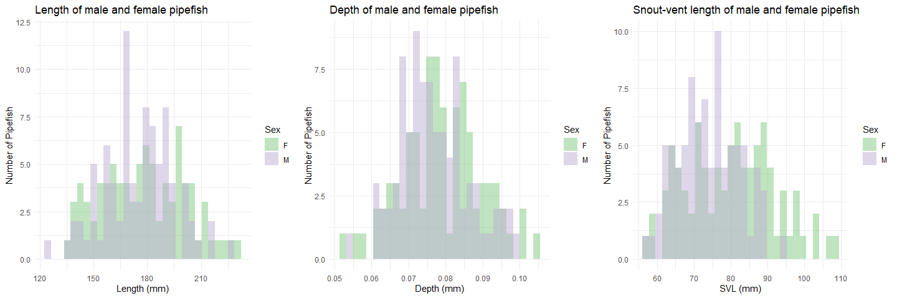
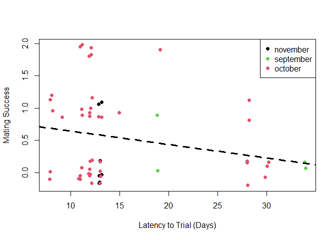
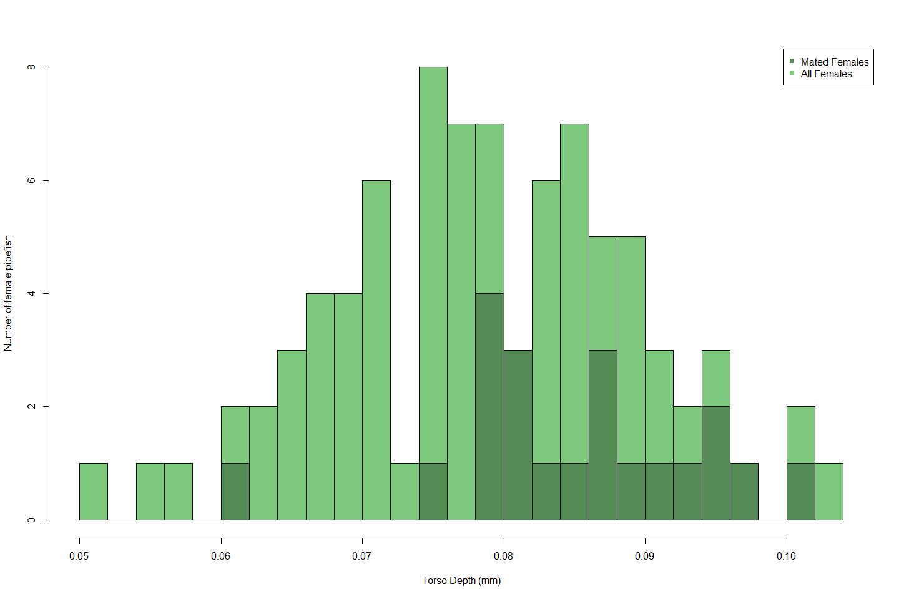
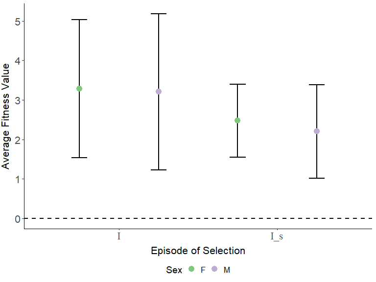
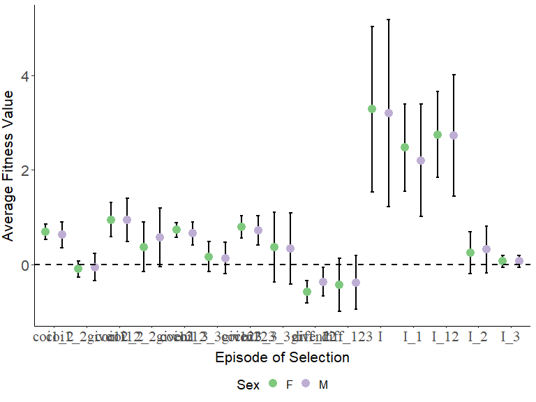
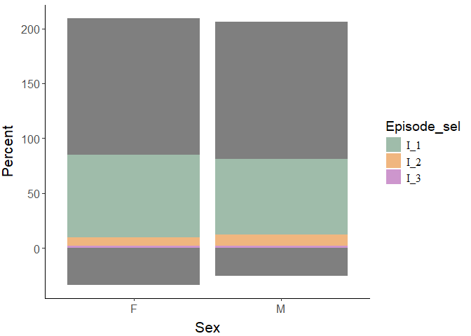
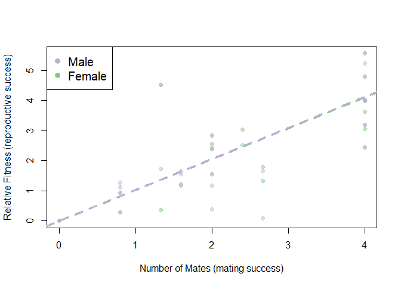

Selection pressures in *Syngnathus floridae*
================


- [Calculating the degree of sexual
  dimorphism](#calculating-the-degree-of-sexual-dimorphism)
  - [Checking the assumptions for a pairwise
    comparison](#checking-the-assumptions-for-a-pairwise-comparison)
  - [Investigate distributions and run the
    tests](#investigate-distributions-and-run-the-tests)
- [Calculating mating and reproductive success for individuals who
  mated](#calculating-mating-and-reproductive-success-for-individuals-who-mated)
- [Summary statistics for successfully mated
  individuals](#summary-statistics-for-successfully-mated-individuals)
  - [Males](#males)
  - [Females](#females)
- [Differences between mated individuals and unmated
  individuals](#differences-between-mated-individuals-and-unmated-individuals)
  - [Males](#males-1)
    - [Visual Comparison](#visual-comparison)
    - [Testing the difference](#testing-the-difference)
    - [Relationships with latency to
      mate](#relationships-with-latency-to-mate)
    - [Differences between singly mated and multiply mated
      males](#differences-between-singly-mated-and-multiply-mated-males)
  - [Females](#females-1)
    - [Visual Comparison](#visual-comparison-1)
    - [Testing the difference](#testing-the-difference-1)
- [Looking into the Opportunity for Selection in Males and
  Females](#looking-into-the-opportunity-for-selection-in-males-and-females)
  - [Generating the total opportunity for selection ($I$) and the
    opportunity for sexual selection
    ($I_S$)](#generating-the-total-opportunity-for-selection-i-and-the-opportunity-for-sexual-selection-i_s)
  - [Partitioning the Total Opportunity for Selection
    ($I$)](#partitioning-the-total-opportunity-for-selection-i)
- [Mate success versus Reproductive success (Bateman Gradient,
  $\beta_{SS}$)](#mate-success-versus-reproductive-success-bateman-gradient-beta_ss)
  - [Omitting females with high
    mating](#omitting-females-with-high-mating)

``` r
#This is a cohesive list of all the libraries used in this document
library(ggplot2)
library(cowplot)
library(fBasics)
library(pwr)
library(lme4)
library(dplyr)
library(tidyr)
library(knitr)
```

``` r
#MomIDs and embryo counts for each section of the male's brood pouch
em_dat <- read.csv("data/EmbryoParentage_floridae.csv")

#Metadata for males and females from the mesocosm experiments
fem_mesoFL <- read.csv("data/all_fem_meso_floridae.csv")
mal_mesoFL <- read.csv("data/all_mal_meso_floridae.csv")
```

# Calculating the degree of sexual dimorphism

Other papers have reported varying levels of significant or
non-significant size differences between males and females in this
species, particularly in terms of standard length (measured from the tip
of the snout to the base of the caudal fin). I want to investigate the
data that I have to see what sexual size dimorphism is like for this
population. I am doing this across all fish that were used, including
those trials that had no successful matings.

The aspects of size that I am interested in looking at include:

- **Standard length** (A; yellow line): measured from the tip of the
  snout to the base of the caudal fin.
- **Torso depth** (B; blue line): measured from the point in front of
  the dorsal fin down (perpendicular to standard length).
- **Snout-vent length** (C; red line): measured from the tip of the
  snout to the urogenital opening.

<p float="center">


</p>

## Checking the assumptions for a pairwise comparison

Before comparing male size to female size I want to ensure the data
meets the assumptions. The main two things that I will be looking into
include:

1.  Equal variances between my groups (using `var.test()`).
2.  Normal distribution of the data (using `normalTest()`).

The null hypotheses for these two tests are that the variances are equal
and the data is normally distributed.

To account for the fact that fish who are longer may just inherently be
deeper as well, I am going to adjust the depth by the standard length of
the pipefish prior to funning any analyses

``` r
#Adjust the torso depth
fem_mesoFL$depth_adj <- fem_mesoFL$depth/fem_mesoFL$length
mal_mesoFL$depth_adj <- mal_mesoFL$depth/mal_mesoFL$length

#Testing to see if the variances are equal
var.test(fem_mesoFL$length, mal_mesoFL$length) #EQUAL
```

    ## 
    ##  F test to compare two variances
    ## 
    ## data:  fem_mesoFL$length and mal_mesoFL$length
    ## F = 1.4609, num df = 85, denom df = 85, p-value = 0.08239
    ## alternative hypothesis: true ratio of variances is not equal to 1
    ## 95 percent confidence interval:
    ##  0.9521741 2.2413401
    ## sample estimates:
    ## ratio of variances 
    ##           1.460872

``` r
var.test(fem_mesoFL$depth_adj, mal_mesoFL$depth_adj) #EQUAL
```

    ## 
    ##  F test to compare two variances
    ## 
    ## data:  fem_mesoFL$depth_adj and mal_mesoFL$depth_adj
    ## F = 1.3686, num df = 84, denom df = 85, p-value = 0.151
    ## alternative hypothesis: true ratio of variances is not equal to 1
    ## 95 percent confidence interval:
    ##  0.8911382 2.1030826
    ## sample estimates:
    ## ratio of variances 
    ##           1.368614

``` r
var.test(fem_mesoFL$svl, mal_mesoFL$svl) #NOT EQUAL
```

    ## 
    ##  F test to compare two variances
    ## 
    ## data:  fem_mesoFL$svl and mal_mesoFL$svl
    ## F = 2.1705, num df = 85, denom df = 85, p-value = 0.0004335
    ## alternative hypothesis: true ratio of variances is not equal to 1
    ## 95 percent confidence interval:
    ##  1.414675 3.330029
    ## sample estimates:
    ## ratio of variances 
    ##           2.170463

``` r
#Testing for normal distribution - Females
normalTest(fem_mesoFL$length, method = "da") #NOT NORMAL
```

    ## 
    ## Title:
    ##  D'Agostino Normality Test
    ## 
    ## Test Results:
    ##   STATISTIC:
    ##     Chi2 | Omnibus: 6.0342
    ##     Z3  | Skewness: 0.5032
    ##     Z4  | Kurtosis: -2.4044
    ##   P VALUE:
    ##     Omnibus  Test: 0.04894 
    ##     Skewness Test: 0.6148 
    ##     Kurtosis Test: 0.0162

``` r
normalTest(fem_mesoFL$depth_adj, method = "da") #NORMAL
```

    ## 
    ## Title:
    ##  D'Agostino Normality Test
    ## 
    ## Test Results:
    ##   STATISTIC:
    ##     Chi2 | Omnibus: 0.6513
    ##     Z3  | Skewness: 0.7106
    ##     Z4  | Kurtosis: -0.3825
    ##   P VALUE:
    ##     Omnibus  Test: 0.7221 
    ##     Skewness Test: 0.4773 
    ##     Kurtosis Test: 0.7021

``` r
normalTest(fem_mesoFL$svl, method = "da") #NORMAL
```

    ## 
    ## Title:
    ##  D'Agostino Normality Test
    ## 
    ## Test Results:
    ##   STATISTIC:
    ##     Chi2 | Omnibus: 3.0383
    ##     Z3  | Skewness: 0.7065
    ##     Z4  | Kurtosis: -1.5935
    ##   P VALUE:
    ##     Omnibus  Test: 0.2189 
    ##     Skewness Test: 0.4799 
    ##     Kurtosis Test: 0.1111

``` r
#Testing for normal distribution - Males
normalTest(mal_mesoFL$length, method = "da") #NORMAL
```

    ## 
    ## Title:
    ##  D'Agostino Normality Test
    ## 
    ## Test Results:
    ##   STATISTIC:
    ##     Chi2 | Omnibus: 0.0501
    ##     Z3  | Skewness: -0.1257
    ##     Z4  | Kurtosis: 0.1851
    ##   P VALUE:
    ##     Omnibus  Test: 0.9753 
    ##     Skewness Test: 0.9 
    ##     Kurtosis Test: 0.8531

``` r
normalTest(mal_mesoFL$depth_adj, method = "da") #NORMAL
```

    ## 
    ## Title:
    ##  D'Agostino Normality Test
    ## 
    ## Test Results:
    ##   STATISTIC:
    ##     Chi2 | Omnibus: 1.9819
    ##     Z3  | Skewness: 0.5381
    ##     Z4  | Kurtosis: 1.3009
    ##   P VALUE:
    ##     Omnibus  Test: 0.3712 
    ##     Skewness Test: 0.5905 
    ##     Kurtosis Test: 0.1933

``` r
normalTest(mal_mesoFL$svl, method = "da") #NORMAL
```

    ## 
    ## Title:
    ##  D'Agostino Normality Test
    ## 
    ## Test Results:
    ##   STATISTIC:
    ##     Chi2 | Omnibus: 3.4451
    ##     Z3  | Skewness: 0.5003
    ##     Z4  | Kurtosis: -1.7874
    ##   P VALUE:
    ##     Omnibus  Test: 0.1786 
    ##     Skewness Test: 0.6168 
    ##     Kurtosis Test: 0.07387

## Investigate distributions and run the tests

Looking at the distributions below I do not expect to see differences in
standard length, but maybe in depth and SVL. I will run one of three
tests depending on the results of the above assumption testing:

1.  If **both** assumptions are met: *Two Sample t-test*
2.  If only the **variances** are not equal, but the data is normal:
    *Welch Two Sample t-test*
3.  If the **data is not normal**, regardless of whether variances are
    equal: *Wilcoxon rank sum test with continuity correction*

Based on this, I will run a Wilcoxon test for standard length, a Welch
two sample t-test for snout-vent length, and a two sample t-test for
torso depth (adjusted).

<figure>

<figcaption aria-hidden="true"><em>Histograms of male and female
pipefish body sizes.</em></figcaption>
</figure>

``` r
#Running the appropriate test
wilcox.test(fem_mesoFL$length, mal_mesoFL$length)
```

    ## 
    ##  Wilcoxon rank sum test with continuity correction
    ## 
    ## data:  fem_mesoFL$length and mal_mesoFL$length
    ## W = 3930, p-value = 0.4784
    ## alternative hypothesis: true location shift is not equal to 0

``` r
t.test(fem_mesoFL$depth_adj, mal_mesoFL$depth_adj, var.equal = TRUE)
```

    ## 
    ##  Two Sample t-test
    ## 
    ## data:  fem_mesoFL$depth_adj and mal_mesoFL$depth_adj
    ## t = 4.1064, df = 169, p-value = 6.248e-05
    ## alternative hypothesis: true difference in means is not equal to 0
    ## 95 percent confidence interval:
    ##  0.001494861 0.004262830
    ## sample estimates:
    ##  mean of x  mean of y 
    ## 0.03537844 0.03249959

``` r
t.test(fem_mesoFL$svl, mal_mesoFL$svl, var.equal = FALSE)
```

    ## 
    ##  Welch Two Sample t-test
    ## 
    ## data:  fem_mesoFL$svl and mal_mesoFL$svl
    ## t = 3.86, df = 149.61, p-value = 0.0001682
    ## alternative hypothesis: true difference in means is not equal to 0
    ## 95 percent confidence interval:
    ##  2.949949 9.137632
    ## sample estimates:
    ## mean of x mean of y 
    ##  80.01955  73.97576

From these results we can see that there are no significant differences
between male and female pipefish in terms of standard length. However,
female dusky pipefish are significantly deeper that males and possess a
significantly longer snout-vent length. For those two morphometrics I am
going to run a power test to ensure that we are confident in our
results.

``` r
#Checking the power - SVL
d_mean_svl <- abs(mean(fem_mesoFL$svl, na.rm = TRUE) - 
                    mean(mal_mesoFL$svl, na.rm = TRUE))
pool_sd_svl <- sqrt((var(fem_mesoFL$svl, na.rm = TRUE) + 
                       var(mal_mesoFL$svl, na.rm = TRUE))/ 2)
d_svl <- d_mean_svl/pool_sd_svl

pwr.t.test(n = nrow(fem_mesoFL), 
           d = d_svl,
           sig.level = 0.05,
           type = 'two.sample',
           alternative = 'two.sided')
```

    ## 
    ##      Two-sample t test power calculation 
    ## 
    ##               n = 86
    ##               d = 0.5886437
    ##       sig.level = 0.05
    ##           power = 0.9698186
    ##     alternative = two.sided
    ## 
    ## NOTE: n is number in *each* group

``` r
#Checking the power - Depth
d_mean_depth <- abs(mean(fem_mesoFL$depth_adj, na.rm = TRUE) - 
                      mean(mal_mesoFL$depth_adj, na.rm = TRUE))
pool_sd_depth <- sqrt((var(fem_mesoFL$depth_adj, na.rm = TRUE) + 
                         var(mal_mesoFL$depth_adj, na.rm = TRUE))/ 2)
d_depth <- d_mean_depth/pool_sd_depth
pwr.t.test(n = nrow(fem_mesoFL), 
           d = d_depth,
           sig.level = 0.05,
           type = 'two.sample',
           alternative = 'two.sided')
```

    ## 
    ##      Two-sample t test power calculation 
    ## 
    ##               n = 86
    ##               d = 0.627763
    ##       sig.level = 0.05
    ##           power = 0.9835455
    ##     alternative = two.sided
    ## 
    ## NOTE: n is number in *each* group

For both variables we have a power of over 0.9 or over 90% so we can be
confident in our interpretation.

# Calculating mating and reproductive success for individuals who mated

*Syngnathus floridae* (dusky pipefish) were sampled from three distinct
seagrass beds around Tampa Bay in Tampa, Florida. Sexually mature
females (standard length $\ge$ 120mm) and pregnant males were collected
and brought back to the University of Tampa and put into experimental
breeding populations. In these trials, 8 males and 8 females were housed
together in a 140L tank for a period of 14-days and allowed to mate
freely. Parentage analysis was done with all of the pregnant males from
the trials to figure out how many times each male and female mated, and
the number of eggs that were transferred. The results of that are here.

First I had to calculate the mating and reproductive success for each
male and female who mated based on the assigned mom for each genotyped
embryo.

``` r
#Row-by-Row analysis of parentage data by male brood pouch section

#Read in the data
#em_dat <- read.csv("~/EmbryoParentage.csv")

#For each row in the dataset(each section of the pouch) apply this function
mom_counts <- do.call(rbind,apply(em_dat, 1, function(one_section){
  
  #Save all of the momIDs into an object
  mom_ids<-c(one_section[grep("momID",names(one_section))])  
  
  #Calculate the number of eggs that belongs to each potential mom based on
  #the proportions and total number of developed and undeveloped embryos
  mom_props<-c(as.numeric(one_section[grep("prop",names(one_section))]))
  mom_counts_dev<-mom_props*as.numeric(one_section["num_embryos_dev"])
  mom_counts_und<-mom_props*as.numeric(one_section["num_embryos_non_dev"])
  
  #Create a dataframe that contains the maleID, pouch section number and the
  #number of eggs that belongs to each momID
  this_section<-data.frame(
    maleID=one_section["maleID"],
    section_num=one_section["section_num"],
    mom_ids[which((mom_counts_dev + mom_counts_und) > 0)],
    mom_counts_dev[which((mom_counts_dev + mom_counts_und)>0)],
    mom_counts_und[which((mom_counts_dev + mom_counts_und)>0)]
  )
  
  #Rename the columns
  colnames(this_section)[3:5]<-c("momID","num_dev","num_und")
  
  return(this_section)
  
}))

#Calculate female fitness
fem_fitness<-do.call(rbind,by(mom_counts, mom_counts$momID,function(dat){
  
  mom_fitness<-data.frame(
    momID=unique(dat$momID),
    MatingSuccess=length(unique(dat$maleID)),
    NumDeveloped=round(sum(dat$num_dev)),
    NumUndeveloped=round(sum(dat$num_und))
  )
  return(mom_fitness)
}))

fem_fitness$totalEggs <- fem_fitness$NumDeveloped + fem_fitness$NumUndeveloped

#Calculate Male Fitness 
mal_fitness<-do.call(rbind,by(mom_counts, mom_counts$maleID,function(dat){
 
  dad_fitness<-data.frame(
    maleID=unique(dat$maleID),
    MatingSuccess=length(unique(dat$momID)),
    NumDeveloped_Calc=round(sum(dat$num_dev)),
    NumUndeveloped_Calc=round(sum(dat$num_und))
  )
  return(dad_fitness)
}))

mal_fitness$totalEggs <- mal_fitness$NumDeveloped_Calc + mal_fitness$NumUndeveloped_Calc
```

After running the above R script we have two datasets, `mal_fitness` and
`fem_fitness`. These datasets include information about the mating
success (number of mates) and reproductive success (Number of embryos
transferred). We can split reproductive success up further later if we
want to from the total number of embryos transferred to the number of
embryos developed and the number that were undeveloped.

I want to include all of the other metadata that I have for these
individuals (traits, collection location, latency to pregnancy, etc.) as
well as tack on all of the information for the individuals who did not
mate. To do that I am going to need to merge the fitness datasets with
`fem_meso` and `mal_meso`.

``` r
#Make a column in *_meso that contains the full fishID (i.e. FL1M3) to match the 
#formatting in the fitness datasets (make sure they have the same name for merging purposes)
fem_mesoFL$momID <- paste0("FL", fem_mesoFL$trial_num, "F", fem_mesoFL$fishID)
mal_mesoFL$maleID <- paste0("FL", mal_mesoFL$trial_num, "M", mal_mesoFL$fishID)

#Merge the datasets based on the columns created above
fem_allFL <- merge(fem_mesoFL, fem_fitness, by = "momID", all.x = TRUE, all.y = TRUE)
mal_allFL <- merge(mal_mesoFL, mal_fitness, by = "maleID", all.x = TRUE, all.y = TRUE)
```

There are a few trials that I want to remove from the analysis:

1.  All trials where there were no successful matings (7, 9, 10, 11).

2.  Trial 1, a male gave birth and the babies were immediately eaten by
    the adults so the trial was ended early and therefore I was unable
    to get any parentage information for that trial.

I also want to replace the NAs that were automatically added to the
columns from the fitness dataset (MatingSuccess, NumDeveloped,
NumUndeveloped, totalEggs) with 0s and add a column to the female
dataset that tells me whether or not the female mated (with 1 or 0).

``` r
#Subset the merged datasets to remove trials without successful matings and Trial 1
fem_succFL <- subset(fem_allFL, !(trial_num %in% c(7, 9, 10, 11, 1)))
mal_succFL <- subset(mal_allFL, !(trial_num %in% c(7, 9, 10, 11, 1)))

#Replace NAs with 0s in the columns related to fitness
mal_succFL[, c("MatingSuccess", "NumDeveloped_Calc", 
               "NumUndeveloped_Calc", "totalEggs")] <- sapply(mal_succFL[, c("MatingSuccess", 
                                                                             "NumDeveloped_Calc", 
                                                                             "NumUndeveloped_Calc", 
                                                                             "totalEggs")],
                                                              function(x)
                                                                ifelse(is.na(x), 0, x))

fem_succFL[, c("MatingSuccess", "NumDeveloped", 
               "NumUndeveloped", "totalEggs")] <- sapply(fem_succFL[, c("MatingSuccess", 
                                                                        "NumDeveloped", 
                                                                        "NumUndeveloped", 
                                                                        "totalEggs")],
                                                         function(x)
                                                           ifelse(is.na(x), 0, x))

#Add a column for females to denote mated or unmated
fem_succFL$mated <- ifelse(fem_succFL$MatingSuccess > 0, 1, 0)
```

# Summary statistics for successfully mated individuals

## Males

Across all 7 trials and 56 total males, there were 24 males that mated
at least one time and 6 of those males had two mates.

Looking across all males, including the ones that did not mate, this is
what we find as the mean, sd, and se for the number of embryos
transferred and how many of those developed versus didn’t:

|                     |       mean |          SD |         SE | max | min |
|:--------------------|-----------:|------------:|-----------:|----:|----:|
| Number of Embryos   |      108.5 | 155.1902059 | 20.7381636 | 500 |   0 |
| Developed Embryos   | 94.1964286 | 139.7347383 | 18.6728398 | 463 |   0 |
| Undeveloped Embryos | 14.3035714 |  27.7907242 |  3.7136917 | 131 |   0 |

These values will be influenced by the number of 0s coming from males
who did not mate. So let’s look at the same thing, but this time for
only males who had at least one successful mating:

|                     |        mean |          SD |         SE | max | min |
|:--------------------|------------:|------------:|-----------:|----:|----:|
| Number of Embryos   | 253.1666667 | 139.1941611 | 28.4128892 | 500 |   9 |
| Developed Embryos   | 219.7916667 | 133.7427704 | 27.3001287 | 463 |   7 |
| Undeveloped Embryos |      33.375 |  34.3901054 |  7.0198509 | 131 |   0 |

We can see from the bottom table that even when we only include males
who mated there is still a wide range in the brood size. I want to see
what relationship there is between brood pouch size (in terms of both
total area and length) and brood size (total number of embryos).

<figure>

<figcaption aria-hidden="true"><em>Scatterplot of the relationship
between brood pouch size metrics and the number of embryos a male
had.</em></figcaption>
</figure>

There may be some correlation happening here, but it doesn’t look
particularly strong. Let’s run some correlations tests to see what they
say.

    ## 
    ##  Pearson's product-moment correlation
    ## 
    ## data:  as.numeric(mated_malFL$bp_area) and mated_malFL$totalEggs
    ## t = 0.90485, df = 22, p-value = 0.3753
    ## alternative hypothesis: true correlation is not equal to 0
    ## 95 percent confidence interval:
    ##  -0.2316769  0.5507364
    ## sample estimates:
    ##       cor 
    ## 0.1894228

    ## 
    ##  Pearson's product-moment correlation
    ## 
    ## data:  as.numeric(mated_malFL$bp_length) and mated_malFL$totalEggs
    ## t = 0.51929, df = 22, p-value = 0.6087
    ## alternative hypothesis: true correlation is not equal to 0
    ## 95 percent confidence interval:
    ##  -0.3069838  0.4916139
    ## sample estimates:
    ##       cor 
    ## 0.1100398

There is not a significant correlation between the number of eggs and
size of the brood pouch when we look at brood pouch area OR brood pouch
length.

Multiple of the wild study papers looked at correlations between body
size in terms of standard length and the number of embryos and found
significant positive correlations.

<figure>

<figcaption aria-hidden="true"><em>Scatterplot of the relationship
between standard length (mm) and the number of embryos a male
had.</em></figcaption>
</figure>

    ## 
    ##  Pearson's product-moment correlation
    ## 
    ## data:  as.numeric(mated_malFL$length) and mated_malFL$totalEggs
    ## t = -0.35647, df = 22, p-value = 0.7249
    ## alternative hypothesis: true correlation is not equal to 0
    ## 95 percent confidence interval:
    ##  -0.4649642  0.3379463
    ## sample estimates:
    ##         cor 
    ## -0.07578142

There appears to be no significant correlation between standard length
and the number of eggs in males, unlike what has been found in the
species previously. This is unsurprising as we didn’t find any hint of a
relationship in the brood pouch size metrics and there was a
considerable number of males that did not have a full brood pouch.

## Females

Across all 7 trials and 56 total females, there were 21 females that
mated at least one time, 5 females that mated twice, and 2 that mated 3
times.

Looking across all females, including the ones that did not mate, this
is what we find as the mean, sd, and se for the total number of embryos
transferred from each female (across all of her mates if applicable) and
how many of those developed versus didn’t:

|                     |        mean |          SD |         SE | max | min |
|:--------------------|------------:|------------:|-----------:|----:|----:|
| Number of Embryos   | 108.4821429 | 195.2328206 |  26.089083 | 916 |   0 |
| Developed Embryos   |  94.1785714 | 177.0691808 | 23.6618646 | 785 |   0 |
| Undeveloped Embryos |  14.3035714 |  29.7033329 |  3.9692748 | 131 |   0 |

These values will be influenced by the number of 0s coming from females
who did not mate. So let’s look at the same thing, but this time for
only females who had at least one successful mating:

|                     |        mean |          SD |         SE | max | min |
|:--------------------|------------:|------------:|-----------:|----:|----:|
| Number of Embryos   | 289.2857143 | 223.3819919 |  48.745947 | 916 |  35 |
| Developed Embryos   | 251.1428571 | 211.7324457 | 46.2038076 | 785 |   7 |
| Undeveloped Embryos |  38.1428571 |   38.360508 |  8.3709491 | 131 |   0 |

We can see from the bottom table that even when we only include females
who mated there is still a wide range in the number of eggs transferred.
I want to see what relationship there may be between female body size
(in terms of standard length, depth, and SVL) and the number of eggs she
transferred. I also want to see on average how many eggs were
transferred per mating. I’m going to calculate this by taking the total
number of eggs and dividing it by the number of mates.

    ## [1] 202.3254

    ## [1] 14.68782

<figure>

<figcaption aria-hidden="true"><em>Scatterplot of the relationship
between female size metrics and the number of eggs
transferred.</em></figcaption>
</figure>

There may be some correlation happening here, but it doesn’t look
particularly strong. Let’s run some correlations tests to see what they
say.

    ## 
    ##  Pearson's product-moment correlation
    ## 
    ## data:  mated_femFL$length and as.numeric(mated_femFL$totalEggs)
    ## t = -0.92304, df = 19, p-value = 0.3676
    ## alternative hypothesis: true correlation is not equal to 0
    ## 95 percent confidence interval:
    ##  -0.5864091  0.2465727
    ## sample estimates:
    ##        cor 
    ## -0.2071652

    ## 
    ##  Pearson's product-moment correlation
    ## 
    ## data:  mated_femFL$depth_adj and as.numeric(mated_femFL$totalEggs)
    ## t = 2.0729, df = 19, p-value = 0.05202
    ## alternative hypothesis: true correlation is not equal to 0
    ## 95 percent confidence interval:
    ##  -0.002716801  0.726473616
    ## sample estimates:
    ##       cor 
    ## 0.4294737

    ## 
    ##  Pearson's product-moment correlation
    ## 
    ## data:  mated_femFL$svl and as.numeric(mated_femFL$totalEggs)
    ## t = -0.5112, df = 19, p-value = 0.6151
    ## alternative hypothesis: true correlation is not equal to 0
    ## 95 percent confidence interval:
    ##  -0.5219227  0.3318958
    ## sample estimates:
    ##        cor 
    ## -0.1164796

There is not a significant correlation between the number of eggs and
size of the female in terms of standard length, depth, or snout-vent
length. Interestingly, however, there is a negative correlation for
length and SVL and a positive correlation for depth (but they are all
overall weak).

# Differences between mated individuals and unmated individuals

I want to now see if there are any significant differences in the sizes
of individuals who mated vs individuals that didn’t mate in males and
females. I am going to be focusing on the same morphometrics outlined
above.

## Males

### Visual Comparison

Before conducting any analyses, let’s see if we can visually detect any
differences between males who mated and unmated individuals.

<figure>

<figcaption aria-hidden="true"><em>Six different morphometrics compared
between males who sucessfully mated versus those that didn’t. Orange
represents unmated and blue represents mated males.</em></figcaption>
</figure>

I don’t notice many differences, however, it appears that unmated males
are slightly larger in terms of standard length and snout-vent length, a
somewhat surprising find.

### Testing the difference

Let’s now put some statistical power behind the difference in various
morphometrics between mated and unmated individuals. I am first going to
test the assumptions and then run the appropriate version of a t-test.
See the previous section “Calculating the degree of sexual dimorphism”
for more details.

    ## 
    ##  F test to compare two variances
    ## 
    ## data:  mal_succFL$length by mal_succFL$preg_status
    ## F = 1.227, num df = 31, denom df = 23, p-value = 0.6183
    ## alternative hypothesis: true ratio of variances is not equal to 1
    ## 95 percent confidence interval:
    ##  0.549967 2.616083
    ## sample estimates:
    ## ratio of variances 
    ##           1.226976

    ## 
    ##  F test to compare two variances
    ## 
    ## data:  mal_succFL$depth_adj by mal_succFL$preg_status
    ## F = 1.1946, num df = 31, denom df = 23, p-value = 0.6665
    ## alternative hypothesis: true ratio of variances is not equal to 1
    ## 95 percent confidence interval:
    ##  0.5354334 2.5469498
    ## sample estimates:
    ## ratio of variances 
    ##           1.194551

    ## 
    ##  F test to compare two variances
    ## 
    ## data:  mal_succFL$svl by mal_succFL$preg_status
    ## F = 1.5716, num df = 31, denom df = 23, p-value = 0.2651
    ## alternative hypothesis: true ratio of variances is not equal to 1
    ## 95 percent confidence interval:
    ##  0.704435 3.350857
    ## sample estimates:
    ## ratio of variances 
    ##           1.571594

    ## 
    ##  F test to compare two variances
    ## 
    ## data:  as.numeric(mal_succFL$bp_area) by mal_succFL$preg_status
    ## F = 2.1704, num df = 28, denom df = 23, p-value = 0.06161
    ## alternative hypothesis: true ratio of variances is not equal to 1
    ## 95 percent confidence interval:
    ##  0.9619177 4.7455975
    ## sample estimates:
    ## ratio of variances 
    ##           2.170381

    ## 
    ##  F test to compare two variances
    ## 
    ## data:  mal_succFL$bp_length by mal_succFL$preg_status
    ## F = 1.1712, num df = 28, denom df = 23, p-value = 0.7047
    ## alternative hypothesis: true ratio of variances is not equal to 1
    ## 95 percent confidence interval:
    ##  0.5190955 2.5609447
    ## sample estimates:
    ## ratio of variances 
    ##           1.171238

    ## 
    ##  F test to compare two variances
    ## 
    ## data:  mal_succFL$weight by mal_succFL$preg_status
    ## F = 1.6153, num df = 31, denom df = 23, p-value = 0.2373
    ## alternative hypothesis: true ratio of variances is not equal to 1
    ## 95 percent confidence interval:
    ##  0.7240159 3.4439992
    ## sample estimates:
    ## ratio of variances 
    ##           1.615279

    ## 
    ## Title:
    ##  D'Agostino Normality Test
    ## 
    ## Test Results:
    ##   STATISTIC:
    ##     Chi2 | Omnibus: 1.3942
    ##     Z3  | Skewness: -1.0089
    ##     Z4  | Kurtosis: 0.6135
    ##   P VALUE:
    ##     Omnibus  Test: 0.498 
    ##     Skewness Test: 0.313 
    ##     Kurtosis Test: 0.5396

    ## 
    ## Title:
    ##  D'Agostino Normality Test
    ## 
    ## Test Results:
    ##   STATISTIC:
    ##     Chi2 | Omnibus: 2.7815
    ##     Z3  | Skewness: -0.6756
    ##     Z4  | Kurtosis: 1.5248
    ##   P VALUE:
    ##     Omnibus  Test: 0.2489 
    ##     Skewness Test: 0.4993 
    ##     Kurtosis Test: 0.1273

    ## 
    ## Title:
    ##  D'Agostino Normality Test
    ## 
    ## Test Results:
    ##   STATISTIC:
    ##     Chi2 | Omnibus: 2.8353
    ##     Z3  | Skewness: -0.1915
    ##     Z4  | Kurtosis: -1.6729
    ##   P VALUE:
    ##     Omnibus  Test: 0.2423 
    ##     Skewness Test: 0.8482 
    ##     Kurtosis Test: 0.09434

    ## 
    ## Title:
    ##  D'Agostino Normality Test
    ## 
    ## Test Results:
    ##   STATISTIC:
    ##     Chi2 | Omnibus: 5.3414
    ##     Z3  | Skewness: 1.9695
    ##     Z4  | Kurtosis: 1.2093
    ##   P VALUE:
    ##     Omnibus  Test: 0.0692 
    ##     Skewness Test: 0.04889 
    ##     Kurtosis Test: 0.2266

    ## 
    ## Title:
    ##  D'Agostino Normality Test
    ## 
    ## Test Results:
    ##   STATISTIC:
    ##     Chi2 | Omnibus: 0.1537
    ##     Z3  | Skewness: -0.1976
    ##     Z4  | Kurtosis: -0.3386
    ##   P VALUE:
    ##     Omnibus  Test: 0.926 
    ##     Skewness Test: 0.8433 
    ##     Kurtosis Test: 0.7349

    ## 
    ## Title:
    ##  D'Agostino Normality Test
    ## 
    ## Test Results:
    ##   STATISTIC:
    ##     Chi2 | Omnibus: 4.4842
    ##     Z3  | Skewness: 0.9969
    ##     Z4  | Kurtosis: -1.8682
    ##   P VALUE:
    ##     Omnibus  Test: 0.1062 
    ##     Skewness Test: 0.3188 
    ##     Kurtosis Test: 0.06173

    ## 
    ##  Two Sample t-test
    ## 
    ## data:  mal_succFL$length by mal_succFL$preg_status
    ## t = 2.189, df = 54, p-value = 0.03294
    ## alternative hypothesis: true difference in means between group 0 and group 1 is not equal to 0
    ## 95 percent confidence interval:
    ##   0.8753587 19.9376622
    ## sample estimates:
    ## mean in group 0 mean in group 1 
    ##        180.7827        170.3762

    ## 
    ##  Two Sample t-test
    ## 
    ## data:  mal_succFL$depth_adj by mal_succFL$preg_status
    ## t = -1.1162, df = 54, p-value = 0.2693
    ## alternative hypothesis: true difference in means between group 0 and group 1 is not equal to 0
    ## 95 percent confidence interval:
    ##  -0.003774190  0.001074713
    ## sample estimates:
    ## mean in group 0 mean in group 1 
    ##      0.03252334      0.03387308

    ## 
    ##  Two Sample t-test
    ## 
    ## data:  mal_succFL$svl by mal_succFL$preg_status
    ## t = 2.2934, df = 54, p-value = 0.02574
    ## alternative hypothesis: true difference in means between group 0 and group 1 is not equal to 0
    ## 95 percent confidence interval:
    ##  0.5626831 8.3831502
    ## sample estimates:
    ## mean in group 0 mean in group 1 
    ##        76.32887        71.85596

    ## 
    ##  Two Sample t-test
    ## 
    ## data:  as.numeric(mal_succFL$bp_area) by mal_succFL$preg_status
    ## t = 0.76167, df = 51, p-value = 0.4498
    ## alternative hypothesis: true difference in means between group 0 and group 1 is not equal to 0
    ## 95 percent confidence interval:
    ##  -24.10295  53.57274
    ## sample estimates:
    ## mean in group 0 mean in group 1 
    ##        264.5283        249.7934

    ## 
    ##  Two Sample t-test
    ## 
    ## data:  mal_succFL$bp_length by mal_succFL$preg_status
    ## t = 0.53608, df = 51, p-value = 0.5942
    ## alternative hypothesis: true difference in means between group 0 and group 1 is not equal to 0
    ## 95 percent confidence interval:
    ##  -2.527712  4.369421
    ## sample estimates:
    ## mean in group 0 mean in group 1 
    ##        48.12590        47.20504

    ## 
    ##  Two Sample t-test
    ## 
    ## data:  mal_succFL$weight by mal_succFL$preg_status
    ## t = 1.2283, df = 54, p-value = 0.2247
    ## alternative hypothesis: true difference in means between group 0 and group 1 is not equal to 0
    ## 95 percent confidence interval:
    ##  -0.2601657  1.0830824
    ## sample estimates:
    ## mean in group 0 mean in group 1 
    ##        3.503125        3.091667

We can now see that males who mated we significantly smaller in terms of
both standard length AND snout-vent length. Previous studies on wild
populations found that larger males had higher mating and reproductive
success . . . exciting!

Let’s explore this a bit more and overlay the distribution of all males
(mated and unmated) with the males who did mate and see how it varies.

<figure>

<figcaption aria-hidden="true"><em>Overlay of the size range of males
who mated on top of the size range of all males for length and
snout-vent length.</em></figcaption>
</figure>

Even though mated males were significantly smaller, some of the larger
males were able to achieve successful matings.

### Relationships with latency to mate

There was some variety in the length of time that males were house in
the same-sex tanks before being placed in the experimental breeding
populations. I am now curious to see if there is any relationship
between the latency to trials and various components of fitness.

``` r
#Mating success
##Create the model
mate_succlm <- lmer(mal_succFL$MatingSuccess ~ mal_succFL$lat_to_trial + 
                      (1 | mal_succFL$col_location) + (1 | mal_succFL$col_date))

summary(mate_succlm)
```

    ## Linear mixed model fit by REML ['lmerMod']
    ## Formula: 
    ## mal_succFL$MatingSuccess ~ mal_succFL$lat_to_trial + (1 | mal_succFL$col_location) +  
    ##     (1 | mal_succFL$col_date)
    ## 
    ## REML criterion at convergence: 122.7
    ## 
    ## Scaled residuals: 
    ##     Min      1Q  Median      3Q     Max 
    ## -1.0664 -0.9121 -0.3876  0.5572  2.2580 
    ## 
    ## Random effects:
    ##  Groups                  Name        Variance Std.Dev.
    ##  mal_succFL$col_date     (Intercept) 0.02109  0.1452  
    ##  mal_succFL$col_location (Intercept) 0.00000  0.0000  
    ##  Residual                            0.44891  0.6700  
    ## Number of obs: 56, groups:  mal_succFL$col_date, 3; mal_succFL$col_location, 2
    ## 
    ## Fixed effects:
    ##                         Estimate Std. Error t value
    ## (Intercept)              0.80188    0.24599   3.260
    ## mal_succFL$lat_to_trial -0.02067    0.01274  -1.622
    ## 
    ## Correlation of Fixed Effects:
    ##             (Intr)
    ## ml_sccFL$__ -0.827
    ## optimizer (nloptwrap) convergence code: 0 (OK)
    ## boundary (singular) fit: see help('isSingular')

``` r
##Create model with fewer parameters
lm_no_location <- lmer(mal_succFL$MatingSuccess ~ mal_succFL$lat_to_trial + 
                         (1 | mal_succFL$col_date))
anova(mate_succlm, lm_no_location)  # Compare models with and without col_location
```

    ## Data: NULL
    ## Models:
    ## lm_no_location: mal_succFL$MatingSuccess ~ mal_succFL$lat_to_trial + (1 | mal_succFL$col_date)
    ## mate_succlm: mal_succFL$MatingSuccess ~ mal_succFL$lat_to_trial + (1 | mal_succFL$col_location) + (1 | mal_succFL$col_date)
    ##                npar    AIC    BIC logLik deviance Chisq Df Pr(>Chisq)
    ## lm_no_location    4 121.02 129.12 -56.51   113.02                    
    ## mate_succlm       5 123.02 133.15 -56.51   113.02     0  1          1

I ran a linear mixed effects model comparing Mating Success to the
Latency to trial including both the collection date and collection
location as random effect. Overall, the random effects for collection
location appear to be non-significant but there is some variability in
mating success due to the collection date. From the fixed effects we can
see that latency to trial has a negative but non-significant effect on
mating success.

<figure>

<figcaption aria-hidden="true"><em>Scatterplot of the relationship
between the number of mates achieved by a male and how long the male was
in the lab prir to entering a trial. Color of the points correspond to
the month that the pipefish was collected in.</em></figcaption>
</figure>

Now let’s see if there is any relationship when we look at reproductive
success (in terms of total eggs received) and the latency to the trial.
Because we already accounted for the males who didn’t mate in terms of
mating success, I am going to remove them from this model. Therefore we
will be looking at the impact on reproductive success on the individuals
that were successfully able to obtain a mate.

``` r
#Mating success
##Create the model
tot_eggslm <- lmer(mated_malFL$totalEggs ~ mated_malFL$lat_to_trial + 
                      (1 | mated_malFL$col_location) + 
                     (1 | mated_malFL$col_date))

summary(tot_eggslm)
```

    ## Linear mixed model fit by REML ['lmerMod']
    ## Formula: 
    ## mated_malFL$totalEggs ~ mated_malFL$lat_to_trial + (1 | mated_malFL$col_location) +  
    ##     (1 | mated_malFL$col_date)
    ## 
    ## REML criterion at convergence: 286.4
    ## 
    ## Scaled residuals: 
    ##     Min      1Q  Median      3Q     Max 
    ## -1.8902 -0.6907 -0.1027  0.6349  1.7355 
    ## 
    ## Random effects:
    ##  Groups                   Name        Variance Std.Dev.
    ##  mated_malFL$col_date     (Intercept)     0      0.00  
    ##  mated_malFL$col_location (Intercept)  1508     38.83  
    ##  Residual                             16627    128.95  
    ## Number of obs: 24, groups:  
    ## mated_malFL$col_date, 3; mated_malFL$col_location, 2
    ## 
    ## Fixed effects:
    ##                          Estimate Std. Error t value
    ## (Intercept)                392.95      78.45   5.009
    ## mated_malFL$lat_to_trial   -11.17       5.20  -2.148
    ## 
    ## Correlation of Fixed Effects:
    ##             (Intr)
    ## mtd_mlFL$__ -0.861
    ## optimizer (nloptwrap) convergence code: 0 (OK)
    ## boundary (singular) fit: see help('isSingular')

``` r
##Create model with fewer parameters
lm_no_date <- lmer(mated_malFL$MatingSuccess ~ mated_malFL$lat_to_trial + 
                         (1 | mated_malFL$col_location))
anova(tot_eggslm, lm_no_date)  # Compare models with and without col_location
```

    ## Data: NULL
    ## Models:
    ## lm_no_date: mated_malFL$MatingSuccess ~ mated_malFL$lat_to_trial + (1 | mated_malFL$col_location)
    ## tot_eggslm: mated_malFL$totalEggs ~ mated_malFL$lat_to_trial + (1 | mated_malFL$col_location) + (1 | mated_malFL$col_date)
    ##            npar     AIC     BIC   logLik deviance Chisq Df Pr(>Chisq)
    ## lm_no_date    4  35.831  40.543  -13.915   27.831                    
    ## tot_eggslm    5 309.982 315.873 -149.991  299.982     0  1          1

In this new model now we can see that there is only non-zero variance
for the random effect of Collection location and there does appear to be
a significant negative impact of latency to trial on the total number of
eggs received by a male. This may mean that while males who were in the
lab for longer did not experience impacts on their ability to achieve
mates, they did receive fewer eggs.

<figure>

<figcaption aria-hidden="true"><em>Scatterplot of the relationship
between the total eggs recieved by a male and how long the male was in
the lab prior to entering a trial. Color of the points correspond to the
location that the pipefish was collected from.</em></figcaption>
</figure>

### Differences between singly mated and multiply mated males

I also want to see if we can detect any differences between the males
that mated only once compared to the males that mated more than once. My
hunch is that I will not have a large enough sample size for the
multiply mated individuals to be able to detect any differences, but we
shall see. I am going to look at standard length, depth, svl, and
reproductive fitness. Once again, before I run the tests I want to check
the assumptions.

    ## 
    ##  F test to compare two variances
    ## 
    ## data:  mated_malFL$length[mated_malFL$MatingSuccess == 1] and mated_malFL$length[mated_malFL$MatingSuccess > 1]
    ## F = 3.2029, num df = 17, denom df = 5, p-value = 0.2024
    ## alternative hypothesis: true ratio of variances is not equal to 1
    ## 95 percent confidence interval:
    ##   0.5019162 11.0114177
    ## sample estimates:
    ## ratio of variances 
    ##           3.202908

    ## 
    ##  F test to compare two variances
    ## 
    ## data:  mated_malFL$depth_adj[mated_malFL$MatingSuccess == 1] and mated_malFL$depth_adj[mated_malFL$MatingSuccess > 1]
    ## F = 2.2538, num df = 17, denom df = 5, p-value = 0.3762
    ## alternative hypothesis: true ratio of variances is not equal to 1
    ## 95 percent confidence interval:
    ##  0.3531831 7.7483995
    ## sample estimates:
    ## ratio of variances 
    ##           2.253789

    ## 
    ##  F test to compare two variances
    ## 
    ## data:  mated_malFL$svl[mated_malFL$MatingSuccess == 1] and mated_malFL$svl[mated_malFL$MatingSuccess > 1]
    ## F = 1.5326, num df = 17, denom df = 5, p-value = 0.6726
    ## alternative hypothesis: true ratio of variances is not equal to 1
    ## 95 percent confidence interval:
    ##  0.2401707 5.2690463
    ## sample estimates:
    ## ratio of variances 
    ##           1.532616

    ## 
    ##  F test to compare two variances
    ## 
    ## data:  mated_malFL$totalEggs[mated_malFL$MatingSuccess == 1] and mated_malFL$totalEggs[mated_malFL$MatingSuccess > 1]
    ## F = 0.40451, num df = 17, denom df = 5, p-value = 0.1479
    ## alternative hypothesis: true ratio of variances is not equal to 1
    ## 95 percent confidence interval:
    ##  0.06338875 1.39067045
    ## sample estimates:
    ## ratio of variances 
    ##          0.4045065

    ## 
    ## Title:
    ##  D'Agostino Normality Test
    ## 
    ## Test Results:
    ##   STATISTIC:
    ##     Chi2 | Omnibus: 3.9467
    ##     Z3  | Skewness: -1.1389
    ##     Z4  | Kurtosis: 1.6278
    ##   P VALUE:
    ##     Omnibus  Test: 0.139 
    ##     Skewness Test: 0.2548 
    ##     Kurtosis Test: 0.1036

    ## 
    ## Title:
    ##  D'Agostino Normality Test
    ## 
    ## Test Results:
    ##   STATISTIC:
    ##     Chi2 | Omnibus: 0.96
    ##     Z3  | Skewness: 0.9779
    ##     Z4  | Kurtosis: -0.0604
    ##   P VALUE:
    ##     Omnibus  Test: 0.6188 
    ##     Skewness Test: 0.3281 
    ##     Kurtosis Test: 0.9519

    ## 
    ## Title:
    ##  D'Agostino Normality Test
    ## 
    ## Test Results:
    ##   STATISTIC:
    ##     Chi2 | Omnibus: 1.1956
    ##     Z3  | Skewness: 0.978
    ##     Z4  | Kurtosis: 0.4891
    ##   P VALUE:
    ##     Omnibus  Test: 0.55 
    ##     Skewness Test: 0.3281 
    ##     Kurtosis Test: 0.6248

    ## 
    ## Title:
    ##  D'Agostino Normality Test
    ## 
    ## Test Results:
    ##   STATISTIC:
    ##     Chi2 | Omnibus: 1.4399
    ##     Z3  | Skewness: 0.0549
    ##     Z4  | Kurtosis: -1.1987
    ##   P VALUE:
    ##     Omnibus  Test: 0.4868 
    ##     Skewness Test: 0.9562 
    ##     Kurtosis Test: 0.2306

    ## 
    ##  Two Sample t-test
    ## 
    ## data:  mated_malFL$length[mated_malFL$MatingSuccess == 1] and mated_malFL$length[mated_malFL$MatingSuccess > 1]
    ## t = -0.326, df = 22, p-value = 0.7475
    ## alternative hypothesis: true difference in means is not equal to 0
    ## 95 percent confidence interval:
    ##  -19.10883  13.91739
    ## sample estimates:
    ## mean of x mean of y 
    ##  169.7273  172.3230

    ## 
    ##  Two Sample t-test
    ## 
    ## data:  mated_malFL$depth_adj[mated_malFL$MatingSuccess == 1] and mated_malFL$depth_adj[mated_malFL$MatingSuccess > 1]
    ## t = 0.75626, df = 22, p-value = 0.4575
    ## alternative hypothesis: true difference in means is not equal to 0
    ## 95 percent confidence interval:
    ##  -0.002663057  0.005720072
    ## sample estimates:
    ##  mean of x  mean of y 
    ## 0.03425521 0.03272670

    ## 
    ##  Two Sample t-test
    ## 
    ## data:  mated_malFL$svl[mated_malFL$MatingSuccess == 1] and mated_malFL$svl[mated_malFL$MatingSuccess > 1]
    ## t = 0.28342, df = 22, p-value = 0.7795
    ## alternative hypothesis: true difference in means is not equal to 0
    ## 95 percent confidence interval:
    ##  -5.398796  7.108018
    ## sample estimates:
    ## mean of x mean of y 
    ##  72.06961  71.21500

    ## 
    ##  Two Sample t-test
    ## 
    ## data:  mated_malFL$totalEggs[mated_malFL$MatingSuccess == 1] and mated_malFL$totalEggs[mated_malFL$MatingSuccess > 1]
    ## t = -1.0702, df = 22, p-value = 0.2961
    ## alternative hypothesis: true difference in means is not equal to 0
    ## 95 percent confidence interval:
    ##  -205.65316   65.65316
    ## sample estimates:
    ## mean of x mean of y 
    ##  235.6667  305.6667

Just as I suspected, we cannot find any significant differences between
the mated and multiply mated males.

## Females

Similarly, now let’s see if we can identify any significant differences
in the morphometrics of females who were able to obtain mates versus
those who were unsuccessful.

### Visual Comparison

Before conducting any analyses, let’s see if we can visually detect any
differences between males who mated and unmated individuals.

<figure>

<figcaption aria-hidden="true"><em>Four different morphometrics compared
between females who sucessfully mated versus those that didn’t. Orange
represents unmated and blue represents mated females.</em></figcaption>
</figure>

I don’t notice many differences, however, it appears that mated females
are deeper than unmated females.

### Testing the difference

Let’s now put some statistical power behind the difference in various
morphometrics between mated and unmated individuals. I am first going to
test the assumptions and then run the appropriate version of a t-test.
See the previous section “Calculating the degree of sexual dimorphism”
for more details.

    ## 
    ##  F test to compare two variances
    ## 
    ## data:  fem_succFL$length by fem_succFL$mated
    ## F = 1.633, num df = 34, denom df = 20, p-value = 0.2486
    ## alternative hypothesis: true ratio of variances is not equal to 1
    ## 95 percent confidence interval:
    ##  0.7038378 3.4857593
    ## sample estimates:
    ## ratio of variances 
    ##           1.632956

    ## 
    ##  F test to compare two variances
    ## 
    ## data:  fem_succFL$depth_adj by fem_succFL$mated
    ## F = 0.81243, num df = 34, denom df = 20, p-value = 0.5788
    ## alternative hypothesis: true ratio of variances is not equal to 1
    ## 95 percent confidence interval:
    ##  0.3501734 1.7342349
    ## sample estimates:
    ## ratio of variances 
    ##           0.812428

    ## 
    ##  F test to compare two variances
    ## 
    ## data:  fem_succFL$svl by fem_succFL$mated
    ## F = 1.5349, num df = 34, denom df = 20, p-value = 0.3137
    ## alternative hypothesis: true ratio of variances is not equal to 1
    ## 95 percent confidence interval:
    ##  0.6615829 3.2764914
    ## sample estimates:
    ## ratio of variances 
    ##           1.534921

    ## 
    ##  F test to compare two variances
    ## 
    ## data:  fem_succFL$weight by fem_succFL$mated
    ## F = 1.8753, num df = 34, denom df = 20, p-value = 0.1398
    ## alternative hypothesis: true ratio of variances is not equal to 1
    ## 95 percent confidence interval:
    ##  0.8082719 4.0029692
    ## sample estimates:
    ## ratio of variances 
    ##            1.87525

    ## 
    ## Title:
    ##  D'Agostino Normality Test
    ## 
    ## Test Results:
    ##   STATISTIC:
    ##     Chi2 | Omnibus: 5.6455
    ##     Z3  | Skewness: 0.1955
    ##     Z4  | Kurtosis: -2.368
    ##   P VALUE:
    ##     Omnibus  Test: 0.05944 
    ##     Skewness Test: 0.845 
    ##     Kurtosis Test: 0.01789

    ## 
    ## Title:
    ##  D'Agostino Normality Test
    ## 
    ## Test Results:
    ##   STATISTIC:
    ##     Chi2 | Omnibus: 1.5954
    ##     Z3  | Skewness: 1.199
    ##     Z4  | Kurtosis: -0.3971
    ##   P VALUE:
    ##     Omnibus  Test: 0.4504 
    ##     Skewness Test: 0.2305 
    ##     Kurtosis Test: 0.6913

    ## 
    ## Title:
    ##  D'Agostino Normality Test
    ## 
    ## Test Results:
    ##   STATISTIC:
    ##     Chi2 | Omnibus: 2.1451
    ##     Z3  | Skewness: 0.1292
    ##     Z4  | Kurtosis: -1.4589
    ##   P VALUE:
    ##     Omnibus  Test: 0.3421 
    ##     Skewness Test: 0.8972 
    ##     Kurtosis Test: 0.1446

    ## 
    ## Title:
    ##  D'Agostino Normality Test
    ## 
    ## Test Results:
    ##   STATISTIC:
    ##     Chi2 | Omnibus: 3.6932
    ##     Z3  | Skewness: 1.5783
    ##     Z4  | Kurtosis: -1.0965
    ##   P VALUE:
    ##     Omnibus  Test: 0.1578 
    ##     Skewness Test: 0.1145 
    ##     Kurtosis Test: 0.2729

    ## 
    ##  Two Sample t-test
    ## 
    ## data:  fem_succFL$length by fem_succFL$mated
    ## t = -0.24976, df = 54, p-value = 0.8037
    ## alternative hypothesis: true difference in means between group 0 and group 1 is not equal to 0
    ## 95 percent confidence interval:
    ##  -13.91399  10.83128
    ## sample estimates:
    ## mean in group 0 mean in group 1 
    ##        177.3453        178.8867

    ## 
    ##  Two Sample t-test
    ## 
    ## data:  fem_succFL$depth_adj by fem_succFL$mated
    ## t = -2.9714, df = 54, p-value = 0.004418
    ## alternative hypothesis: true difference in means between group 0 and group 1 is not equal to 0
    ## 95 percent confidence interval:
    ##  -0.005900311 -0.001146035
    ## sample estimates:
    ## mean in group 0 mean in group 1 
    ##      0.03501778      0.03854095

    ## 
    ##  Two Sample t-test
    ## 
    ## data:  fem_succFL$svl by fem_succFL$mated
    ## t = -0.72594, df = 54, p-value = 0.471
    ## alternative hypothesis: true difference in means between group 0 and group 1 is not equal to 0
    ## 95 percent confidence interval:
    ##  -8.570778  4.013997
    ## sample estimates:
    ## mean in group 0 mean in group 1 
    ##        79.01194        81.29033

    ## 
    ##  Two Sample t-test
    ## 
    ## data:  fem_succFL$weight by fem_succFL$mated
    ## t = -0.41333, df = 54, p-value = 0.681
    ## alternative hypothesis: true difference in means between group 0 and group 1 is not equal to 0
    ## 95 percent confidence interval:
    ##  -0.9973865  0.6564341
    ## sample estimates:
    ## mean in group 0 mean in group 1 
    ##        3.234286        3.404762

We can now see that female who mated we significantly larger only in
terms of the torso depth, but otherwise there were no significant
differences in body sizes

Let’s explore this a bit more and overlay the distribution of torso
depth in all females (mated and unmated) with the torso depth of females
who did mate and see how it varies.

<figure>

<figcaption aria-hidden="true"><em>Overlay of the torso depth of females
who mated on top of the size range of all females.</em></figcaption>
</figure>

# Looking into the Opportunity for Selection in Males and Females

One of the benefits of using genetic parentage analysis is that we can
now calculate the opportunity for selection and the opportunity for
sexual selection in male and female pipefish.

## Generating the total opportunity for selection ($I$) and the opportunity for sexual selection ($I_S$)

The opportunity for selection ($I$) and the opportunity for sexual
selection ($I_S$) are defined as the variance in reproductive success
(defined here as the total number of offspring produced by an
individual) and the variance in mating success respectively.

Because each trial provides an independent “population” (i.e., pipefish
from one trial **cannot mate** with pipefish from another trial), I am
going to calculate these metrics for each trial individually and then I
will average it. With these I can then also generate 95% confidence
intervals which I will investigate for indications of significance in
two ways:

- If the confidence intervals **DO NOT** cross 0 -\> significant
  selection.
- If the confidence intervals between the sexes **DO NOT** cross -\>
  significantly different selection between the two sexes.

``` r
##FEMALES
#Create a dataframe to store the calculations of I and I_S in
fem_opp_selection <- data.frame(matrix(ncol = 3,
                                       nrow = 0))

colnames(fem_opp_selection) <- c("trial_num", "I", "I_s")

#Loop through the different trials and calculate I and I_S
for (trial in unique(fem_succFL$trial_num)) {
  
  #Subset the overall dataframe to work with an individual trial
  tmp <- fem_succFL[fem_succFL$trial_num == trial, ]
  
  #Calculate opportunity selection
  I <- var(tmp$NumDeveloped)/(mean(tmp$NumDeveloped)^2)
  
  I_s <- var(tmp$MatingSuccess)/(mean(tmp$MatingSuccess)^2)
  
  #Combining all of the selection values (Is) and save the output
  trial_num <- trial
  selection <- cbind(trial_num, I, I_s)
  
  fem_opp_selection <- rbind(fem_opp_selection, selection)
  
}


##MALES
#Create a dataframe to store the calculations of I and I_S in
mal_opp_selection <- data.frame(matrix(ncol = 3,
                                       nrow = 0))

colnames(mal_opp_selection) <- c("trial_num", "I", "I_s")

#Loop through the different trials and calculate I and I_S
for (trial in unique(mal_succFL$trial_num)) {
  
  #Subset the overall dataframe to work with an individual trial
  tmp <- mal_succFL[mal_succFL$trial_num == trial, ]
  
  #Calculate opportunity selection
  I <- var(tmp$NumDeveloped)/(mean(tmp$NumDeveloped)^2)
  
  I_s <- var(tmp$MatingSuccess)/(mean(tmp$MatingSuccess)^2)
  
  #Combining all of the selection values (Is) and save the output
  trial_num <- trial
  selection <- cbind(trial_num, I, I_s)
  
  mal_opp_selection <- rbind(mal_opp_selection, selection)
  
}

#Merge the selection coefficients from males and females into one dataset to 
#make life easier
fem_opp_selection$Sex <- "F"
mal_opp_selection$Sex <- "M"

opp_selection_all <- rbind(fem_opp_selection, mal_opp_selection)
```

Now that I have calculated the opportunity for selection and sexual
selection, I want to generate my averages and 95% CI for both.

``` r
#List the columns of interest
columns <- c("I", "I_s")

#Create a dataframe to store the final values in
opp_average <- data.frame(matrix(ncol = 4,
                                 nrow = 0))
colnames(opp_average) <- c("Average", "Interval", "Episode_sel", "Sex")

#Calculate the critical value
crit <- qt(p = 0.975, df = (nrow(fem_opp_selection) - 1))

for (j in 1:length(columns)) {
    
    col_name <- columns[[j]]
    
    #Calculate the means
    mean <- t(t(tapply(opp_selection_all[, colnames(opp_selection_all) == col_name], 
                       opp_selection_all$Sex, 
                       mean)))
    
    #Calculate standard error
    se <- t(t(tapply(opp_selection_all[, colnames(opp_selection_all) == col_name], 
                     opp_selection_all$Sex, 
                 function(x){
                   sqrt(var(x))/sqrt(length(x))
                 })))
    
    #Calculate the value that is added and subtracted from the mean
    int <- se*crit
    
    #Combine the data together
    episode <- as.data.frame(cbind(mean, int))
    colnames(episode) <- c("Average", "Interval")
    
    episode$Episode_sel <- col_name
    episode$Sex <- rownames(episode)
    
    rownames(episode) <- NULL
    
    opp_average <- rbind(opp_average, episode)
    
  }
```

Let’s now explore some results:

| Episode_sel | F                 | M                |
|:------------|:------------------|:-----------------|
| I           | 3.28 (1.53, 5.03) | 3.2 (1.22, 5.18) |
| I_s         | 2.47 (1.55, 3.4)  | 2.2 (1.02, 3.39) |

Average Opportunity of Selection (95% CI) for Males and Females

<figure>

<figcaption aria-hidden="true"><em>Average opportunity for selection and
opportunity for sexual selection for male (purple) and female (green) S.
floridae. Errorbars represent the 95% confidence intervals around the
mean</em></figcaption>
</figure>

We can see that for male and female *S. floridae* there is a significant
opportunity for selection and opportunity for sexual selection, however,
we don’t see significant differences between the sexes for either one.
In both cases, there is a greater opportunity for selection compared to
an opportunity for sexual selection.

## Partitioning the Total Opportunity for Selection ($I$)

One of the downsides associated with the opportunity for selection and
the opportunity for sexual selection is that it largely focuses on
**pre-copulatory** sexual selection. While this is a major force for
many organisms, as it is related to one’s ability to successfully
achieve a mate, it is not the only type of selection they experience.
Obtaining a mate is only half the battle, you must also obtain
successful fertilization for your genes to be passed to the next
generation, meaning **post-copulatory** sexual selection is just as
important to consider. To investigate this, we can parse or decompose
the overall opportunity for selection into various episodes to represent
various pre- and post-mating processes.

Once again, I am going to calculate selection for the trials
individually in males and females and then average across all trials to
get the final values and the 95% CIs. For pre-mating processes I am
focusing on mating success and then for post-mating processes I am
looking at the total number of eggs transferred/received and the
proportion of those eggs which developed (showing fertilization
success).

I also want to calculate the percentage of the overall opportunity for
selection that is represented by each episode of selection.

``` r
#Create a dataframe to store all of the intermediate values of fitness in
fem_succ_fitness <- data.frame(matrix(ncol = ncol(fem_succFL) + 9,
                                      nrow = 0))
colnames(fem_succ_fitness) <- c(colnames(fem_succFL),
                                "w1", "w1_squared",
                                "W2", "W2_bar", "w2",
                                "W3", "W3_bar", "w3", "i3")

#Create a dataframe to store the final calculations of I in
opp_selection_episodes_fem <- data.frame(matrix(ncol = 12,
                                            nrow = 0))
colnames(opp_selection_episodes_fem) <- c("trial_num", "I_1", "I_1per", "I_2", "I_2per", 
                                          "I_3", "I_3per", "I_12", "I_12per",
                                          "I", "Iper")

for (trial in unique(fem_succFL$trial_num)) {
  
  #Subset the overall dataframe to work with an individual trial
  tmp <- fem_succFL[fem_succFL$trial_num == trial, ]
  
  #Calculate the absolute pre-copulatory fitness (Eq. 14 Arnold & Wade 1984)
  #This is the same as the calculation of I_s
  tmp$w1 <- tmp$MatingSuccess/mean(tmp$MatingSuccess) #Relative mating success
  tmp$w1_squared <- (tmp$w1)^2
  
  I_1 <- var(tmp$w1) #Variance in relative mating success
  
  #Post-copulatory selection event 1 (Number of eggs transferred) (Eq. 15 Arnold & Wade 1984)
  tmp$W2 <- ifelse(tmp$MatingSuccess > 0,
                   tmp$totalEggs/tmp$MatingSuccess,
                   0) #Number of eggs per mate
  tmp$W2_bar <- tmp$W2 * (tmp$w1/nrow(tmp)) #Number of eggs per mate adjusted by the # of individuals with fitness W
  tmp$w2 <- tmp$W2/sum(tmp$W2_bar)
  
  I_2 <- (sum((tmp$w1 * (tmp$w2)^2))/nrow(tmp) - 1) * nrow(tmp)/(nrow(tmp) - 1)
  
  #Post-copulatory selection event 2 (Number of eggs developed) (Eq. 16 Arnold & Wade 1984)
  tmp$W3 <- ifelse(tmp$totalEggs > 0,
                   tmp$NumDeveloped/tmp$totalEggs,
                   0) #Proportion of transferred eggs that developed
  tmp$W3_bar <- tmp$W3 * ((tmp$totalEggs/mean(tmp$totalEggs))/nrow(tmp)) #Prop. of eggs developed adjusted by the # of individuals with fitness W
  tmp$w3 <- tmp$W3/sum(tmp$W3_bar)
  tmp$i3 <- ((tmp$totalEggs/mean(tmp$totalEggs))/nrow(tmp)) * ((tmp$w3 - 1)^2)
  
  I_3 <- sum(tmp$i3) * nrow(tmp)/(nrow(tmp) - 1)

  I_12 <- var(tmp$totalEggs)/(mean(tmp$totalEggs)^2)
  
  #Total opportunity for selection
  I <- var(tmp$NumDeveloped)/(mean(tmp$NumDeveloped)^2)
  
  #Calculating percentages for each selection event
  I_1per <- (I_1/I)*100
  I_2per <- (I_2/I)*100
  I_3per <- (I_3/I)*100
  I_12per <- (I_12/I)*100
  Iper <- (I/I)*100
  
  #Combining all of the selection values (Is) and saving the output
  trial_num <- trial
  selection <- cbind(trial_num, I_1, I_1per, I_2, I_2per, I_3, I_3per,
                     I_12, I_12per, I, Iper)
  
  opp_selection_episodes_fem <- rbind(opp_selection_episodes_fem, selection)
  
  #Save the intermediate values
  fem_succ_fitness <- rbind(fem_succ_fitness, tmp)
}

#Exporting the data
#write.csv(fem_succ_fitness, "data/floridae_int_I_fem.csv", row.names = FALSE)
```

``` r
#Create a dataframe to store all of the intermediate values of fitness in
mal_succ_fitness <- data.frame(matrix(ncol = ncol(mal_succFL) + 9,
                                      nrow = 0))
colnames(mal_succ_fitness) <- c(colnames(mal_succFL),
                                "w1", "w1_squared",
                                "W2", "W2_bar", "w2",
                                "W3", "W3_bar", "w3", "i3")

#Create a dataframe to store the final calculations of I in
opp_selection_episodes_mal <- data.frame(matrix(ncol = 12,
                                            nrow = 0))
colnames(opp_selection_episodes_mal) <- c("trial_num", "I_1", "I_1per", "I_2", "I_2per", 
                                          "I_3", "I_3per", "I_12", "I_12per",
                                          "I", "Iper", "I_s")

for (trial in unique(mal_succFL$trial_num)) {
  
  #Subset the overall dataframe to work with an individual trial
  tmp <- mal_succFL[mal_succFL$trial_num == trial, ]
  
  #Calculate the absolute pre-copultory fitness (Eq. 14 Arnold & Wade 1984)
  tmp$w1 <- tmp$MatingSuccess/mean(tmp$MatingSuccess) #Relative mating success
  tmp$w1_squared <- (tmp$w1)^2
  
  I_1 <- var(tmp$w1) #Variance in relative mating success
  
  #Post-copulatory selection event 1 (Number of eggs transferred) (Eq. 15 Arnold & Wade 1984)
  tmp$W2 <- ifelse(tmp$MatingSuccess > 0,
                   tmp$totalEggs/tmp$MatingSuccess,
                   0) #Number of eggs per mate
  tmp$W2_bar <- tmp$W2 * (tmp$w1/nrow(tmp)) #Number of eggs per mate adjusted by the # of individuals with fitness W
  tmp$w2 <- tmp$W2/sum(tmp$W2_bar)
  
  I_2 <- (sum((tmp$w1 * (tmp$w2)^2))/nrow(tmp) - 1) * nrow(tmp)/(nrow(tmp) - 1)
  
  #Post-copulatory selection event 2 (Number of eggs developed) (Eq. 16 Arnold & Wade 1984)
  tmp$W3 <- ifelse(tmp$totalEggs > 0,
                   tmp$NumDeveloped_Calc/tmp$totalEggs,
                   0) #Proportion of transferred eggs that developed
  tmp$W3_bar <- tmp$W3 * ((tmp$totalEggs/mean(tmp$totalEggs))/nrow(tmp)) #Prop. of eggs developed adjusted by the # of individuals with fitness W
  tmp$w3 <- tmp$W3/sum(tmp$W3_bar)
  tmp$i3 <- ((tmp$totalEggs/mean(tmp$totalEggs))/nrow(tmp)) * ((tmp$w3 - 1)^2)
  
  I_3 <- sum(tmp$i3) * nrow(tmp)/(nrow(tmp) - 1)

  I_12 <- var(tmp$totalEggs)/(mean(tmp$totalEggs)^2)
  
  #Total opportunity for selection
  I <- var(tmp$NumDeveloped_Calc)/(mean(tmp$NumDeveloped_Calc)^2)

  #Calculating percentages for each selection event
  I_1per <- (I_1/I)*100
  I_2per <- (I_2/I)*100
  I_3per <- (I_3/I)*100
  I_12per <- (I_12/I)*100
  Iper <- (I/I)*100
  
  #Combining all of the selection values (Is) and saving the output
  trial_num <- trial
  selection <- cbind(trial_num, I_1, I_1per, I_2, I_2per, I_3, I_3per,
                     I_12, I_12per, I, Iper)
  
  opp_selection_episodes_mal <- rbind(opp_selection_episodes_mal, selection)
  
  #Save the intermediate values
  mal_succ_fitness <- rbind(mal_succ_fitness, tmp)
}

#Exporting the data
#write.csv(mal_succ_fitness, "data/floridae_int_I_mal.csv", row.names = FALSE)
```

``` r
#Merge the selection coefficients from males and females into one dataset to 
#make life easier
opp_selection_episodes_fem$Sex <- "F"
opp_selection_episodes_mal$Sex <- "M"

opp_selection_episodes_all <- rbind(opp_selection_episodes_fem, opp_selection_episodes_mal)

#Exporting the data
#write.csv(opp_selection_episodes_all, "data/floridae_opp_selection.csv", row.names = FALSE)

#List the columns of interest
columns <- c("I_1", "I_2", "I_12", "I_3","I")

#Create a dataframe to store the final values in
opp_episodes_average <- data.frame(matrix(ncol = 4,
                                    nrow = 0))
colnames(opp_episodes_average) <- c("Average", "Interval", 
                                    "Episode_sel", "Sex")

#Calculate the critical value
crit <- qt(p = 0.975, df = (nrow(opp_selection_episodes_fem) - 1))

for (j in 1:length(columns)) {
    
    col_name <- columns[[j]]
    
    #Calculate the means
    mean <- t(t(tapply(opp_selection_episodes_all[, colnames(opp_selection_episodes_all) 
                                                  == col_name], 
                       opp_selection_episodes_all$Sex, 
                       mean)))
    
    #Calculate standard error
    se <- t(t(tapply(opp_selection_episodes_all[, colnames(opp_selection_episodes_all) 
                                                == col_name], 
                     opp_selection_episodes_all$Sex, 
                 function(x){
                   sqrt(var(x))/sqrt(length(x))
                 })))
    
    #Calculate the value that is added and subtracted from the mean
    int <- se*crit
    
    #Combine the data together
    episode <- as.data.frame(cbind(mean, int))
    colnames(episode) <- c("Average", "Interval")
    
    episode$Episode_sel <- col_name
    episode$Sex <- rownames(episode)
    
    rownames(episode) <- NULL
    
    opp_episodes_average <- rbind(opp_episodes_average, episode)
    
  }
```

Let’s now explore some results:

| Episode_sel | F                  | M                  |
|:------------|:-------------------|:-------------------|
| I_1         | 2.47 (1.55, 3.4)   | 2.2 (1.02, 3.39)   |
| I_2         | 0.25 (-0.19, 0.69) | 0.32 (-0.17, 0.81) |
| I_12        | 2.75 (1.84, 3.66)  | 2.73 (1.45, 4.01)  |
| I_3         | 0.07 (-0.06, 0.19) | 0.07 (-0.06, 0.19) |
| I           | 3.28 (1.53, 5.03)  | 3.2 (1.22, 5.18)   |

Average Episode of Selection (95% CI) for Males and Females

<figure>

<figcaption aria-hidden="true"><em>Average opportunity for selection for
the different episodes for male (purple) and female (green) S. floridae.
Errorbars represent the 95% confidence intervals around the
mean</em></figcaption>
</figure>

From the table and the plot we can see that once again there are no
significant differences in the selection between males and females.
Additionally, the two post-mating episodes of selection ($I_2$ and
$I_3$) are non-significant for both males and females (i.e., the 95% CI
cross zero).

Let’s now look more into the percentage of the overall opportunity for
selection made up for by each individual episode of selection:

``` r
sexes <- c("M", "F")

#Create a dataframe to store the final values in
opp_percents <- data.frame(matrix(ncol = 3,
                                 nrow = 0))
colnames(opp_percents) <- c("Percent", "Episode_sel", "Sex")

#Calculate the percentage for each episode in the two sexes
for (sex in sexes) {
    
  #subset dataset based on sex
  tmp_sex <- opp_episodes_average[opp_episodes_average$Sex == sex, ]
  
  #Pull out the overall opp. for selection value
  I_average <- tmp_sex$Average[tmp_sex$Episode_sel == "I"]
  
  #Calculate what percentage of the I is represented by each episode
  percents <- as.data.frame(t(t(apply(tmp_sex, 1, function(x){
      
      (as.numeric(x[1])/I_average)*100
      
    }))))
    
    colnames(percents) <- "Percent"
    percents$Episode_sel <- tmp_sex$Episode_sel
    percents$Sex <- sex
    
    rownames(percents) <- NULL
    
    opp_percents <- rbind(opp_percents, percents)
    
  }
```

<figure>

<figcaption aria-hidden="true"><em>The proportion of the total
opportunity for selection that is represented by each episode of
selection for males and females.</em></figcaption>
</figure>

Matching the previous plots, most of the opportunity for selection in
*Syngnathus floridae* males and females can be attributed to variance in
mating success ($I_1$) rather than variance in eggs transferred/received
($I_2$) or variance in the proportion of eggs developed ($I_3$).

# Mate success versus Reproductive success (Bateman Gradient, $\beta_{SS}$)

I now want to look at any relationship that may exist between mating
success and reproductive success for males and females. The Bateman
gradient ($\beta_{SS}$) will be calculated, which is the slope of the
weighted least-squares regression of relative reproductive success
(number of offspring divided by the mean) on mating success.

A shallow slope in the Bateman gradient implies a low fitness gain with
each additional mating event, and correspondingly weak or no selection
acting on traits related to mating success, with a steeper Bateman
gradient showing the reverse.

To calculate $\beta_{SS}$ we use *relative* measures of fitness:
($\frac{indvidual's fitness}{mean(fitness)}$)

I am going to generate the measurements of relative fitness once again
for the trials individually rather than across all of the trials.

``` r
#Calculating relative fitness as a metric for reproductive success
#Create a dataframe to store all of the calculations of relative fitness in
fem_bateman <- data.frame(matrix(ncol = 3,
                                 nrow = 0))
colnames(fem_bateman) <- c("trial", "MatingSuccess","rel_repo_fitness")

#Loop through each trial to calculate relative fitness
for (trial in unique(fem_succFL$trial_num)) {
  
  #Subset the overall dataframe to work with an individual trial
  tmp <- fem_succFL[fem_succFL$trial_num == trial, ]
  
  #Calculate relative fitness
  rel_repo_fitness <- tmp$totalEggs/mean(tmp$totalEggs)
  
  #Calculte mating fitness
  rel_mate_succuess <- tmp$MatingSuccess/mean(tmp$MatingSuccess)
  
  #Column-bind the trial #, Mating success, and calculated rel. fitness
  fitness <- cbind("trial" = rep(trial, nrow(tmp)), 
                   "MatingSuccess" = rel_mate_succuess, 
                   rel_repo_fitness)
  
  #Add this chunk of data to the dataframe we created
  fem_bateman <- rbind(fem_bateman, fitness)
}


#Repeat process for the Male mating data
mal_bateman <- data.frame(matrix(ncol = 3,
                                 nrow = 0))
colnames(mal_bateman) <- c("trial", "MatingSuccess","rel_repo_fitness")

for (trial in unique(mal_succFL$trial_num)) {
  
  #Subset the overall dataframe to work with an individual trial
  tmp <- mal_succFL[mal_succFL$trial_num == trial, ]
  
  #Calculate relative fitness
  rel_repo_fitness <- tmp$totalEggs/mean(tmp$totalEggs)
  
  #Calculte mating fitness
  rel_mate_succuess <- tmp$MatingSuccess/mean(tmp$MatingSuccess)
  
  #Column-bind the trial #, Mating success, and calculated rel. fitness
  fitness <- cbind("trial" = rep(trial, nrow(tmp)), 
                   "MatingSuccess" = rel_mate_succuess, 
                   rel_repo_fitness)
  
  #Add this chunk of data to the dataframe we created
  mal_bateman <- rbind(mal_bateman, fitness)
}
```

Once we have the measures of relative fitness we can use them to run the
weighted least-squares regression for males and females separately.

``` r
#Generating Bateman's gradient
#Define the model
fem_model <- lm(fem_bateman$rel_repo_fitness ~ fem_bateman$MatingSuccess)
mal_model <- lm(mal_bateman$rel_repo_fitness ~ mal_bateman$MatingSuccess)

#define weights to use
wt_fem <- 1 / lm(abs(fem_model$residuals) ~ fem_model$fitted.values)$fitted.values^2
wt_mal <- 1 / lm(abs(mal_model$residuals) ~ mal_model$fitted.values)$fitted.values^2

#perform weighted least squares regression
wls_model_fem <- lm(fem_bateman$rel_repo_fitness ~ fem_bateman$MatingSuccess,
                    weights=wt_fem)
wls_model_mal <- lm(mal_bateman$rel_repo_fitness ~ mal_bateman$MatingSuccess,
                    weights=wt_mal)

#Investigate the results
summary(wls_model_fem) #significant
```

    ## 
    ## Call:
    ## lm(formula = fem_bateman$rel_repo_fitness ~ fem_bateman$MatingSuccess, 
    ##     weights = wt_fem)
    ## 
    ## Weighted Residuals:
    ##     Min      1Q  Median      3Q     Max 
    ## -2.5721 -0.0155 -0.0155 -0.0155  8.1361 
    ## 
    ## Coefficients:
    ##                           Estimate Std. Error t value Pr(>|t|)    
    ## (Intercept)               0.001705   0.024911   0.068    0.946    
    ## fem_bateman$MatingSuccess 1.023781   0.076162  13.442   <2e-16 ***
    ## ---
    ## Signif. codes:  0 '***' 0.001 '**' 0.01 '*' 0.05 '.' 0.1 ' ' 1
    ## 
    ## Residual standard error: 1.346 on 54 degrees of freedom
    ## Multiple R-squared:  0.7699, Adjusted R-squared:  0.7656 
    ## F-statistic: 180.7 on 1 and 54 DF,  p-value: < 2.2e-16

``` r
summary(wls_model_mal) #significant
```

    ## 
    ## Call:
    ## lm(formula = mal_bateman$rel_repo_fitness ~ mal_bateman$MatingSuccess, 
    ##     weights = wt_mal)
    ## 
    ## Weighted Residuals:
    ##     Min      1Q  Median      3Q     Max 
    ## -3.2297 -0.0261 -0.0261 -0.0261  6.8522 
    ## 
    ## Coefficients:
    ##                           Estimate Std. Error t value Pr(>|t|)    
    ## (Intercept)               0.002509   0.021039   0.119    0.906    
    ## mal_bateman$MatingSuccess 1.029675   0.082827  12.432   <2e-16 ***
    ## ---
    ## Signif. codes:  0 '***' 0.001 '**' 0.01 '*' 0.05 '.' 0.1 ' ' 1
    ## 
    ## Residual standard error: 1.244 on 54 degrees of freedom
    ## Multiple R-squared:  0.7411, Adjusted R-squared:  0.7363 
    ## F-statistic: 154.5 on 1 and 54 DF,  p-value: < 2.2e-16

For both males and females there is a significant slope, meaning both
sexes see increases in fitness with each additional mating. I am
interested to run the model with the two datasets combined to see if
there is an interaction of sex.

``` r
#Combine the two datasets
fem_bateman$Sex <- "F"
mal_bateman$Sex <- "M"

all_bateman <- rbind(fem_bateman, mal_bateman)

#Running a weighted least squares regression between MS and Sex
MS_sex_model <- lm(all_bateman$rel_repo_fitness ~
                     all_bateman$MatingSuccess*all_bateman$Sex)

wt_all <- 1 / lm(abs(MS_sex_model$residuals) ~
                   MS_sex_model$fitted.values)$fitted.values^2

wls_MS_sex_model <- lm(all_bateman$rel_repo_fitness ~ 
                         all_bateman$MatingSuccess*all_bateman$Sex, weights = wt_all)

summary(wls_MS_sex_model)
```

    ## 
    ## Call:
    ## lm(formula = all_bateman$rel_repo_fitness ~ all_bateman$MatingSuccess * 
    ##     all_bateman$Sex, weights = wt_all)
    ## 
    ## Weighted Residuals:
    ##     Min      1Q  Median      3Q     Max 
    ## -3.5546 -0.0327 -0.0224 -0.0120  7.4643 
    ## 
    ## Coefficients:
    ##                                              Estimate Std. Error t value
    ## (Intercept)                                 0.0012765  0.0231776   0.055
    ## all_bateman$MatingSuccess                   1.0257671  0.0809607  12.670
    ## all_bateman$SexM                            0.0020852  0.0329369   0.063
    ## all_bateman$MatingSuccess:all_bateman$SexM -0.0001004  0.1129412  -0.001
    ##                                            Pr(>|t|)    
    ## (Intercept)                                   0.956    
    ## all_bateman$MatingSuccess                    <2e-16 ***
    ## all_bateman$SexM                              0.950    
    ## all_bateman$MatingSuccess:all_bateman$SexM    0.999    
    ## ---
    ## Signif. codes:  0 '***' 0.001 '**' 0.01 '*' 0.05 '.' 0.1 ' ' 1
    ## 
    ## Residual standard error: 1.295 on 108 degrees of freedom
    ## Multiple R-squared:  0.7536, Adjusted R-squared:  0.7468 
    ## F-statistic: 110.1 on 3 and 108 DF,  p-value: < 2.2e-16

<figure>

<figcaption aria-hidden="true"><em>Relationship between reproductive
success and mating success for male (purple) and female (green)
<em>Syngnathus floridae</em>. Reproductive success is shown as relative
fitness (i.e. number of offspring produced divided by the mean number of
offspring produced). Bateman’s gradient is shown as the weighted
least-squares regression line (dashed) for males and
females.</em></figcaption>
</figure>

## Omitting females with high mating

To make sure the two females that mated 3 times are not significantly
affect the Bateman gradient I am re-plotting and re-running the model
with those points omitted.

<!-- -->

    ## 
    ## Call:
    ## lm(formula = fem_bateman$rel_repo_fitness[fem_bateman$MatingSuccess < 
    ##     3] ~ fem_bateman$MatingSuccess[fem_bateman$MatingSuccess < 
    ##     3], weights = wt_fem2)
    ## 
    ## Weighted Residuals:
    ##     Min      1Q  Median      3Q     Max 
    ## -2.0271 -0.0006 -0.0006 -0.0006  5.7909 
    ## 
    ## Coefficients:
    ##                                                           Estimate Std. Error
    ## (Intercept)                                              3.491e-05  1.025e-02
    ## fem_bateman$MatingSuccess[fem_bateman$MatingSuccess < 3] 1.084e+00  1.092e-01
    ##                                                          t value Pr(>|t|)    
    ## (Intercept)                                                0.003    0.997    
    ## fem_bateman$MatingSuccess[fem_bateman$MatingSuccess < 3]   9.926 5.15e-13 ***
    ## ---
    ## Signif. codes:  0 '***' 0.001 '**' 0.01 '*' 0.05 '.' 0.1 ' ' 1
    ## 
    ## Residual standard error: 1.009 on 46 degrees of freedom
    ## Multiple R-squared:  0.6817, Adjusted R-squared:  0.6748 
    ## F-statistic: 98.53 on 1 and 46 DF,  p-value: 5.15e-13

It doesn’t look like omitting those few individuals has any effect on
the results of the Bateman gradient.
