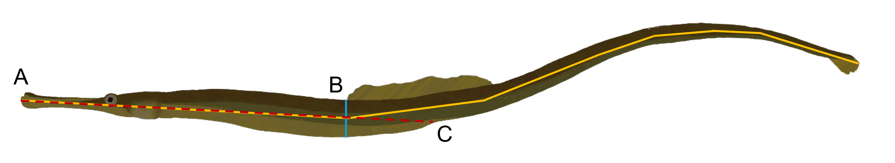

Selection pressures in *Syngnathus floridae*
================


- <a href="#calculating-the-degree-of-sexual-dimorphism"
  id="toc-calculating-the-degree-of-sexual-dimorphism">Calculating the
  degree of sexual dimorphism</a>
  - <a href="#checking-the-assumptions-for-a-pairwise-comparison"
    id="toc-checking-the-assumptions-for-a-pairwise-comparison">Checking the
    assumptions for a pairwise comparison</a>
  - <a href="#investigate-distributions-and-run-the-tests"
    id="toc-investigate-distributions-and-run-the-tests">Investigate
    distributions and run the tests</a>
- <a
  href="#calculating-mating-and-reproductive-success-for-individuals-who-mated"
  id="toc-calculating-mating-and-reproductive-success-for-individuals-who-mated">Calculating
  mating and reproductive success for individuals who mated</a>

``` r
#This is a cohesive list of all the libraries used in this document
library(ggplot2)
library(cowplot)
library(fBasics)
library(pwr)
```

``` r
#MomIDs and embryo counts for each section of the male's brood pouch
em_dat <- read.csv("data/EmbryoParentage_floridae.csv")

#Metadata for males and females from the mesocosm experiments
fem_mesoFL <- read.csv("data/all_fem_meso_floridae.csv")
mal_mesoFL <- read.csv("data/all_mal_meso_floridae.csv")
```

# Calculating the degree of sexual dimorphism

Other papers have reported varying levels of significant or
non-significant size differences between males and females in this
species, particularly in terms of standard length (measured from the tip
of the snout to the base of the caudal fin). I want to investigate the
data that I have to see what sexual size dimorphism is like for this
population. I am doing this across all fish that were used, including
those trials that had no successful matings.

The aspects of size that I am interested in looking at include:

- **Standard length** (A; yellow line): measured from the tip of the
  snout to the base of the caudal fin.
- **Torso depth** (B; blue line): measured from the point in front of
  the dorsal fin down (perpendicular to standard length).
- **Snout-vent length** (C; red line): measured from the tip of the
  snout to the urogenital opening.

<p float="center">



</p>

## Checking the assumptions for a pairwise comparison

Before comparing male size to female size I want to ensure the data
meets the assumptions. The main two things that I will be looking into
include:

1.  Equal variances between my groups (using `var.test()`).
2.  Normal distribution of the data (using `normalTest()`).

The null hypotheses for these two tests are that the variances are equal
and the data is normally distributed.

To account for the fact that fish who are longer may just inherently be
deeper as well, I am going to adjust the depth by the standard length of
the pipefish prior to funning any analyses

``` r
#Adjust the torso depth
fem_mesoFL$depth_adj <- fem_mesoFL$depth/fem_mesoFL$length
mal_mesoFL$depth_adj <- mal_mesoFL$depth/mal_mesoFL$length

#Testing to see if the variances are equal
var.test(fem_mesoFL$length, mal_mesoFL$length) #EQUAL
```

    ## 
    ##  F test to compare two variances
    ## 
    ## data:  fem_mesoFL$length and mal_mesoFL$length
    ## F = 1.4609, num df = 85, denom df = 85, p-value = 0.08239
    ## alternative hypothesis: true ratio of variances is not equal to 1
    ## 95 percent confidence interval:
    ##  0.9521741 2.2413401
    ## sample estimates:
    ## ratio of variances 
    ##           1.460872

``` r
var.test(fem_mesoFL$depth_adj, mal_mesoFL$depth_adj) #EQUAL
```

    ## 
    ##  F test to compare two variances
    ## 
    ## data:  fem_mesoFL$depth_adj and mal_mesoFL$depth_adj
    ## F = 1.3686, num df = 84, denom df = 85, p-value = 0.151
    ## alternative hypothesis: true ratio of variances is not equal to 1
    ## 95 percent confidence interval:
    ##  0.8911382 2.1030826
    ## sample estimates:
    ## ratio of variances 
    ##           1.368614

``` r
var.test(fem_mesoFL$svl, mal_mesoFL$svl) #NOT EQUAL
```

    ## 
    ##  F test to compare two variances
    ## 
    ## data:  fem_mesoFL$svl and mal_mesoFL$svl
    ## F = 2.1705, num df = 85, denom df = 85, p-value = 0.0004335
    ## alternative hypothesis: true ratio of variances is not equal to 1
    ## 95 percent confidence interval:
    ##  1.414675 3.330029
    ## sample estimates:
    ## ratio of variances 
    ##           2.170463

``` r
#Testing for normal distribution - Females
normalTest(fem_mesoFL$length, method = "da") #NOT NORMAL
```

    ## 
    ## Title:
    ##  D'Agostino Normality Test
    ## 
    ## Test Results:
    ##   STATISTIC:
    ##     Chi2 | Omnibus: 6.0342
    ##     Z3  | Skewness: 0.5032
    ##     Z4  | Kurtosis: -2.4044
    ##   P VALUE:
    ##     Omnibus  Test: 0.04894 
    ##     Skewness Test: 0.6148 
    ##     Kurtosis Test: 0.0162

``` r
normalTest(fem_mesoFL$depth_adj, method = "da") #NORMAL
```

    ## 
    ## Title:
    ##  D'Agostino Normality Test
    ## 
    ## Test Results:
    ##   STATISTIC:
    ##     Chi2 | Omnibus: 0.6513
    ##     Z3  | Skewness: 0.7106
    ##     Z4  | Kurtosis: -0.3825
    ##   P VALUE:
    ##     Omnibus  Test: 0.7221 
    ##     Skewness Test: 0.4773 
    ##     Kurtosis Test: 0.7021

``` r
normalTest(fem_mesoFL$svl, method = "da") #NORMAL
```

    ## 
    ## Title:
    ##  D'Agostino Normality Test
    ## 
    ## Test Results:
    ##   STATISTIC:
    ##     Chi2 | Omnibus: 3.0383
    ##     Z3  | Skewness: 0.7065
    ##     Z4  | Kurtosis: -1.5935
    ##   P VALUE:
    ##     Omnibus  Test: 0.2189 
    ##     Skewness Test: 0.4799 
    ##     Kurtosis Test: 0.1111

``` r
#Testing for normal distribution - Males
normalTest(mal_mesoFL$length, method = "da") #NORMAL
```

    ## 
    ## Title:
    ##  D'Agostino Normality Test
    ## 
    ## Test Results:
    ##   STATISTIC:
    ##     Chi2 | Omnibus: 0.0501
    ##     Z3  | Skewness: -0.1257
    ##     Z4  | Kurtosis: 0.1851
    ##   P VALUE:
    ##     Omnibus  Test: 0.9753 
    ##     Skewness Test: 0.9 
    ##     Kurtosis Test: 0.8531

``` r
normalTest(mal_mesoFL$depth_adj, method = "da") #NORMAL
```

    ## 
    ## Title:
    ##  D'Agostino Normality Test
    ## 
    ## Test Results:
    ##   STATISTIC:
    ##     Chi2 | Omnibus: 1.9819
    ##     Z3  | Skewness: 0.5381
    ##     Z4  | Kurtosis: 1.3009
    ##   P VALUE:
    ##     Omnibus  Test: 0.3712 
    ##     Skewness Test: 0.5905 
    ##     Kurtosis Test: 0.1933

``` r
normalTest(mal_mesoFL$svl, method = "da") #NORMAL
```

    ## 
    ## Title:
    ##  D'Agostino Normality Test
    ## 
    ## Test Results:
    ##   STATISTIC:
    ##     Chi2 | Omnibus: 3.4451
    ##     Z3  | Skewness: 0.5003
    ##     Z4  | Kurtosis: -1.7874
    ##   P VALUE:
    ##     Omnibus  Test: 0.1786 
    ##     Skewness Test: 0.6168 
    ##     Kurtosis Test: 0.07387

## Investigate distributions and run the tests

Looking at the distributions below I do not expect to see differences in
standard length, but maybe in depth and SVL. I will run one of three
tests depending on the results of the above assumption testing:

1.  If **both** assumptions are met: *Two Sample t-test*
2.  If only the **variances** are not equal, but the data is normal:
    *Welch Two Sample t-test*
3.  If the **data is not normal**, regardless of whether variances are
    equal: *Wilcoxon rank sum test with continuity correction*

Based on this, I will run a Wilcoxon test for standard length, a Welch
two sample t-test for snout-vent length, and a two sample t-test for
torso depth (adjusted).


``` r
#Running the appropriate test
wilcox.test(fem_mesoFL$length, mal_mesoFL$length)
```

    ## 
    ##  Wilcoxon rank sum test with continuity correction
    ## 
    ## data:  fem_mesoFL$length and mal_mesoFL$length
    ## W = 3930, p-value = 0.4784
    ## alternative hypothesis: true location shift is not equal to 0

``` r
t.test(fem_mesoFL$depth_adj, mal_mesoFL$depth_adj, var.equal = TRUE)
```

    ## 
    ##  Two Sample t-test
    ## 
    ## data:  fem_mesoFL$depth_adj and mal_mesoFL$depth_adj
    ## t = 4.1064, df = 169, p-value = 6.248e-05
    ## alternative hypothesis: true difference in means is not equal to 0
    ## 95 percent confidence interval:
    ##  0.001494861 0.004262830
    ## sample estimates:
    ##  mean of x  mean of y 
    ## 0.03537844 0.03249959

``` r
t.test(fem_mesoFL$svl, mal_mesoFL$svl, var.equal = FALSE)
```

    ## 
    ##  Welch Two Sample t-test
    ## 
    ## data:  fem_mesoFL$svl and mal_mesoFL$svl
    ## t = 3.86, df = 149.61, p-value = 0.0001682
    ## alternative hypothesis: true difference in means is not equal to 0
    ## 95 percent confidence interval:
    ##  2.949949 9.137632
    ## sample estimates:
    ## mean of x mean of y 
    ##  80.01955  73.97576

From these results we can see that there are no significant differences
between male and female pipefish in terms of standard length. However,
female dusky pipefish are significantly deeper that males and possess a
significantly longer snout-vent length. For those two morphometrics I am
going to run a power test to ensure that we are confident in our
results.

``` r
#Checking the power - SVL
d_mean_svl <- abs(mean(fem_mesoFL$svl, na.rm = TRUE) - 
                    mean(mal_mesoFL$svl, na.rm = TRUE))
pool_sd_svl <- sqrt((var(fem_mesoFL$svl, na.rm = TRUE) + 
                       var(mal_mesoFL$svl, na.rm = TRUE))/ 2)
d_svl <- d_mean_svl/pool_sd_svl

pwr.t.test(n = nrow(fem_mesoFL), 
           d = d_svl,
           sig.level = 0.05,
           type = 'two.sample',
           alternative = 'two.sided')
```

    ## 
    ##      Two-sample t test power calculation 
    ## 
    ##               n = 86
    ##               d = 0.5886437
    ##       sig.level = 0.05
    ##           power = 0.9698186
    ##     alternative = two.sided
    ## 
    ## NOTE: n is number in *each* group

``` r
#Checking the power - Depth
d_mean_depth <- abs(mean(fem_mesoFL$depth_adj, na.rm = TRUE) - 
                      mean(mal_mesoFL$depth_adj, na.rm = TRUE))
pool_sd_depth <- sqrt((var(fem_mesoFL$depth_adj, na.rm = TRUE) + 
                         var(mal_mesoFL$depth_adj, na.rm = TRUE))/ 2)
d_depth <- d_mean_depth/pool_sd_depth
pwr.t.test(n = nrow(fem_mesoFL), 
           d = d_depth,
           sig.level = 0.05,
           type = 'two.sample',
           alternative = 'two.sided')
```

    ## 
    ##      Two-sample t test power calculation 
    ## 
    ##               n = 86
    ##               d = 0.627763
    ##       sig.level = 0.05
    ##           power = 0.9835455
    ##     alternative = two.sided
    ## 
    ## NOTE: n is number in *each* group

For both variables we have a power of over 0.9 or over 90% so we can be
confident in our interpretation.

# Calculating mating and reproductive success for individuals who mated

*Syngnathus floridae* (dusky pipefish) were sampled from three distinct
seagrass beds around Tampa Bay in Tampa, Florida. Sexually mature
females (standard length $\ge$ 120mm) and pregnant males were collected
and brought back to the University of Tampa and put into experimental
breeding populations. In these trials, 8 males and 8 females were housed
together in a 140L tank for a period of 14-days and allowed to mate
freely. Parentage analysis was done with all of the pregnant males from
the trials to figure out how many times each male and female mated, and
the number of eggs that were transferred. The results of that are here.

First I had to calculate the mating and reproductive success for each
male and female who mated based on the assigned mom for each genotyped
embryo.

``` r
#Row-by-Row analysis of parentage data by male brood pouch section

#Read in the data
#em_dat <- read.csv("~/EmbryoParentage.csv")

#For each row in the dataset(each section of the pouch) apply this function
mom_counts <- do.call(rbind,apply(em_dat, 1, function(one_section){
  
  #Save all of the momIDs into an object
  mom_ids<-c(one_section[grep("momID",names(one_section))])  
  
  #Calculate the number of eggs that belongs to each potential mom based on
  #the proportions and total number of developed and undeveloped embryos
  mom_props<-c(as.numeric(one_section[grep("prop",names(one_section))]))
  mom_counts_dev<-mom_props*as.numeric(one_section["num_embryos_dev"])
  mom_counts_und<-mom_props*as.numeric(one_section["num_embryos_non_dev"])
  
  #Create a dataframe that contains the maleID, pouch section number and the
  #number of eggs that belongs to each momID
  this_section<-data.frame(
    maleID=one_section["maleID"],
    section_num=one_section["section_num"],
    mom_ids[which((mom_counts_dev + mom_counts_und) > 0)],
    mom_counts_dev[which((mom_counts_dev + mom_counts_und)>0)],
    mom_counts_und[which((mom_counts_dev + mom_counts_und)>0)]
  )
  
  #Rename the columns
  colnames(this_section)[3:5]<-c("momID","num_dev","num_und")
  
  return(this_section)
  
}))

#Calculate female fitness
fem_fitness<-do.call(rbind,by(mom_counts, mom_counts$momID,function(dat){
  
  mom_fitness<-data.frame(
    momID=unique(dat$momID),
    MatingSuccess=length(unique(dat$maleID)),
    NumDeveloped=round(sum(dat$num_dev)),
    NumUndeveloped=round(sum(dat$num_und))
  )
  return(mom_fitness)
}))

fem_fitness$totalEggs <- fem_fitness$NumDeveloped + fem_fitness$NumUndeveloped

#Calculate Male Fitness 
mal_fitness<-do.call(rbind,by(mom_counts, mom_counts$maleID,function(dat){
 
  dad_fitness<-data.frame(
    maleID=unique(dat$maleID),
    MatingSuccess=length(unique(dat$momID)),
    NumDeveloped_Calc=round(sum(dat$num_dev)),
    NumUndeveloped_Calc=round(sum(dat$num_und))
  )
  return(dad_fitness)
}))

mal_fitness$totalEggs <- mal_fitness$NumDeveloped_Calc + mal_fitness$NumUndeveloped_Calc
```

After running the above R script we have two datasets, `mal_fitness` and
`fem_fitness`. These datasets include information about the mating
success (number of mates) and reproductive success (Number of embryos
transferred). We can split reproductive success up further later if we
want to from the total number of embryos transferred to the number of
embryos developed and the number that were undeveloped.

I want to include all of the other metadata that I have for these
individuals (traits, collection location, latency to pregnancy, etc.) as
well as tack on all of the information for the individuals who did not
mate. To do that I am going to need to merge the fitness datasets with
`fem_meso` and `mal_meso`.

``` r
#Make a column in *_meso that contains the full fishID (i.e. FL1M3) to match the 
#formatting in the fitness datasets (make sure they have the same name for merging purposes)
fem_mesoFL$momID <- paste0("FL", fem_mesoFL$trial_num, "F", fem_mesoFL$fishID)
mal_mesoFL$maleID <- paste0("FL", mal_mesoFL$trial_num, "M", mal_mesoFL$fishID)

#Merge the datasets based on the columns created above
fem_allFL <- merge(fem_mesoFL, fem_fitness, by = "momID", all.x = TRUE, all.y = TRUE)
mal_allFL <- merge(mal_mesoFL, mal_fitness, by = "maleID", all.x = TRUE, all.y = TRUE)
```

There are a few trials that I want to remove from the analysis:

1.  All trials where there were no successful matings (7, 9, 10, 11).

2.  Trial 1, a male gave birth and the babies were immediately eaten by
    the adults so the trial was ended early and therefore I was unable
    to get any parentage information for that trial.

I also want to replace the NAs that were automatically added to the
columns from the fitness dataset (MatingSuccess, NumDeveloped,
NumUndeveloped, totalEggs) with 0s and add a column to the female
dataset that tells me whether or not the female mated (with 1 or 0).

``` r
#Subset the merged datasets to remove trials without successful matings and Trial 1
fem_succFL <- subset(fem_allFL, !(trial_num %in% c(7, 9, 10, 11, 1)))
mal_succFL <- subset(mal_allFL, !(trial_num %in% c(7, 9, 10, 11, 1)))

#Replace NAs with 0s in the columns related to fitness
mal_succFL[, c("MatingSuccess", "NumDeveloped_Calc", 
               "NumUndeveloped_Calc", "totalEggs")] <- sapply(mal_succFL[, c("MatingSuccess", 
                                                                             "NumDeveloped_Calc", 
                                                                             "NumUndeveloped_Calc", 
                                                                             "totalEggs")],
                                                              function(x)
                                                                ifelse(is.na(x), 0, x))

fem_succFL[, c("MatingSuccess", "NumDeveloped", 
               "NumUndeveloped", "totalEggs")] <- sapply(fem_succFL[, c("MatingSuccess", 
                                                                        "NumDeveloped", 
                                                                        "NumUndeveloped", 
                                                                        "totalEggs")],
                                                         function(x)
                                                           ifelse(is.na(x), 0, x))

#Add a column for females to denote mated or unmated
fem_succFL$mated <- ifelse(fem_succFL$MatingSuccess > 0, 1, 0)
```
