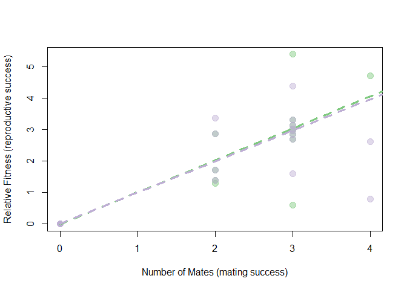

Selection pressures in *Syngnathus fuscus*
================


- <a href="#calculating-the-degree-of-sexual-dimorphism"
  id="toc-calculating-the-degree-of-sexual-dimorphism">Calculating the
  degree of sexual dimorphism</a>
  - <a href="#checking-the-assumptions-for-a-pairwise-comparison"
    id="toc-checking-the-assumptions-for-a-pairwise-comparison">Checking the
    assumptions for a pairwise comparison</a>
  - <a href="#investigate-distributions-and-run-the-tests"
    id="toc-investigate-distributions-and-run-the-tests">Investigate
    distributions and run the tests</a>
- <a
  href="#calculating-mating-and-reproductive-success-for-individuals-who-mated"
  id="toc-calculating-mating-and-reproductive-success-for-individuals-who-mated">Calculating
  mating and reproductive success for individuals who mated</a>
- <a href="#summary-statistics-for-successfully-mated-individuals"
  id="toc-summary-statistics-for-successfully-mated-individuals">Summary
  statistics for successfully mated individuals</a>
  - <a href="#males" id="toc-males">Males</a>
  - <a href="#females" id="toc-females">Females</a>
- <a href="#differences-between-mated-individuals-and-unmated-individuals"
  id="toc-differences-between-mated-individuals-and-unmated-individuals">Differences
  between mated individuals and unmated individuals</a>
  - <a href="#males-1" id="toc-males-1">Males</a>
    - <a href="#visual-comparison" id="toc-visual-comparison">Visual
      Comparison</a>
    - <a href="#testing-the-difference"
      id="toc-testing-the-difference">Testing the difference</a>
  - <a href="#females-1" id="toc-females-1">Females</a>
    - <a href="#visual-comparison-1" id="toc-visual-comparison-1">Visual
      Comparison</a>
    - <a href="#testing-the-difference-1"
      id="toc-testing-the-difference-1">Testing the difference</a>
- <a
  href="#looking-into-the-opportunity-for-selection-in-males-and-females"
  id="toc-looking-into-the-opportunity-for-selection-in-males-and-females">Looking
  into the Opportunity for Selection in Males and Females</a>
  - <a
    href="#generating-the-total-opportunity-for-selection-i-and-the-opportunity-for-sexual-selection-i_s"
    id="toc-generating-the-total-opportunity-for-selection-i-and-the-opportunity-for-sexual-selection-i_s">Generating
    the total opportunity for selection (<span
    class="math inline"><em>I</em></span>) and the opportunity for sexual
    selection (<span
    class="math inline"><em>I</em><sub><em>S</em></sub></span>)</a>
  - <a href="#partitioning-the-total-opportunity-for-selection-i"
    id="toc-partitioning-the-total-opportunity-for-selection-i">Partitioning
    the Total Opportunity for Selection (<span
    class="math inline"><em>I</em></span>)</a>
- <a
  href="#mate-success-versus-reproductive-success-bateman-gradient-beta_fu"
  id="toc-mate-success-versus-reproductive-success-bateman-gradient-beta_fu">Mate
  success versus Reproductive success (Bateman Gradient, <span
  class="math inline"><em>β</em><sub><em>F</em><em>U</em></sub></span>)</a>
  - <a href="#omitting-females-with-high-mating"
    id="toc-omitting-females-with-high-mating">Omitting females with high
    mating</a>
  - <a href="#investigating-the-impact-of-zeros-on-the-bateman-gradient"
    id="toc-investigating-the-impact-of-zeros-on-the-bateman-gradient">Investigating
    the impact of “zeros” on the Bateman Gradient</a>
    - <a href="#removing-the-zeros-from-the-plot"
      id="toc-removing-the-zeros-from-the-plot">Removing the zeros from the
      plot</a>
    - <a href="#removing-the-zeros-from-the-calculation-of-relative-fitness"
      id="toc-removing-the-zeros-from-the-calculation-of-relative-fitness">Removing
      the zeros from the calculation of relative fitness</a>
- <a
  href="#investing-selection-differentials-on-snout-vent-length-s-and-s"
  id="toc-investing-selection-differentials-on-snout-vent-length-s-and-s">Investing
  selection differentials on snout-vent-length (<span
  class="math inline"><em>s</em></span> and <span
  class="math inline"><em>s</em>′</span>)</a>
  - <a href="#looking-into-the-maximum-sexual-selection-differential"
    id="toc-looking-into-the-maximum-sexual-selection-differential">Looking
    into the Maximum Sexual Selection Differential</a>
- <a href="#visualizing-post-copulatory-selection"
  id="toc-visualizing-post-copulatory-selection">Visualizing
  post-copulatory selection</a>

``` r
#This is a cohesive list of all the libraries used in this document
library(ggplot2)
library(cowplot)
library(fBasics)
library(pwr)
#library(lme4)
library(dplyr)
library(tidyr)
library(knitr)
```

``` r
#MomIDs and embryo counts for each section of the male's brood pouch
em_dat <- read.csv("data/EmbryoParentage_fuscus.csv")

#Metadata for males and females from the mesocosm experiments
fem_mesoFU <- read.csv("data/all_fem_meso_fuscus.csv")
mal_mesoFU <- read.csv("data/all_mal_meso_fuscus.csv")
```

This document will follow the same analysis as was outlined in
`selection_analysis_floridae.Rmd`. For more thorough details refer back
to that document.

# Calculating the degree of sexual dimorphism

I noticed that there was a certain degree of sexual dimorphism in terms
of an ornamentation that was present only in the females, but I also
want to explore any size sexual dimorphism that may be present in this
species.

I will be looking at total standard length (mm, measured from the tip of
the snout to the tip of the caudal fin), snout-vent length (mm, measured
from the tip of the snout to the urogenital opening), torso depth (mm),
and snout length (mm). To look at these differences I will be performing
t-tests between males and females. First, I need to see if assumptions
are met, i.e. variances are equal and data is normally distributed.

## Checking the assumptions for a pairwise comparison

The main two things that I will be looking into include:

1.  Equal variances between my groups (using `var.test()`).
2.  Normal distribution of the data (using `normalTest()`).

To account for the fact that fish who are longer may just inherently be
deeper as well, I am going to adjust the depth by the standard length of
the pipefish prior to running any analyses.

``` r
#Adjust the torso depth
fem_mesoFU$depth_adj <- fem_mesoFU$depth/fem_mesoFU$svl
mal_mesoFU$depth_adj <- mal_mesoFU$depth/mal_mesoFU$svl

#Testing to see if the variances are equal
var.test(fem_mesoFU$length, mal_mesoFU$length) #EQUAL
```

    ## 
    ##  F test to compare two variances
    ## 
    ## data:  fem_mesoFU$length and mal_mesoFU$length
    ## F = 1.0335, num df = 90, denom df = 91, p-value = 0.8755
    ## alternative hypothesis: true ratio of variances is not equal to 1
    ## 95 percent confidence interval:
    ##  0.6828564 1.5649649
    ## sample estimates:
    ## ratio of variances 
    ##           1.033505

``` r
var.test(fem_mesoFU$depth_adj, mal_mesoFU$depth_adj) #NOT EQUAL
```

    ## 
    ##  F test to compare two variances
    ## 
    ## data:  fem_mesoFU$depth_adj and mal_mesoFU$depth_adj
    ## F = 1.6127, num df = 90, denom df = 91, p-value = 0.02397
    ## alternative hypothesis: true ratio of variances is not equal to 1
    ## 95 percent confidence interval:
    ##  1.06552 2.44195
    ## sample estimates:
    ## ratio of variances 
    ##           1.612667

``` r
var.test(fem_mesoFU$svl, mal_mesoFU$svl) #EQUAL
```

    ## 
    ##  F test to compare two variances
    ## 
    ## data:  fem_mesoFU$svl and mal_mesoFU$svl
    ## F = 0.82582, num df = 90, denom df = 91, p-value = 0.3646
    ## alternative hypothesis: true ratio of variances is not equal to 1
    ## 95 percent confidence interval:
    ##  0.5456328 1.2504769
    ## sample estimates:
    ## ratio of variances 
    ##          0.8258167

``` r
#Testing for normal distribution - Females
normalTest(fem_mesoFU$length, method = "da") #NORMAL
```

    ## 
    ## Title:
    ##  D'Agostino Normality Test
    ## 
    ## Test Results:
    ##   STATISTIC:
    ##     Chi2 | Omnibus: 1.8153
    ##     Z3  | Skewness: 1.2824
    ##     Z4  | Kurtosis: 0.4133
    ##   P VALUE:
    ##     Omnibus  Test: 0.4035 
    ##     Skewness Test: 0.1997 
    ##     Kurtosis Test: 0.6794

``` r
normalTest(fem_mesoFU$depth_adj, method = "da") #NOT NORMAL
```

    ## 
    ## Title:
    ##  D'Agostino Normality Test
    ## 
    ## Test Results:
    ##   STATISTIC:
    ##     Chi2 | Omnibus: 6.4163
    ##     Z3  | Skewness: 2.5245
    ##     Z4  | Kurtosis: 0.208
    ##   P VALUE:
    ##     Omnibus  Test: 0.04043 
    ##     Skewness Test: 0.01159 
    ##     Kurtosis Test: 0.8352

``` r
normalTest(fem_mesoFU$svl, method = "da") #NORMAL
```

    ## 
    ## Title:
    ##  D'Agostino Normality Test
    ## 
    ## Test Results:
    ##   STATISTIC:
    ##     Chi2 | Omnibus: 0.5465
    ##     Z3  | Skewness: -0.572
    ##     Z4  | Kurtosis: -0.4683
    ##   P VALUE:
    ##     Omnibus  Test: 0.7609 
    ##     Skewness Test: 0.5673 
    ##     Kurtosis Test: 0.6396

``` r
#Testing for normal distribution - Males
normalTest(mal_mesoFU$length, method = "da") #NOT NORMAL
```

    ## 
    ## Title:
    ##  D'Agostino Normality Test
    ## 
    ## Test Results:
    ##   STATISTIC:
    ##     Chi2 | Omnibus: 6.4888
    ##     Z3  | Skewness: -0.4917
    ##     Z4  | Kurtosis: -2.4994
    ##   P VALUE:
    ##     Omnibus  Test: 0.03899 
    ##     Skewness Test: 0.6229 
    ##     Kurtosis Test: 0.01244

``` r
normalTest(mal_mesoFU$depth_adj, method = "da") #NOT NORMAL
```

    ## 
    ## Title:
    ##  D'Agostino Normality Test
    ## 
    ## Test Results:
    ##   STATISTIC:
    ##     Chi2 | Omnibus: 92.4727
    ##     Z3  | Skewness: 7.3589
    ##     Z4  | Kurtosis: 6.1903
    ##   P VALUE:
    ##     Omnibus  Test: < 2.2e-16 
    ##     Skewness Test: 1.854e-13 
    ##     Kurtosis Test: 6.006e-10

``` r
normalTest(mal_mesoFU$svl, method = "da") #NORMAL
```

    ## 
    ## Title:
    ##  D'Agostino Normality Test
    ## 
    ## Test Results:
    ##   STATISTIC:
    ##     Chi2 | Omnibus: 1.4624
    ##     Z3  | Skewness: -0.7134
    ##     Z4  | Kurtosis: 0.9765
    ##   P VALUE:
    ##     Omnibus  Test: 0.4813 
    ##     Skewness Test: 0.4756 
    ##     Kurtosis Test: 0.3288

## Investigate distributions and run the tests

I will run a Wilcoxon test for standard length, a two sample t-test for
snout-vent length, and a Wilcoxon test for torso depth (adjusted).


``` r
#Running the appropriate test
wilcox.test(fem_mesoFU$length, mal_mesoFU$length)
```

    ## 
    ##  Wilcoxon rank sum test with continuity correction
    ## 
    ## data:  fem_mesoFU$length and mal_mesoFU$length
    ## W = 5828, p-value = 4.616e-06
    ## alternative hypothesis: true location shift is not equal to 0

``` r
wilcox.test(fem_mesoFU$depth_adj, mal_mesoFU$depth_adj)
```

    ## 
    ##  Wilcoxon rank sum test with continuity correction
    ## 
    ## data:  fem_mesoFU$depth_adj and mal_mesoFU$depth_adj
    ## W = 4382, p-value = 0.5853
    ## alternative hypothesis: true location shift is not equal to 0

``` r
t.test(fem_mesoFU$svl, mal_mesoFU$svl, var.equal = TRUE)
```

    ## 
    ##  Two Sample t-test
    ## 
    ## data:  fem_mesoFU$svl and mal_mesoFU$svl
    ## t = 10.569, df = 181, p-value < 2.2e-16
    ## alternative hypothesis: true difference in means is not equal to 0
    ## 95 percent confidence interval:
    ##   7.773462 11.342346
    ## sample estimates:
    ## mean of x mean of y 
    ##  63.93716  54.37926

For the Northern pipefish, there are significant differences between
males and females in terms of standard length, snout-vent length but not
in torso depth.

``` r
#Checking the power - length
d_mean_len <- abs(mean(fem_mesoFU$length, na.rm = TRUE) - 
                    mean(mal_mesoFU$length, na.rm = TRUE))
pool_sd_len <- sqrt((var(fem_mesoFU$length, na.rm = TRUE) + 
                       var(mal_mesoFU$length, na.rm = TRUE))/ 2)
d_len <- d_mean_len/pool_sd_len

pwr.t.test(n = nrow(fem_mesoFU), 
           d = d_len,
           sig.level = 0.05,
           type = 'two.sample',
           alternative = 'two.sided')
```

    ## 
    ##      Two-sample t test power calculation 
    ## 
    ##               n = 91
    ##               d = 0.8110413
    ##       sig.level = 0.05
    ##           power = 0.9997506
    ##     alternative = two.sided
    ## 
    ## NOTE: n is number in *each* group

``` r
#Checking the power - SVL
d_mean_svl <- abs(mean(fem_mesoFU$svl, na.rm = TRUE) - 
                    mean(mal_mesoFU$svl, na.rm = TRUE))
pool_sd_svl <- sqrt((var(fem_mesoFU$svl, na.rm = TRUE) + 
                       var(mal_mesoFU$svl, na.rm = TRUE))/ 2)
d_svl <- d_mean_svl/pool_sd_svl

pwr.t.test(n = nrow(fem_mesoFU), 
           d = d_svl,
           sig.level = 0.05,
           type = 'two.sample',
           alternative = 'two.sided')
```

    ## 
    ##      Two-sample t test power calculation 
    ## 
    ##               n = 91
    ##               d = 1.562958
    ##       sig.level = 0.05
    ##           power = 1
    ##     alternative = two.sided
    ## 
    ## NOTE: n is number in *each* group

``` r
#Checking the power - Depth
d_mean_depth <- abs(mean(fem_mesoFU$depth_adj, na.rm = TRUE) - 
                      mean(mal_mesoFU$depth_adj, na.rm = TRUE))
pool_sd_depth <- sqrt((var(fem_mesoFU$depth_adj, na.rm = TRUE) + 
                         var(mal_mesoFU$depth_adj, na.rm = TRUE))/ 2)
d_depth <- d_mean_depth/pool_sd_depth
pwr.t.test(n = nrow(fem_mesoFU), 
           d = d_depth,
           sig.level = 0.05,
           type = 'two.sample',
           alternative = 'two.sided')
```

    ## 
    ##      Two-sample t test power calculation 
    ## 
    ##               n = 91
    ##               d = 0.1721576
    ##       sig.level = 0.05
    ##           power = 0.2113619
    ##     alternative = two.sided
    ## 
    ## NOTE: n is number in *each* group

For all variables we have a power of over 0.9 or over 90% so we can be
confident in our interpretation.

# Calculating mating and reproductive success for individuals who mated

*Syngnathus fuscus* (Northern pipefish) were sampled from one cohesive
seagrass beds in Chesapeake Bay in Cape Charles, Virgina. Sexually
mature females (standard length $\ge$ 120mm) and pregnant males were
collected and brought back to the University of Tampa for mesocosm
experiments. In these mesocosms, 6 males and 6 females were housed
together in a 140L tank for a period of 6-weeks and allowed to mate
freely. Parentage analysis was done with all of the pregnant males from
the trials to figure out how many times each male and female mated, and
the number of eggs that were transferred. The results of that are here.

First I had to calculate the mating and reproductive success for each
male and female who mated based on the assigned mom for each genotyped
embryo.

``` r
#Row-by-Row analysis of parentage data by male brood pouch section

#Read in the data
#em_dat <- read.csv("~/EmbryoParentage.csv")

#For each row in the dataset(each section of the pouch) apply this function
mom_counts <- do.call(rbind,apply(em_dat, 1, function(one_section){
  
  #Save all of the momIDs into an object
  mom_ids<-c(one_section[grep("momID",names(one_section))])  
  
  #Calculate the number of eggs that belongs to each potential mom based on
  #the proportions and total number of developed and undeveloped embryos
  mom_props<-c(as.numeric(one_section[grep("prop",names(one_section))]))
  mom_counts_dev<-mom_props*as.numeric(one_section["num_embryos_dev"])
  mom_counts_und<-mom_props*as.numeric(one_section["num_embryos_non_dev"])
  
  #Create a dataframe that contains the maleID, pouch section number and the
  #number of eggs that belongs to each momID
  this_section<-data.frame(
    maleID=one_section["maleID"],
    section_num=one_section["section_num"],
    mom_ids[which((mom_counts_dev + mom_counts_und) > 0)],
    mom_counts_dev[which((mom_counts_dev + mom_counts_und)>0)],
    mom_counts_und[which((mom_counts_dev + mom_counts_und)>0)]
  )
  
  #Rename the columns
  colnames(this_section)[3:5]<-c("momID","num_dev","num_und")
  
  return(this_section)
  
}))

#Calculate female fitness
fem_fitness<-do.call(rbind,by(mom_counts, mom_counts$momID,function(dat){
  
  mom_fitness<-data.frame(
    momID=unique(dat$momID),
    MatingSuccess=length(unique(dat$maleID)),
    NumDeveloped=round(sum(dat$num_dev)),
    NumUndeveloped=round(sum(dat$num_und))
  )
  return(mom_fitness)
}))

fem_fitness$totalEggs <- fem_fitness$NumDeveloped + fem_fitness$NumUndeveloped

#Calculate Male Fitness 
mal_fitness<-do.call(rbind,by(mom_counts, mom_counts$maleID,function(dat){
 
  dad_fitness<-data.frame(
    maleID=unique(dat$maleID),
    MatingSuccess=length(unique(dat$momID)),
    NumDeveloped_Calc=round(sum(dat$num_dev)),
    NumUndeveloped_Calc=round(sum(dat$num_und))
  )
  return(dad_fitness)
}))

mal_fitness$totalEggs <- mal_fitness$NumDeveloped_Calc + mal_fitness$NumUndeveloped_Calc
```

After running the above R script we have generated two datasets,
`mal_fitness` and `fem_fitness`. These datasets include information
about the mating success (number of mates) and reproductive success
(Number of embryos transferred). We can split reproductive success up
further later if we want to from the total number of embryos transferred
to the number of embryos developed and the number that were undeveloped.

I want to include all of the other metadata that I have for these
individuals (traits, collection location, latency to pregnancy, etc.) as
well as tack on all of the information for the individuals who did not
mate. To do that I am going to need to merge the fitness datasets with
`fem_meso` and `mal_meso`.

``` r
#Make a column in *_meso that contains the full fishID (i.e. FU1M3) to match the 
#formatting in the fitness datasets (make sure they have the same name for merging purposes)
fem_mesoFU$momID <- paste0("FU", fem_mesoFU$trial_num, "F",
                         fem_mesoFU$fishID)
mal_mesoFU$maleID <- paste0("FU", mal_mesoFU$trial_num, "M",
                          mal_mesoFU$fishID)

#Merge the datasets based on the columns created above
fem_all <- merge(fem_mesoFU, fem_fitness, by = "momID", 
                 all.x = TRUE, all.y = TRUE)
mal_all <- merge(mal_mesoFU, mal_fitness, by = "maleID", 
                 all.x = TRUE, all.y = TRUE)
```

There are a few trials that I want to remove from the analysis including
all trials where there were no successful matings (4, 7, 8, and 9).

I also want to replace the NAs that were automatically added to the
columns from the fitness dataset (MatingSuccess, NumDeveloped,
NumUndeveloped, totalEggs) with 0s and add a column to the female
dataset that tells me whether or not the female mated (with 1 or 0).

``` r
#Subset the merged datasets to remove trials without successful matings 
fem_succFU <- subset(fem_all, !(trial_num %in% c(4, 7, 8, 9)))
mal_succFU <- subset(mal_all, !(trial_num %in% c(4, 7, 8, 9)))

#Replace NAs with 0s in the columns related to fitness
mal_succFU[, c("MatingSuccess", "NumDeveloped_Calc", 
               "NumUndeveloped_Calc", "totalEggs")] <- sapply(mal_succFU[,
                                                                         c("MatingSuccess", "NumDeveloped_Calc", 
               "NumUndeveloped_Calc", "totalEggs")],
                           function(x)
                             ifelse(is.na(x), 0, x))

fem_succFU[, c("MatingSuccess", "NumDeveloped", 
               "NumUndeveloped", "totalEggs")] <- sapply(fem_succFU[, c("MatingSuccess", 
                                                                        "NumDeveloped", 
                                                                        "NumUndeveloped", 
                                                                        "totalEggs")],
                           function(x)
                             ifelse(is.na(x), 0, x))

#Add a column for females to denote mated or unmated
fem_succFU$mated <- ifelse(fem_succFU$MatingSuccess > 0, 1, 0)
```

# Summary statistics for successfully mated individuals

## Males

Across all 12 trials and 74 total males, there were 22 males that mated
at least one time and 1 of those males had two mates.

Looking across all males, including the ones that did not mate, this is
what we find as the mean, sd, and se for the number of embryos
transferred and how many of those developed versus didn’t:

|                     |       mean |          SD |         SE | max | min |
|:--------------------|-----------:|------------:|-----------:|----:|----:|
| Number of Embryos   | 68.2432432 | 138.1056585 | 16.0544567 | 607 |   0 |
| Developed Embryos   | 63.6216216 | 130.3914762 | 15.1577012 | 566 |   0 |
| Undeveloped Embryos |  4.6216216 |  13.9889415 |  1.6261814 |  84 |   0 |

These values will be influenced by the number of 0s coming from males
who did not mate. So let’s look at the same thing, but this time for
only males who had at least one successful mating:

|                     |        mean |          SD |         SE | max | min |
|:--------------------|------------:|------------:|-----------:|----:|----:|
| Number of Embryos   | 229.5454545 | 165.8693483 | 35.3634639 | 607 |   0 |
| Developed Embryos   |         214 | 159.3379159 | 33.9709578 | 566 |   0 |
| Undeveloped Embryos |  15.5454545 |  22.4132768 |  4.7785267 |  84 |   0 |

We can see from the bottom table that even when we only include males
who mated there is still a wide range in the brood size. I want to see
what relationship there is between brood pouch size (in terms of both
total area and length) and brood size (total number of embryos).


There may be some correlation happening here, but it doesn’t look
particularly strong. Let’s run some correlations tests to see what they
say.

    ## 
    ##  Pearson's product-moment correlation
    ## 
    ## data:  as.numeric(mated_malFU$bp_area) and mated_malFU$totalEggs
    ## t = 1.7941, df = 20, p-value = 0.08793
    ## alternative hypothesis: true correlation is not equal to 0
    ## 95 percent confidence interval:
    ##  -0.05845921  0.68621522
    ## sample estimates:
    ##       cor 
    ## 0.3723259

    ## 
    ##  Pearson's product-moment correlation
    ## 
    ## data:  as.numeric(mated_malFU$bp_length) and mated_malFU$totalEggs
    ## t = 1.5076, df = 20, p-value = 0.1473
    ## alternative hypothesis: true correlation is not equal to 0
    ## 95 percent confidence interval:
    ##  -0.1180647  0.6530941
    ## sample estimates:
    ##       cor 
    ## 0.3194448

There is not a significant correlation between the number of eggs and
size of the brood pouch when we look at brood pouch area OR brood pouch
length.

Let’s see if this changes if we just look at the overall size of the
male


    ## 
    ##  Pearson's product-moment correlation
    ## 
    ## data:  as.numeric(mated_malFU$length) and mated_malFU$totalEggs
    ## t = 0.68816, df = 20, p-value = 0.4993
    ## alternative hypothesis: true correlation is not equal to 0
    ## 95 percent confidence interval:
    ##  -0.2879874  0.5391261
    ## sample estimates:
    ##       cor 
    ## 0.1520871

The correlation actually decreases when we look at the overall size of
the fish.

## Females

Across all 12 trials and 73 total females, there were 19 females that
mated at least one time, 2 females that mated twice, and 0 that mated 3
times.

Looking across all females, including the ones that did not mate, this
is what we find as the mean, sd, and se for the total number of embryos
transferred from each female (across all of her mates if applicable) and
how many of those developed versus didn’t:

|                     |       mean |          SD |         SE | max | min |
|:--------------------|-----------:|------------:|-----------:|----:|----:|
| Number of Embryos   | 69.1780822 | 145.8034581 |  17.065004 | 607 |   0 |
| Developed Embryos   | 64.4931507 | 134.6631727 | 15.7611322 | 566 |   0 |
| Undeveloped Embryos |  4.6849315 |  18.9442726 |  2.2172594 | 152 |   0 |

These values will be influenced by the number of 0s coming from females
who did not mate. So let’s look at the same thing, but this time for
only females who had at least one successful mating:

|                     |        mean |          SD |         SE | max | min |
|:--------------------|------------:|------------:|-----------:|----:|----:|
| Number of Embryos   | 265.7894737 | 172.8414749 | 39.6525538 | 607 |  53 |
| Developed Embryos   | 247.7894737 |  156.826365 | 35.9784356 | 566 |  52 |
| Undeveloped Embryos |          18 |  34.3883055 |  7.8892183 | 152 |   0 |

We can see from the bottom table that even when we only include females
who mated there is still a wide range in the number of eggs transferred.
I want to see what relationship there may be between female body size
(in terms of standard length, depth, and SVL) and the number of eggs she
transferred. I also want to see on average how many eggs were
transferred per mating. I’m going to calculate this by taking the total
number of eggs and dividing it by the number of mates.

    ## [1] 244.2632

    ## [1] 18.6399


There also appears to be a correlation between female body size and the
number of eggs transferred, especially in terms of depth. Let’s run some
correlations tests to see what they say.

    ## 
    ##  Pearson's product-moment correlation
    ## 
    ## data:  mated_femFU$length and as.numeric(mated_femFU$totalEggs)
    ## t = 1.2419, df = 17, p-value = 0.2311
    ## alternative hypothesis: true correlation is not equal to 0
    ## 95 percent confidence interval:
    ##  -0.1908052  0.6565978
    ## sample estimates:
    ##       cor 
    ## 0.2883983

    ## 
    ##  Pearson's product-moment correlation
    ## 
    ## data:  mated_femFU$depth_adj and as.numeric(mated_femFU$totalEggs)
    ## t = 2.4558, df = 17, p-value = 0.02512
    ## alternative hypothesis: true correlation is not equal to 0
    ## 95 percent confidence interval:
    ##  0.07493128 0.78376349
    ## sample estimates:
    ##       cor 
    ## 0.5117243

    ## 
    ##  Pearson's product-moment correlation
    ## 
    ## data:  mated_femFU$svl and as.numeric(mated_femFU$totalEggs)
    ## t = 1.0581, df = 17, p-value = 0.3048
    ## alternative hypothesis: true correlation is not equal to 0
    ## 95 percent confidence interval:
    ##  -0.2318064  0.6314863
    ## sample estimates:
    ##       cor 
    ## 0.2485751

There is no sig. correlation between length or svl and the number of
eggs transferred but we do see a significantly positive relationship
between depth and number of eggs transferred!

# Differences between mated individuals and unmated individuals

I want to now see if there are any significant differences in the sizes
of individuals who mated vs individuals that didn’t mate in males and
females. I am going to be focusing on the same morphometrics outlined
above.

## Males

### Visual Comparison

Before conducting any analyses, let’s see if we can visually detect any
differences between males who mated and unmated individuals.


I don’t notice many differences, however, it appears that unmated males
are slightly larger in terms of standard length a somewhat surprising
find but similar to *S. floridae*.

### Testing the difference

Let’s now put some statistical power behind the difference in various
morphometrics between mated and unmated individuals. I am first going to
test the assumptions and then run the appropriate version of a t-test.

    ## 
    ##  F test to compare two variances
    ## 
    ## data:  mal_succFU$length by mal_succFU$preg_status
    ## F = 1.5512, num df = 51, denom df = 21, p-value = 0.272
    ## alternative hypothesis: true ratio of variances is not equal to 1
    ## 95 percent confidence interval:
    ##  0.7034511 3.0559527
    ## sample estimates:
    ## ratio of variances 
    ##           1.551159

    ## 
    ##  F test to compare two variances
    ## 
    ## data:  mal_succFU$depth_adj by mal_succFU$preg_status
    ## F = 2.7939, num df = 51, denom df = 21, p-value = 0.01213
    ## alternative hypothesis: true ratio of variances is not equal to 1
    ## 95 percent confidence interval:
    ##  1.267032 5.504276
    ## sample estimates:
    ## ratio of variances 
    ##           2.793894

    ## 
    ##  F test to compare two variances
    ## 
    ## data:  mal_succFU$svl by mal_succFU$preg_status
    ## F = 2.2874, num df = 51, denom df = 21, p-value = 0.04071
    ## alternative hypothesis: true ratio of variances is not equal to 1
    ## 95 percent confidence interval:
    ##  1.037315 4.506334
    ## sample estimates:
    ## ratio of variances 
    ##           2.287352

    ## 
    ##  F test to compare two variances
    ## 
    ## data:  as.numeric(mal_succFU$bp_area) by mal_succFU$preg_status
    ## F = 1.3147, num df = 50, denom df = 21, p-value = 0.5005
    ## alternative hypothesis: true ratio of variances is not equal to 1
    ## 95 percent confidence interval:
    ##  0.5953957 2.5977425
    ## sample estimates:
    ## ratio of variances 
    ##           1.314708

    ## 
    ##  F test to compare two variances
    ## 
    ## data:  mal_succFU$bp_length by mal_succFU$preg_status
    ## F = 1.1517, num df = 50, denom df = 21, p-value = 0.7435
    ## alternative hypothesis: true ratio of variances is not equal to 1
    ## 95 percent confidence interval:
    ##  0.5215926 2.2757358
    ## sample estimates:
    ## ratio of variances 
    ##           1.151741

    ## 
    ##  F test to compare two variances
    ## 
    ## data:  mal_succFU$weight by mal_succFU$preg_status
    ## F = 2.607, num df = 51, denom df = 21, p-value = 0.01875
    ## alternative hypothesis: true ratio of variances is not equal to 1
    ## 95 percent confidence interval:
    ##  1.182260 5.136008
    ## sample estimates:
    ## ratio of variances 
    ##           2.606966

    ## 
    ## Title:
    ##  D'Agostino Normality Test
    ## 
    ## Test Results:
    ##   STATISTIC:
    ##     Chi2 | Omnibus: 6.4738
    ##     Z3  | Skewness: 0.38
    ##     Z4  | Kurtosis: -2.5158
    ##   P VALUE:
    ##     Omnibus  Test: 0.03928 
    ##     Skewness Test: 0.7039 
    ##     Kurtosis Test: 0.01188

    ## 
    ## Title:
    ##  D'Agostino Normality Test
    ## 
    ## Test Results:
    ##   STATISTIC:
    ##     Chi2 | Omnibus: 90.6463
    ##     Z3  | Skewness: 7.3449
    ##     Z4  | Kurtosis: 6.058
    ##   P VALUE:
    ##     Omnibus  Test: < 2.2e-16 
    ##     Skewness Test: 2.058e-13 
    ##     Kurtosis Test: 1.379e-09

    ## 
    ## Title:
    ##  D'Agostino Normality Test
    ## 
    ## Test Results:
    ##   STATISTIC:
    ##     Chi2 | Omnibus: 1.4898
    ##     Z3  | Skewness: -0.0559
    ##     Z4  | Kurtosis: 1.2193
    ##   P VALUE:
    ##     Omnibus  Test: 0.4748 
    ##     Skewness Test: 0.9554 
    ##     Kurtosis Test: 0.2227

    ## 
    ## Title:
    ##  D'Agostino Normality Test
    ## 
    ## Test Results:
    ##   STATISTIC:
    ##     Chi2 | Omnibus: 7.7251
    ##     Z3  | Skewness: 2.3028
    ##     Z4  | Kurtosis: 1.5563
    ##   P VALUE:
    ##     Omnibus  Test: 0.02101 
    ##     Skewness Test: 0.02129 
    ##     Kurtosis Test: 0.1196

    ## 
    ## Title:
    ##  D'Agostino Normality Test
    ## 
    ## Test Results:
    ##   STATISTIC:
    ##     Chi2 | Omnibus: 0.085
    ##     Z3  | Skewness: 0.2379
    ##     Z4  | Kurtosis: 0.1686
    ##   P VALUE:
    ##     Omnibus  Test: 0.9584 
    ##     Skewness Test: 0.812 
    ##     Kurtosis Test: 0.8661

    ## 
    ## Title:
    ##  D'Agostino Normality Test
    ## 
    ## Test Results:
    ##   STATISTIC:
    ##     Chi2 | Omnibus: 8.9227
    ##     Z3  | Skewness: 2.4847
    ##     Z4  | Kurtosis: 1.6579
    ##   P VALUE:
    ##     Omnibus  Test: 0.01155 
    ##     Skewness Test: 0.01296 
    ##     Kurtosis Test: 0.09733

    ## 
    ##  Wilcoxon rank sum test with continuity correction
    ## 
    ## data:  mal_succFU$length by mal_succFU$preg_status
    ## W = 685, p-value = 0.1834
    ## alternative hypothesis: true location shift is not equal to 0

    ## 
    ##  Two Sample t-test
    ## 
    ## data:  mal_succFU$depth_adj by mal_succFU$preg_status
    ## t = 0.70838, df = 72, p-value = 0.481
    ## alternative hypothesis: true difference in means between group 0 and group 1 is not equal to 0
    ## 95 percent confidence interval:
    ##  -0.002793088  0.005872388
    ## sample estimates:
    ## mean in group 0 mean in group 1 
    ##      0.07307099      0.07153134

    ## 
    ##  Welch Two Sample t-test
    ## 
    ## data:  mal_succFU$svl by mal_succFU$preg_status
    ## t = 1.0161, df = 58.682, p-value = 0.3138
    ## alternative hypothesis: true difference in means between group 0 and group 1 is not equal to 0
    ## 95 percent confidence interval:
    ##  -1.386368  4.246102
    ## sample estimates:
    ## mean in group 0 mean in group 1 
    ##        53.97723        52.54736

    ## 
    ##  Wilcoxon rank sum test with continuity correction
    ## 
    ## data:  as.numeric(mal_succFU$bp_area) by mal_succFU$preg_status
    ## W = 669, p-value = 0.1962
    ## alternative hypothesis: true location shift is not equal to 0

    ## 
    ##  Two Sample t-test
    ## 
    ## data:  mal_succFU$bp_length by mal_succFU$preg_status
    ## t = 1.978, df = 71, p-value = 0.05181
    ## alternative hypothesis: true difference in means between group 0 and group 1 is not equal to 0
    ## 95 percent confidence interval:
    ##  -0.01802097  4.48727801
    ## sample estimates:
    ## mean in group 0 mean in group 1 
    ##        33.86349        31.62886

    ## 
    ##  Wilcoxon rank sum test with continuity correction
    ## 
    ## data:  mal_succFU$weight by mal_succFU$preg_status
    ## W = 680, p-value = 0.2018
    ## alternative hypothesis: true location shift is not equal to 0

There were no significant differences in terms of the sizes of males who
mated versus those who did not, except for maybe in terms of brood pouch
length.

Let’s explore this a bit more and overlay the distribution of all males
(mated and unmated) with the males who did mate and see how it varies
for the brood pouch.


## Females

Similarly, now let’s see if we can identify any significant differences
in the morphometrics of females who were able to obtain mates versus
those who were unsuccessful.

### Visual Comparison


I don’t notice many differences, however, it appears that mated females
are larger than unmated females.

### Testing the difference

Let’s now put some statistical power behind the difference in various
morphometrics between mated and unmated individuals.

    ## 
    ##  F test to compare two variances
    ## 
    ## data:  fem_succFU$length by fem_succFU$mated
    ## F = 1.558, num df = 53, denom df = 18, p-value = 0.3014
    ## alternative hypothesis: true ratio of variances is not equal to 1
    ## 95 percent confidence interval:
    ##  0.6663111 3.1416657
    ## sample estimates:
    ## ratio of variances 
    ##           1.558006

    ## 
    ##  F test to compare two variances
    ## 
    ## data:  fem_succFU$depth_adj by fem_succFU$mated
    ## F = 0.45766, num df = 53, denom df = 18, p-value = 0.02875
    ## alternative hypothesis: true ratio of variances is not equal to 1
    ## 95 percent confidence interval:
    ##  0.1957263 0.9228520
    ## sample estimates:
    ## ratio of variances 
    ##          0.4576582

    ## 
    ##  F test to compare two variances
    ## 
    ## data:  fem_succFU$svl by fem_succFU$mated
    ## F = 1.4118, num df = 53, denom df = 18, p-value = 0.4254
    ## alternative hypothesis: true ratio of variances is not equal to 1
    ## 95 percent confidence interval:
    ##  0.6037712 2.8467894
    ## sample estimates:
    ## ratio of variances 
    ##           1.411772

    ## 
    ##  F test to compare two variances
    ## 
    ## data:  fem_succFU$weight by fem_succFU$mated
    ## F = 0.81218, num df = 53, denom df = 18, p-value = 0.5435
    ## alternative hypothesis: true ratio of variances is not equal to 1
    ## 95 percent confidence interval:
    ##  0.3473424 1.6377241
    ## sample estimates:
    ## ratio of variances 
    ##          0.8121756

    ## 
    ## Title:
    ##  D'Agostino Normality Test
    ## 
    ## Test Results:
    ##   STATISTIC:
    ##     Chi2 | Omnibus: 4.6664
    ##     Z3  | Skewness: 1.802
    ##     Z4  | Kurtosis: 1.1913
    ##   P VALUE:
    ##     Omnibus  Test: 0.09698 
    ##     Skewness Test: 0.07155 
    ##     Kurtosis Test: 0.2335

    ## 
    ## Title:
    ##  D'Agostino Normality Test
    ## 
    ## Test Results:
    ##   STATISTIC:
    ##     Chi2 | Omnibus: 4.3796
    ##     Z3  | Skewness: 2.0921
    ##     Z4  | Kurtosis: -0.0524
    ##   P VALUE:
    ##     Omnibus  Test: 0.1119 
    ##     Skewness Test: 0.03643 
    ##     Kurtosis Test: 0.9582

    ## 
    ## Title:
    ##  D'Agostino Normality Test
    ## 
    ## Test Results:
    ##   STATISTIC:
    ##     Chi2 | Omnibus: 0.1544
    ##     Z3  | Skewness: 0.2023
    ##     Z4  | Kurtosis: -0.3369
    ##   P VALUE:
    ##     Omnibus  Test: 0.9257 
    ##     Skewness Test: 0.8397 
    ##     Kurtosis Test: 0.7362

    ## 
    ## Title:
    ##  D'Agostino Normality Test
    ## 
    ## Test Results:
    ##   STATISTIC:
    ##     Chi2 | Omnibus: 5.609
    ##     Z3  | Skewness: 2.3682
    ##     Z4  | Kurtosis: 0.0273
    ##   P VALUE:
    ##     Omnibus  Test: 0.06054 
    ##     Skewness Test: 0.01788 
    ##     Kurtosis Test: 0.9782

    ## 
    ##  Two Sample t-test
    ## 
    ## data:  fem_succFU$length by fem_succFU$mated
    ## t = -0.50525, df = 71, p-value = 0.615
    ## alternative hypothesis: true difference in means between group 0 and group 1 is not equal to 0
    ## 95 percent confidence interval:
    ##  -10.706289   6.377429
    ## sample estimates:
    ## mean in group 0 mean in group 1 
    ##        154.2378        156.4023

    ## 
    ##  Wilcoxon rank sum test with continuity correction
    ## 
    ## data:  fem_succFU$depth_adj by fem_succFU$mated
    ## W = 371, p-value = 0.07525
    ## alternative hypothesis: true location shift is not equal to 0

    ## 
    ##  Two Sample t-test
    ## 
    ## data:  fem_succFU$svl by fem_succFU$mated
    ## t = -0.81641, df = 71, p-value = 0.417
    ## alternative hypothesis: true difference in means between group 0 and group 1 is not equal to 0
    ## 95 percent confidence interval:
    ##  -4.524398  1.895723
    ## sample estimates:
    ## mean in group 0 mean in group 1 
    ##        62.93693        64.25126

    ## 
    ##  Two Sample t-test
    ## 
    ## data:  fem_succFU$weight by fem_succFU$mated
    ## t = -1.5966, df = 71, p-value = 0.1148
    ## alternative hypothesis: true difference in means between group 0 and group 1 is not equal to 0
    ## 95 percent confidence interval:
    ##  -0.51773060  0.05730175
    ## sample estimates:
    ## mean in group 0 mean in group 1 
    ##        1.759259        1.989474

There are no significant differences, however, it does get close for
torso depth and in every case the mated females were larger than the
unmated.

Let’s explore this a bit more and overlay the distribution of torso
depth in all females (mated and unmated) with the torso depth of females
who did mate and see how it varies.


We can see that the 5 deepest females all secured a mate, whereas the
skinniest females did not.

# Looking into the Opportunity for Selection in Males and Females

One of the benefits of using genetic parentage analysis is that we can
now calculate the opportunity for selection and the opportunity for
sexual selection in male and female pipefish.

## Generating the total opportunity for selection ($I$) and the opportunity for sexual selection ($I_S$)

Because each trial provides an independent “population” (i.e., pipefish
from one trial **cannot mate** with pipefish from another trial), I am
going to calculate these metrics for each trial individually and then I
will average it. With these I can then also generate 95% confidence
intervals which I will investigate for indications of significance in
two ways:

- If the confidence intervals **DO NOT** cross 0 -\> significant
  selection.
- If the confidence intervals between the sexes **DO NOT** cross -\>
  significantly different selection between the two sexes.

``` r
##FEMALES
#Create a dataframe to store the calculations of I and I_S in
fem_opp_selection <- data.frame(matrix(ncol = 3,
                                       nrow = 0))

colnames(fem_opp_selection) <- c("trial_num", "I", "I_s")

#Loop through the different trials and calculate I and I_S
for (trial in unique(fem_succFU$trial_num)) {
  
  #Subset the overall dataframe to work with an individual trial
  tmp <- fem_succFU[fem_succFU$trial_num == trial, ]
  
  #Calculate opportunity selection
  I <- var(tmp$NumDeveloped)/(mean(tmp$NumDeveloped)^2)
  
  I_s <- var(tmp$MatingSuccess)/(mean(tmp$MatingSuccess)^2)
  
  #Combining all of the selection values (Is) and save the output
  trial_num <- trial
  selection <- cbind(trial_num, I, I_s)
  
  fem_opp_selection <- rbind(fem_opp_selection, selection)
  
}


##MALES
#Create a dataframe to store the calculations of I and I_S in
mal_opp_selection <- data.frame(matrix(ncol = 3,
                                       nrow = 0))

colnames(mal_opp_selection) <- c("trial_num", "I", "I_s")

#Loop through the different trials and calculate I and I_S
for (trial in unique(mal_succFU$trial_num)) {
  
  #Subset the overall dataframe to work with an individual trial
  tmp <- mal_succFU[mal_succFU$trial_num == trial, ]
  
  #Calculate opportunity selection
  I <- var(tmp$NumDeveloped)/(mean(tmp$NumDeveloped)^2)
  
  I_s <- var(tmp$MatingSuccess)/(mean(tmp$MatingSuccess)^2)
  
  #Combining all of the selection values (Is) and save the output
  trial_num <- trial
  selection <- cbind(trial_num, I, I_s)
  
  mal_opp_selection <- rbind(mal_opp_selection, selection)
  
}

#Merge the selection coefficients from males and females into one dataset to 
#make life easier
fem_opp_selection$Sex <- "F"
mal_opp_selection$Sex <- "M"

opp_selection_all <- rbind(fem_opp_selection, mal_opp_selection)
```

Now that I have calculated the opportunity for selection and sexual
selection, I want to generate my averages and 95% CI for both.

``` r
#List the columns of interest
columns <- c("I", "I_s")

#Create a dataframe to store the final values in
opp_average <- data.frame(matrix(ncol = 4,
                                 nrow = 0))
colnames(opp_average) <- c("Average", "Interval", "Episode_sel", "Sex")

#Calculate the critical value
crit <- qt(p = 0.975, df = (nrow(fem_opp_selection) - 1))

for (j in 1:length(columns)) {
    
    col_name <- columns[[j]]
    
    #Calculate the means
    mean <- t(t(tapply(opp_selection_all[, colnames(opp_selection_all) == col_name], 
                       opp_selection_all$Sex, 
                       mean)))
    
    #Calculate standard error
    se <- t(t(tapply(opp_selection_all[, colnames(opp_selection_all) == col_name], 
                     opp_selection_all$Sex, 
                 function(x){
                   sqrt(var(x))/sqrt(length(x))
                 })))
    
    #Calculate the value that is added and subtracted from the mean
    int <- se*crit
    
    #Combine the data together
    episode <- as.data.frame(cbind(mean, int))
    colnames(episode) <- c("Average", "Interval")
    
    episode$Episode_sel <- col_name
    episode$Sex <- rownames(episode)
    
    rownames(episode) <- NULL
    
    opp_average <- rbind(opp_average, episode)
    
  }
```

Let’s now explore some results:

| Episode_sel | F                 | M                 |
|:------------|:------------------|:------------------|
| I           | 4.51 (3.3, 5.73)  | 4.27 (3.04, 5.5)  |
| I_s         | 4.22 (2.89, 5.54) | 3.92 (2.71, 5.13) |

Average Opportunity of Selection (95% CI) for Males and Females


We can see that for male and female *S. fuscus* there is a significant
opportunity for selection and opportunity for sexual selection, however,
we don’t see significant differences between the sexes for either one.
There is also not a large difference between the opportunity for
selection and the opportunity for sexual selection.

## Partitioning the Total Opportunity for Selection ($I$)

Once again for partitioning the opportunity for selection, I am going to
calculate selection for the trials individually in males and females and
then average across all trials to get the final values and the 95% CIs.
For pre-mating processes I am focusing on mating success and then for
post-mating processes I am looking at the total number of eggs
transferred/received and the proportion of those eggs which developed
(showing fertilization success).

``` r
#Create a dataframe to store all of the intermediate values of fitness in
fem_succ_fitness <- data.frame(matrix(ncol = ncol(fem_succFU) + 9,
                                      nrow = 0))
colnames(fem_succ_fitness) <- c(colnames(fem_succFU),
                                "w1", "w1_squared",
                                "W2", "W2_bar", "w2",
                                "W3", "W3_bar", "w3", "i3")

#Create a dataframe to store the final calculations of I in
opp_selection_episodes_fem <- data.frame(matrix(ncol = 12,
                                            nrow = 0))
colnames(opp_selection_episodes_fem) <- c("trial_num", "I_1", "I_1per", "I_2", "I_2per", 
                                          "I_3", "I_3per", "I_12", "I_12per",
                                          "I", "Iper")

for (trial in unique(fem_succFU$trial_num)) {
  
  #Subset the overall dataframe to work with an individual trial
  tmp <- fem_succFU[fem_succFU$trial_num == trial, ]
  
  #Calculate the absolute pre-copulatory fitness (Eq. 14 Arnold & Wade 1984)
  #This is the same as the calculation of I_s
  tmp$w1 <- tmp$MatingSuccess/mean(tmp$MatingSuccess) #Relative mating success
  tmp$w1_squared <- (tmp$w1)^2
  
  I_1 <- var(tmp$w1) #Variance in relative mating success
  
  #Post-copulatory selection event 1 (Number of eggs transferred) (Eq. 15 Arnold & Wade 1984)
  tmp$W2 <- ifelse(tmp$MatingSuccess > 0,
                   tmp$totalEggs/tmp$MatingSuccess,
                   0) #Number of eggs per mate
  tmp$W2_bar <- tmp$W2 * (tmp$w1/nrow(tmp)) #Number of eggs per mate adjusted by the # of individuals with fitness W
  tmp$w2 <- tmp$W2/sum(tmp$W2_bar)
  
  I_2 <- (sum((tmp$w1 * (tmp$w2)^2))/nrow(tmp) - 1) * nrow(tmp)/(nrow(tmp) - 1)
  
  #Post-copulatory selection event 2 (Number of eggs developed) (Eq. 16 Arnold & Wade 1984)
  tmp$W3 <- ifelse(tmp$totalEggs > 0,
                   tmp$NumDeveloped/tmp$totalEggs,
                   0) #Proportion of transferred eggs that developed
  tmp$W3_bar <- tmp$W3 * ((tmp$totalEggs/mean(tmp$totalEggs))/nrow(tmp)) #Prop. of eggs developed adjusted by the # of individuals with fitness W
  tmp$w3 <- tmp$W3/sum(tmp$W3_bar)
  tmp$i3 <- ((tmp$totalEggs/mean(tmp$totalEggs))/nrow(tmp)) * ((tmp$w3 - 1)^2)
  
  I_3 <- sum(tmp$i3) * nrow(tmp)/(nrow(tmp) - 1)

  I_12 <- var(tmp$totalEggs)/(mean(tmp$totalEggs)^2)
  
  #Total opportunity for selection
  I <- var(tmp$NumDeveloped)/(mean(tmp$NumDeveloped)^2)
  
  #Calculating percentages for each selection event
  I_1per <- (I_1/I)*100
  I_2per <- (I_2/I)*100
  I_3per <- (I_3/I)*100
  I_12per <- (I_12/I)*100
  Iper <- (I/I)*100
  
  #Combining all of the selection values (Is) and saving the output
  trial_num <- trial
  selection <- cbind(trial_num, I_1, I_1per, I_2, I_2per, I_3, I_3per,
                     I_12, I_12per, I, Iper)
  
  opp_selection_episodes_fem <- rbind(opp_selection_episodes_fem, selection)
  
  #Save the intermediate values
  fem_succ_fitness <- rbind(fem_succ_fitness, tmp)
}

#Exporting the data
#write.csv(fem_succ_fitness, "data/fuscus_int_I_fem.csv", row.names = FALSE)
```

``` r
#Create a dataframe to store all of the intermediate values of fitness in
mal_succ_fitness <- data.frame(matrix(ncol = ncol(mal_succFU) + 9,
                                      nrow = 0))
colnames(mal_succ_fitness) <- c(colnames(mal_succFU),
                                "w1", "w1_squared",
                                "W2", "W2_bar", "w2",
                                "W3", "W3_bar", "w3", "i3")

#Create a dataframe to store the final calculations of I in
opp_selection_episodes_mal <- data.frame(matrix(ncol = 12,
                                            nrow = 0))
colnames(opp_selection_episodes_mal) <- c("trial_num", "I_1", "I_1per", "I_2", "I_2per", 
                                          "I_3", "I_3per", "I_12", "I_12per",
                                          "I", "Iper", "I_s")

for (trial in unique(mal_succFU$trial_num)) {
  
  #Subset the overall dataframe to work with an individual trial
  tmp <- mal_succFU[mal_succFU$trial_num == trial, ]
  
  #Calculate the absolute pre-copultory fitness (Eq. 14 Arnold & Wade 1984)
  tmp$w1 <- tmp$MatingSuccess/mean(tmp$MatingSuccess) #Relative mating success
  tmp$w1_squared <- (tmp$w1)^2
  
  I_1 <- var(tmp$w1) #Variance in relative mating success
  
  #Post-copulatory selection event 1 (Number of eggs transferred) (Eq. 15 Arnold & Wade 1984)
  tmp$W2 <- ifelse(tmp$MatingSuccess > 0,
                   tmp$totalEggs/tmp$MatingSuccess,
                   0) #Number of eggs per mate
  tmp$W2_bar <- tmp$W2 * (tmp$w1/nrow(tmp)) #Number of eggs per mate adjusted by the # of individuals with fitness W
  tmp$w2 <- tmp$W2/sum(tmp$W2_bar)
  
  I_2 <- (sum((tmp$w1 * (tmp$w2)^2))/nrow(tmp) - 1) * nrow(tmp)/(nrow(tmp) - 1)
  
  #Post-copulatory selection event 2 (Number of eggs developed) (Eq. 16 Arnold & Wade 1984)
  tmp$W3 <- ifelse(tmp$totalEggs > 0,
                   tmp$NumDeveloped_Calc/tmp$totalEggs,
                   0) #Proportion of transferred eggs that developed
  tmp$W3_bar <- tmp$W3 * ((tmp$totalEggs/mean(tmp$totalEggs))/nrow(tmp)) #Prop. of eggs developed adjusted by the # of individuals with fitness W
  tmp$w3 <- tmp$W3/sum(tmp$W3_bar)
  tmp$i3 <- ((tmp$totalEggs/mean(tmp$totalEggs))/nrow(tmp)) * ((tmp$w3 - 1)^2)
  
  I_3 <- sum(tmp$i3) * nrow(tmp)/(nrow(tmp) - 1)

  I_12 <- var(tmp$totalEggs)/(mean(tmp$totalEggs)^2)
  
  #Total opportunity for selection
  I <- var(tmp$NumDeveloped_Calc)/(mean(tmp$NumDeveloped_Calc)^2)

  #Calculating percentages for each selection event
  I_1per <- (I_1/I)*100
  I_2per <- (I_2/I)*100
  I_3per <- (I_3/I)*100
  I_12per <- (I_12/I)*100
  Iper <- (I/I)*100
  
  #Combining all of the selection values (Is) and saving the output
  trial_num <- trial
  selection <- cbind(trial_num, I_1, I_1per, I_2, I_2per, I_3, I_3per,
                     I_12, I_12per, I, Iper)
  
  opp_selection_episodes_mal <- rbind(opp_selection_episodes_mal, selection)
  
  #Save the intermediate values
  mal_succ_fitness <- rbind(mal_succ_fitness, tmp)
}

#Exporting the data
#write.csv(mal_succ_fitness, "data/fuscus_int_I_mal.csv", row.names = FALSE)
```

``` r
#Merge the selection coefficients from males and females into one dataset to 
#make life easier
opp_selection_episodes_fem$Sex <- "F"
opp_selection_episodes_mal$Sex <- "M"

opp_selection_episodes_all <- rbind(opp_selection_episodes_fem, opp_selection_episodes_mal)

#Exporting the data
#write.csv(opp_selection_episodes_all, "data/fuscus_opp_selection.csv", row.names = FALSE)

#List the columns of interest
columns <- c("I_1", "I_2", "I_12", "I_3","I")

#Create a dataframe to store the final values in
opp_episodes_average <- data.frame(matrix(ncol = 4,
                                    nrow = 0))
colnames(opp_episodes_average) <- c("Average", "Interval", 
                                    "Episode_sel", "Sex")

#Calculate the critical value
crit <- qt(p = 0.975, df = (nrow(opp_selection_episodes_fem) - 1))

for (j in 1:length(columns)) {
    
    col_name <- columns[[j]]
    
    #Calculate the means
    mean <- t(t(tapply(opp_selection_episodes_all[, colnames(opp_selection_episodes_all) 
                                                  == col_name], 
                       opp_selection_episodes_all$Sex, 
                       mean)))
    
    #Calculate standard error
    se <- t(t(tapply(opp_selection_episodes_all[, colnames(opp_selection_episodes_all) 
                                                == col_name], 
                     opp_selection_episodes_all$Sex, 
                 function(x){
                   sqrt(var(x))/sqrt(length(x))
                 })))
    
    #Calculate the value that is added and subtracted from the mean
    int <- se*crit
    
    #Combine the data together
    episode <- as.data.frame(cbind(mean, int))
    colnames(episode) <- c("Average", "Interval")
    
    episode$Episode_sel <- col_name
    episode$Sex <- rownames(episode)
    
    rownames(episode) <- NULL
    
    opp_episodes_average <- rbind(opp_episodes_average, episode)
    
  }
```

Let’s now explore some results:

| Episode_sel | F                   | M                   |
|:------------|:--------------------|:--------------------|
| I_1         | 4.217 (2.89, 5.54)  | 3.919 (2.71, 5.13)  |
| I_2         | 0.082 (-0.06, 0.22) | 0.118 (-0.02, 0.26) |
| I_12        | 4.497 (3.27, 5.72)  | 4.223 (2.98, 5.47)  |
| I_3         | 0.001 (0, 0)        | 0.003 (0, 0.01)     |
| I           | 4.512 (3.3, 5.73)   | 4.269 (3.04, 5.5)   |

Average Episode of Selection (95% CI) for Males and Females


From the table and the plot we can see that once again there are no
significant differences in the selection between males and females.
Additionally, the two post-mating episodes of selection ($I_2$ and
$I_3$) are non-significant for both males and females (i.e., the 95% CI
cross zero) and in particular, variance in the proportion of embryos
developing ($I_3$) is basically non-existent.

Let’s now look more into the percentage of the overall opportunity for
selection made up for by each individual episode of selection:

``` r
sexes <- c("M", "F")

#Create a dataframe to store the final values in
opp_percents <- data.frame(matrix(ncol = 3,
                                 nrow = 0))
colnames(opp_percents) <- c("Percent", "Episode_sel", "Sex")

#Calculate the percentage for each episode in the two sexes
for (sex in sexes) {
    
  #subset dataset based on sex
  tmp_sex <- opp_episodes_average[opp_episodes_average$Sex == sex, ]
  
  #Pull out the overall opp. for selection value
  I_average <- tmp_sex$Average[tmp_sex$Episode_sel == "I"]
  
  #Calculate what percentage of the I is represented by each episode
  percents <- as.data.frame(t(t(apply(tmp_sex, 1, function(x){
      
      (as.numeric(x[1])/I_average)*100
      
    }))))
    
    colnames(percents) <- "Percent"
    percents$Episode_sel <- tmp_sex$Episode_sel
    percents$Sex <- sex
    
    rownames(percents) <- NULL
    
    opp_percents <- rbind(opp_percents, percents)
    
  }
```


Matching the previous plots, most of the opportunity for selection in
*Syngnathus fuscus* males and females can be attributed to variance in
mating success ($I_1$) rather than variance in eggs transferred/received
($I_2$) or variance in the proportion of eggs developed ($I_3$). This
also corresponds to the opportunity for selection ($I$) and the
opportunity for sexual selection ($I_S$ or $I_1$), most of the variance
in fitness for these individuals is found in whether or not they can
obtain a mate.

# Mate success versus Reproductive success (Bateman Gradient, $\beta_{FU}$)

To calculate $\beta_{FU}$ we use *relative* measures of fitness:
($\frac{indvidual's fitness}{mean(fitness)}$)

I am going to generate the measurements of relative fitness once again
for the trials individually rather than across all of the trials.

``` r
#Calculating relative fitness as a metric for reproductive success
#Create a dataframe to store all of the calculations of relative fitness in
fem_bateman <- data.frame(matrix(ncol = 3,
                                 nrow = 0))
colnames(fem_bateman) <- c("trial", "MatingSuccess","rel_repo_fitness")

#Loop through each trial to calculate relative fitness
for (trial in unique(fem_succFU$trial_num)) {
  
  #Subset the overall dataframe to work with an individual trial
  tmp <- fem_succFU[fem_succFU$trial_num == trial, ]
  
  #Calculate relative fitness
  rel_repo_fitness <- tmp$totalEggs/mean(tmp$totalEggs)
  
  #Calculte mating fitness
  rel_mate_succuess <- tmp$MatingSuccess/mean(tmp$MatingSuccess)
  
  #Column-bind the trial #, Mating success, and calculated rel. fitness
  fitness <- cbind("trial" = rep(trial, nrow(tmp)), 
                   "MatingSuccess" = rel_mate_succuess, 
                   rel_repo_fitness)
  
  #Add this chunk of data to the dataframe we created
  fem_bateman <- rbind(fem_bateman, fitness)
}


#Repeat process for the Male mating data
mal_bateman <- data.frame(matrix(ncol = 3,
                                 nrow = 0))
colnames(mal_bateman) <- c("trial", "MatingSuccess","rel_repo_fitness")

for (trial in unique(mal_succFU$trial_num)) {
  
  #Subset the overall dataframe to work with an individual trial
  tmp <- mal_succFU[mal_succFU$trial_num == trial, ]
  
  #Calculate relative fitness
  rel_repo_fitness <- tmp$totalEggs/mean(tmp$totalEggs)
  
  #Calculte mating fitness
  rel_mate_succuess <- tmp$MatingSuccess/mean(tmp$MatingSuccess)
  
  #Column-bind the trial #, Mating success, and calculated rel. fitness
  fitness <- cbind("trial" = rep(trial, nrow(tmp)), 
                   "MatingSuccess" = rel_mate_succuess, 
                   rel_repo_fitness)
  
  #Add this chunk of data to the dataframe we created
  mal_bateman <- rbind(mal_bateman, fitness)
}
```

Once we have the measures of relative fitness we can use them to run the
weighted least-squares regression for males and females separately.

``` r
#Generating Bateman's gradient
#Define the model
fem_model <- lm(fem_bateman$rel_repo_fitness ~ fem_bateman$MatingSuccess)
mal_model <- lm(mal_bateman$rel_repo_fitness ~ mal_bateman$MatingSuccess)

#define weights to use
wt_fem <- 1 / lm(abs(fem_model$residuals) ~ fem_model$fitted.values)$fitted.values^2
wt_mal <- 1 / lm(abs(mal_model$residuals) ~ mal_model$fitted.values)$fitted.values^2

#perform weighted least squares regression
wls_model_fem <- lm(fem_bateman$rel_repo_fitness ~ fem_bateman$MatingSuccess,
                    weights=wt_fem)
wls_model_mal <- lm(mal_bateman$rel_repo_fitness ~ mal_bateman$MatingSuccess,
                    weights=wt_mal)

#Investigate the results
summary(wls_model_fem) #significant
```

    ## 
    ## Call:
    ## lm(formula = fem_bateman$rel_repo_fitness ~ fem_bateman$MatingSuccess, 
    ##     weights = wt_fem)
    ## 
    ## Weighted Residuals:
    ##     Min      1Q  Median      3Q     Max 
    ## -9.3078  0.0109  0.0109  0.0109  9.3987 
    ## 
    ## Coefficients:
    ##                             Estimate Std. Error t value Pr(>|t|)    
    ## (Intercept)               -0.0007031  0.0157510  -0.045    0.965    
    ## fem_bateman$MatingSuccess  0.9963444  0.0345032  28.877   <2e-16 ***
    ## ---
    ## Signif. codes:  0 '***' 0.001 '**' 0.01 '*' 0.05 '.' 0.1 ' ' 1
    ## 
    ## Residual standard error: 1.796 on 71 degrees of freedom
    ## Multiple R-squared:  0.9215, Adjusted R-squared:  0.9204 
    ## F-statistic: 833.9 on 1 and 71 DF,  p-value: < 2.2e-16

``` r
summary(wls_model_mal) #significant
```

    ## 
    ## Call:
    ## lm(formula = mal_bateman$rel_repo_fitness ~ mal_bateman$MatingSuccess, 
    ##     weights = wt_mal)
    ## 
    ## Weighted Residuals:
    ##     Min      1Q  Median      3Q     Max 
    ## -5.0792 -0.0063 -0.0063 -0.0063  4.9347 
    ## 
    ## Coefficients:
    ##                            Estimate Std. Error t value Pr(>|t|)    
    ## (Intercept)               0.0004157  0.0104497    0.04    0.968    
    ## mal_bateman$MatingSuccess 1.0114408  0.0423781   23.87   <2e-16 ***
    ## ---
    ## Signif. codes:  0 '***' 0.001 '**' 0.01 '*' 0.05 '.' 0.1 ' ' 1
    ## 
    ## Residual standard error: 1.156 on 72 degrees of freedom
    ## Multiple R-squared:  0.8878, Adjusted R-squared:  0.8862 
    ## F-statistic: 569.6 on 1 and 72 DF,  p-value: < 2.2e-16

For both males and females there is a significant slope, meaning both
sexes see increases in fitness with each additional mating. I am
interested to run the model with the two datasets combined to see if
there is an interaction of sex.

``` r
#Combine the two datasets
fem_bateman$Sex <- "F"
mal_bateman$Sex <- "M"

all_bateman <- rbind(fem_bateman, mal_bateman)

#Running a weighted least squares regression between MS and Sex
MS_sex_model <- lm(all_bateman$rel_repo_fitness ~
                     all_bateman$MatingSuccess*all_bateman$Sex)

wt_all <- 1 / lm(abs(MS_sex_model$residuals) ~
                   MS_sex_model$fitted.values)$fitted.values^2

wls_MS_sex_model <- lm(all_bateman$rel_repo_fitness ~ 
                         all_bateman$MatingSuccess*all_bateman$Sex, weights = wt_all)

summary(wls_MS_sex_model)
```

    ## 
    ## Call:
    ## lm(formula = all_bateman$rel_repo_fitness ~ all_bateman$MatingSuccess * 
    ##     all_bateman$Sex, weights = wt_all)
    ## 
    ## Weighted Residuals:
    ##     Min      1Q  Median      3Q     Max 
    ## -6.8581 -0.0111 -0.0111  0.0055  6.6957 
    ## 
    ## Coefficients:
    ##                                              Estimate Std. Error t value
    ## (Intercept)                                -0.0003692  0.0127173  -0.029
    ## all_bateman$MatingSuccess                   0.9947980  0.0396214  25.108
    ## all_bateman$SexM                            0.0011314  0.0182187   0.062
    ## all_bateman$MatingSuccess:all_bateman$SexM  0.0145986  0.0551343   0.265
    ##                                            Pr(>|t|)    
    ## (Intercept)                                   0.977    
    ## all_bateman$MatingSuccess                    <2e-16 ***
    ## all_bateman$SexM                              0.951    
    ## all_bateman$MatingSuccess:all_bateman$SexM    0.792    
    ## ---
    ## Signif. codes:  0 '***' 0.001 '**' 0.01 '*' 0.05 '.' 0.1 ' ' 1
    ## 
    ## Residual standard error: 1.402 on 143 degrees of freedom
    ## Multiple R-squared:  0.9025, Adjusted R-squared:  0.9005 
    ## F-statistic: 441.2 on 3 and 143 DF,  p-value: < 2.2e-16

When we combine all of the data together we can see two additional
things:

1.  There is no significant interactions effect of Mating success and
    sex
2.  The slopes for males and females are not significantly different
    from each other

Let’s visually look at this pattern now:


The plot confirms the results from the two models. We can see that there
is a steep slope for both males and females, however, the two lines are
not different.

## Omitting females with high mating

To make sure the few females that mated 2 times are not significantly
affecting the Bateman gradient I am re-plotting and re-running the model
with those points omitted.

<!-- -->

    ## 
    ## Call:
    ## lm(formula = fem_bateman$rel_repo_fitness[fem_bateman$MatingSuccess < 
    ##     6] ~ fem_bateman$MatingSuccess[fem_bateman$MatingSuccess < 
    ##     6], weights = wt_fem2)
    ## 
    ## Weighted Residuals:
    ##     Min      1Q  Median      3Q     Max 
    ## -3.2797  0.0003  0.0003  0.0003  3.3882 
    ## 
    ## Coefficients:
    ##                                                            Estimate Std. Error
    ## (Intercept)                                              -4.338e-06  1.337e-03
    ## fem_bateman$MatingSuccess[fem_bateman$MatingSuccess < 6]  9.870e-01  4.567e-02
    ##                                                          t value Pr(>|t|)    
    ## (Intercept)                                               -0.003    0.997    
    ## fem_bateman$MatingSuccess[fem_bateman$MatingSuccess < 6]  21.609   <2e-16 ***
    ## ---
    ## Signif. codes:  0 '***' 0.001 '**' 0.01 '*' 0.05 '.' 0.1 ' ' 1
    ## 
    ## Residual standard error: 0.6841 on 65 degrees of freedom
    ## Multiple R-squared:  0.8778, Adjusted R-squared:  0.8759 
    ## F-statistic:   467 on 1 and 65 DF,  p-value: < 2.2e-16

It doesn’t look like omitting those few individuals has any effect on
the results of the Bateman gradient.

## Investigating the impact of “zeros” on the Bateman Gradient

It has been shown previously that the inclusion or exclusion of
individuals who were unable to achieve a mate. When the non-mated
individuals are included, the gradient is influenced by the relative
fitness gain that is experienced from gaining a mate (i.e, moving from 0
to 1). If we do not include the non-mated individuals, we can more
clearly look at the fitness increase associated with obtaining more than
one mate.

### Removing the zeros from the plot

The first way I am addressing this is by using the same datasets as
before and just excluding the 0’s from the plot and the model:

``` r
#Generating Bateman's gradient
#Define the model
fem_model2 <- lm(fem_bateman$rel_repo_fitness[fem_bateman$MatingSuccess != 0] ~
                   fem_bateman$MatingSuccess[fem_bateman$MatingSuccess != 0])
mal_model2 <- lm(mal_bateman$rel_repo_fitness[mal_bateman$MatingSuccess != 0] ~
                   mal_bateman$MatingSuccess[mal_bateman$MatingSuccess != 0])

#define weights to use
wt_fem2 <- 1 / lm(abs(fem_model2$residuals) ~
                    fem_model2$fitted.values)$fitted.values^2
wt_mal2 <- 1 / lm(abs(mal_model2$residuals) ~
                    mal_model2$fitted.values)$fitted.values^2

#perform weighted least squares regression
wls_model_fem2 <- lm(fem_bateman$rel_repo_fitness[fem_bateman$MatingSuccess != 0] ~
                       fem_bateman$MatingSuccess[fem_bateman$MatingSuccess != 0],
                    weights=wt_fem2)
wls_model_mal2 <- lm(mal_bateman$rel_repo_fitness[mal_bateman$MatingSuccess != 0] ~
                       mal_bateman$MatingSuccess[mal_bateman$MatingSuccess != 0],
                    weights=wt_mal2)

#Investigate the results
summary(wls_model_fem2) #significant
```

    ## 
    ## Call:
    ## lm(formula = fem_bateman$rel_repo_fitness[fem_bateman$MatingSuccess != 
    ##     0] ~ fem_bateman$MatingSuccess[fem_bateman$MatingSuccess != 
    ##     0], weights = wt_fem2)
    ## 
    ## Weighted Residuals:
    ##     Min      1Q  Median      3Q     Max 
    ## -3.9352 -0.3313 -0.0358  0.1084  3.8665 
    ## 
    ## Coefficients:
    ##                                                           Estimate Std. Error
    ## (Intercept)                                                0.03698    0.36771
    ## fem_bateman$MatingSuccess[fem_bateman$MatingSuccess != 0]  0.99472    0.05267
    ##                                                           t value Pr(>|t|)    
    ## (Intercept)                                                 0.101    0.921    
    ## fem_bateman$MatingSuccess[fem_bateman$MatingSuccess != 0]  18.886 7.62e-13 ***
    ## ---
    ## Signif. codes:  0 '***' 0.001 '**' 0.01 '*' 0.05 '.' 0.1 ' ' 1
    ## 
    ## Residual standard error: 1.46 on 17 degrees of freedom
    ## Multiple R-squared:  0.9545, Adjusted R-squared:  0.9518 
    ## F-statistic: 356.7 on 1 and 17 DF,  p-value: 7.618e-13

``` r
summary(wls_model_mal2) #significant
```

    ## 
    ## Call:
    ## lm(formula = mal_bateman$rel_repo_fitness[mal_bateman$MatingSuccess != 
    ##     0] ~ mal_bateman$MatingSuccess[mal_bateman$MatingSuccess != 
    ##     0], weights = wt_mal2)
    ## 
    ## Weighted Residuals:
    ##     Min      1Q  Median      3Q     Max 
    ## -4.2888 -0.3582  0.1410  0.2022  4.3267 
    ## 
    ## Coefficients:
    ##                                                           Estimate Std. Error
    ## (Intercept)                                                 0.1152     0.7994
    ## mal_bateman$MatingSuccess[mal_bateman$MatingSuccess != 0]   0.9677     0.1748
    ##                                                           t value Pr(>|t|)    
    ## (Intercept)                                                 0.144    0.887    
    ## mal_bateman$MatingSuccess[mal_bateman$MatingSuccess != 0]   5.537 2.95e-05 ***
    ## ---
    ## Signif. codes:  0 '***' 0.001 '**' 0.01 '*' 0.05 '.' 0.1 ' ' 1
    ## 
    ## Residual standard error: 1.665 on 18 degrees of freedom
    ## Multiple R-squared:  0.6301, Adjusted R-squared:  0.6095 
    ## F-statistic: 30.66 on 1 and 18 DF,  p-value: 2.95e-05


When we exclude the non-mated individuals from the plot and the model,
we can see the results do not change for males or females as the slope
for both sexes is still significant.

### Removing the zeros from the calculation of relative fitness

The other way to approach this is rather than just eliminating the zeros
from the scatter plot, I can remove the zeros in the calculation of
relative fitness.

``` r
#Calculating relative fitness as a metric for reproductive success
#Create a dataframe to store all of the calculations of relative fitness in
fem_bateman_nozero <- data.frame(matrix(ncol = 3,
                                 nrow = 0))
colnames(fem_bateman_nozero) <- c("trial", "MatingSuccess","rel_repo_fitness")

#Loop through each trial to calculate relative fitness
for (trial in unique(fem_succFU$trial_num)) {
  
  #Subset the overall dataframe to work with an individual trial
  tmp <- fem_succFU[fem_succFU$trial_num == trial, ]
  
  #Calculate relative fitness
  rel_repo_fitness <- tmp$totalEggs[tmp$MatingSuccess != 0]/
    mean(tmp$totalEggs[tmp$MatingSuccess != 0])
  
  #Calculte mating fitness
  rel_mate_succuess <- tmp$MatingSuccess[tmp$MatingSuccess != 0]/
    mean(tmp$MatingSuccess[tmp$MatingSuccess != 0])
  
  #Column-bind the trial #, Mating success, and calculated rel. fitness
  fitness <- cbind("trial" = rep(trial, nrow(tmp[tmp$MatingSuccess != 0,])), 
                   "MatingSuccess" = rel_mate_succuess, 
                   rel_repo_fitness)
  
  #Add this chunk of data to the dataframe we created
  fem_bateman_nozero <- rbind(fem_bateman_nozero, fitness)
}

#Repeat process for the Male mating data
mal_bateman_nozero <- data.frame(matrix(ncol = 3,
                                 nrow = 0))
colnames(mal_bateman_nozero) <- c("trial", "MatingSuccess","rel_repo_fitness")

for (trial in unique(mal_succFU$trial_num)) {
  
  #Subset the overall dataframe to work with an individual trial
  tmp <- mal_succFU[mal_succFU$trial_num == trial, ]
  
  #Calculate relative fitness
  rel_repo_fitness <- tmp$totalEggs[tmp$MatingSuccess != 0]/
    mean(tmp$totalEggs[tmp$MatingSuccess != 0])
  
  #Calculte mating fitness
  rel_mate_succuess <- tmp$MatingSuccess[tmp$MatingSuccess != 0]/
    mean(tmp$MatingSuccess[tmp$MatingSuccess != 0])
  
  #Column-bind the trial #, Mating success, and calculated rel. fitness
  fitness <- cbind("trial" = rep(trial, nrow(tmp[tmp$MatingSuccess != 0,])), 
                   "MatingSuccess" = rel_mate_succuess, 
                   rel_repo_fitness)
  
  #Add this chunk of data to the dataframe we created
  mal_bateman_nozero <- rbind(mal_bateman_nozero, fitness)
}
```

Once we have the measures of relative fitness we can use them to run the
weighted least-squares regression for males and females separately.

``` r
#Generating Bateman's gradient
#Define the model
fem_model3 <- lm(fem_bateman_nozero$rel_repo_fitness ~ 
                  fem_bateman_nozero$MatingSuccess)
mal_model3 <- lm(mal_bateman_nozero$rel_repo_fitness ~ 
                  mal_bateman_nozero$MatingSuccess)

#define weights to use
wt_fem3 <- 1 / lm(abs(fem_model3$residuals) ~
                    fem_model3$fitted.values)$fitted.values^2
wt_mal3 <- 1 / lm(abs(mal_model3$residuals) ~
                    mal_model3$fitted.values)$fitted.values^2

#perform weighted least squares regression
wls_model_fem3 <- lm(fem_bateman_nozero$rel_repo_fitness ~
                      fem_bateman_nozero$MatingSuccess,
                    weights=wt_fem3)
wls_model_mal3 <- lm(mal_bateman_nozero$rel_repo_fitness ~ 
                      mal_bateman_nozero$MatingSuccess,
                     weights = wt_mal3)


#Investigate the results
summary(wls_model_fem3) #significant
```

    ## 
    ## Call:
    ## lm(formula = fem_bateman_nozero$rel_repo_fitness ~ fem_bateman_nozero$MatingSuccess, 
    ##     weights = wt_fem3)
    ## 
    ## Weighted Residuals:
    ##     Min      1Q  Median      3Q     Max 
    ## -5.4410 -0.1991  0.0000  0.0316  5.4410 
    ## 
    ## Coefficients:
    ##                                  Estimate Std. Error t value Pr(>|t|)  
    ## (Intercept)                       -0.7089     0.6559  -1.081   0.2949  
    ## fem_bateman_nozero$MatingSuccess   1.7089     0.6521   2.621   0.0179 *
    ## ---
    ## Signif. codes:  0 '***' 0.001 '**' 0.01 '*' 0.05 '.' 0.1 ' ' 1
    ## 
    ## Residual standard error: 2.09 on 17 degrees of freedom
    ## Multiple R-squared:  0.2877, Adjusted R-squared:  0.2458 
    ## F-statistic: 6.867 on 1 and 17 DF,  p-value: 0.0179

``` r
summary(wls_model_mal3) #not significant
```

    ## 
    ## Call:
    ## lm(formula = mal_bateman_nozero$rel_repo_fitness ~ mal_bateman_nozero$MatingSuccess, 
    ##     weights = wt_mal3)
    ## 
    ## Weighted Residuals:
    ##     Min      1Q  Median      3Q     Max 
    ## -4.3017 -0.3354  0.0000  0.1037  4.3017 
    ## 
    ## Coefficients:
    ##                                  Estimate Std. Error t value Pr(>|t|)  
    ## (Intercept)                        1.3797     0.7173   1.924   0.0704 .
    ## mal_bateman_nozero$MatingSuccess  -0.3797     0.7134  -0.532   0.6010  
    ## ---
    ## Signif. codes:  0 '***' 0.001 '**' 0.01 '*' 0.05 '.' 0.1 ' ' 1
    ## 
    ## Residual standard error: 1.807 on 18 degrees of freedom
    ## Multiple R-squared:  0.0155, Adjusted R-squared:  -0.03919 
    ## F-statistic: 0.2834 on 1 and 18 DF,  p-value: 0.601


With this way of excluding the individuals who did not mate, there is
still a significant increase in relative fitness with each additional
mating for females, however, not for males anymore.

# Investing selection differentials on snout-vent-length ($s$ and $s'$)

A selection differential is the covariance between a trait and relative
fitness and is often thought of as the difference in a trait mean before
and after selection.

Just as I did for the decomposition of the opportunity for selection, I
am going to decompose the total selection differentials into the
different pre- and post-mating episodes.

To keep things consistent with the analysis I conducted on *S.
floridae*, I will once again be investigating snout-vent length as the
trait of interest, even though standard length was also significantly
different between males and females.

``` r
#Create a dataframe to store all of the intermediate values of fitness in
fem_succ_select_diff <- data.frame(matrix(ncol = ncol(fem_succFU) + 6,
                                          nrow = 0))
colnames(fem_succ_select_diff) <- c(colnames(fem_succFU),
                                    "fit1", "eggs_per_mate","fit2", 
                                    "prop_dev", "fit3", "StdLength")

#Create a dataframe to store the final calculations of I in
select_diff_fem <- data.frame(matrix(ncol = 11,
                                     nrow = 0))
colnames(select_diff_fem) <- c("trial", "s1", "s2", "s3", "s12", "s123",
                               "s1_prime", "s2_prime", "s3_prime", 
                               "s12_prime", "s123_prime")

for (trial in unique(fem_succFU$trial_num)) {
  
  #Subset the overall dataframe to work with an individual trial
  tmp <- fem_succFU[fem_succFU$trial_num == trial, ]
  
  #Calculate fitness relating to pre-cop. selection (#matings)
  tmp$fit1 <- tmp$MatingSuccess/mean(tmp$MatingSuccess) #Relative mating success

  #Calculate fitness relating to post-mating selection (#eggs transferred)
  tmp$eggs_per_mate <- tmp$totalEggs/tmp$MatingSuccess
  ##If mating success = 0, eggs_per_mate = NA and it not included in the calculation
  ##of the relative fitness moving forward
  tmp$fit2 <- ifelse(tmp$MatingSuccess > 0,
                     tmp$eggs_per_mate/mean(tmp$eggs_per_mate, na.rm = TRUE),
                     0) #Relative eggs transferred

  #Calculate fitness relating to post-mating selection (eggs that developed)
  tmp$prop_dev <- (tmp$NumDeveloped/tmp$MatingSuccess)/tmp$eggs_per_mate
  tmp$fit3 <- ifelse(tmp$MatingSuccess > 0,
                     tmp$prop_dev/mean(tmp$prop_dev, na.rm = TRUE),
                     0)
  
  #Standardizing the trait value to have a mean of 0 and sd of unity
  tmp$StdLength <- (tmp$svl - mean(tmp$svl))/sd(tmp$svl)
  
  #Calculating the absolute selection differentials (s)
  s1 <- cov(tmp$svl, tmp$fit1)
  s12 <- cov(tmp$svl, tmp$fit2)
  s123 <- cov(tmp$svl, tmp$fit3)
  s2 <- s12 - s1
  s3 <- s123 - s12
  
  #Calculating the standardized selection differentials (s')
  s1_prime <- cov(tmp$StdLength, tmp$fit1)
  s12_prime <- cov(tmp$StdLength, tmp$fit2)
  s123_prime <- cov(tmp$StdLength, tmp$fit3)
  s2_prime <- s12_prime - s1_prime
  s3_prime <- s123_prime - s12_prime
  
  #Combining all of the selection differentials (s, s') and saving the output
  selection <- cbind(trial, s1, s2, s3, s12, s123, 
                     s1_prime, s2_prime, s3_prime, s12_prime, s123_prime)
  
  select_diff_fem <- rbind(select_diff_fem, selection)
  
  #Save the intermediate values
  fem_succ_select_diff <- rbind(fem_succ_select_diff, tmp)
}

#Exporting the data
write.csv(fem_succ_select_diff, "data/fuscus_int_diff_fem.csv", row.names = FALSE)
```

``` r
#Create a dataframe to store all of the intermediate values of fitness in
mal_succ_select_diff <- data.frame(matrix(ncol = ncol(mal_succFU) + 6,
                                          nrow = 0))
colnames(mal_succ_select_diff) <- c(colnames(mal_succFU),
                                    "fit1", "eggs_per_mate","fit2", "prop_dev", 
                                    "fit3", "StdLength")

#Create a dataframe to store the final calculations of I in
select_diff_mal <- data.frame(matrix(ncol = 11,
                                     nrow = 0))
colnames(select_diff_mal) <- c("trial", "s1", "s2", "s3", "s12", "s123",
                               "s1_prime", "s2_prime", "s3_prime", 
                               "s12_prime", "s123_prime")

for (trial in unique(mal_succFU$trial_num)) {
  
  #Subset the overall dataframe to work with an individual trial
  tmp <- mal_succFU[mal_succFU$trial_num == trial, ]
  
  #Calculate fitness relating to pre-cop. selection (#matings)
  tmp$fit1 <- tmp$MatingSuccess/mean(tmp$MatingSuccess) #Relative mating success

  #Calculate fitness relating to post-mating selection (#eggs transferred)
  tmp$eggs_per_mate <- tmp$totalEggs/tmp$MatingSuccess
  tmp$fit2 <- ifelse(tmp$MatingSuccess > 0,
                     tmp$eggs_per_mate/mean(tmp$eggs_per_mate, na.rm = TRUE),
                     0) #Relative eggs transferred

  #Calculate fitness relating to post-mating selection (eggs that developed)
  tmp$prop_dev <- (tmp$NumDeveloped_Calc/tmp$MatingSuccess)/tmp$eggs_per_mate
  tmp$fit3 <- ifelse(tmp$MatingSuccess > 0,
                     tmp$prop_dev/mean(tmp$prop_dev, na.rm = TRUE),
                     0)
  
  #Standardizing the trait value to have a mean of 0 and sd of unity
  tmp$StdLength <- (tmp$svl - mean(tmp$svl))/sd(tmp$svl)
  
  #Calculating the absolute selection differentials (s)
  s1 <- cov(tmp$svl, tmp$fit1)
  s12 <- cov(tmp$svl, tmp$fit2)
  s123 <- cov(tmp$svl, tmp$fit3)
  s2 <- s12 - s1
  s3 <- s123 - s12
  
  #Calculating the standardized selection differentials (s')
  s1_prime <- cov(tmp$StdLength, tmp$fit1)
  s12_prime <- cov(tmp$StdLength, tmp$fit2)
  s123_prime <- cov(tmp$StdLength, tmp$fit3)
  s2_prime <- s12_prime - s1_prime
  s3_prime <- s123_prime - s12_prime
  
  #Combining all of the selection differentials (s, s') and saving the output
  selection <- cbind(trial, s1, s2, s3, s12, s123, 
                     s1_prime, s2_prime, s3_prime, s12_prime, s123_prime)
  
  select_diff_mal <- rbind(select_diff_mal, selection)
  
  #Save the intermediate values
  mal_succ_select_diff <- rbind(mal_succ_select_diff, tmp)
}

#Exporting the data
write.csv(mal_succ_select_diff, "data/fuscus_int_diff_mal.csv", row.names = FALSE)
```

``` r
#Merge the male and female datasets together
select_diff_fem$Sex <- "F"
select_diff_mal$Sex <- "M"

select_diff_all <- rbind(select_diff_fem, select_diff_mal)

write.csv(select_diff_all, "data/fuscus_select_diff.csv", row.names = FALSE)


#List the columns of interest
columns <- c("s1", "s2", "s3", "s123",
             "s1_prime", "s2_prime", "s3_prime", "s123_prime")

#Create a dataframe to store the final values in
sd_average <- data.frame(matrix(ncol = 4,
                                nrow = 0))
colnames(sd_average) <- c("Average", "Interval", "Select_diff", "Sex")

#Calculate the critical value
crit <- qt(p = 0.975, df = (nrow(select_diff_fem) - 1))

#Calculating the averages and confidence intervals for each species and 
#selection differential
for (j in 1:length(columns)) {
    
    col_name <- columns[[j]]
    
    #Calculate the means
    mean <- t(t(tapply(select_diff_all[, colnames(select_diff_all) == col_name], 
                       select_diff_all$Sex, mean)))
    
    #Calculate standard error
    se <- t(t(tapply(select_diff_all[, colnames(select_diff_all) == col_name], 
                     select_diff_all$Sex, 
                 function(x){
                   
                   sqrt(var(x))/sqrt(length(x))
                   
                 })))
    
    #Calculate the value that is added and subtracted from the mean
    int <- se*crit
    
    #Combine the data together
    episode <- as.data.frame(cbind(mean, int))
    colnames(episode) <- c("Average", "Interval")
    
    episode$Select_diff <- col_name
    episode$Sex <- rownames(episode)
    
    rownames(episode) <- NULL
    
    sd_average <- rbind(sd_average, episode)
    
}
```

Now that we have the average select diff for males and females alongside
the 95% confidence intervals we can visualize some results:

| Select_diff | F                   | M                   |
|:------------|:--------------------|:--------------------|
| s1          | 2.29 (-0.96, 5.54)  | -0.67 (-2.57, 1.22) |
| s2          | -1.82 (-4.46, 0.81) | 0.5 (-0.83, 1.83)   |
| s3          | -0.01 (-0.27, 0.24) | 0.01 (-0.12, 0.14)  |
| s123        | 0.45 (-0.25, 1.16)  | -0.16 (-0.75, 0.42) |
| s1_prime    | 0.45 (-0.2, 1.09)   | -0.18 (-0.54, 0.17) |
| s2_prime    | -0.37 (-0.89, 0.15) | 0.14 (-0.11, 0.4)   |
| s3_prime    | 0 (-0.04, 0.05)     | 0 (-0.03, 0.03)     |
| s123_prime  | 0.08 (-0.06, 0.22)  | -0.04 (-0.14, 0.07) |

Average Selection Differentials (95% CI) for Males and Females


We can see from these results that males and females are experiencing
largely different selection on snout-vent length. When the male
selection differential is negative the female is positive and vice
avers. Overall, it appears larger size in female svl is more beneficial
in the pre-mating episode and in terms of the proportion of eggs
developed, but not for the number of eggs transferred. However, while we
can see these patterns, there is no significant selection on snout-vent
length (all the 95% CI cross 0) for males or females.

## Looking into the Maximum Sexual Selection Differential

We can calculate $s'_{max}$:

$$
s'_{max}\ =\ \beta_{FU}\sqrt{I_S}
$$

One major benefit of this is that both the variation in mating success
and the Bateman gradient are taken into effect. Additionally, $s'_{max}$
places an upper bound on the strength of sexual selection during a
sexual selection episode.

Let’s now generate $s'_{max}$ for male and female *S. fuscus*.

``` r
#Pull out the Bateman gradient (slopes of the models)
bateman_fem <- coefficients(wls_model_fem)[2]
bateman_mal <- coefficients(wls_model_mal)[2]

#Pull out the Average opp sexual selection for males and females
opp_ss_fem <- opp_average$Average[opp_average$Sex == "F" & 
                                    opp_average$Episode_sel == "I_s"]
opp_ss_mal <- opp_average$Average[opp_average$Sex == "M" & 
                                    opp_average$Episode_sel == "I_s"]

#Calculate select diff max
select_diff_max_fem <- bateman_fem * sqrt(opp_ss_fem)
select_diff_max_mal <- bateman_mal * sqrt(opp_ss_mal)
```

For females, the $s'_{max}$ is 2.0459458, while $s'$ is 0.0809736, which
is about 1/25 of the max selection that could be experiences. For males,
$s'_{max}$ is 2.0023074 and $s'$ is -0.0383915.

# Visualizing post-copulatory selection

As a way to visualize selection acting AFTER the mating event
(post-copulatory selection) I am plotting the proportion of eggs that
survived against mating success. Hopefully this will tell us if
acquiring more mates is having any affect on the ability for the eggs to
develop.

I am going to plot this relationship only looking into the individuals
who mated.


There may be a correlation for both males and females, let’s investigate
further:

``` r
cor.test(fem_succFU$MatingSuccess[fem_succFU$MatingSuccess != 0],
         fem_succFU$prop_surviving[fem_succFU$totalEggs != 0])
```

    ## 
    ##  Pearson's product-moment correlation
    ## 
    ## data:  fem_succFU$MatingSuccess[fem_succFU$MatingSuccess != 0] and fem_succFU$prop_surviving[fem_succFU$totalEggs != 0]
    ## t = -3.8901, df = 17, p-value = 0.001177
    ## alternative hypothesis: true correlation is not equal to 0
    ## 95 percent confidence interval:
    ##  -0.8694526 -0.3371292
    ## sample estimates:
    ##        cor 
    ## -0.6862543

``` r
cor.test(mal_succFU$MatingSuccess[mal_succFU$MatingSuccess != 0],
         mal_succFU$prop_surviving[mal_succFU$totalEggs != 0])
```

    ## 
    ##  Pearson's product-moment correlation
    ## 
    ## data:  mal_succFU$MatingSuccess[mal_succFU$MatingSuccess != 0] and mal_succFU$prop_surviving[mal_succFU$totalEggs != 0]
    ## t = -0.51631, df = 18, p-value = 0.6119
    ## alternative hypothesis: true correlation is not equal to 0
    ## 95 percent confidence interval:
    ##  -0.5347393  0.3398856
    ## sample estimates:
    ##       cor 
    ## -0.120805

There is a significantly negative correlation between mating success and
reproductive success for female *S. fuscus* but not for males.
