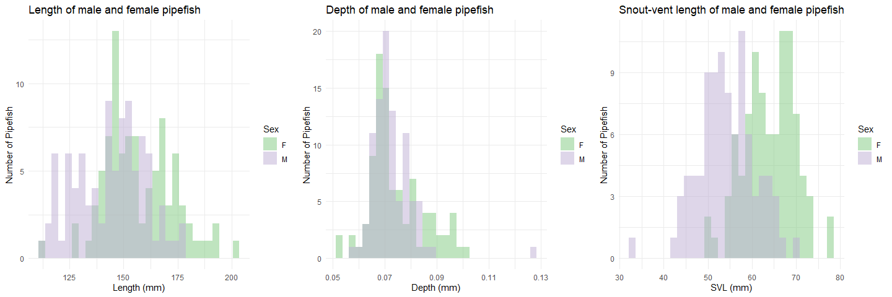

Selection pressures in *Syngnathus fuscus*
================


- [Calculating the degree of sexual
  dimorphism](#calculating-the-degree-of-sexual-dimorphism)
  - [Checking the assumptions for a pairwise
    comparison](#checking-the-assumptions-for-a-pairwise-comparison)
  - [Investigate distributions and run the
    tests](#investigate-distributions-and-run-the-tests)

``` r
#This is a cohesive list of all the libraries used in this document
library(ggplot2)
library(cowplot)
library(fBasics)
library(pwr)
library(lme4)
library(dplyr)
library(tidyr)
library(knitr)
```

``` r
#MomIDs and embryo counts for each section of the male's brood pouch
em_dat <- read.csv("data/EmbryoParentage_fuscus.csv")

#Metadata for males and females from the mesocosm experiments
fem_mesoFU <- read.csv("data/all_fem_meso_fuscus.csv")
mal_mesoFU <- read.csv("data/all_mal_meso_fuscus.csv")
```

This document will follow the same analysis as was outlined in
`selection_analysis_floridae.Rmd`. For more thorough details refer back
to that document.

# Calculating the degree of sexual dimorphism

I noticed that there was a certain degree of sexual dimorphism in terms
of an ornamentation that was present only in the females, but I also
want to explore any size sexual dimorphism that may be present in this
species.

I will be looking at total standard length (mm, measured from the tip of
the snout to the tip of the caudal fin), snout-vent length (mm, measured
from the tip of the snout to the urogenital opening), torso depth (mm),
and snout length (mm). To look at these differences I will be performing
t-tests between males and females. First, I need to see if assumptions
are met, i.e. variances are equal and data is normally distributed.

## Checking the assumptions for a pairwise comparison

The main two things that I will be looking into include:

1.  Equal variances between my groups (using `var.test()`).
2.  Normal distribution of the data (using `normalTest()`).

To account for the fact that fish who are longer may just inherently be
deeper as well, I am going to adjust the depth by the standard length of
the pipefish prior to running any analyses.

``` r
#Adjust the torso depth
fem_mesoFU$depth_adj <- fem_mesoFU$depth/fem_mesoFU$length
mal_mesoFU$depth_adj <- mal_mesoFU$depth/mal_mesoFU$length

#Testing to see if the variances are equal
var.test(fem_mesoFU$length, mal_mesoFU$length) #EQUAL
```

    ## 
    ##  F test to compare two variances
    ## 
    ## data:  fem_mesoFU$length and mal_mesoFU$length
    ## F = 1.0335, num df = 90, denom df = 91, p-value = 0.8755
    ## alternative hypothesis: true ratio of variances is not equal to 1
    ## 95 percent confidence interval:
    ##  0.6828564 1.5649649
    ## sample estimates:
    ## ratio of variances 
    ##           1.033505

``` r
var.test(fem_mesoFU$depth_adj, mal_mesoFU$depth_adj) #NOT EQUAL
```

    ## 
    ##  F test to compare two variances
    ## 
    ## data:  fem_mesoFU$depth_adj and mal_mesoFU$depth_adj
    ## F = 2.9658, num df = 90, denom df = 91, p-value = 4.582e-07
    ## alternative hypothesis: true ratio of variances is not equal to 1
    ## 95 percent confidence interval:
    ##  1.959556 4.490895
    ## sample estimates:
    ## ratio of variances 
    ##           2.965793

``` r
var.test(fem_mesoFU$svl, mal_mesoFU$svl) #EQUAL
```

    ## 
    ##  F test to compare two variances
    ## 
    ## data:  fem_mesoFU$svl and mal_mesoFU$svl
    ## F = 0.82582, num df = 90, denom df = 91, p-value = 0.3646
    ## alternative hypothesis: true ratio of variances is not equal to 1
    ## 95 percent confidence interval:
    ##  0.5456328 1.2504769
    ## sample estimates:
    ## ratio of variances 
    ##          0.8258167

``` r
#Testing for normal distribution - Females
normalTest(fem_mesoFU$length, method = "da") #NORMAL
```

    ## 
    ## Title:
    ##  D'Agostino Normality Test
    ## 
    ## Test Results:
    ##   STATISTIC:
    ##     Chi2 | Omnibus: 1.8153
    ##     Z3  | Skewness: 1.2824
    ##     Z4  | Kurtosis: 0.4133
    ##   P VALUE:
    ##     Omnibus  Test: 0.4035 
    ##     Skewness Test: 0.1997 
    ##     Kurtosis Test: 0.6794

``` r
normalTest(fem_mesoFU$depth_adj, method = "da") #NOT NORMAL
```

    ## 
    ## Title:
    ##  D'Agostino Normality Test
    ## 
    ## Test Results:
    ##   STATISTIC:
    ##     Chi2 | Omnibus: 12.554
    ##     Z3  | Skewness: 3.4056
    ##     Z4  | Kurtosis: 0.9778
    ##   P VALUE:
    ##     Omnibus  Test: 0.001879 
    ##     Skewness Test: 0.0006603 
    ##     Kurtosis Test: 0.3282

``` r
normalTest(fem_mesoFU$svl, method = "da") #NORMAL
```

    ## 
    ## Title:
    ##  D'Agostino Normality Test
    ## 
    ## Test Results:
    ##   STATISTIC:
    ##     Chi2 | Omnibus: 0.5465
    ##     Z3  | Skewness: -0.572
    ##     Z4  | Kurtosis: -0.4683
    ##   P VALUE:
    ##     Omnibus  Test: 0.7609 
    ##     Skewness Test: 0.5673 
    ##     Kurtosis Test: 0.6396

``` r
#Testing for normal distribution - Males
normalTest(mal_mesoFU$length, method = "da") #NOT NORMAL
```

    ## 
    ## Title:
    ##  D'Agostino Normality Test
    ## 
    ## Test Results:
    ##   STATISTIC:
    ##     Chi2 | Omnibus: 6.4888
    ##     Z3  | Skewness: -0.4917
    ##     Z4  | Kurtosis: -2.4994
    ##   P VALUE:
    ##     Omnibus  Test: 0.03899 
    ##     Skewness Test: 0.6229 
    ##     Kurtosis Test: 0.01244

``` r
normalTest(mal_mesoFU$depth_adj, method = "da") #NORMAL
```

    ## 
    ## Title:
    ##  D'Agostino Normality Test
    ## 
    ## Test Results:
    ##   STATISTIC:
    ##     Chi2 | Omnibus: 3.3202
    ##     Z3  | Skewness: 1.4622
    ##     Z4  | Kurtosis: -1.0872
    ##   P VALUE:
    ##     Omnibus  Test: 0.1901 
    ##     Skewness Test: 0.1437 
    ##     Kurtosis Test: 0.2769

``` r
normalTest(mal_mesoFU$svl, method = "da") #NORMAL
```

    ## 
    ## Title:
    ##  D'Agostino Normality Test
    ## 
    ## Test Results:
    ##   STATISTIC:
    ##     Chi2 | Omnibus: 1.4624
    ##     Z3  | Skewness: -0.7134
    ##     Z4  | Kurtosis: 0.9765
    ##   P VALUE:
    ##     Omnibus  Test: 0.4813 
    ##     Skewness Test: 0.4756 
    ##     Kurtosis Test: 0.3288

## Investigate distributions and run the tests

I will run a Wilcoxon test for standard length, a two sample t-test for
snout-vent length, and a Wilcoxon test for torso depth (adjusted).

<figure>

<figcaption aria-hidden="true"><em>Histograms of male and female
pipefish body sizes.</em></figcaption>
</figure>

``` r
#Running the appropriate test
wilcox.test(fem_mesoFU$length, mal_mesoFU$length)
```

    ## 
    ##  Wilcoxon rank sum test with continuity correction
    ## 
    ## data:  fem_mesoFU$length and mal_mesoFU$length
    ## W = 5828, p-value = 4.616e-06
    ## alternative hypothesis: true location shift is not equal to 0

``` r
wilcox.test(fem_mesoFU$depth_adj, mal_mesoFU$depth_adj)
```

    ## 
    ##  Wilcoxon rank sum test with continuity correction
    ## 
    ## data:  fem_mesoFU$depth_adj and mal_mesoFU$depth_adj
    ## W = 6062, p-value = 1.653e-07
    ## alternative hypothesis: true location shift is not equal to 0

``` r
t.test(fem_mesoFU$svl, mal_mesoFU$svl, var.equal = TRUE)
```

    ## 
    ##  Two Sample t-test
    ## 
    ## data:  fem_mesoFU$svl and mal_mesoFU$svl
    ## t = 10.569, df = 181, p-value < 2.2e-16
    ## alternative hypothesis: true difference in means is not equal to 0
    ## 95 percent confidence interval:
    ##   7.773462 11.342346
    ## sample estimates:
    ## mean of x mean of y 
    ##  63.93716  54.37926

For the Northern pipefish, there are significant differences between
males and females in terms of standard length, snout-vent length, and
torso depth.

``` r
#Checking the power - length
d_mean_len <- abs(mean(fem_mesoFU$length, na.rm = TRUE) - 
                    mean(mal_mesoFU$length, na.rm = TRUE))
pool_sd_len <- sqrt((var(fem_mesoFU$length, na.rm = TRUE) + 
                       var(mal_mesoFU$length, na.rm = TRUE))/ 2)
d_len <- d_mean_len/pool_sd_len

pwr.t.test(n = nrow(fem_mesoFU), 
           d = d_len,
           sig.level = 0.05,
           type = 'two.sample',
           alternative = 'two.sided')
```

    ## 
    ##      Two-sample t test power calculation 
    ## 
    ##               n = 91
    ##               d = 0.8110413
    ##       sig.level = 0.05
    ##           power = 0.9997506
    ##     alternative = two.sided
    ## 
    ## NOTE: n is number in *each* group

``` r
#Checking the power - SVL
d_mean_svl <- abs(mean(fem_mesoFU$svl, na.rm = TRUE) - 
                    mean(mal_mesoFU$svl, na.rm = TRUE))
pool_sd_svl <- sqrt((var(fem_mesoFU$svl, na.rm = TRUE) + 
                       var(mal_mesoFU$svl, na.rm = TRUE))/ 2)
d_svl <- d_mean_svl/pool_sd_svl

pwr.t.test(n = nrow(fem_mesoFU), 
           d = d_svl,
           sig.level = 0.05,
           type = 'two.sample',
           alternative = 'two.sided')
```

    ## 
    ##      Two-sample t test power calculation 
    ## 
    ##               n = 91
    ##               d = 1.562958
    ##       sig.level = 0.05
    ##           power = 1
    ##     alternative = two.sided
    ## 
    ## NOTE: n is number in *each* group

``` r
#Checking the power - Depth
d_mean_depth <- abs(mean(fem_mesoFU$depth_adj, na.rm = TRUE) - 
                      mean(mal_mesoFU$depth_adj, na.rm = TRUE))
pool_sd_depth <- sqrt((var(fem_mesoFU$depth_adj, na.rm = TRUE) + 
                         var(mal_mesoFU$depth_adj, na.rm = TRUE))/ 2)
d_depth <- d_mean_depth/pool_sd_depth
pwr.t.test(n = nrow(fem_mesoFU), 
           d = d_depth,
           sig.level = 0.05,
           type = 'two.sample',
           alternative = 'two.sided')
```

    ## 
    ##      Two-sample t test power calculation 
    ## 
    ##               n = 91
    ##               d = 0.8749359
    ##       sig.level = 0.05
    ##           power = 0.9999539
    ##     alternative = two.sided
    ## 
    ## NOTE: n is number in *each* group

For all variables we have a power of over 0.9 or over 90% so we can be
confident in our interpretation.
