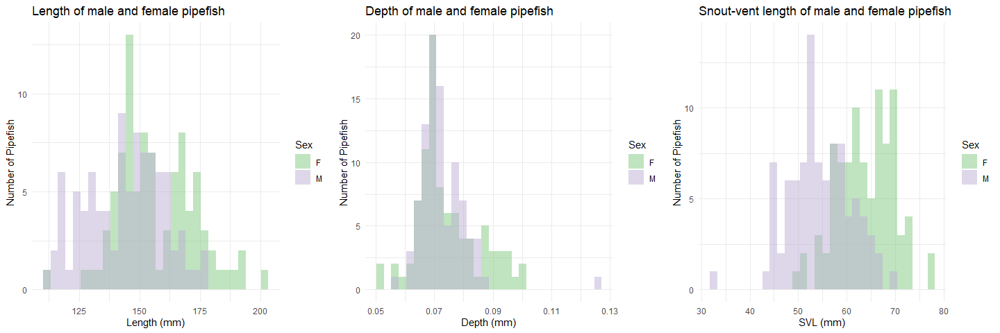

Selection pressures in *Syngnathus fuscus*
================


- [Calculating the degree of sexual
  dimorphism](#calculating-the-degree-of-sexual-dimorphism)
  - [Checking the assumptions for a pairwise
    comparison](#checking-the-assumptions-for-a-pairwise-comparison)
  - [Investigate distributions and run the
    tests](#investigate-distributions-and-run-the-tests)
- [Calculating mating and reproductive success for individuals who
  mated](#calculating-mating-and-reproductive-success-for-individuals-who-mated)
- [Summary statistics for successfully mated
  individuals](#summary-statistics-for-successfully-mated-individuals)
  - [Males](#males)
  - [Females](#females)

``` r
#This is a cohesive list of all the libraries used in this document
library(ggplot2)
library(cowplot)
library(fBasics)
library(pwr)
library(lme4)
library(dplyr)
library(tidyr)
library(knitr)
```

``` r
#MomIDs and embryo counts for each section of the male's brood pouch
em_dat <- read.csv("data/EmbryoParentage_fuscus.csv")

#Metadata for males and females from the mesocosm experiments
fem_mesoFU <- read.csv("data/all_fem_meso_fuscus.csv")
mal_mesoFU <- read.csv("data/all_mal_meso_fuscus.csv")
```

This document will follow the same analysis as was outlined in
`selection_analysis_floridae.Rmd`. For more thorough details refer back
to that document.

# Calculating the degree of sexual dimorphism

I noticed that there was a certain degree of sexual dimorphism in terms
of an ornamentation that was present only in the females, but I also
want to explore any size sexual dimorphism that may be present in this
species.

I will be looking at total standard length (mm, measured from the tip of
the snout to the tip of the caudal fin), snout-vent length (mm, measured
from the tip of the snout to the urogenital opening), torso depth (mm),
and snout length (mm). To look at these differences I will be performing
t-tests between males and females. First, I need to see if assumptions
are met, i.e. variances are equal and data is normally distributed.

## Checking the assumptions for a pairwise comparison

The main two things that I will be looking into include:

1.  Equal variances between my groups (using `var.test()`).
2.  Normal distribution of the data (using `normalTest()`).

To account for the fact that fish who are longer may just inherently be
deeper as well, I am going to adjust the depth by the standard length of
the pipefish prior to running any analyses.

``` r
#Adjust the torso depth
fem_mesoFU$depth_adj <- fem_mesoFU$depth/fem_mesoFU$length
mal_mesoFU$depth_adj <- mal_mesoFU$depth/mal_mesoFU$length

#Testing to see if the variances are equal
var.test(fem_mesoFU$length, mal_mesoFU$length) #EQUAL
```

    ## 
    ##  F test to compare two variances
    ## 
    ## data:  fem_mesoFU$length and mal_mesoFU$length
    ## F = 1.0335, num df = 90, denom df = 91, p-value = 0.8755
    ## alternative hypothesis: true ratio of variances is not equal to 1
    ## 95 percent confidence interval:
    ##  0.6828564 1.5649649
    ## sample estimates:
    ## ratio of variances 
    ##           1.033505

``` r
var.test(fem_mesoFU$depth_adj, mal_mesoFU$depth_adj) #NOT EQUAL
```

    ## 
    ##  F test to compare two variances
    ## 
    ## data:  fem_mesoFU$depth_adj and mal_mesoFU$depth_adj
    ## F = 2.9658, num df = 90, denom df = 91, p-value = 4.582e-07
    ## alternative hypothesis: true ratio of variances is not equal to 1
    ## 95 percent confidence interval:
    ##  1.959556 4.490895
    ## sample estimates:
    ## ratio of variances 
    ##           2.965793

``` r
var.test(fem_mesoFU$svl, mal_mesoFU$svl) #EQUAL
```

    ## 
    ##  F test to compare two variances
    ## 
    ## data:  fem_mesoFU$svl and mal_mesoFU$svl
    ## F = 0.82582, num df = 90, denom df = 91, p-value = 0.3646
    ## alternative hypothesis: true ratio of variances is not equal to 1
    ## 95 percent confidence interval:
    ##  0.5456328 1.2504769
    ## sample estimates:
    ## ratio of variances 
    ##          0.8258167

``` r
#Testing for normal distribution - Females
normalTest(fem_mesoFU$length, method = "da") #NORMAL
```

    ## 
    ## Title:
    ##  D'Agostino Normality Test
    ## 
    ## Test Results:
    ##   STATISTIC:
    ##     Chi2 | Omnibus: 1.8153
    ##     Z3  | Skewness: 1.2824
    ##     Z4  | Kurtosis: 0.4133
    ##   P VALUE:
    ##     Omnibus  Test: 0.4035 
    ##     Skewness Test: 0.1997 
    ##     Kurtosis Test: 0.6794

``` r
normalTest(fem_mesoFU$depth_adj, method = "da") #NOT NORMAL
```

    ## 
    ## Title:
    ##  D'Agostino Normality Test
    ## 
    ## Test Results:
    ##   STATISTIC:
    ##     Chi2 | Omnibus: 12.554
    ##     Z3  | Skewness: 3.4056
    ##     Z4  | Kurtosis: 0.9778
    ##   P VALUE:
    ##     Omnibus  Test: 0.001879 
    ##     Skewness Test: 0.0006603 
    ##     Kurtosis Test: 0.3282

``` r
normalTest(fem_mesoFU$svl, method = "da") #NORMAL
```

    ## 
    ## Title:
    ##  D'Agostino Normality Test
    ## 
    ## Test Results:
    ##   STATISTIC:
    ##     Chi2 | Omnibus: 0.5465
    ##     Z3  | Skewness: -0.572
    ##     Z4  | Kurtosis: -0.4683
    ##   P VALUE:
    ##     Omnibus  Test: 0.7609 
    ##     Skewness Test: 0.5673 
    ##     Kurtosis Test: 0.6396

``` r
#Testing for normal distribution - Males
normalTest(mal_mesoFU$length, method = "da") #NOT NORMAL
```

    ## 
    ## Title:
    ##  D'Agostino Normality Test
    ## 
    ## Test Results:
    ##   STATISTIC:
    ##     Chi2 | Omnibus: 6.4888
    ##     Z3  | Skewness: -0.4917
    ##     Z4  | Kurtosis: -2.4994
    ##   P VALUE:
    ##     Omnibus  Test: 0.03899 
    ##     Skewness Test: 0.6229 
    ##     Kurtosis Test: 0.01244

``` r
normalTest(mal_mesoFU$depth_adj, method = "da") #NORMAL
```

    ## 
    ## Title:
    ##  D'Agostino Normality Test
    ## 
    ## Test Results:
    ##   STATISTIC:
    ##     Chi2 | Omnibus: 3.3202
    ##     Z3  | Skewness: 1.4622
    ##     Z4  | Kurtosis: -1.0872
    ##   P VALUE:
    ##     Omnibus  Test: 0.1901 
    ##     Skewness Test: 0.1437 
    ##     Kurtosis Test: 0.2769

``` r
normalTest(mal_mesoFU$svl, method = "da") #NORMAL
```

    ## 
    ## Title:
    ##  D'Agostino Normality Test
    ## 
    ## Test Results:
    ##   STATISTIC:
    ##     Chi2 | Omnibus: 1.4624
    ##     Z3  | Skewness: -0.7134
    ##     Z4  | Kurtosis: 0.9765
    ##   P VALUE:
    ##     Omnibus  Test: 0.4813 
    ##     Skewness Test: 0.4756 
    ##     Kurtosis Test: 0.3288

## Investigate distributions and run the tests

I will run a Wilcoxon test for standard length, a two sample t-test for
snout-vent length, and a Wilcoxon test for torso depth (adjusted).

<figure>

<figcaption aria-hidden="true"><em>Histograms of male and female
pipefish body sizes.</em></figcaption>
</figure>

``` r
#Running the appropriate test
wilcox.test(fem_mesoFU$length, mal_mesoFU$length)
```

    ## 
    ##  Wilcoxon rank sum test with continuity correction
    ## 
    ## data:  fem_mesoFU$length and mal_mesoFU$length
    ## W = 5828, p-value = 4.616e-06
    ## alternative hypothesis: true location shift is not equal to 0

``` r
wilcox.test(fem_mesoFU$depth_adj, mal_mesoFU$depth_adj)
```

    ## 
    ##  Wilcoxon rank sum test with continuity correction
    ## 
    ## data:  fem_mesoFU$depth_adj and mal_mesoFU$depth_adj
    ## W = 6062, p-value = 1.653e-07
    ## alternative hypothesis: true location shift is not equal to 0

``` r
t.test(fem_mesoFU$svl, mal_mesoFU$svl, var.equal = TRUE)
```

    ## 
    ##  Two Sample t-test
    ## 
    ## data:  fem_mesoFU$svl and mal_mesoFU$svl
    ## t = 10.569, df = 181, p-value < 2.2e-16
    ## alternative hypothesis: true difference in means is not equal to 0
    ## 95 percent confidence interval:
    ##   7.773462 11.342346
    ## sample estimates:
    ## mean of x mean of y 
    ##  63.93716  54.37926

For the Northern pipefish, there are significant differences between
males and females in terms of standard length, snout-vent length, and
torso depth.

``` r
#Checking the power - length
d_mean_len <- abs(mean(fem_mesoFU$length, na.rm = TRUE) - 
                    mean(mal_mesoFU$length, na.rm = TRUE))
pool_sd_len <- sqrt((var(fem_mesoFU$length, na.rm = TRUE) + 
                       var(mal_mesoFU$length, na.rm = TRUE))/ 2)
d_len <- d_mean_len/pool_sd_len

pwr.t.test(n = nrow(fem_mesoFU), 
           d = d_len,
           sig.level = 0.05,
           type = 'two.sample',
           alternative = 'two.sided')
```

    ## 
    ##      Two-sample t test power calculation 
    ## 
    ##               n = 91
    ##               d = 0.8110413
    ##       sig.level = 0.05
    ##           power = 0.9997506
    ##     alternative = two.sided
    ## 
    ## NOTE: n is number in *each* group

``` r
#Checking the power - SVL
d_mean_svl <- abs(mean(fem_mesoFU$svl, na.rm = TRUE) - 
                    mean(mal_mesoFU$svl, na.rm = TRUE))
pool_sd_svl <- sqrt((var(fem_mesoFU$svl, na.rm = TRUE) + 
                       var(mal_mesoFU$svl, na.rm = TRUE))/ 2)
d_svl <- d_mean_svl/pool_sd_svl

pwr.t.test(n = nrow(fem_mesoFU), 
           d = d_svl,
           sig.level = 0.05,
           type = 'two.sample',
           alternative = 'two.sided')
```

    ## 
    ##      Two-sample t test power calculation 
    ## 
    ##               n = 91
    ##               d = 1.562958
    ##       sig.level = 0.05
    ##           power = 1
    ##     alternative = two.sided
    ## 
    ## NOTE: n is number in *each* group

``` r
#Checking the power - Depth
d_mean_depth <- abs(mean(fem_mesoFU$depth_adj, na.rm = TRUE) - 
                      mean(mal_mesoFU$depth_adj, na.rm = TRUE))
pool_sd_depth <- sqrt((var(fem_mesoFU$depth_adj, na.rm = TRUE) + 
                         var(mal_mesoFU$depth_adj, na.rm = TRUE))/ 2)
d_depth <- d_mean_depth/pool_sd_depth
pwr.t.test(n = nrow(fem_mesoFU), 
           d = d_depth,
           sig.level = 0.05,
           type = 'two.sample',
           alternative = 'two.sided')
```

    ## 
    ##      Two-sample t test power calculation 
    ## 
    ##               n = 91
    ##               d = 0.8749359
    ##       sig.level = 0.05
    ##           power = 0.9999539
    ##     alternative = two.sided
    ## 
    ## NOTE: n is number in *each* group

For all variables we have a power of over 0.9 or over 90% so we can be
confident in our interpretation.

# Calculating mating and reproductive success for individuals who mated

*Syngnathus fuscus* (Northern pipefish) were sampled from one cohesive
seagrass beds in Chesapeake Bay in Cape Charles, Virgina. Sexually
mature females (standard length $\ge$ 120mm) and pregnant males were
collected and brought back to the University of Tampa for mesocosm
experiments. In these mesocosms, 6 males and 6 females were housed
together in a 140L tank for a period of 6-weeks and allowed to mate
freely. Parentage analysis was done with all of the pregnant males from
the trials to figure out how many times each male and female mated, and
the number of eggs that were transferred. The results of that are here.

First I had to calculate the mating and reproductive success for each
male and female who mated based on the assigned mom for each genotyped
embryo.

``` r
#Row-by-Row analysis of parentage data by male brood pouch section

#Read in the data
#em_dat <- read.csv("~/EmbryoParentage.csv")

#For each row in the dataset(each section of the pouch) apply this function
mom_counts <- do.call(rbind,apply(em_dat, 1, function(one_section){
  
  #Save all of the momIDs into an object
  mom_ids<-c(one_section[grep("momID",names(one_section))])  
  
  #Calculate the number of eggs that belongs to each potential mom based on
  #the proportions and total number of developed and undeveloped embryos
  mom_props<-c(as.numeric(one_section[grep("prop",names(one_section))]))
  mom_counts_dev<-mom_props*as.numeric(one_section["num_embryos_dev"])
  mom_counts_und<-mom_props*as.numeric(one_section["num_embryos_non_dev"])
  
  #Create a dataframe that contains the maleID, pouch section number and the
  #number of eggs that belongs to each momID
  this_section<-data.frame(
    maleID=one_section["maleID"],
    section_num=one_section["section_num"],
    mom_ids[which((mom_counts_dev + mom_counts_und) > 0)],
    mom_counts_dev[which((mom_counts_dev + mom_counts_und)>0)],
    mom_counts_und[which((mom_counts_dev + mom_counts_und)>0)]
  )
  
  #Rename the columns
  colnames(this_section)[3:5]<-c("momID","num_dev","num_und")
  
  return(this_section)
  
}))

#Calculate female fitness
fem_fitness<-do.call(rbind,by(mom_counts, mom_counts$momID,function(dat){
  
  mom_fitness<-data.frame(
    momID=unique(dat$momID),
    MatingSuccess=length(unique(dat$maleID)),
    NumDeveloped=round(sum(dat$num_dev)),
    NumUndeveloped=round(sum(dat$num_und))
  )
  return(mom_fitness)
}))

fem_fitness$totalEggs <- fem_fitness$NumDeveloped + fem_fitness$NumUndeveloped

#Calculate Male Fitness 
mal_fitness<-do.call(rbind,by(mom_counts, mom_counts$maleID,function(dat){
 
  dad_fitness<-data.frame(
    maleID=unique(dat$maleID),
    MatingSuccess=length(unique(dat$momID)),
    NumDeveloped_Calc=round(sum(dat$num_dev)),
    NumUndeveloped_Calc=round(sum(dat$num_und))
  )
  return(dad_fitness)
}))

mal_fitness$totalEggs <- mal_fitness$NumDeveloped_Calc + mal_fitness$NumUndeveloped_Calc
```

After running the above R script we have generated two datasets,
`mal_fitness` and `fem_fitness`. These datasets include information
about the mating success (number of mates) and reproductive success
(Number of embryos transferred). We can split reproductive success up
further later if we want to from the total number of embryos transferred
to the number of embryos developed and the number that were undeveloped.

I want to include all of the other metadata that I have for these
individuals (traits, collection location, latency to pregnancy, etc.) as
well as tack on all of the information for the individuals who did not
mate. To do that I am going to need to merge the fitness datasets with
`fem_meso` and `mal_meso`.

``` r
#Make a column in *_meso that contains the full fishID (i.e. FU1M3) to match the 
#formatting in the fitness datasets (make sure they have the same name for merging purposes)
fem_mesoFU$momID <- paste0("FU", fem_mesoFU$trial_num, "F",
                         fem_mesoFU$fishID)
mal_mesoFU$maleID <- paste0("FU", mal_mesoFU$trial_num, "M",
                          mal_mesoFU$fishID)

#Merge the datasets based on the columns created above
fem_all <- merge(fem_mesoFU, fem_fitness, by = "momID", 
                 all.x = TRUE, all.y = TRUE)
mal_all <- merge(mal_mesoFU, mal_fitness, by = "maleID", 
                 all.x = TRUE, all.y = TRUE)
```

There are a few trials that I want to remove from the analysis including
all trials where there were no successful matings (4, 7, 8, and 9).

I also want to replace the NAs that were automatically added to the
columns from the fitness dataset (MatingSuccess, NumDeveloped,
NumUndeveloped, totalEggs) with 0s and add a column to the female
dataset that tells me whether or not the female mated (with 1 or 0).

``` r
#Subset the merged datasets to remove trials without successful matings 
fem_succFU <- subset(fem_all, !(trial_num %in% c(4, 7, 8, 9)))
mal_succFU <- subset(mal_all, !(trial_num %in% c(4, 7, 8, 9)))

#Replace NAs with 0s in the columns related to fitness
mal_succFU[, c("MatingSuccess", "NumDeveloped_Calc", 
               "NumUndeveloped_Calc", "totalEggs")] <- sapply(mal_succFU[,
                                                                         c("MatingSuccess", "NumDeveloped_Calc", 
               "NumUndeveloped_Calc", "totalEggs")],
                           function(x)
                             ifelse(is.na(x), 0, x))

fem_succFU[, c("MatingSuccess", "NumDeveloped", 
               "NumUndeveloped", "totalEggs")] <- sapply(fem_succFU[, c("MatingSuccess", 
                                                                        "NumDeveloped", 
                                                                        "NumUndeveloped", 
                                                                        "totalEggs")],
                           function(x)
                             ifelse(is.na(x), 0, x))

#Add a column for females to denote mated or unmated
fem_succFU$mated <- ifelse(fem_succFU$MatingSuccess > 0, 1, 0)
```

# Summary statistics for successfully mated individuals

## Males

Across all 12 trials and 74 total males, there were 22 males that mated
at least one time and 1 of those males had two mates.

Looking across all males, including the ones that did not mate, this is
what we find as the mean, sd, and se for the number of embryos
transferred and how many of those developed versus didn’t:

|                     |       mean |          SD |         SE | max | min |
|:--------------------|-----------:|------------:|-----------:|----:|----:|
| Number of Embryos   | 68.2432432 | 138.1056585 | 16.0544567 | 607 |   0 |
| Developed Embryos   | 63.6216216 | 130.3914762 | 15.1577012 | 566 |   0 |
| Undeveloped Embryos |  4.6216216 |  13.9889415 |  1.6261814 |  84 |   0 |

These values will be influenced by the number of 0s coming from males
who did not mate. So let’s look at the same thing, but this time for
only males who had at least one successful mating:

|                     |        mean |          SD |         SE | max | min |
|:--------------------|------------:|------------:|-----------:|----:|----:|
| Number of Embryos   | 229.5454545 | 165.8693483 | 35.3634639 | 607 |   0 |
| Developed Embryos   |         214 | 159.3379159 | 33.9709578 | 566 |   0 |
| Undeveloped Embryos |  15.5454545 |  22.4132768 |  4.7785267 |  84 |   0 |

We can see from the bottom table that even when we only include males
who mated there is still a wide range in the brood size. I want to see
what relationship there is between brood pouch size (in terms of both
total area and length) and brood size (total number of embryos).

<figure>

<figcaption aria-hidden="true"><em>Scatterplot of the relationship
between brood pouch size metrics and the number of embryos a male
had.</em></figcaption>
</figure>

There may be some correlation happening here, but it doesn’t look
particularly strong. Let’s run some correlations tests to see what they
say.

    ## 
    ##  Pearson's product-moment correlation
    ## 
    ## data:  as.numeric(mated_malFU$bp_area) and mated_malFU$totalEggs
    ## t = 1.7941, df = 20, p-value = 0.08793
    ## alternative hypothesis: true correlation is not equal to 0
    ## 95 percent confidence interval:
    ##  -0.05845921  0.68621522
    ## sample estimates:
    ##       cor 
    ## 0.3723259

    ## 
    ##  Pearson's product-moment correlation
    ## 
    ## data:  as.numeric(mated_malFU$bp_length) and mated_malFU$totalEggs
    ## t = 1.5076, df = 20, p-value = 0.1473
    ## alternative hypothesis: true correlation is not equal to 0
    ## 95 percent confidence interval:
    ##  -0.1180647  0.6530941
    ## sample estimates:
    ##       cor 
    ## 0.3194448

There is not a significant correlation between the number of eggs and
size of the brood pouch when we look at brood pouch area OR brood pouch
length.

Let’s see if this changes if we just look at the overall size of the
male

<figure>

<figcaption aria-hidden="true"><em>Scatterplot of the relationship
between standard length (mm) and the number of embryos a male
had.</em></figcaption>
</figure>

    ## 
    ##  Pearson's product-moment correlation
    ## 
    ## data:  as.numeric(mated_malFU$length) and mated_malFU$totalEggs
    ## t = 0.68816, df = 20, p-value = 0.4993
    ## alternative hypothesis: true correlation is not equal to 0
    ## 95 percent confidence interval:
    ##  -0.2879874  0.5391261
    ## sample estimates:
    ##       cor 
    ## 0.1520871

The correlation actually decreases when we look at the overall size of
the fish.

## Females

Across all 12 trials and 73 total females, there were 19 females that
mated at least one time, 2 females that mated twice, and 0 that mated 3
times.

Looking across all females, including the ones that did not mate, this
is what we find as the mean, sd, and se for the total number of embryos
transferred from each female (across all of her mates if applicable) and
how many of those developed versus didn’t:

|                     |       mean |          SD |         SE | max | min |
|:--------------------|-----------:|------------:|-----------:|----:|----:|
| Number of Embryos   | 69.1780822 | 145.8034581 |  17.065004 | 607 |   0 |
| Developed Embryos   | 64.4931507 | 134.6631727 | 15.7611322 | 566 |   0 |
| Undeveloped Embryos |  4.6849315 |  18.9442726 |  2.2172594 | 152 |   0 |

These values will be influenced by the number of 0s coming from females
who did not mate. So let’s look at the same thing, but this time for
only females who had at least one successful mating:

|                     |        mean |          SD |         SE | max | min |
|:--------------------|------------:|------------:|-----------:|----:|----:|
| Number of Embryos   | 265.7894737 | 172.8414749 | 39.6525538 | 607 |  53 |
| Developed Embryos   | 247.7894737 |  156.826365 | 35.9784356 | 566 |  52 |
| Undeveloped Embryos |          18 |  34.3883055 |  7.8892183 | 152 |   0 |

We can see from the bottom table that even when we only include females
who mated there is still a wide range in the number of eggs transferred.
I want to see what relationship there may be between female body size
(in terms of standard length, depth, and SVL) and the number of eggs she
transferred. I also want to see on average how many eggs were
transferred per mating. I’m going to calculate this by taking the total
number of eggs and dividing it by the number of mates.

    ## [1] 244.2632

    ## [1] 18.6399

<figure>

<figcaption aria-hidden="true">Scatterplot of the relationship between
female size metrics and the number of eggs transferred.</figcaption>
</figure>

There also appears to be a correlation between female body size and the
number of eggs transferred, especially in terms of depth. Let’s run some
correlations tests to see what they say.

    ## 
    ##  Pearson's product-moment correlation
    ## 
    ## data:  mated_femFU$length and as.numeric(mated_femFU$totalEggs)
    ## t = 1.2419, df = 17, p-value = 0.2311
    ## alternative hypothesis: true correlation is not equal to 0
    ## 95 percent confidence interval:
    ##  -0.1908052  0.6565978
    ## sample estimates:
    ##       cor 
    ## 0.2883983

    ## 
    ##  Pearson's product-moment correlation
    ## 
    ## data:  mated_femFU$depth_adj and as.numeric(mated_femFU$totalEggs)
    ## t = 2.3679, df = 17, p-value = 0.03001
    ## alternative hypothesis: true correlation is not equal to 0
    ## 95 percent confidence interval:
    ##  0.05660158 0.77655940
    ## sample estimates:
    ##       cor 
    ## 0.4980076

    ## 
    ##  Pearson's product-moment correlation
    ## 
    ## data:  mated_femFU$svl and as.numeric(mated_femFU$totalEggs)
    ## t = 1.0581, df = 17, p-value = 0.3048
    ## alternative hypothesis: true correlation is not equal to 0
    ## 95 percent confidence interval:
    ##  -0.2318064  0.6314863
    ## sample estimates:
    ##       cor 
    ## 0.2485751

There is no sig. correlation between length or svl and the number of
eggs transferred but we do see a significantly positive relationship
between depth and number of eggs transferred!
