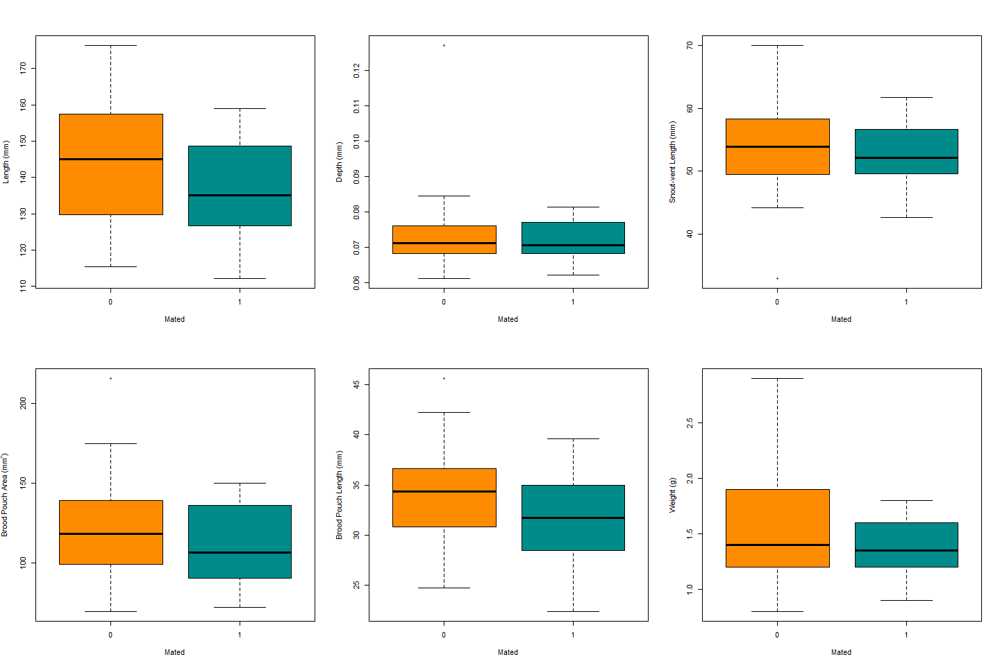
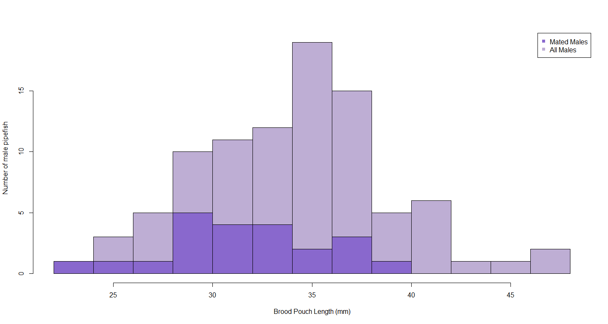
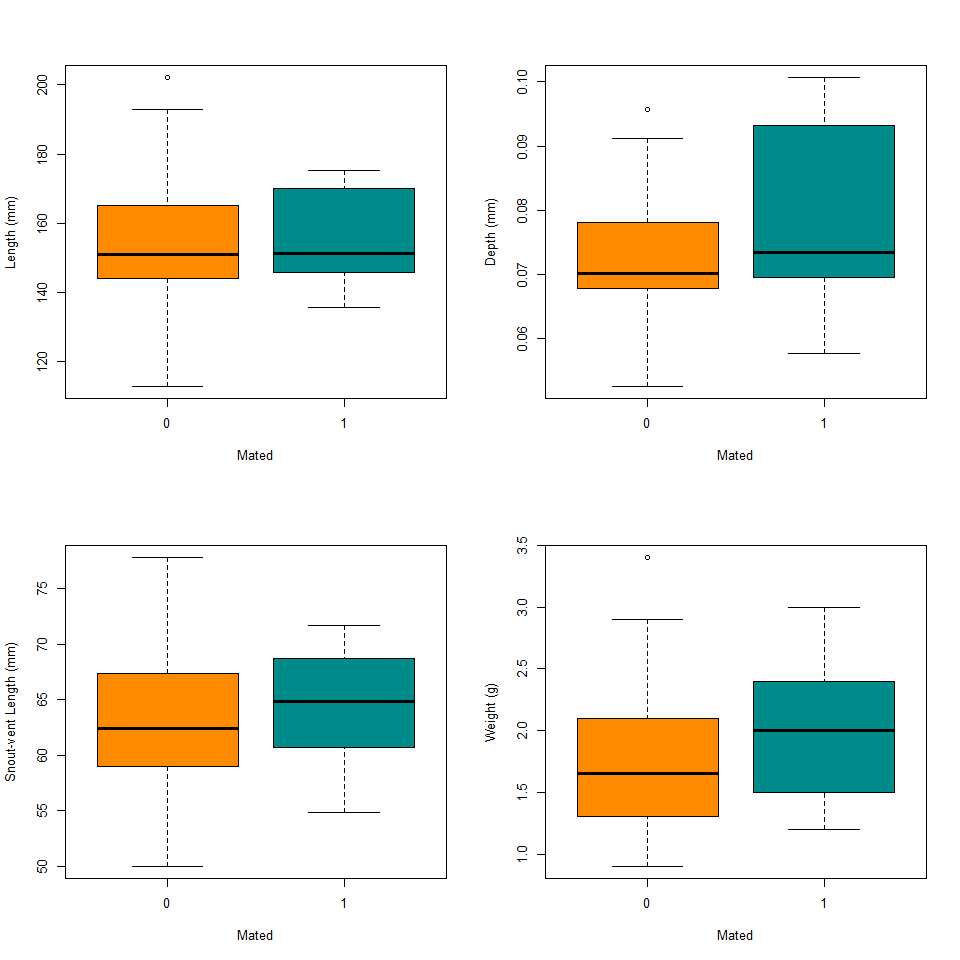
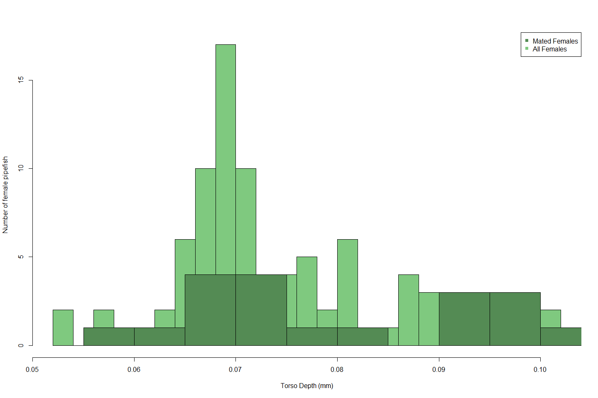
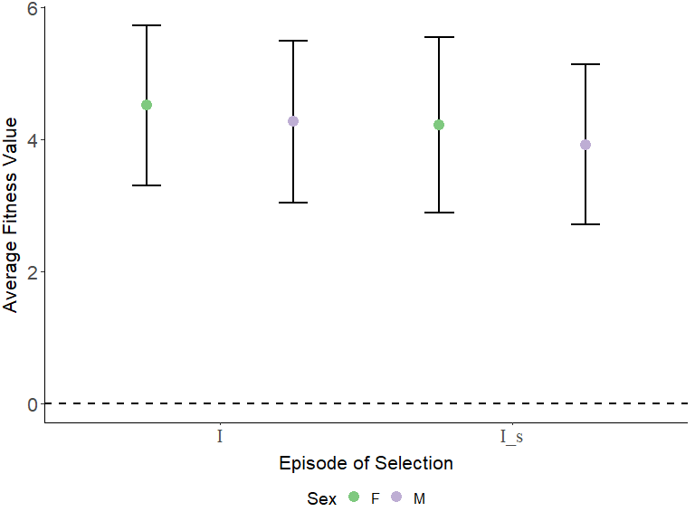
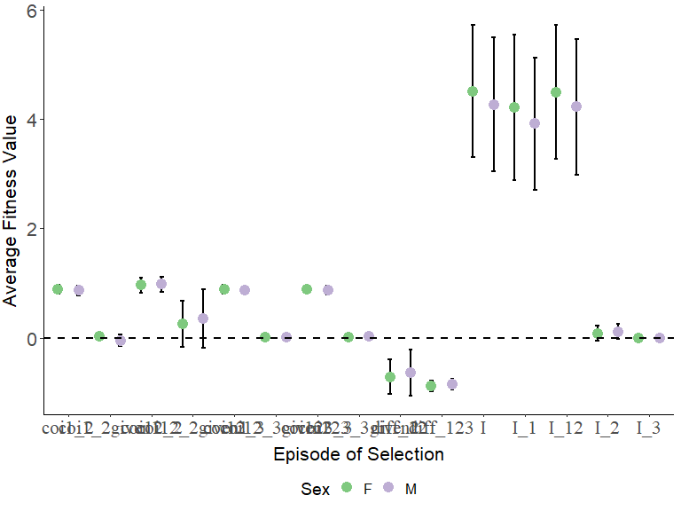
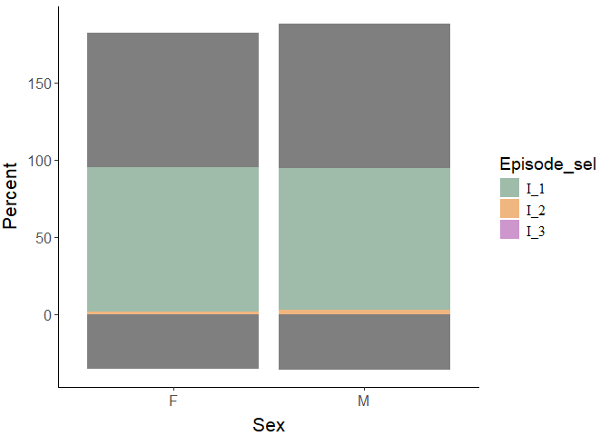

Selection pressures in *Syngnathus fuscus*
================


- [Calculating the degree of sexual
  dimorphism](#calculating-the-degree-of-sexual-dimorphism)
  - [Checking the assumptions for a pairwise
    comparison](#checking-the-assumptions-for-a-pairwise-comparison)
  - [Investigate distributions and run the
    tests](#investigate-distributions-and-run-the-tests)
- [Calculating mating and reproductive success for individuals who
  mated](#calculating-mating-and-reproductive-success-for-individuals-who-mated)
- [Summary statistics for successfully mated
  individuals](#summary-statistics-for-successfully-mated-individuals)
  - [Males](#males)
  - [Females](#females)
- [Differences between mated individuals and unmated
  individuals](#differences-between-mated-individuals-and-unmated-individuals)
  - [Males](#males-1)
    - [Visual Comparison](#visual-comparison)
    - [Testing the difference](#testing-the-difference)
  - [Females](#females-1)
    - [Visual Comparison](#visual-comparison-1)
    - [Testing the difference](#testing-the-difference-1)
- [Looking into the Opportunity for Selection in Males and
  Females](#looking-into-the-opportunity-for-selection-in-males-and-females)
  - [Generating the total opportunity for selection ($I$) and the
    opportunity for sexual selection
    ($I_S$)](#generating-the-total-opportunity-for-selection-i-and-the-opportunity-for-sexual-selection-i_s)
  - [Partitioning the Total Opportunity for Selection
    ($I$)](#partitioning-the-total-opportunity-for-selection-i)

``` r
#This is a cohesive list of all the libraries used in this document
library(ggplot2)
library(cowplot)
library(fBasics)
library(pwr)
library(lme4)
library(dplyr)
library(tidyr)
library(knitr)
```

``` r
#MomIDs and embryo counts for each section of the male's brood pouch
em_dat <- read.csv("data/EmbryoParentage_fuscus.csv")

#Metadata for males and females from the mesocosm experiments
fem_mesoFU <- read.csv("data/all_fem_meso_fuscus.csv")
mal_mesoFU <- read.csv("data/all_mal_meso_fuscus.csv")
```

This document will follow the same analysis as was outlined in
`selection_analysis_floridae.Rmd`. For more thorough details refer back
to that document.

# Calculating the degree of sexual dimorphism

I noticed that there was a certain degree of sexual dimorphism in terms
of an ornamentation that was present only in the females, but I also
want to explore any size sexual dimorphism that may be present in this
species.

I will be looking at total standard length (mm, measured from the tip of
the snout to the tip of the caudal fin), snout-vent length (mm, measured
from the tip of the snout to the urogenital opening), torso depth (mm),
and snout length (mm). To look at these differences I will be performing
t-tests between males and females. First, I need to see if assumptions
are met, i.e. variances are equal and data is normally distributed.

## Checking the assumptions for a pairwise comparison

The main two things that I will be looking into include:

1.  Equal variances between my groups (using `var.test()`).
2.  Normal distribution of the data (using `normalTest()`).

To account for the fact that fish who are longer may just inherently be
deeper as well, I am going to adjust the depth by the standard length of
the pipefish prior to running any analyses.

``` r
#Adjust the torso depth
fem_mesoFU$depth_adj <- fem_mesoFU$depth/fem_mesoFU$length
mal_mesoFU$depth_adj <- mal_mesoFU$depth/mal_mesoFU$length

#Testing to see if the variances are equal
var.test(fem_mesoFU$length, mal_mesoFU$length) #EQUAL
```

    ## 
    ##  F test to compare two variances
    ## 
    ## data:  fem_mesoFU$length and mal_mesoFU$length
    ## F = 1.0335, num df = 90, denom df = 91, p-value = 0.8755
    ## alternative hypothesis: true ratio of variances is not equal to 1
    ## 95 percent confidence interval:
    ##  0.6828564 1.5649649
    ## sample estimates:
    ## ratio of variances 
    ##           1.033505

``` r
var.test(fem_mesoFU$depth_adj, mal_mesoFU$depth_adj) #NOT EQUAL
```

    ## 
    ##  F test to compare two variances
    ## 
    ## data:  fem_mesoFU$depth_adj and mal_mesoFU$depth_adj
    ## F = 2.9658, num df = 90, denom df = 91, p-value = 4.582e-07
    ## alternative hypothesis: true ratio of variances is not equal to 1
    ## 95 percent confidence interval:
    ##  1.959556 4.490895
    ## sample estimates:
    ## ratio of variances 
    ##           2.965793

``` r
var.test(fem_mesoFU$svl, mal_mesoFU$svl) #EQUAL
```

    ## 
    ##  F test to compare two variances
    ## 
    ## data:  fem_mesoFU$svl and mal_mesoFU$svl
    ## F = 0.82582, num df = 90, denom df = 91, p-value = 0.3646
    ## alternative hypothesis: true ratio of variances is not equal to 1
    ## 95 percent confidence interval:
    ##  0.5456328 1.2504769
    ## sample estimates:
    ## ratio of variances 
    ##          0.8258167

``` r
#Testing for normal distribution - Females
normalTest(fem_mesoFU$length, method = "da") #NORMAL
```

    ## 
    ## Title:
    ##  D'Agostino Normality Test
    ## 
    ## Test Results:
    ##   STATISTIC:
    ##     Chi2 | Omnibus: 1.8153
    ##     Z3  | Skewness: 1.2824
    ##     Z4  | Kurtosis: 0.4133
    ##   P VALUE:
    ##     Omnibus  Test: 0.4035 
    ##     Skewness Test: 0.1997 
    ##     Kurtosis Test: 0.6794

``` r
normalTest(fem_mesoFU$depth_adj, method = "da") #NOT NORMAL
```

    ## 
    ## Title:
    ##  D'Agostino Normality Test
    ## 
    ## Test Results:
    ##   STATISTIC:
    ##     Chi2 | Omnibus: 12.554
    ##     Z3  | Skewness: 3.4056
    ##     Z4  | Kurtosis: 0.9778
    ##   P VALUE:
    ##     Omnibus  Test: 0.001879 
    ##     Skewness Test: 0.0006603 
    ##     Kurtosis Test: 0.3282

``` r
normalTest(fem_mesoFU$svl, method = "da") #NORMAL
```

    ## 
    ## Title:
    ##  D'Agostino Normality Test
    ## 
    ## Test Results:
    ##   STATISTIC:
    ##     Chi2 | Omnibus: 0.5465
    ##     Z3  | Skewness: -0.572
    ##     Z4  | Kurtosis: -0.4683
    ##   P VALUE:
    ##     Omnibus  Test: 0.7609 
    ##     Skewness Test: 0.5673 
    ##     Kurtosis Test: 0.6396

``` r
#Testing for normal distribution - Males
normalTest(mal_mesoFU$length, method = "da") #NOT NORMAL
```

    ## 
    ## Title:
    ##  D'Agostino Normality Test
    ## 
    ## Test Results:
    ##   STATISTIC:
    ##     Chi2 | Omnibus: 6.4888
    ##     Z3  | Skewness: -0.4917
    ##     Z4  | Kurtosis: -2.4994
    ##   P VALUE:
    ##     Omnibus  Test: 0.03899 
    ##     Skewness Test: 0.6229 
    ##     Kurtosis Test: 0.01244

``` r
normalTest(mal_mesoFU$depth_adj, method = "da") #NORMAL
```

    ## 
    ## Title:
    ##  D'Agostino Normality Test
    ## 
    ## Test Results:
    ##   STATISTIC:
    ##     Chi2 | Omnibus: 3.3202
    ##     Z3  | Skewness: 1.4622
    ##     Z4  | Kurtosis: -1.0872
    ##   P VALUE:
    ##     Omnibus  Test: 0.1901 
    ##     Skewness Test: 0.1437 
    ##     Kurtosis Test: 0.2769

``` r
normalTest(mal_mesoFU$svl, method = "da") #NORMAL
```

    ## 
    ## Title:
    ##  D'Agostino Normality Test
    ## 
    ## Test Results:
    ##   STATISTIC:
    ##     Chi2 | Omnibus: 1.4624
    ##     Z3  | Skewness: -0.7134
    ##     Z4  | Kurtosis: 0.9765
    ##   P VALUE:
    ##     Omnibus  Test: 0.4813 
    ##     Skewness Test: 0.4756 
    ##     Kurtosis Test: 0.3288

## Investigate distributions and run the tests

I will run a Wilcoxon test for standard length, a two sample t-test for
snout-vent length, and a Wilcoxon test for torso depth (adjusted).

<figure>

<figcaption aria-hidden="true"><em>Histograms of male and female
pipefish body sizes.</em></figcaption>
</figure>

``` r
#Running the appropriate test
wilcox.test(fem_mesoFU$length, mal_mesoFU$length)
```

    ## 
    ##  Wilcoxon rank sum test with continuity correction
    ## 
    ## data:  fem_mesoFU$length and mal_mesoFU$length
    ## W = 5828, p-value = 4.616e-06
    ## alternative hypothesis: true location shift is not equal to 0

``` r
wilcox.test(fem_mesoFU$depth_adj, mal_mesoFU$depth_adj)
```

    ## 
    ##  Wilcoxon rank sum test with continuity correction
    ## 
    ## data:  fem_mesoFU$depth_adj and mal_mesoFU$depth_adj
    ## W = 6062, p-value = 1.653e-07
    ## alternative hypothesis: true location shift is not equal to 0

``` r
t.test(fem_mesoFU$svl, mal_mesoFU$svl, var.equal = TRUE)
```

    ## 
    ##  Two Sample t-test
    ## 
    ## data:  fem_mesoFU$svl and mal_mesoFU$svl
    ## t = 10.569, df = 181, p-value < 2.2e-16
    ## alternative hypothesis: true difference in means is not equal to 0
    ## 95 percent confidence interval:
    ##   7.773462 11.342346
    ## sample estimates:
    ## mean of x mean of y 
    ##  63.93716  54.37926

For the Northern pipefish, there are significant differences between
males and females in terms of standard length, snout-vent length, and
torso depth.

``` r
#Checking the power - length
d_mean_len <- abs(mean(fem_mesoFU$length, na.rm = TRUE) - 
                    mean(mal_mesoFU$length, na.rm = TRUE))
pool_sd_len <- sqrt((var(fem_mesoFU$length, na.rm = TRUE) + 
                       var(mal_mesoFU$length, na.rm = TRUE))/ 2)
d_len <- d_mean_len/pool_sd_len

pwr.t.test(n = nrow(fem_mesoFU), 
           d = d_len,
           sig.level = 0.05,
           type = 'two.sample',
           alternative = 'two.sided')
```

    ## 
    ##      Two-sample t test power calculation 
    ## 
    ##               n = 91
    ##               d = 0.8110413
    ##       sig.level = 0.05
    ##           power = 0.9997506
    ##     alternative = two.sided
    ## 
    ## NOTE: n is number in *each* group

``` r
#Checking the power - SVL
d_mean_svl <- abs(mean(fem_mesoFU$svl, na.rm = TRUE) - 
                    mean(mal_mesoFU$svl, na.rm = TRUE))
pool_sd_svl <- sqrt((var(fem_mesoFU$svl, na.rm = TRUE) + 
                       var(mal_mesoFU$svl, na.rm = TRUE))/ 2)
d_svl <- d_mean_svl/pool_sd_svl

pwr.t.test(n = nrow(fem_mesoFU), 
           d = d_svl,
           sig.level = 0.05,
           type = 'two.sample',
           alternative = 'two.sided')
```

    ## 
    ##      Two-sample t test power calculation 
    ## 
    ##               n = 91
    ##               d = 1.562958
    ##       sig.level = 0.05
    ##           power = 1
    ##     alternative = two.sided
    ## 
    ## NOTE: n is number in *each* group

``` r
#Checking the power - Depth
d_mean_depth <- abs(mean(fem_mesoFU$depth_adj, na.rm = TRUE) - 
                      mean(mal_mesoFU$depth_adj, na.rm = TRUE))
pool_sd_depth <- sqrt((var(fem_mesoFU$depth_adj, na.rm = TRUE) + 
                         var(mal_mesoFU$depth_adj, na.rm = TRUE))/ 2)
d_depth <- d_mean_depth/pool_sd_depth
pwr.t.test(n = nrow(fem_mesoFU), 
           d = d_depth,
           sig.level = 0.05,
           type = 'two.sample',
           alternative = 'two.sided')
```

    ## 
    ##      Two-sample t test power calculation 
    ## 
    ##               n = 91
    ##               d = 0.8749359
    ##       sig.level = 0.05
    ##           power = 0.9999539
    ##     alternative = two.sided
    ## 
    ## NOTE: n is number in *each* group

For all variables we have a power of over 0.9 or over 90% so we can be
confident in our interpretation.

# Calculating mating and reproductive success for individuals who mated

*Syngnathus fuscus* (Northern pipefish) were sampled from one cohesive
seagrass beds in Chesapeake Bay in Cape Charles, Virgina. Sexually
mature females (standard length $\ge$ 120mm) and pregnant males were
collected and brought back to the University of Tampa for mesocosm
experiments. In these mesocosms, 6 males and 6 females were housed
together in a 140L tank for a period of 6-weeks and allowed to mate
freely. Parentage analysis was done with all of the pregnant males from
the trials to figure out how many times each male and female mated, and
the number of eggs that were transferred. The results of that are here.

First I had to calculate the mating and reproductive success for each
male and female who mated based on the assigned mom for each genotyped
embryo.

``` r
#Row-by-Row analysis of parentage data by male brood pouch section

#Read in the data
#em_dat <- read.csv("~/EmbryoParentage.csv")

#For each row in the dataset(each section of the pouch) apply this function
mom_counts <- do.call(rbind,apply(em_dat, 1, function(one_section){
  
  #Save all of the momIDs into an object
  mom_ids<-c(one_section[grep("momID",names(one_section))])  
  
  #Calculate the number of eggs that belongs to each potential mom based on
  #the proportions and total number of developed and undeveloped embryos
  mom_props<-c(as.numeric(one_section[grep("prop",names(one_section))]))
  mom_counts_dev<-mom_props*as.numeric(one_section["num_embryos_dev"])
  mom_counts_und<-mom_props*as.numeric(one_section["num_embryos_non_dev"])
  
  #Create a dataframe that contains the maleID, pouch section number and the
  #number of eggs that belongs to each momID
  this_section<-data.frame(
    maleID=one_section["maleID"],
    section_num=one_section["section_num"],
    mom_ids[which((mom_counts_dev + mom_counts_und) > 0)],
    mom_counts_dev[which((mom_counts_dev + mom_counts_und)>0)],
    mom_counts_und[which((mom_counts_dev + mom_counts_und)>0)]
  )
  
  #Rename the columns
  colnames(this_section)[3:5]<-c("momID","num_dev","num_und")
  
  return(this_section)
  
}))

#Calculate female fitness
fem_fitness<-do.call(rbind,by(mom_counts, mom_counts$momID,function(dat){
  
  mom_fitness<-data.frame(
    momID=unique(dat$momID),
    MatingSuccess=length(unique(dat$maleID)),
    NumDeveloped=round(sum(dat$num_dev)),
    NumUndeveloped=round(sum(dat$num_und))
  )
  return(mom_fitness)
}))

fem_fitness$totalEggs <- fem_fitness$NumDeveloped + fem_fitness$NumUndeveloped

#Calculate Male Fitness 
mal_fitness<-do.call(rbind,by(mom_counts, mom_counts$maleID,function(dat){
 
  dad_fitness<-data.frame(
    maleID=unique(dat$maleID),
    MatingSuccess=length(unique(dat$momID)),
    NumDeveloped_Calc=round(sum(dat$num_dev)),
    NumUndeveloped_Calc=round(sum(dat$num_und))
  )
  return(dad_fitness)
}))

mal_fitness$totalEggs <- mal_fitness$NumDeveloped_Calc + mal_fitness$NumUndeveloped_Calc
```

After running the above R script we have generated two datasets,
`mal_fitness` and `fem_fitness`. These datasets include information
about the mating success (number of mates) and reproductive success
(Number of embryos transferred). We can split reproductive success up
further later if we want to from the total number of embryos transferred
to the number of embryos developed and the number that were undeveloped.

I want to include all of the other metadata that I have for these
individuals (traits, collection location, latency to pregnancy, etc.) as
well as tack on all of the information for the individuals who did not
mate. To do that I am going to need to merge the fitness datasets with
`fem_meso` and `mal_meso`.

``` r
#Make a column in *_meso that contains the full fishID (i.e. FU1M3) to match the 
#formatting in the fitness datasets (make sure they have the same name for merging purposes)
fem_mesoFU$momID <- paste0("FU", fem_mesoFU$trial_num, "F",
                         fem_mesoFU$fishID)
mal_mesoFU$maleID <- paste0("FU", mal_mesoFU$trial_num, "M",
                          mal_mesoFU$fishID)

#Merge the datasets based on the columns created above
fem_all <- merge(fem_mesoFU, fem_fitness, by = "momID", 
                 all.x = TRUE, all.y = TRUE)
mal_all <- merge(mal_mesoFU, mal_fitness, by = "maleID", 
                 all.x = TRUE, all.y = TRUE)
```

There are a few trials that I want to remove from the analysis including
all trials where there were no successful matings (4, 7, 8, and 9).

I also want to replace the NAs that were automatically added to the
columns from the fitness dataset (MatingSuccess, NumDeveloped,
NumUndeveloped, totalEggs) with 0s and add a column to the female
dataset that tells me whether or not the female mated (with 1 or 0).

``` r
#Subset the merged datasets to remove trials without successful matings 
fem_succFU <- subset(fem_all, !(trial_num %in% c(4, 7, 8, 9)))
mal_succFU <- subset(mal_all, !(trial_num %in% c(4, 7, 8, 9)))

#Replace NAs with 0s in the columns related to fitness
mal_succFU[, c("MatingSuccess", "NumDeveloped_Calc", 
               "NumUndeveloped_Calc", "totalEggs")] <- sapply(mal_succFU[,
                                                                         c("MatingSuccess", "NumDeveloped_Calc", 
               "NumUndeveloped_Calc", "totalEggs")],
                           function(x)
                             ifelse(is.na(x), 0, x))

fem_succFU[, c("MatingSuccess", "NumDeveloped", 
               "NumUndeveloped", "totalEggs")] <- sapply(fem_succFU[, c("MatingSuccess", 
                                                                        "NumDeveloped", 
                                                                        "NumUndeveloped", 
                                                                        "totalEggs")],
                           function(x)
                             ifelse(is.na(x), 0, x))

#Add a column for females to denote mated or unmated
fem_succFU$mated <- ifelse(fem_succFU$MatingSuccess > 0, 1, 0)
```

# Summary statistics for successfully mated individuals

## Males

Across all 12 trials and 74 total males, there were 22 males that mated
at least one time and 1 of those males had two mates.

Looking across all males, including the ones that did not mate, this is
what we find as the mean, sd, and se for the number of embryos
transferred and how many of those developed versus didn’t:

|                     |       mean |          SD |         SE | max | min |
|:--------------------|-----------:|------------:|-----------:|----:|----:|
| Number of Embryos   | 68.2432432 | 138.1056585 | 16.0544567 | 607 |   0 |
| Developed Embryos   | 63.6216216 | 130.3914762 | 15.1577012 | 566 |   0 |
| Undeveloped Embryos |  4.6216216 |  13.9889415 |  1.6261814 |  84 |   0 |

These values will be influenced by the number of 0s coming from males
who did not mate. So let’s look at the same thing, but this time for
only males who had at least one successful mating:

|                     |        mean |          SD |         SE | max | min |
|:--------------------|------------:|------------:|-----------:|----:|----:|
| Number of Embryos   | 229.5454545 | 165.8693483 | 35.3634639 | 607 |   0 |
| Developed Embryos   |         214 | 159.3379159 | 33.9709578 | 566 |   0 |
| Undeveloped Embryos |  15.5454545 |  22.4132768 |  4.7785267 |  84 |   0 |

We can see from the bottom table that even when we only include males
who mated there is still a wide range in the brood size. I want to see
what relationship there is between brood pouch size (in terms of both
total area and length) and brood size (total number of embryos).

<figure>

<figcaption aria-hidden="true"><em>Scatterplot of the relationship
between brood pouch size metrics and the number of embryos a male
had.</em></figcaption>
</figure>

There may be some correlation happening here, but it doesn’t look
particularly strong. Let’s run some correlations tests to see what they
say.

    ## 
    ##  Pearson's product-moment correlation
    ## 
    ## data:  as.numeric(mated_malFU$bp_area) and mated_malFU$totalEggs
    ## t = 1.7941, df = 20, p-value = 0.08793
    ## alternative hypothesis: true correlation is not equal to 0
    ## 95 percent confidence interval:
    ##  -0.05845921  0.68621522
    ## sample estimates:
    ##       cor 
    ## 0.3723259

    ## 
    ##  Pearson's product-moment correlation
    ## 
    ## data:  as.numeric(mated_malFU$bp_length) and mated_malFU$totalEggs
    ## t = 1.5076, df = 20, p-value = 0.1473
    ## alternative hypothesis: true correlation is not equal to 0
    ## 95 percent confidence interval:
    ##  -0.1180647  0.6530941
    ## sample estimates:
    ##       cor 
    ## 0.3194448

There is not a significant correlation between the number of eggs and
size of the brood pouch when we look at brood pouch area OR brood pouch
length.

Let’s see if this changes if we just look at the overall size of the
male

<figure>

<figcaption aria-hidden="true"><em>Scatterplot of the relationship
between standard length (mm) and the number of embryos a male
had.</em></figcaption>
</figure>

    ## 
    ##  Pearson's product-moment correlation
    ## 
    ## data:  as.numeric(mated_malFU$length) and mated_malFU$totalEggs
    ## t = 0.68816, df = 20, p-value = 0.4993
    ## alternative hypothesis: true correlation is not equal to 0
    ## 95 percent confidence interval:
    ##  -0.2879874  0.5391261
    ## sample estimates:
    ##       cor 
    ## 0.1520871

The correlation actually decreases when we look at the overall size of
the fish.

## Females

Across all 12 trials and 73 total females, there were 19 females that
mated at least one time, 2 females that mated twice, and 0 that mated 3
times.

Looking across all females, including the ones that did not mate, this
is what we find as the mean, sd, and se for the total number of embryos
transferred from each female (across all of her mates if applicable) and
how many of those developed versus didn’t:

|                     |       mean |          SD |         SE | max | min |
|:--------------------|-----------:|------------:|-----------:|----:|----:|
| Number of Embryos   | 69.1780822 | 145.8034581 |  17.065004 | 607 |   0 |
| Developed Embryos   | 64.4931507 | 134.6631727 | 15.7611322 | 566 |   0 |
| Undeveloped Embryos |  4.6849315 |  18.9442726 |  2.2172594 | 152 |   0 |

These values will be influenced by the number of 0s coming from females
who did not mate. So let’s look at the same thing, but this time for
only females who had at least one successful mating:

|                     |        mean |          SD |         SE | max | min |
|:--------------------|------------:|------------:|-----------:|----:|----:|
| Number of Embryos   | 265.7894737 | 172.8414749 | 39.6525538 | 607 |  53 |
| Developed Embryos   | 247.7894737 |  156.826365 | 35.9784356 | 566 |  52 |
| Undeveloped Embryos |          18 |  34.3883055 |  7.8892183 | 152 |   0 |

We can see from the bottom table that even when we only include females
who mated there is still a wide range in the number of eggs transferred.
I want to see what relationship there may be between female body size
(in terms of standard length, depth, and SVL) and the number of eggs she
transferred. I also want to see on average how many eggs were
transferred per mating. I’m going to calculate this by taking the total
number of eggs and dividing it by the number of mates.

    ## [1] 244.2632

    ## [1] 18.6399

<figure>

<figcaption aria-hidden="true">Scatterplot of the relationship between
female size metrics and the number of eggs transferred.</figcaption>
</figure>

There also appears to be a correlation between female body size and the
number of eggs transferred, especially in terms of depth. Let’s run some
correlations tests to see what they say.

    ## 
    ##  Pearson's product-moment correlation
    ## 
    ## data:  mated_femFU$length and as.numeric(mated_femFU$totalEggs)
    ## t = 1.2419, df = 17, p-value = 0.2311
    ## alternative hypothesis: true correlation is not equal to 0
    ## 95 percent confidence interval:
    ##  -0.1908052  0.6565978
    ## sample estimates:
    ##       cor 
    ## 0.2883983

    ## 
    ##  Pearson's product-moment correlation
    ## 
    ## data:  mated_femFU$depth_adj and as.numeric(mated_femFU$totalEggs)
    ## t = 2.3679, df = 17, p-value = 0.03001
    ## alternative hypothesis: true correlation is not equal to 0
    ## 95 percent confidence interval:
    ##  0.05660158 0.77655940
    ## sample estimates:
    ##       cor 
    ## 0.4980076

    ## 
    ##  Pearson's product-moment correlation
    ## 
    ## data:  mated_femFU$svl and as.numeric(mated_femFU$totalEggs)
    ## t = 1.0581, df = 17, p-value = 0.3048
    ## alternative hypothesis: true correlation is not equal to 0
    ## 95 percent confidence interval:
    ##  -0.2318064  0.6314863
    ## sample estimates:
    ##       cor 
    ## 0.2485751

There is no sig. correlation between length or svl and the number of
eggs transferred but we do see a significantly positive relationship
between depth and number of eggs transferred!

# Differences between mated individuals and unmated individuals

I want to now see if there are any significant differences in the sizes
of individuals who mated vs individuals that didn’t mate in males and
females. I am going to be focusing on the same morphometrics outlined
above.

## Males

### Visual Comparison

Before conducting any analyses, let’s see if we can visually detect any
differences between males who mated and unmated individuals.

<figure>

<figcaption aria-hidden="true"><em>Six different morphometrics compared
between males who sucessfully mated versus those that didn’t. Orange
represents unmated and blue represents mated males.</em></figcaption>
</figure>

I don’t notice many differences, however, it appears that unmated males
are slightly larger in terms of standard length a somewhat surprising
find but similar to *S. floridae*.

### Testing the difference

Let’s now put some statistical power behind the difference in various
morphometrics between mated and unmated individuals. I am first going to
test the assumptions and then run the appropriate version of a t-test.

    ## 
    ##  F test to compare two variances
    ## 
    ## data:  mal_succFU$length by mal_succFU$preg_status
    ## F = 1.5512, num df = 51, denom df = 21, p-value = 0.272
    ## alternative hypothesis: true ratio of variances is not equal to 1
    ## 95 percent confidence interval:
    ##  0.7034511 3.0559527
    ## sample estimates:
    ## ratio of variances 
    ##           1.551159

    ## 
    ##  F test to compare two variances
    ## 
    ## data:  mal_succFU$depth_adj by mal_succFU$preg_status
    ## F = 0.88216, num df = 51, denom df = 21, p-value = 0.694
    ## alternative hypothesis: true ratio of variances is not equal to 1
    ## 95 percent confidence interval:
    ##  0.4000581 1.7379441
    ## sample estimates:
    ## ratio of variances 
    ##          0.8821563

    ## 
    ##  F test to compare two variances
    ## 
    ## data:  mal_succFU$svl by mal_succFU$preg_status
    ## F = 2.2874, num df = 51, denom df = 21, p-value = 0.04071
    ## alternative hypothesis: true ratio of variances is not equal to 1
    ## 95 percent confidence interval:
    ##  1.037315 4.506334
    ## sample estimates:
    ## ratio of variances 
    ##           2.287352

    ## 
    ##  F test to compare two variances
    ## 
    ## data:  as.numeric(mal_succFU$bp_area) by mal_succFU$preg_status
    ## F = 1.3147, num df = 50, denom df = 21, p-value = 0.5005
    ## alternative hypothesis: true ratio of variances is not equal to 1
    ## 95 percent confidence interval:
    ##  0.5953957 2.5977425
    ## sample estimates:
    ## ratio of variances 
    ##           1.314708

    ## 
    ##  F test to compare two variances
    ## 
    ## data:  mal_succFU$bp_length by mal_succFU$preg_status
    ## F = 1.1517, num df = 50, denom df = 21, p-value = 0.7435
    ## alternative hypothesis: true ratio of variances is not equal to 1
    ## 95 percent confidence interval:
    ##  0.5215926 2.2757358
    ## sample estimates:
    ## ratio of variances 
    ##           1.151741

    ## 
    ##  F test to compare two variances
    ## 
    ## data:  mal_succFU$weight by mal_succFU$preg_status
    ## F = 2.607, num df = 51, denom df = 21, p-value = 0.01875
    ## alternative hypothesis: true ratio of variances is not equal to 1
    ## 95 percent confidence interval:
    ##  1.182260 5.136008
    ## sample estimates:
    ## ratio of variances 
    ##           2.606966

    ## 
    ## Title:
    ##  D'Agostino Normality Test
    ## 
    ## Test Results:
    ##   STATISTIC:
    ##     Chi2 | Omnibus: 6.4738
    ##     Z3  | Skewness: 0.38
    ##     Z4  | Kurtosis: -2.5158
    ##   P VALUE:
    ##     Omnibus  Test: 0.03928 
    ##     Skewness Test: 0.7039 
    ##     Kurtosis Test: 0.01188

    ## 
    ## Title:
    ##  D'Agostino Normality Test
    ## 
    ## Test Results:
    ##   STATISTIC:
    ##     Chi2 | Omnibus: 5.7144
    ##     Z3  | Skewness: 0.9229
    ##     Z4  | Kurtosis: -2.2051
    ##   P VALUE:
    ##     Omnibus  Test: 0.05743 
    ##     Skewness Test: 0.356 
    ##     Kurtosis Test: 0.02744

    ## 
    ## Title:
    ##  D'Agostino Normality Test
    ## 
    ## Test Results:
    ##   STATISTIC:
    ##     Chi2 | Omnibus: 1.4898
    ##     Z3  | Skewness: -0.0559
    ##     Z4  | Kurtosis: 1.2193
    ##   P VALUE:
    ##     Omnibus  Test: 0.4748 
    ##     Skewness Test: 0.9554 
    ##     Kurtosis Test: 0.2227

    ## 
    ## Title:
    ##  D'Agostino Normality Test
    ## 
    ## Test Results:
    ##   STATISTIC:
    ##     Chi2 | Omnibus: 7.7251
    ##     Z3  | Skewness: 2.3028
    ##     Z4  | Kurtosis: 1.5563
    ##   P VALUE:
    ##     Omnibus  Test: 0.02101 
    ##     Skewness Test: 0.02129 
    ##     Kurtosis Test: 0.1196

    ## 
    ## Title:
    ##  D'Agostino Normality Test
    ## 
    ## Test Results:
    ##   STATISTIC:
    ##     Chi2 | Omnibus: 0.085
    ##     Z3  | Skewness: 0.2379
    ##     Z4  | Kurtosis: 0.1686
    ##   P VALUE:
    ##     Omnibus  Test: 0.9584 
    ##     Skewness Test: 0.812 
    ##     Kurtosis Test: 0.8661

    ## 
    ## Title:
    ##  D'Agostino Normality Test
    ## 
    ## Test Results:
    ##   STATISTIC:
    ##     Chi2 | Omnibus: 8.9227
    ##     Z3  | Skewness: 2.4847
    ##     Z4  | Kurtosis: 1.6579
    ##   P VALUE:
    ##     Omnibus  Test: 0.01155 
    ##     Skewness Test: 0.01296 
    ##     Kurtosis Test: 0.09733

    ## 
    ##  Wilcoxon rank sum test with continuity correction
    ## 
    ## data:  mal_succFU$length by mal_succFU$preg_status
    ## W = 685, p-value = 0.1834
    ## alternative hypothesis: true location shift is not equal to 0

    ## 
    ##  Two Sample t-test
    ## 
    ## data:  mal_succFU$depth_adj by mal_succFU$preg_status
    ## t = -0.089483, df = 72, p-value = 0.9289
    ## alternative hypothesis: true difference in means between group 0 and group 1 is not equal to 0
    ## 95 percent confidence interval:
    ##  -0.001184444  0.001082677
    ## sample estimates:
    ## mean in group 0 mean in group 1 
    ##      0.02730395      0.02735483

    ## 
    ##  Welch Two Sample t-test
    ## 
    ## data:  mal_succFU$svl by mal_succFU$preg_status
    ## t = 1.0161, df = 58.682, p-value = 0.3138
    ## alternative hypothesis: true difference in means between group 0 and group 1 is not equal to 0
    ## 95 percent confidence interval:
    ##  -1.386368  4.246102
    ## sample estimates:
    ## mean in group 0 mean in group 1 
    ##        53.97723        52.54736

    ## 
    ##  Wilcoxon rank sum test with continuity correction
    ## 
    ## data:  as.numeric(mal_succFU$bp_area) by mal_succFU$preg_status
    ## W = 669, p-value = 0.1962
    ## alternative hypothesis: true location shift is not equal to 0

    ## 
    ##  Two Sample t-test
    ## 
    ## data:  mal_succFU$bp_length by mal_succFU$preg_status
    ## t = 1.978, df = 71, p-value = 0.05181
    ## alternative hypothesis: true difference in means between group 0 and group 1 is not equal to 0
    ## 95 percent confidence interval:
    ##  -0.01802097  4.48727801
    ## sample estimates:
    ## mean in group 0 mean in group 1 
    ##        33.86349        31.62886

    ## 
    ##  Wilcoxon rank sum test with continuity correction
    ## 
    ## data:  mal_succFU$weight by mal_succFU$preg_status
    ## W = 680, p-value = 0.2018
    ## alternative hypothesis: true location shift is not equal to 0

There were no significant differences in terms of the sizes of males who
mated versus those who did not, except for maybe in terms of brood pouch
length.

Let’s explore this a bit more and overlay the distribution of all males
(mated and unmated) with the males who did mate and see how it varies
for the brood pouch.

<figure>

<figcaption aria-hidden="true"><em>Overlay of the size range of males
who mated on top of the size range of all males for length of brood
pouch.</em></figcaption>
</figure>

## Females

Similarly, now let’s see if we can identify any significant differences
in the morphometrics of females who were able to obtain mates versus
those who were unsuccessful.

### Visual Comparison

<figure>

<figcaption aria-hidden="true"><em>Four different morphometrics compared
between females who sucessfully mated versus those that didn’t. Orange
represents unmated and blue represents mated females.</em></figcaption>
</figure>

I don’t notice many differences, however, it appears that mated females
are larger than unmated females.

### Testing the difference

Let’s now put some statistical power behind the difference in various
morphometrics between mated and unmated individuals.

    ## 
    ##  F test to compare two variances
    ## 
    ## data:  fem_succFU$length by fem_succFU$mated
    ## F = 1.558, num df = 53, denom df = 18, p-value = 0.3014
    ## alternative hypothesis: true ratio of variances is not equal to 1
    ## 95 percent confidence interval:
    ##  0.6663111 3.1416657
    ## sample estimates:
    ## ratio of variances 
    ##           1.558006

    ## 
    ##  F test to compare two variances
    ## 
    ## data:  fem_succFU$depth_adj by fem_succFU$mated
    ## F = 0.34834, num df = 53, denom df = 18, p-value = 0.00299
    ## alternative hypothesis: true ratio of variances is not equal to 1
    ## 95 percent confidence interval:
    ##  0.1489748 0.7024182
    ## sample estimates:
    ## ratio of variances 
    ##          0.3483413

    ## 
    ##  F test to compare two variances
    ## 
    ## data:  fem_succFU$svl by fem_succFU$mated
    ## F = 1.4118, num df = 53, denom df = 18, p-value = 0.4254
    ## alternative hypothesis: true ratio of variances is not equal to 1
    ## 95 percent confidence interval:
    ##  0.6037712 2.8467894
    ## sample estimates:
    ## ratio of variances 
    ##           1.411772

    ## 
    ##  F test to compare two variances
    ## 
    ## data:  fem_succFU$weight by fem_succFU$mated
    ## F = 0.81218, num df = 53, denom df = 18, p-value = 0.5435
    ## alternative hypothesis: true ratio of variances is not equal to 1
    ## 95 percent confidence interval:
    ##  0.3473424 1.6377241
    ## sample estimates:
    ## ratio of variances 
    ##          0.8121756

    ## 
    ## Title:
    ##  D'Agostino Normality Test
    ## 
    ## Test Results:
    ##   STATISTIC:
    ##     Chi2 | Omnibus: 4.6664
    ##     Z3  | Skewness: 1.802
    ##     Z4  | Kurtosis: 1.1913
    ##   P VALUE:
    ##     Omnibus  Test: 0.09698 
    ##     Skewness Test: 0.07155 
    ##     Kurtosis Test: 0.2335

    ## 
    ## Title:
    ##  D'Agostino Normality Test
    ## 
    ## Test Results:
    ##   STATISTIC:
    ##     Chi2 | Omnibus: 11.3168
    ##     Z3  | Skewness: 3.1797
    ##     Z4  | Kurtosis: 1.0982
    ##   P VALUE:
    ##     Omnibus  Test: 0.003488 
    ##     Skewness Test: 0.001474 
    ##     Kurtosis Test: 0.2721

    ## 
    ## Title:
    ##  D'Agostino Normality Test
    ## 
    ## Test Results:
    ##   STATISTIC:
    ##     Chi2 | Omnibus: 0.1544
    ##     Z3  | Skewness: 0.2023
    ##     Z4  | Kurtosis: -0.3369
    ##   P VALUE:
    ##     Omnibus  Test: 0.9257 
    ##     Skewness Test: 0.8397 
    ##     Kurtosis Test: 0.7362

    ## 
    ## Title:
    ##  D'Agostino Normality Test
    ## 
    ## Test Results:
    ##   STATISTIC:
    ##     Chi2 | Omnibus: 5.609
    ##     Z3  | Skewness: 2.3682
    ##     Z4  | Kurtosis: 0.0273
    ##   P VALUE:
    ##     Omnibus  Test: 0.06054 
    ##     Skewness Test: 0.01788 
    ##     Kurtosis Test: 0.9782

    ## 
    ##  Two Sample t-test
    ## 
    ## data:  fem_succFU$length by fem_succFU$mated
    ## t = -0.50525, df = 71, p-value = 0.615
    ## alternative hypothesis: true difference in means between group 0 and group 1 is not equal to 0
    ## 95 percent confidence interval:
    ##  -10.706289   6.377429
    ## sample estimates:
    ## mean in group 0 mean in group 1 
    ##        154.2378        156.4023

    ## 
    ##  Wilcoxon rank sum test with continuity correction
    ## 
    ## data:  fem_succFU$depth_adj by fem_succFU$mated
    ## W = 376, p-value = 0.08615
    ## alternative hypothesis: true location shift is not equal to 0

    ## 
    ##  Two Sample t-test
    ## 
    ## data:  fem_succFU$svl by fem_succFU$mated
    ## t = -0.81641, df = 71, p-value = 0.417
    ## alternative hypothesis: true difference in means between group 0 and group 1 is not equal to 0
    ## 95 percent confidence interval:
    ##  -4.524398  1.895723
    ## sample estimates:
    ## mean in group 0 mean in group 1 
    ##        62.93693        64.25126

    ## 
    ##  Two Sample t-test
    ## 
    ## data:  fem_succFU$weight by fem_succFU$mated
    ## t = -1.5966, df = 71, p-value = 0.1148
    ## alternative hypothesis: true difference in means between group 0 and group 1 is not equal to 0
    ## 95 percent confidence interval:
    ##  -0.51773060  0.05730175
    ## sample estimates:
    ## mean in group 0 mean in group 1 
    ##        1.759259        1.989474

There are no significant differences, however, it does get close for
torso depth and in every case the mated females were larger than the
unmated.

Let’s explore this a bit more and overlay the distribution of torso
depth in all females (mated and unmated) with the torso depth of females
who did mate and see how it varies.

<figure>

<figcaption aria-hidden="true"><em>Overlay of the torso depth of females
who mated on top of the size range of all females.</em></figcaption>
</figure>

We can see that the 5 deepest females all secured a mate, whereas the
skinniest females did not.

# Looking into the Opportunity for Selection in Males and Females

One of the benefits of using genetic parentage analysis is that we can
now calculate the opportunity for selection and the opportunity for
sexual selection in male and female pipefish.

## Generating the total opportunity for selection ($I$) and the opportunity for sexual selection ($I_S$)

Because each trial provides an independent “population” (i.e., pipefish
from one trial **cannot mate** with pipefish from another trial), I am
going to calculate these metrics for each trial individually and then I
will average it. With these I can then also generate 95% confidence
intervals which I will investigate for indications of significance in
two ways:

- If the confidence intervals **DO NOT** cross 0 -\> significant
  selection.
- If the confidence intervals between the sexes **DO NOT** cross -\>
  significantly different selection between the two sexes.

``` r
##FEMALES
#Create a dataframe to store the calculations of I and I_S in
fem_opp_selection <- data.frame(matrix(ncol = 3,
                                       nrow = 0))

colnames(fem_opp_selection) <- c("trial_num", "I", "I_s")

#Loop through the different trials and calculate I and I_S
for (trial in unique(fem_succFU$trial_num)) {
  
  #Subset the overall dataframe to work with an individual trial
  tmp <- fem_succFU[fem_succFU$trial_num == trial, ]
  
  #Calculate opportunity selection
  I <- var(tmp$NumDeveloped)/(mean(tmp$NumDeveloped)^2)
  
  I_s <- var(tmp$MatingSuccess)/(mean(tmp$MatingSuccess)^2)
  
  #Combining all of the selection values (Is) and save the output
  trial_num <- trial
  selection <- cbind(trial_num, I, I_s)
  
  fem_opp_selection <- rbind(fem_opp_selection, selection)
  
}


##MALES
#Create a dataframe to store the calculations of I and I_S in
mal_opp_selection <- data.frame(matrix(ncol = 3,
                                       nrow = 0))

colnames(mal_opp_selection) <- c("trial_num", "I", "I_s")

#Loop through the different trials and calculate I and I_S
for (trial in unique(mal_succFU$trial_num)) {
  
  #Subset the overall dataframe to work with an individual trial
  tmp <- mal_succFU[mal_succFU$trial_num == trial, ]
  
  #Calculate opportunity selection
  I <- var(tmp$NumDeveloped)/(mean(tmp$NumDeveloped)^2)
  
  I_s <- var(tmp$MatingSuccess)/(mean(tmp$MatingSuccess)^2)
  
  #Combining all of the selection values (Is) and save the output
  trial_num <- trial
  selection <- cbind(trial_num, I, I_s)
  
  mal_opp_selection <- rbind(mal_opp_selection, selection)
  
}

#Merge the selection coefficients from males and females into one dataset to 
#make life easier
fem_opp_selection$Sex <- "F"
mal_opp_selection$Sex <- "M"

opp_selection_all <- rbind(fem_opp_selection, mal_opp_selection)
```

Now that I have calculated the opportunity for selection and sexual
selection, I want to generate my averages and 95% CI for both.

``` r
#List the columns of interest
columns <- c("I", "I_s")

#Create a dataframe to store the final values in
opp_average <- data.frame(matrix(ncol = 4,
                                 nrow = 0))
colnames(opp_average) <- c("Average", "Interval", "Episode_sel", "Sex")

#Calculate the critical value
crit <- qt(p = 0.975, df = (nrow(fem_opp_selection) - 1))

for (j in 1:length(columns)) {
    
    col_name <- columns[[j]]
    
    #Calculate the means
    mean <- t(t(tapply(opp_selection_all[, colnames(opp_selection_all) == col_name], 
                       opp_selection_all$Sex, 
                       mean)))
    
    #Calculate standard error
    se <- t(t(tapply(opp_selection_all[, colnames(opp_selection_all) == col_name], 
                     opp_selection_all$Sex, 
                 function(x){
                   sqrt(var(x))/sqrt(length(x))
                 })))
    
    #Calculate the value that is added and subtracted from the mean
    int <- se*crit
    
    #Combine the data together
    episode <- as.data.frame(cbind(mean, int))
    colnames(episode) <- c("Average", "Interval")
    
    episode$Episode_sel <- col_name
    episode$Sex <- rownames(episode)
    
    rownames(episode) <- NULL
    
    opp_average <- rbind(opp_average, episode)
    
  }
```

Let’s now explore some results:

| Episode_sel | F                 | M                 |
|:------------|:------------------|:------------------|
| I           | 4.51 (3.3, 5.73)  | 4.27 (3.04, 5.5)  |
| I_s         | 4.22 (2.89, 5.54) | 3.92 (2.71, 5.13) |

Average Opportunity of Selection (95% CI) for Males and Females

<figure>

<figcaption aria-hidden="true"><em>Average opportunity for selection and
opportunity for sexual selection for male (purple) and female (green) S.
fuscus. Errorbars represent the 95% confidence intervals around the
mean</em></figcaption>
</figure>

We can see that for male and female *S. fuscus* there is a significant
opportunity for selection and opportunity for sexual selection, however,
we don’t see significant differences between the sexes for either one.
There is also not a large difference between the opportunity for
selection and the opportunity for sexual selection.

## Partitioning the Total Opportunity for Selection ($I$)

Once again for partitioning the opportunity for selection, I am going to
calculate selection for the trials individually in males and females and
then average across all trials to get the final values and the 95% CIs.
For pre-mating processes I am focusing on mating success and then for
post-mating processes I am looking at the total number of eggs
transferred/received and the proportion of those eggs which developed
(showing fertilization success).

``` r
#Create a dataframe to store all of the intermediate values of fitness in
fem_succ_fitness <- data.frame(matrix(ncol = ncol(fem_succFU) + 9,
                                      nrow = 0))
colnames(fem_succ_fitness) <- c(colnames(fem_succFU),
                                "w1", "w1_squared",
                                "W2", "W2_bar", "w2",
                                "W3", "W3_bar", "w3", "i3")

#Create a dataframe to store the final calculations of I in
opp_selection_episodes_fem <- data.frame(matrix(ncol = 12,
                                            nrow = 0))
colnames(opp_selection_episodes_fem) <- c("trial_num", "I_1", "I_1per", "I_2", "I_2per", 
                                          "I_3", "I_3per", "I_12", "I_12per",
                                          "I", "Iper")

for (trial in unique(fem_succFU$trial_num)) {
  
  #Subset the overall dataframe to work with an individual trial
  tmp <- fem_succFU[fem_succFU$trial_num == trial, ]
  
  #Calculate the absolute pre-copulatory fitness (Eq. 14 Arnold & Wade 1984)
  #This is the same as the calculation of I_s
  tmp$w1 <- tmp$MatingSuccess/mean(tmp$MatingSuccess) #Relative mating success
  tmp$w1_squared <- (tmp$w1)^2
  
  I_1 <- var(tmp$w1) #Variance in relative mating success
  
  #Post-copulatory selection event 1 (Number of eggs transferred) (Eq. 15 Arnold & Wade 1984)
  tmp$W2 <- ifelse(tmp$MatingSuccess > 0,
                   tmp$totalEggs/tmp$MatingSuccess,
                   0) #Number of eggs per mate
  tmp$W2_bar <- tmp$W2 * (tmp$w1/nrow(tmp)) #Number of eggs per mate adjusted by the # of individuals with fitness W
  tmp$w2 <- tmp$W2/sum(tmp$W2_bar)
  
  I_2 <- (sum((tmp$w1 * (tmp$w2)^2))/nrow(tmp) - 1) * nrow(tmp)/(nrow(tmp) - 1)
  
  #Post-copulatory selection event 2 (Number of eggs developed) (Eq. 16 Arnold & Wade 1984)
  tmp$W3 <- ifelse(tmp$totalEggs > 0,
                   tmp$NumDeveloped/tmp$totalEggs,
                   0) #Proportion of transferred eggs that developed
  tmp$W3_bar <- tmp$W3 * ((tmp$totalEggs/mean(tmp$totalEggs))/nrow(tmp)) #Prop. of eggs developed adjusted by the # of individuals with fitness W
  tmp$w3 <- tmp$W3/sum(tmp$W3_bar)
  tmp$i3 <- ((tmp$totalEggs/mean(tmp$totalEggs))/nrow(tmp)) * ((tmp$w3 - 1)^2)
  
  I_3 <- sum(tmp$i3) * nrow(tmp)/(nrow(tmp) - 1)

  I_12 <- var(tmp$totalEggs)/(mean(tmp$totalEggs)^2)
  
  #Total opportunity for selection
  I <- var(tmp$NumDeveloped)/(mean(tmp$NumDeveloped)^2)
  
  #Calculating percentages for each selection event
  I_1per <- (I_1/I)*100
  I_2per <- (I_2/I)*100
  I_3per <- (I_3/I)*100
  I_12per <- (I_12/I)*100
  Iper <- (I/I)*100
  
  #Combining all of the selection values (Is) and saving the output
  trial_num <- trial
  selection <- cbind(trial_num, I_1, I_1per, I_2, I_2per, I_3, I_3per,
                     I_12, I_12per, I, Iper)
  
  opp_selection_episodes_fem <- rbind(opp_selection_episodes_fem, selection)
  
  #Save the intermediate values
  fem_succ_fitness <- rbind(fem_succ_fitness, tmp)
}

#Exporting the data
#write.csv(fem_succ_fitness, "data/fuscus_int_I_fem.csv", row.names = FALSE)
```

``` r
#Create a dataframe to store all of the intermediate values of fitness in
mal_succ_fitness <- data.frame(matrix(ncol = ncol(mal_succFU) + 9,
                                      nrow = 0))
colnames(mal_succ_fitness) <- c(colnames(mal_succFU),
                                "w1", "w1_squared",
                                "W2", "W2_bar", "w2",
                                "W3", "W3_bar", "w3", "i3")

#Create a dataframe to store the final calculations of I in
opp_selection_episodes_mal <- data.frame(matrix(ncol = 12,
                                            nrow = 0))
colnames(opp_selection_episodes_mal) <- c("trial_num", "I_1", "I_1per", "I_2", "I_2per", 
                                          "I_3", "I_3per", "I_12", "I_12per",
                                          "I", "Iper", "I_s")

for (trial in unique(mal_succFU$trial_num)) {
  
  #Subset the overall dataframe to work with an individual trial
  tmp <- mal_succFU[mal_succFU$trial_num == trial, ]
  
  #Calculate the absolute pre-copultory fitness (Eq. 14 Arnold & Wade 1984)
  tmp$w1 <- tmp$MatingSuccess/mean(tmp$MatingSuccess) #Relative mating success
  tmp$w1_squared <- (tmp$w1)^2
  
  I_1 <- var(tmp$w1) #Variance in relative mating success
  
  #Post-copulatory selection event 1 (Number of eggs transferred) (Eq. 15 Arnold & Wade 1984)
  tmp$W2 <- ifelse(tmp$MatingSuccess > 0,
                   tmp$totalEggs/tmp$MatingSuccess,
                   0) #Number of eggs per mate
  tmp$W2_bar <- tmp$W2 * (tmp$w1/nrow(tmp)) #Number of eggs per mate adjusted by the # of individuals with fitness W
  tmp$w2 <- tmp$W2/sum(tmp$W2_bar)
  
  I_2 <- (sum((tmp$w1 * (tmp$w2)^2))/nrow(tmp) - 1) * nrow(tmp)/(nrow(tmp) - 1)
  
  #Post-copulatory selection event 2 (Number of eggs developed) (Eq. 16 Arnold & Wade 1984)
  tmp$W3 <- ifelse(tmp$totalEggs > 0,
                   tmp$NumDeveloped_Calc/tmp$totalEggs,
                   0) #Proportion of transferred eggs that developed
  tmp$W3_bar <- tmp$W3 * ((tmp$totalEggs/mean(tmp$totalEggs))/nrow(tmp)) #Prop. of eggs developed adjusted by the # of individuals with fitness W
  tmp$w3 <- tmp$W3/sum(tmp$W3_bar)
  tmp$i3 <- ((tmp$totalEggs/mean(tmp$totalEggs))/nrow(tmp)) * ((tmp$w3 - 1)^2)
  
  I_3 <- sum(tmp$i3) * nrow(tmp)/(nrow(tmp) - 1)

  I_12 <- var(tmp$totalEggs)/(mean(tmp$totalEggs)^2)
  
  #Total opportunity for selection
  I <- var(tmp$NumDeveloped_Calc)/(mean(tmp$NumDeveloped_Calc)^2)

  #Calculating percentages for each selection event
  I_1per <- (I_1/I)*100
  I_2per <- (I_2/I)*100
  I_3per <- (I_3/I)*100
  I_12per <- (I_12/I)*100
  Iper <- (I/I)*100
  
  #Combining all of the selection values (Is) and saving the output
  trial_num <- trial
  selection <- cbind(trial_num, I_1, I_1per, I_2, I_2per, I_3, I_3per,
                     I_12, I_12per, I, Iper)
  
  opp_selection_episodes_mal <- rbind(opp_selection_episodes_mal, selection)
  
  #Save the intermediate values
  mal_succ_fitness <- rbind(mal_succ_fitness, tmp)
}

#Exporting the data
#write.csv(mal_succ_fitness, "data/fuscus_int_I_mal.csv", row.names = FALSE)
```

``` r
#Merge the selection coefficients from males and females into one dataset to 
#make life easier
opp_selection_episodes_fem$Sex <- "F"
opp_selection_episodes_mal$Sex <- "M"

opp_selection_episodes_all <- rbind(opp_selection_episodes_fem, opp_selection_episodes_mal)

#Exporting the data
#write.csv(opp_selection_episodes_all, "data/fuscus_opp_selection.csv", row.names = FALSE)

#List the columns of interest
columns <- c("I_1", "I_2", "I_12", "I_3","I")

#Create a dataframe to store the final values in
opp_episodes_average <- data.frame(matrix(ncol = 4,
                                    nrow = 0))
colnames(opp_episodes_average) <- c("Average", "Interval", 
                                    "Episode_sel", "Sex")

#Calculate the critical value
crit <- qt(p = 0.975, df = (nrow(opp_selection_episodes_fem) - 1))

for (j in 1:length(columns)) {
    
    col_name <- columns[[j]]
    
    #Calculate the means
    mean <- t(t(tapply(opp_selection_episodes_all[, colnames(opp_selection_episodes_all) 
                                                  == col_name], 
                       opp_selection_episodes_all$Sex, 
                       mean)))
    
    #Calculate standard error
    se <- t(t(tapply(opp_selection_episodes_all[, colnames(opp_selection_episodes_all) 
                                                == col_name], 
                     opp_selection_episodes_all$Sex, 
                 function(x){
                   sqrt(var(x))/sqrt(length(x))
                 })))
    
    #Calculate the value that is added and subtracted from the mean
    int <- se*crit
    
    #Combine the data together
    episode <- as.data.frame(cbind(mean, int))
    colnames(episode) <- c("Average", "Interval")
    
    episode$Episode_sel <- col_name
    episode$Sex <- rownames(episode)
    
    rownames(episode) <- NULL
    
    opp_episodes_average <- rbind(opp_episodes_average, episode)
    
  }
```

Let’s now explore some results:

| Episode_sel | F                   | M                   |
|:------------|:--------------------|:--------------------|
| I_1         | 4.217 (2.89, 5.54)  | 3.919 (2.71, 5.13)  |
| I_2         | 0.082 (-0.06, 0.22) | 0.118 (-0.02, 0.26) |
| I_12        | 4.497 (3.27, 5.72)  | 4.223 (2.98, 5.47)  |
| I_3         | 0.001 (0, 0)        | 0.003 (0, 0.01)     |
| I           | 4.512 (3.3, 5.73)   | 4.269 (3.04, 5.5)   |

Average Episode of Selection (95% CI) for Males and Females

<figure>

<figcaption aria-hidden="true"><em>Average opportunity for selection for
the different episodes for male (purple) and female (green) S. fuscus.
Errorbars represent the 95% confidence intervals around the
mean</em></figcaption>
</figure>

From the table and the plot we can see that once again there are no
significant differences in the selection between males and females.
Additionally, the two post-mating episodes of selection ($I_2$ and
$I_3$) are non-significant for both males and females (i.e., the 95% CI
cross zero) and in particular, variance in the proportion of embryos
developing ($I_3$) is basically non-existent.

Let’s now look more into the percentage of the overall opportunity for
selection made up for by each individual episode of selection:

``` r
sexes <- c("M", "F")

#Create a dataframe to store the final values in
opp_percents <- data.frame(matrix(ncol = 3,
                                 nrow = 0))
colnames(opp_percents) <- c("Percent", "Episode_sel", "Sex")

#Calculate the percentage for each episode in the two sexes
for (sex in sexes) {
    
  #subset dataset based on sex
  tmp_sex <- opp_episodes_average[opp_episodes_average$Sex == sex, ]
  
  #Pull out the overall opp. for selection value
  I_average <- tmp_sex$Average[tmp_sex$Episode_sel == "I"]
  
  #Calculate what percentage of the I is represented by each episode
  percents <- as.data.frame(t(t(apply(tmp_sex, 1, function(x){
      
      (as.numeric(x[1])/I_average)*100
      
    }))))
    
    colnames(percents) <- "Percent"
    percents$Episode_sel <- tmp_sex$Episode_sel
    percents$Sex <- sex
    
    rownames(percents) <- NULL
    
    opp_percents <- rbind(opp_percents, percents)
    
  }
```

<figure>

<figcaption aria-hidden="true"><em>The proportion of the total
opportunity for selection that is represented by each episode of
selection for males and females.</em></figcaption>
</figure>

Matching the previous plots, most of the opportunity for selection in
*Syngnathus fuscus* males and females can be attributed to variance in
mating success ($I_1$) rather than variance in eggs transferred/received
($I_2$) or variance in the proportion of eggs developed ($I_3$). This
also corresponds to the opportunity for selection ($I$) and the
opportunity for sexual selection ($I_S$ or $I_1$), most of the variance
in fitness for these individuals is found in whether or not they can
obtain a mate.
